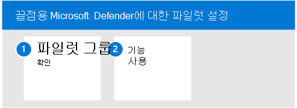

# Endpoint용 파일럿 Microsoft Defender

이 문서에서는 끝점용 Microsoft Defender에 대한 파일럿을 실행하는 과정을 안내합니다. 

다음 단계에 따라 끝점용 Microsoft Defender의 파일럿을 설정하고 구성합니다. 

- 1단계. 파일럿 그룹 확인
- 2단계. 기능 사용

끝점용 Microsoft Defender를 파일럿할 때 전체 조직을 온보딩하기 전에 몇 대의 장치를 서비스에 온보딩할 수 있습니다.  

그런 다음 공격 시뮬레이션을 실행하고 Endpoint용 Defender가 악의적인 활동을 표시하고 효율적인 대응을 하는 방법을 보는 등 사용 가능한 기능을 사용해 볼 수 있습니다. 

## 1단계. 파일럿 그룹 확인
평가 사용 섹션에 설명된 온보더링 단계를 완료한 후 약 1시간 후에 장치 인벤토리 목록에 장치가 표시됩니다.  

온보드 디바이스가 표시될 때 기능 시도를 계속할 수 있습니다. 

## 2단계. 기능 사용
이제 일부 디바이스의 온보드를 완료하고 서비스에 보고하고 있는 것을 확인한 후 바로 사용할 수 있는 강력한 기능을 사용해 보아 제품에 대해 잘 알고 있습니다.

파일럿 중에 복잡한 구성 단계를 거치지 않고도 일부 기능을 사용해 볼 수 있습니다.

먼저 대시보드를 체크 아웃합니다.

### 장치 인벤토리 보기
디바이스 인벤토리는 네트워크에서 끝점, 네트워크 장치 및 IoT 장치 목록을 볼 수 있는 위치입니다. 네트워크의 디바이스 보기를 제공할 뿐만 아니라 도메인, 위험 수준, OS 플랫폼 및 기타 세부 정보와 같이 가장 위험에 노출된 장치를 쉽게 식별할 수 있는 자세한 정보도 제공합니다.

### 위협 및 취약성 관리 보기 
위협 및 취약성 관리 조직에 가장 긴급하고 가장 높은 위험을 내포하는 약점에 집중할 수 있습니다. 대시보드에서 조직 노출 점수, 장치에 대한 Microsoft 보안 점수, 장치 노출 분포, 최상위 보안 권장 사항, 주요 취약한 소프트웨어, 최상위 수정 활동 및 노출된 상위 장치 데이터에 대한 높은 수준의 보기를 얻습니다. 

### 시뮬레이션 실행
끝점용 Microsoft Defender는 파일럿 장치에서 실행할 수 있는 ["직접 실행"](https://securitycenter.windows.com/tutorials) 공격 시나리오와 함께 제공됩니다.  각 문서에는 OS 및 응용 프로그램 요구 사항과 공격 시나리오와 관련한 자세한 지침이 포함되어 있습니다. 이러한 스크립트는 안전하고 문서화되어 있으며 사용하기 쉽습니다. 이러한 시나리오는 끝점 기능에 대한 Defender를 반영하고 조사 환경을 진행합니다.

제공된 시뮬레이션을 실행하려면 하나 이상의 온보드 [디바이스가 필요합니다.](../defender-endpoint/onboard-configure.md)

1. 도움말 **시뮬레이션**& 자습서 에서 시뮬레이션할 사용 가능한 공격 시나리오를  >  선택합니다.

   - **시나리오 1: 문서 드롭 백도어** - 사회적으로 엔지니어링된 Lure 문서의 배달을 시뮬레이트합니다. 이 문서는 공격자가 제어할 수 있는 특수하게 만들어진 백도어를 실행합니다.

   - **시나리오 2: 파일** 없는 공격의 PowerShell 스크립트 - PowerShell을 사용하여 공격 표면 감소 및 악의적인 메모리 활동의 장치 학습 감지를 표시하는 파일 없는 공격을 시뮬레이션합니다.

   - **시나리오 3: 자동화된** 인시던트 대응 - 인시던트 대응 용량을 확장하기 위해 위반 아티팩트를 자동으로 헌팅하고 수정하는 자동화된 조사를 트리거합니다.

2. 선택한 시나리오와 함께 제공된 해당 Walkthrough 문서를 다운로드하고 읽습니다.

3. 시뮬레이션 파일을 다운로드하거나 자습서 에서 도움말   >  **시뮬레이션으로 & 복사합니다.** 테스트 장치에서 파일 또는 스크립트를 다운로드할 수 있지만 필수는 아닙니다.

4. 테스트 장치에서 시뮬레이션 파일 또는 스크립트를 실행합니다. 이 문서의 지시에 따라 실행합니다.

> [!NOTE]
> 시뮬레이션 파일 또는 스크립트는 공격 활동을 모방하지만 실제로는 양호하며 테스트 장치를 손상하거나 손상하지 않습니다.

## 다음 단계
[평가 Microsoft Cloud App Security](eval-defender-mcas-overview.md)

[끝점용 Microsoft Defender 평가 개요로 돌아가기](eval-defender-endpoint-overview.md)

평가 및 파일럿 테스트 [개요로 Microsoft 365 Defender](eval-overview.md)