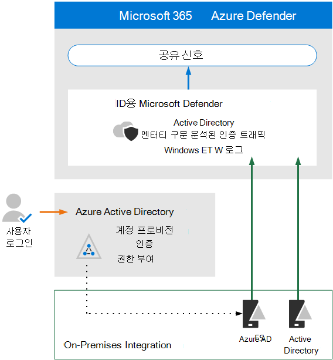

# Microsoft Defender for Identity에 대한 아키텍처 요구 사항 및 주요 개념 검토

**적용 대상:**
- Microsoft 365 Defender

이 문서는 Id에 대한 Microsoft Defender의 평가 환경을 설정하는 프로세스의 [1단계](eval-defender-identity-overview.md) 중 3단계입니다. 이 프로세스에 대한 자세한 내용은 개요 문서를 [참조하세요.](eval-defender-identity-overview.md)

Id에 대해 Microsoft Defender를 사용하도록 설정하기 전에 아키텍처를 이해하고 요구 사항을 충족할 수 있는지 확인합니다.

Id용 Microsoft Defender는 기계 학습 및 동작 분석을 사용하여 클라우드 ID와 관련된 사용자 로그인 위험을 감지하고 사전 예방하는 것과 함께 사내 네트워크에서 공격을 식별합니다. 자세한 내용은 Id에 [대한 Microsoft Defender란?을 참조하세요.](/defender-for-identity/what-is)

Id에 대한 Defender는 Azure AD(Active Directory)에 동기화된 사용자 및/또는 Azure Active Directory 보호합니다. Azure AD 사용자로만 만들어진 환경을 보호하기 위해 [Azure AD ID 보호를 참조하세요.](/azure/active-directory/identity-protection/overview-identity-protection)

## 아키텍처 이해

다음 다이어그램은 Id용 Defender에 대한 기준 아키텍처를 보여 제공합니다. 

이 그림에서는 다음을 참조합니다.
- AD 도메인 컨트롤러에 설치된 센서는 로그 및 네트워크 트래픽을 구문 분석하고 분석 및 보고를 위해 ID를 위해 Microsoft Defender로 전송합니다.
-  Azure AD가 페더레이션 인증(그림의 점선)을 사용하도록 구성된 경우 센서는 AD FS(Active Directory Federation Services)를 구문 분석할 수도 있습니다. 
- Microsoft Defender for Identity는 XDR(확장 Microsoft 365 Defender 및 응답)에 대한 신호를 공유합니다.

ID용 Defender 센서는 다음 서버에 직접 설치할 수 있습니다.

- 도메인 컨트롤러: 센서는 전용 서버 또는 포트 미러링 구성 없이 도메인 컨트롤러 트래픽을 직접 모니터링합니다.
- AD FS: 센서는 네트워크 트래픽 및 인증 이벤트를 직접 모니터링합니다.

Id에 대한 Defender의 아키텍처에 대한 자세한 내용은 id와의 통합을 포함하여 Cloud App Security [Microsoft Defender for Identity architecture를 참조합니다.](/defender-for-identity/architecture)

## 주요 개념 이해

다음 표에서는 ID에 대한 Microsoft Defender를 평가, 구성 및 배포할 때 이해해야 하는 주요 개념을 확인했습니다.

|개념  |설명 |추가 정보  |
|---------|---------|---------|
| 모니터링된 활동 | ID에 대한 Defender는 조직 내에서 생성된 신호를 모니터링하여 의심스러우거나 악의적인 활동을 감지하고 각 잠재적 위협의 유효성을 확인하여 효과적으로 판단하고 대응할 수 있도록 합니다.  |  [Id 모니터링 활동용 Microsoft Defender](/defender-for-identity/monitored-activities)       |
| 보안 경고    | ID 보안 경고에 대한 Defender는 네트워크의 센서에서 감지된 의심스러운 활동과 각 위협에 관련된 공격자 및 컴퓨터에 대해 설명합니다.   | [Id 보안 경고에 대한 Microsoft Defender](/defender-for-identity/suspicious-activity-guide?tabs=external)    |
| 엔터티 프로필    | 엔터티 프로필은 액세스 기록과 함께 사용자, 컴퓨터, 장치 및 리소스에 대한 포괄적인 심층 조사를 제공합니다.   | [엔터티 프로필 이해](/defender-for-identity/entity-profiles)  |
| 측면 이동 경로    | MDI 보안 인사이트의 주요 구성 요소는 공격자가 중요하지 않은 계정을 사용하여 네트워크 전체의 중요한 계정 또는 컴퓨터 액세스 권한을 얻는 측면 이동 경로를 식별하는 것입니다.  | [Microsoft Defender for Identity 측면 이동 경로(LMP)](/defender-for-identity/use-case-lateral-movement-path)  |
| 네트워크 이름 확인    |  NNR(네트워크 이름 확인)은 네트워크 트래픽, Windows 이벤트, ETW 등을 기반으로 활동을 캡처하고 이 원시 데이터를 각 활동에 관련된 관련 컴퓨터와 상관 관계가 있는 MDI 기능의 구성 요소입니다.       | [네트워크 이름 확인이란?](/defender-for-identity/nnr-policy)      |
| 보고서    | Id용 Defender 보고서를 사용하면 시스템 및 엔터티 상태 정보를 제공하는 보고서를 예약하거나 즉시 생성하고 다운로드할 수 있습니다.  사용자 환경에서 감지된 시스템 상태, 보안 경고 및 잠재적인 측면 이동 경로에 대한 보고서를 만들 수 있습니다.   | [Microsoft Defender for Identity Reports ](/defender-for-identity/reports)       |
| 역할 그룹    | Id에 대한 Defender는 관리자, 사용자 및 뷰어를 포함하는 조직의 특정 보안 및 규정 준수 요구에 따라 데이터를 보호하기 위해 역할 기반 그룹 및 위임된 액세스를 제공합니다.        |  [ID용 Microsoft Defender 역할 그룹](/defender-for-identity/role-groups)       |
| 관리 포털    |  Id 포털의 Microsoft 365 Defender 포털을 사용하여 의심스러운 활동을 모니터링하고 대응합니다.      | [Microsoft Defender for Identity 포털에서 작업](/defender-for-identity/workspace-portal)        |
| Microsoft Cloud App Security 통합   | Microsoft Cloud App Security Microsoft Defender for Identity와 통합하여 클라우드 앱과 사내 모두 하이브리드 환경에서 UEBA(사용자 엔터티 동작 분석)를 제공합니다.   | Microsoft Defender for Identity 통합  |
| | | |

## 선행 준비 검토

Id에 대한 Defender는 몇 가지 선행 조건 작업을 필요로 하여 프레미스 ID 및 네트워킹 구성 요소가 최소 요구 사항을 충족하는지 확인합니다. 이 문서를 검사 목록으로 사용하여 환경이 준비되도록 합니다. [Microsoft Defender for Identity prerequisites](/defender-for-identity/prerequisites).

## 다음 단계

3단계 중 2단계: ID에 대한 평가 [환경 Defender 사용](eval-defender-identity-enable-eval.md)

ID에 대한 [Microsoft Defender 평가 개요로 돌아가기](eval-defender-identity-overview.md)

평가 및 파일럿 테스트 [개요로 Microsoft 365 Defender](eval-overview.md) 