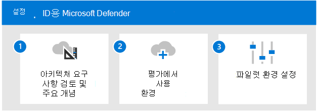

# Id에 대한 Microsoft Defender 평가 개요

**적용 대상:**
- Microsoft 365 Defender

이 문서에서는 Id에 대해 Microsoft Defender를 사용하도록 설정하고 파일럿하는 프로세스를 간략하게 설명합니다. 이 프로세스를 시작하기 전에 전체 프로세스를 검토하여 Microsoft 365 Defender  평가 환경을 Microsoft 365 Defender [합니다.](eval-create-eval-environment.md) 
 

다음 단계에 따라 Id에 대해 Microsoft Defender를 사용하도록 설정하고 파일럿합니다.

다음 표에서는 그림의 단계에 대해 설명합니다.

| |단계  |설명  |
|---------|---------|---------|
|1|[아키텍처 요구 사항 및 주요 개념 검토](eval-defender-identity-architecture.md)    | ID 아키텍처에 대한 Defender를 이해하고 환경이 아키텍처의 선행 요구 사항을 충족하는지 확인       |
|2|[평가 환경 사용](eval-defender-identity-enable-eval.md)     |   단계에 따라 평가 환경을 설정할 수 있습니다.      |
|3 |[파일럿 설정](eval-defender-identity-pilot.md)     |   ID 환경에 대한 벤치마크 설정에 대해 알아보고 Id용 Defender 자습서를 사용해 하세요.     |
||||

