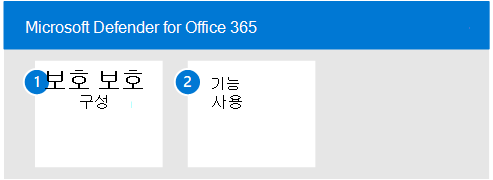

# Id에 대한 Microsoft Defender 파일럿

**적용 대상:**
- Microsoft 365 Defender

이 문서는 Id에 대한 Microsoft Defender의 평가 환경을 설정하는 프로세스의 [3단계](eval-defender-identity-overview.md) 중 3단계입니다. 이 프로세스에 대한 자세한 내용은 개요 문서를 [참조하세요.](eval-defender-identity-overview.md)

다음 단계에 따라 ID에 맞게 Microsoft Defender에 대한 파일럿을 설정하고 구성합니다. 권장 사항에는 파일럿 그룹 설정이 포함되어 있습니다. 모범 사례는 AD DS(Active Directory 도메인 서비스) 및 AD FS(Active Directory Federated Services)를 실행하는 모든 서버에 센서를 설치하는 것입니다.

다음 표에서는 그림의 단계에 대해 설명합니다.

- [1단계: ID 환경에 대한 벤치마크 권장 사항 구성](#step-1-configure-benchmark-recommendations-for-your-identity-environment)
- [2단계: 기능 시도 - 다양한 공격 유형을 식별하고 수정하기 위한 자습서를 진행합니다. ](#step-2-try-out-capabilities--walk-through-tutorials-for-identifying-and-remediating-different-attack-types)

## 1단계. ID 환경에 대한 벤치마크 권장 사항 구성

Microsoft는 Microsoft 클라우드 서비스를 사용하는 고객을 위한 보안 벤치마크 권장 사항을 제공합니다. Azure 보안 벤치마크(ASB)는 Azure에서 워크로드, 데이터 및 서비스의 보안을 개선하는 데 도움이 되는 징계적인 모범 사례 및 권장 사항을 제공합니다. 

이러한 벤치마크 권장 사항에는 [Microsoft Defender for Identity에 대한 Azure 보안 기준이 포함됩니다.](/security/benchmark/azure/baselines/defender-for-identity-security-baseline) 이러한 권장 사항을 구현하는 데는 계획 및 구현에 시간이 걸릴 수 있습니다. 이렇게 하면 ID 환경의 보안이 크게 강화되는 반면, ID에 대한 Microsoft Defender를 계속 평가하고 구현하는 것을 방지하지는 않습니다. 이러한 정보는 인식을 위해 여기에 제공됩니다.

## 2단계. 기능 사용 - 다양한 공격 유형을 식별하고 수정하기 위한 자습서를 진행합니다.

Microsoft Defender for Identity 설명서에는 다양한 공격 유형을 식별하고 수정하는 프로세스를 진행하는 일련의 자습서가 포함되어 있습니다.

Id용 Defender 자습서를 사용해 냅니다.
- [정비 경고](/defender-for-identity/reconnaissance-alerts)
- [손상된 자격 증명 경고](/defender-for-identity/compromised-credentials-alerts)
- [측면 이동 경고](/defender-for-identity/lateral-movement-alerts)
- [도메인 지수 경고](/defender-for-identity/domain-dominance-alerts)
- [유출 경고](/defender-for-identity/exfiltration-alerts)
- [사용자 조사](/defender-for-identity/investigate-a-user)
- [컴퓨터 조사](/defender-for-identity/investigate-a-computer)
- [횡적 이동 경로 조사](/defender-for-identity/investigate-lateral-movement-path)
- [장치에서 엔터티 조사](/defender-for-identity/investigate-entity)

## 다음 단계

[Office 365용 Microsoft Defender 평가](eval-defender-office-365-overview.md)

Microsoft [Defender](eval-defender-office-365-overview.md) for Office 365

평가 및 파일럿 테스트 [개요로 Microsoft 365 Defender](eval-overview.md)