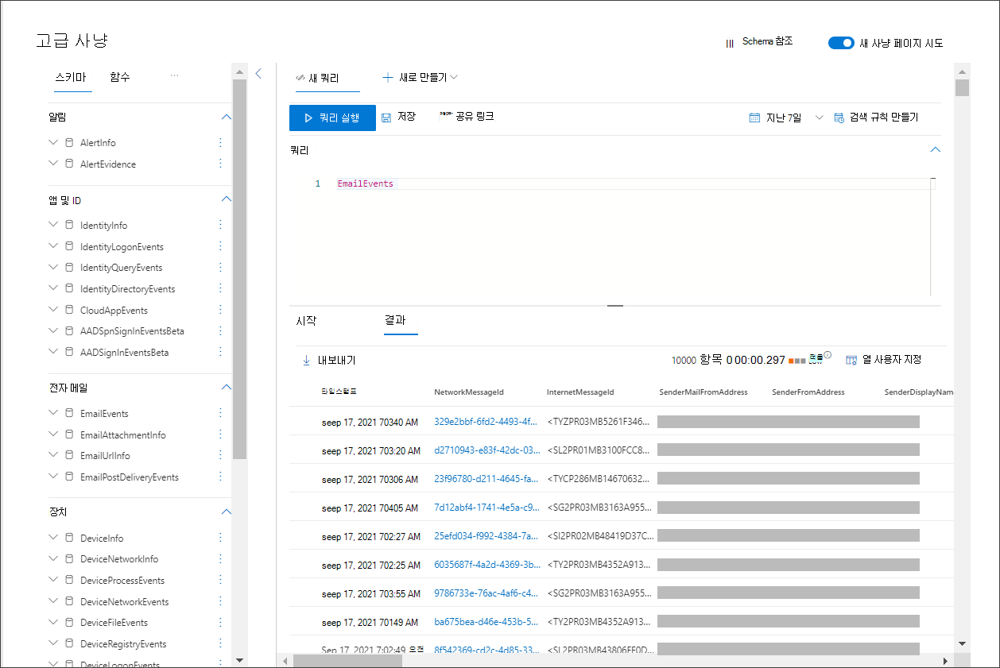

# <a name="try-microsoft-365-defender-incident-response-capabilities-in-a-pilot-environment"></a>파일럿 Microsoft 365 Defender 인시던트 대응 기능 테스트

**적용 대상:**
- Microsoft 365 Defender

이 문서는 파일럿 환경을 사용하여 파일럿 환경에서 인시던트에 대한 조사 및 대응을 Microsoft 365 Defender [2단계](eval-defender-investigate-respond.md) 중 2단계입니다. 이 프로세스에 대한 자세한 내용은 개요 문서를 [참조하세요.](eval-defender-investigate-respond.md)

시뮬레이트된 [](eval-defender-investigate-respond-simulate-attack.md)공격에 대한 인시던트 대응을 수행한 후 다음과 같은 몇 가지 Microsoft 365 Defender 탐색할 수 있습니다.

|기능 |설명 |
|:-------|:-----|
| [인시던트 우선 순위 지정](#prioritize-incidents) | 인시던트 큐 필터링 및 정렬을 사용하여 다음에 해결할 인시던트가 있는지 확인할 수 있습니다. |
| [인시던트 관리](#manage-incidents) | 인시던트 속성을 수정하여 올바른 할당을 보장하고 태그 및 설명을 추가하고 인시던트 문제를 해결합니다. |
| [자동화된 조사 및 응답](#examine-automated-investigation-and-response-with-the-action-center) | 보안 운영 팀이 위협을 보다 효율적으로 해결할 수 있도록 도와주는 자동화된 조사 및 대응(AIR) 기능 알림 센터는 보류 중인 수정 작업 승인과 같은 인시던트 및 경고 작업에 대한 "단일 창 창" 환경입니다. |
| [지능형 헌팅](#advanced-hunting) | 네트워크에서 이벤트를 사전 검사하고 위협 표시기 및 엔터티를 찾을 수 있는 쿼리 기반 위협 헌팅 도구입니다. 또한 인시던트의 조사 및 수정 중에 고급 헌팅을 사용할 수 있습니다. |


## <a name="prioritize-incidents"></a>인시던트 우선 순위 지정

인시던트 **포털의 빠른** 실행에 있는 인시던트 & > 인시던트 큐로 <a href="https://go.microsoft.com/fwlink/p/?linkid=2077139" target="_blank">Microsoft 365 Defender 있습니다.</a> 다음은 예입니다.

:::image type="content" source="../../media/incidents-queue/incidents-ss-incidents.png" alt-text="인시던트 큐의 예입니다.":::

최근 **인시던트** 및 알림 섹션에는 지난 24시간 동안 수신된 경고 및 인시던트 수의 그래프가 표시됩니다.

인시던트 목록을 검사하고 할당 및 조사의 중요성에 우선 순위를 지정하기 위해 다음을 수행하면 됩니다. 

- 사용자 지정 가능한 열을 구성(열 선택 선택)하여 인시던트 또는 영향을 주는 엔터티의 다양한 특성을 파악합니다. 이를 통해 분석을 위한 인시던트 우선 순위에 대한 정보를 통해 의사 결정을 내리는 데 도움이 됩니다.

- 필터링을 사용하여 특정 시나리오 또는 위협에 집중합니다. 인시던트 큐에 필터를 적용하면 즉각적인 주의가 필요한 인시던트가 결정될 수 있습니다. 

기본 인시던트 큐에서 **필터를** 선택하여 특정 인시던트 집합을 지정할 수 있는 필터 창을 표시합니다.  예를 들면 다음과 같습니다.

:::image type="content" source="../../media/incidents-queue/incidents-ss-incidents-filters.png" alt-text="문제 큐에 대한 필터 창의 예입니다.":::

자세한 내용은 인시던트 [우선 순위 지정을 참조하세요.](incident-queue.md)

## <a name="manage-incidents"></a>인시던트 관리

인시던트에 대한 **인시던트 관리** 창에서 인시던트를 관리할 수 있습니다. 다음은 예입니다.

:::image type="content" source="../../media/incidents-queue/incidents-ss-incidents-manage.png" alt-text="인시던트의 인시던트 관리 창 예":::

이 창은 다음의  문제 관리 링크에서 표시할 수 있습니다.

- 인시던트 큐에 있는 인시던트의 속성 창입니다.
- **인시던트의** 요약 페이지입니다.

인시던트 관리 방법은 다음과 같습니다.

- 인시던트 이름 편집

  보안 팀 모범 사례에 따라 자동으로 할당된 이름을 변경합니다.
  
- 인시던트 태그 추가

  보안 팀이 나중에 필터링할 수 있는 인시던트 분류에 사용하는 태그를 추가합니다.
  
- 인시던트 할당

  나중에 필터링할 수 있는 사용자 계정 이름에 할당합니다.
  
- 인시던트 해결

  인시던트가 수정된 후 닫습니다.
  
- 분류 및 결정 설정

  인시던트 해결 시 위협 유형을 분류하고 선택합니다.
  
- 메모 추가

  보안 팀 모범 사례에 따라 진행률, 메모 또는 기타 정보에 설명을 사용하세요. 전체 설명 기록은 인시던트의 세부 정보 페이지의 설명 및 기록 옵션에서 사용할 수 있습니다. 

자세한 내용은 인시던트 [관리를 참조하세요.](manage-incidents.md)

## <a name="examine-automated-investigation-and-response-with-the-action-center"></a>관리 센터를 통해 자동화된 조사 및 대응 검사

조직에 대해 자동화된 조사 및 대응 기능이 구성되는 방식에 따라 보안 운영 팀의 승인만 수행되거나 자동으로 수정 작업이 수행됩니다. 보류 중이든 완료이든 모든 작업은 알림 [](m365d-action-center.md)센터에 나열됩니다. 이 센터에는 장치에 대한 보류 중 및 완료된 수정 작업, 전자 메일 & 공동 작업 콘텐츠 및 ID가 한 위치에 나열됩니다.

다음은 예입니다.

:::image type="content" source="../../media/m3d-action-center-unified.png" alt-text="Microsoft 365 Defender.":::

작업 센터에서 보류 중인 작업을 선택한 다음 플라이아웃 창에서 해당 작업을 승인하거나 거부할 수 있습니다. 다음은 예입니다.

:::image type="content" source="../../media/air-actioncenter-itemselected.png" alt-text="작업을 승인하거나 거부합니다.":::

자동화된 조사를 진행하고 제시간에 완료할 수 있도록 가능한 한 빨리 보류 중인 작업을 승인(또는 거부)합니다.

자세한 내용은 자동화된 조사 및 [대응 및](m365d-autoir.md) [관리 센터를 참조하세요.](m365d-action-center.md)

## <a name="advanced-hunting"></a>고급 헌팅

> [!NOTE]
> 고급 헌팅 시뮬레이션을 진행하기 전에 다음 비디오를 시청하여 고급 헌팅 개념을 이해하고 포털에서 찾을 수 있는 위치를 확인하며 보안 작업에 도움이 되는 방법을 파악합니다.

<br>

> [!VIDEO https://www.microsoft.com/videoplayer/embed/RE4Bp7O]


선택적 파일 없는 [PowerShell](eval-defender-investigate-respond-simulate-attack.md#simulate-an-attack-with-an-isolated-domain-controller-and-client-device-optional) 공격 시뮬레이션이 이미 자격 증명 액세스 단계에 도달한 실제 공격인 경우 조사의 임의 지점에서 고급 헌팅을 사용하여 생성된 경고 및 영향을 받는 엔터티에서 이미 알고 있는 것을 사용하여 네트워크의 이벤트 및 레코드를 능동적으로 검색할 수 있습니다. 

예를 들어 사용자 및 [IP 주소 정비(SMB)](eval-defender-investigate-respond-simulate-attack.md#alert-user-and-ip-address-reconnaissance-smb-source-microsoft-defender-for-identity) 경고의 정보에 따라 이 표를 사용하여 모든 SMB 세션 열00 이벤트를 찾거나 Microsoft Defender for Identity 데이터에서 다른 여러 프로토콜에서 더 많은 검색 활동을 찾을 수 `IdentityDirectoryEvents` `IdentityQueryEvents` 있습니다.


### <a name="hunting-environment-requirements"></a>헌팅 환경 요구 사항

이 시뮬레이션에는 단일 내부 사서함 및 장치가 필요합니다. 테스트 메시지를 보내기 위해 외부 전자 메일 계정도 필요합니다.

1. 테넌트에서 [를 사용하도록 설정되어 있는지 Microsoft 365 Defender.](m365d-enable.md#confirm-that-the-service-is-on)
2. 전자 메일을 받는 데 사용할 대상 사서함을 식별합니다.

   - 이 사서함은 Microsoft Defender에서 모니터링해야 Office 365

   - 요구 사항 3의 장치가 이 사서함에 액세스해야 합니다.

3. 테스트 장치를 구성합니다.

    a. 버전 1903 이상을 Windows 10 있는지 확인

    b. 테스트 장치를 테스트 도메인에 가입합니다.

    c. [를 Windows Defender 바이러스 백신.](/windows/security/threat-protection/windows-defender-antivirus/configure-windows-defender-antivirus-features) 사용자 설정에 문제가 Windows Defender 바이러스 백신 문제 해결 항목을 [참조하세요.](/windows/security/threat-protection/microsoft-defender-atp/troubleshoot-onboarding#ensure-that-microsoft-defender-antivirus-is-not-disabled-by-a-policy)

    d. [끝점용 Microsoft Defender에 온보딩합니다.](/windows/security/threat-protection/microsoft-defender-atp/configure-endpoints)

### <a name="run-the-simulation"></a>시뮬레이션 실행

1. 외부 전자 메일 계정에서 헌팅 환경 요구 사항 섹션의 2단계에서 식별된 사서함으로 전자 메일을 전송합니다. 기존 전자 메일 필터 정책을 통해 허용되는 첨부 파일을 포함합니다. 이 파일은 악성 파일이나 실행 파일이 아니어도 됩니다. 추천 파일 형식은 <i>.pdf</i>, <i></i>.exe(허용되는 경우) 또는 Word 파일과 같은 Office 문서 형식입니다.

2. 헌팅 환경 요구 사항 섹션의 3단계에 정의된 것으로 구성된 장치에서 보낸 전자 메일을 열습니다. 첨부 파일을 열거나 장치에 파일을 저장합니다.

#### <a name="go-hunting"></a>헌팅으로 이동

1. 웹 Microsoft 365 Defender <a href="https://go.microsoft.com/fwlink/p/?linkid=2077139" target="_blank">를 열 수 있습니다.</a>

2. 탐색 창에서 고급 헌팅 **> 선택합니다.**

3. 전자 메일 이벤트를 수집하여 시작하는 쿼리를 작성합니다.

   1. 쿼리 **쿼리 > 새로 고치기 를 선택합니다.**

   1. 고급 **헌팅** 아래의 전자 메일 **그룹에서** **EmailEvents 를 두 번 클릭합니다.** 쿼리 창에 표시됩니다.

      ```console
      EmailEvents
      ```

   1. 쿼리의 시간 프레임을 지난 24시간으로 변경합니다. 위의 시뮬레이션을 실행할 때 보낸 전자 메일이 지난 24시간 동안의 경우, 그렇지 않으면 필요한 경우 시간 프레임을 변경합니다.

   1. **쿼리 실행** 을 선택합니다. 파일럿 환경에 따라 결과가 다를 수 있습니다.

      > [!NOTE]
      > 데이터 반환을 제한하는 필터링 옵션에 대한 다음 단계를 참조하세요.

      

        > [!NOTE]
        > 고급 헌팅은 쿼리 결과를 테이블형 데이터로 표시됩니다. 차트와 같은 다른 형식의 데이터를 볼 수도 있습니다.

   1. 결과를 확인하고 연 전자 메일을 식별할 수 있는지 봐야 합니다. 고급 헌팅에 메시지가 표시될 때 최대 2시간이 걸릴 수 있습니다. 결과 범위를 좁히기 위해 **쿼리에 where** 조건을 추가하여 SenderMailFromDomain으로 "yahoo.com" 전자 메일만 검색할 수 있습니다. 예를 들면 다음과 같습니다.

      ```console
      EmailEvents
      | where SenderMailFromDomain == "yahoo.com"
      ```

   1. 레코드를 검사할 수 있도록 쿼리에서 결과 행을 클릭합니다.

      

4. 이제 전자 메일을 볼 수 있는 것으로 확인되면 첨부 파일에 대한 필터를 추가합니다. 환경의 첨부 파일이 있는 모든 전자 메일에 집중합니다. 이 시뮬레이션에서는 사용자 환경에서 전송되는 전자 메일이 아니라 인바운드 전자 메일에 중점을 니다. 메시지를 찾기 위해 추가한 필터를 제거하고 "| 여기서 **AttachmentCount > 및** **EmailDirection**  ==  **"Inbound""**

   다음 쿼리는 모든 전자 메일 이벤트에 대한 초기 쿼리보다 짧은 목록으로 결과를 보여 주게 됩니다.

   ```console
   EmailEvents
   | where AttachmentCount > 0 and EmailDirection == "Inbound"
   ```

5. 그런 다음 결과 집합에 첨부 파일에 대한 정보(예: 파일 이름, 해시)를 포함합니다. 이렇게 하여 **EmailAttachmentInfo** 테이블을 조인합니다. 조인에 사용할 일반 필드는 **NetworkMessageId** 및 **RecipientObjectId입니다.**

   다음 쿼리에는 "| **project-rename EmailTimestamp=Timestamp**" - 다음 단계에서 추가할 파일 작업과 관련된 타임스탬프와 전자 메일과 관련된 타임스탬프를 식별하는 데 도움이 됩니다.

   ```console
   EmailEvents
   | where AttachmentCount > 0 and EmailDirection == "Inbound"
   | project-rename EmailTimestamp=Timestamp
   | join EmailAttachmentInfo on NetworkMessageId, RecipientObjectId
   ```

6. 그런 다음 **EmailAttachmentInfo** 테이블의 **SHA256** 값을 사용하여 해당 해시에 대한 **DeviceFileEvents(끝점에서** 수행된 파일 작업)를 확인합니다. 여기서 공통 필드는 첨부 파일에 대한 SHA256 해시입니다.

   결과 테이블에는 이제 끝점(끝점용 Microsoft Defender)의 세부 정보(예: 장치 이름, 수행된 작업(이 경우 FileCreated 이벤트만 포함) 및 파일이 저장된 위치가 포함됩니다. 프로세스와 연결된 계정 이름도 포함됩니다.

   ```console
   EmailEvents
   | where AttachmentCount > 0 and EmailDirection == "Inbound"
   | project-rename EmailTimestamp=Timestamp
   | join EmailAttachmentInfo on NetworkMessageId, RecipientObjectId
   | join DeviceFileEvents on SHA256
   | where ActionType == "FileCreated"
   ```

   이제 사용자가 첨부 파일을 열거나 저장한 모든 인바운드 전자 메일을 식별하는 쿼리를 만들 수 있습니다. 이 쿼리를 구체화하여 특정 보낸 사람 도메인, 파일 크기, 파일 형식 등도 필터링할 수 있습니다.

7. 함수는 특수한 종류의 조인으로, 파일에 대한 추가 TI 데이터(예: 보급, 서명자 및 발급자 정보 등)를 끌어와야 합니다. 파일에 대한 자세한 내용을 확인하기 위해 **FileProfile()** 함수 향상을 사용 합니다.

    ```console
    EmailEvents
    | where AttachmentCount > 0 and EmailDirection == "Inbound"
    | project-rename EmailTimestamp=Timestamp
    | join EmailAttachmentInfo on NetworkMessageId, RecipientObjectId
    | join DeviceFileEvents on SHA256
    | where ActionType == "FileCreated"
    | distinct SHA1
    | invoke FileProfile()
    ```

#### <a name="create-a-detection"></a>검색 만들기

향후 경고를 받을 정보를 식별하는 쿼리를 만든  후 쿼리에서 사용자 지정 검색을 만들 수 있습니다.

사용자 지정 검색은 설정한 빈도에 따라 쿼리를 실행하고 쿼리 결과에 따라 선택한 영향을 미치는 자산에 따라 보안 경고가 생성됩니다. 이러한 경고는 인시던트와 상호 관련이 있으며 제품 중 하나에서 생성된 다른 보안 경고로 조사될 수 있습니다.

1. 쿼리 페이지에서 이동 헌팅 지침의 7단계에서 추가된 줄 7과 8을 제거하고 검색 규칙 **만들기를 클릭합니다.**

   

   > [!NOTE]
   > 검색 규칙 **만들기를** 클릭하고 쿼리에 구문 오류가 있는 경우 검색 규칙이 저장되지 않습니다. 쿼리를 다시 확인하여 오류가 없는지 검사합니다.

2. 보안 팀에서 경고를 이해할 수 있는 정보, 경고가 생성된 이유 및 수행할 것으로 예상되는 작업을 파악하는 데 필요한 필드를 입력합니다.

   

   이 검색 규칙 경고에 대한 정보를 통해 다음 사용자에게 정보를 제공하도록 필드를 명확히 작성해야 합니다.

3. 이 경고에 영향을 미치는 엔터티를 선택합니다. 이 경우 장치 및 **사서함 을** **선택합니다.**

   

4. 경고가 트리거되는 경우 수행할 작업을 결정 합니다. 이 경우 다른 작업을 수행할 수 있는 경우에도 바이러스 백신 검색을 실행합니다.

   

5. 경고 규칙의 범위를 선택합니다. 이 쿼리에는 디바이스가 포함되는 것이기 때문에 장치 그룹은 끝점 컨텍스트에 대한 Microsoft Defender에 따라 이 사용자 지정 검색과 관련이 있습니다. 영향을 미치는 엔터티로 장치를 포함하지 않는 사용자 지정 검색을 만드는 경우 범위가 적용되지 않습니다.

   

   이 파일럿에서는 이 규칙을 프로덕션 환경의 테스트 장치 하위 집합으로 제한할 수 있습니다.

6. **만들기** 를 선택합니다. 그런 다음 탐색 **패널에서 사용자** 지정 검색 규칙을 선택합니다.

   

   

   이 페이지에서 세부 정보 페이지를 여는 검색 규칙을 선택할 수 있습니다.

   

<!--

### Advanced hunting walk-through exercises

To learn more about advanced hunting, the following webcasts will walk you through the capabilities of advanced hunting within Microsoft 365 Defender to create cross-pillar queries, pivot to entities, and create custom detections and remediation actions.

> [!NOTE]
> Be prepared with your own GitHub account to run the hunting queries in your pilot test lab environment.

|Title|Description|Download MP4|Watch on YouTube|CSL file to use|
|---|---|---|---|---|
|Episode 1: KQL fundamentals|We'll cover the basics of advanced hunting capabilities in Microsoft 365 Defender. Learn about available advanced hunting data and basic KQL syntax and operators.|[MP4](https://aka.ms/MTP15JUL20_MP4)|[YouTube](https://youtu.be/0D9TkGjeJwM)|[Episode 1: CSL file in Git](https://github.com/microsoft/Microsoft-threat-protection-Hunting-Queries/blob/master/Webcasts/TrackingTheAdversary/Episode%201%20-%20KQL%20Fundamentals.csl)|
|Episode 2: Joins|We'll continue learning about data in advanced hunting and how to join tables together. Learn about inner, outer, unique, and semi joins, and the nuances of the default Kusto innerunique join.|[MP4](https://aka.ms/MTP22JUL20_MP4)|[YouTube](https://youtu.be/LMrO6K5TWOU)|[Episode 2: CSL file in Git](https://github.com/microsoft/Microsoft-threat-protection-Hunting-Queries/blob/master/Webcasts/TrackingTheAdversary/Episode%202%20-%20Joins.csl)|
|Episode 3: Summarizing, pivoting, and visualizing data|Now that we're able to filter, manipulate, and join data, it's time to start summarizing, quantifying, pivoting, and visualizing. In this episode, we'll cover the summarize operator and some of the calculations you can perform while diving into additional tables in the advanced hunting schema. We turn our datasets into charts that can help improve analysis.|[MP4](https://aka.ms/MTP29JUL20_MP4)|[YouTube](https://youtu.be/UKnk9U1NH6Y)|[Episode 3: CSL file in Git](https://github.com/microsoft/Microsoft-threat-protection-Hunting-Queries/blob/master/Webcasts/TrackingTheAdversary/Episode%203%20-%20Summarizing%2C%20Pivoting%2C%20and%20Joining.csl)|
|Episode 4: Let's hunt! Applying KQL to incident tracking|Time to track some attacker activity! In this episode, we'll use our improved understanding of KQL and advanced hunting in Microsoft 365 Defender to track an attack. Learn some of the tips and tricks used in the field to track attacker activity, including the ABCs of cybersecurity and how to apply them to incident response.|[MP4](https://aka.ms/MTP5AUG20_MP4)|[YouTube](https://youtu.be/2EUxOc_LNd8)|[Episode 4: CSL file in Git](https://github.com/microsoft/Microsoft-threat-protection-Hunting-Queries/blob/master/Webcasts/TrackingTheAdversary/Episode%204%20-%20Lets%20Hunt.csl)|
|

--> 

### <a name="expert-training-on-advanced-hunting"></a>고급 헌팅에 대한 전문 교육

**사적** 추적은 새로운 보안 분석가와 위협 헌터를 위한 웹캐스트 시리즈입니다. 고급 헌팅의 기본을 안내하여 정교한 쿼리를 직접 만들 수 있습니다. 

고급 [헌팅에 대한](advanced-hunting-expert-training.md) 전문 교육을 참조하여 시작을 참조합니다.

### <a name="navigation-you-may-need"></a>필요한 탐색

[Microsoft 365 Defender 환경 만들기](eval-create-eval-environment.md)
