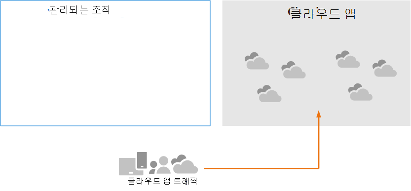
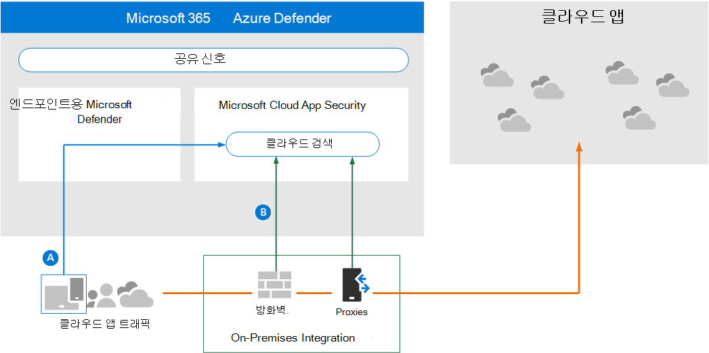
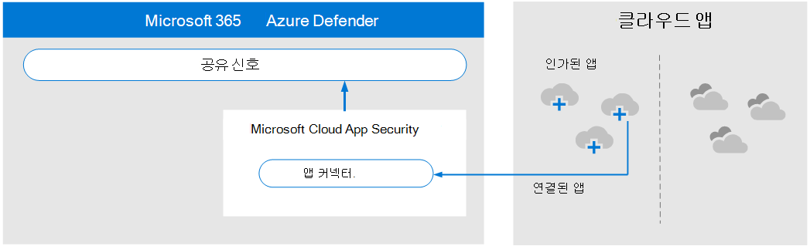
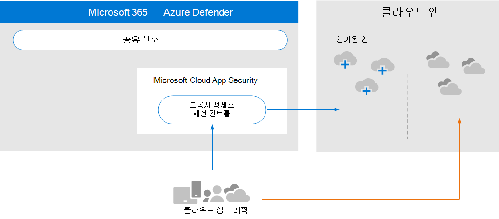

# 아키텍처 요구 사항 및 주요 개념을 Microsoft Cloud App Security

**적용 대상:**

- Microsoft 365 Defender

이 문서는 [1단계 중 3단계로,](eval-defender-mcas-overview.md) 사용자 환경과 함께 Microsoft Cloud App Security 환경을 Microsoft 365 Defender. 이 프로세스에 대한 자세한 내용은 개요 문서를 [참조하세요.](eval-defender-identity-overview.md)

이 Microsoft Cloud App Security 사용하도록 설정하기 전에 아키텍처를 이해하고 요구 사항을 충족할 수 있는지 확인합니다. 

## 아키텍처 이해

Microsoft Cloud App Security CASB(클라우드 액세스 보안 브로커)입니다. CASB는 사용자가 어디에 있든 사용중인 디바이스에 관계없이 엔터프라이즈 사용자와 사용하는 클라우드 리소스 간에 실시간으로 액세스를 브로커하기 위한 게이트키퍼 역할을 합니다. Microsoft Cloud App Security Microsoft 보안 기능과 기본적으로 통합되어 있습니다( Microsoft 365 Defender. 

이 Cloud App Security 없는 경우 조직에서 사용하는 클라우드 앱은 그림과 같은 관리되지 않고 보호되지 않습니다.

이 그림의 내용
- 조직에서 클라우드 앱을 사용하는 것은 원치 않는 것이고 보호되지 않습니다. 
- 이 사용은 관리되는 조직 내에서 달성된 보호 외부에 있습니다. 

#### 클라우드 앱 검색

클라우드 앱 사용을 관리하는 첫 번째 단계는 조직에서 사용하는 클라우드 앱을 검색하는 것입니다. 다음 다이어그램은 클라우드 검색이 클라우드 검색에서 작동하는 Cloud App Security.

이 그림에는 네트워크 트래픽을 모니터링하고 조직에서 사용중인 클라우드 앱을 검색하는 데 사용할 수 있는 두 가지 방법이 있습니다.
- 대답. Cloud App Discovery는 기본적으로 끝점용 Microsoft Defender와 통합됩니다. Endpoint용 Defender는 IT 관리 앱 및 11개 장치에서 IT 관리 Windows 10 Windows 보고합니다. 
- B. 네트워크에 연결된 모든 디바이스에서 적용 범위를 위해 Cloud App Security 로그 수집기 및 끝점에서 데이터를 수집하기 위한 기타 proxies에 설치됩니다. 이 데이터는 분석을 위해 Cloud App Security 전송됩니다.

#### 클라우드 앱 관리

클라우드 앱을 검색하고 조직에서 이러한 앱을 사용하는 방식의 동작을 분석한 후 선택한 클라우드 앱 관리를 시작할 수 있습니다. 

이 그림에서는 다음을 참조합니다.
- 일부 앱은 사용이 제재됩니다. 이는 앱을 관리하는 간단한 방법입니다.
- 앱을 앱 커넥터에 연결하여 가시성과 제어를 강화할 수 있습니다. 앱 커넥터는 앱 공급자의 API를 사용 합니다.

#### 클라우드 앱에 세션 컨트롤 적용

Microsoft Cloud App Security 역방향 프록시 역할을 하여 인증된 클라우드 앱에 대한 프록시 액세스를 제공합니다. 이렇게 하면 Cloud App Security 세션 컨트롤을 적용할 수 있습니다. 

이 그림에서는 다음을 참조합니다.
- 조직의 사용자 및 장치에서 허용된 클라우드 앱에 대한 액세스는 사용자 및 디바이스를 통해 Cloud App Security.
- 이 프록시 액세스를 사용하면 세션 컨트롤을 적용할 수 있습니다.
- 제재를 받거나 명시적으로 사용되지 않은 클라우드 앱은 영향을 받지 않습니다.

세션 컨트롤을 사용하면 조직에서 클라우드 앱을 사용하는 방법에 매개 변수를 적용할 수 있습니다. 예를 들어 조직에서 Salesforce를 사용하는 경우 관리되는 장치만 Salesforce에서 조직의 데이터에 액세스할 수 있도록 허용하는 세션 정책을 구성할 수 있습니다. 더 간단한 예는 더 엄격한 정책을 적용하기 전에 이 트래픽의 위험을 분석할 수 있도록 관리되지 않는 장치의 트래픽을 모니터링하는 정책을 구성할 수 있습니다.

#### 조건부 액세스 앱 컨트롤과 Azure AD 통합

다단계 인증 및 기타 조건부 액세스 정책을 적용하기 위해 Azure AD 테넌트에 SaaS 앱을 이미 추가한 상태일 수 있습니다. Microsoft Cloud App Security Azure AD와 기본적으로 통합됩니다. Azure AD에서 조건부 액세스 앱 제어를 사용하도록 Azure AD에서 정책을 구성하기만 Cloud App Security. 이렇게 하면 이러한 관리되는 SaaS 앱에 대한 네트워크 트래픽이 Cloud App Security 프록시로 라우팅됩니다. 이 Cloud App Security 모니터링하고 세션 컨트롤을 적용할 수 있습니다. 

이 그림에서는 다음을 참조합니다.
- SaaS 앱은 Azure AD 테넌트와 통합됩니다. 이를 통해 Azure AD는 다단계 인증을 비롯한 조건부 액세스 정책을 적용할 수 있습니다.
- SaaS 앱에 대한 Azure Active Directory 트래픽을 다른 앱으로 Cloud App Security. 이 정책은 해당 정책을 적용할 SaaS 앱을 지정합니다. 따라서 Azure AD가 이러한 SaaS 앱에 적용되는 조건부 액세스 정책을 적용한 후 Azure AD는 해당 정책을 통해 세션 트래픽을 Cloud App Security.
- Cloud App Security 모니터링하고 관리자가 구성한 모든 세션 제어 정책을 적용합니다. 

Azure AD에 추가되지 않은 클라우드 Cloud App Security 클라우드 앱을 검색하고 인가한 것일 수 있습니다. 이러한 클라우드 앱을 Azure AD 테넌트 및 조건부 액세스 규칙의 범위에 추가하여 조건부 액세스 앱 제어를 활용할 수 있습니다.

#### 해커로부터 조직 보호

Cloud App Security 자체적으로 강력한 보호 기능을 제공합니다. 그러나 이 기능의 다른 기능과 Microsoft 365 Defender Cloud App Security 함께 공격을 중지하는 데 도움이 되는 공유 신호에 데이터를 제공합니다.

이 그림을 개요에서 이 평가 및 파일럿 Microsoft 365 Defender 반복하는 것이 가치가 있습니다. 

이 그림의 오른쪽에 중점을 두면 Microsoft Cloud App Security, 자격 증명 액세스, 비정상적인 다운로드, 파일 공유 또는 메일 전달 활동과 같은 비정상적인 동작을 발견하여 보안 팀에 보고합니다. 따라서 Cloud App Security 해커의 측면 이동 및 중요한 데이터 유출을 방지할 수 있습니다. Microsoft 356 Defender는 모든 구성 요소의 신호와 상관을 하여 전체 공격 스토리를 제공합니다.

## 주요 개념 이해

다음 표에서는 이러한 개념을 평가, 구성 및 배포할 때 이해해야 하는 주요 개념을 Microsoft Cloud App Security.

|개념  |설명 |추가 정보  |
|---------|---------|---------|
| Cloud App Security 대시보드 | 조직에 대한 가장 중요한 정보에 대한 개요를 제시하고 심층 조사에 대한 링크를 제공합니다.        | [대시보드 작업 ](/cloud-app-security/daily-activities-to-protect-your-cloud-environment)       |
| 조건부 액세스 앱 컨트롤.    | IdP(ID 공급자)와 통합되어 Azure AD 조건부 액세스 정책을 제공하고 선택적으로 세션 제어를 적용하는 역방향 프록시 아키텍처입니다.        |  [조건부 액세스 Microsoft Cloud App Security 컨트롤을 사용하여 앱 보호](/cloud-app-security/proxy-intro-aad)       |
|  Cloud App Catalog   | Cloud App Catalog는 80개가 넘는 위험 요인을 기준으로 순위를 정하고 점수가 점수를 거는 16,000개가 넘는 클라우드 앱의 Microsoft 카탈로그에 대한 전체 그림을 제공합니다.    |  [앱 위험 점수 작업](/cloud-app-security/risk-score)       |
| 클라우드 검색 대시보드    | 클라우드 검색은 트래픽 로그를 분석하고 조직에서 클라우드 앱이 사용되는 방식에 대한 더 많은 정보를 제공하고 경고 및 위험 수준을 제공하도록 디자인됩니다.     |  [검색된 앱 작업   ](/cloud-app-security/discovered-apps)    |
|연결된 앱 |Cloud App Security 앱 액세스 제어를 활용하는 클라우드-클라우드 통합, API 커넥터 및 실시간 액세스 및 세션 컨트롤을 사용하여 연결된 앱에 대한 종단-종단으로 보호를 제공합니다. |[연결된 앱 보호](/cloud-app-security/protect-connected-apps) |
| | | |

## 아키텍처 요구 사항 리뷰

### 클라우드 앱 검색

환경에서 사용되는 클라우드 앱을 검색하기 위해 다음 중 하나 또는 둘 다를 할 수 있습니다.

- 끝점용 Microsoft Defender와 통합하여 클라우드 검색을 빠르게 시작하고 실행합니다. 이 네이티브 통합을 통해 네트워크의 11 및 Windows 및 Windows 10 클라우드 트래픽에 대한 데이터 수집을 즉시 시작할 수 있습니다.
- 네트워크에 연결된 모든 장치에서 액세스하는 모든 클라우드 앱을 검색하려면 방화벽 및 기타 Cloud App Security 로그 수집기 배포합니다. 그러면 끝점에서 데이터를 수집하여 분석하기 위해 Cloud App Security 전송합니다. Cloud App Security 기능을 위해 기본적으로 일부 타사 Proxies와 통합됩니다.

이러한 옵션은 [2단계에 포함되어 있습니다. 평가 환경 사용.](eval-defender-mcas-enable-eval.md) 

### 클라우드 앱에 Azure AD 조건부 액세스 정책 적용

조건부 액세스 앱 제어(클라우드 앱에 조건부 액세스 정책을 적용하는 기능)에는 Azure AD와 통합해야 합니다. 이 설정은 2016년 8월에 시작해야 하는 Cloud App Security. 파일럿 단계인 3단계 동안 시도해 [보시고 권장하는 단계입니다. 파일럿 Microsoft Cloud App Security.](eval-defender-mcas-pilot.md)

## SIEM 통합

일반 SIEM Microsoft Cloud App Security Azure Sentinel과 통합하여 연결된 앱의 경고 및 활동을 중앙에서 모니터링할 수 있습니다. 

또한 Azure Sentinel에는 Azure Sentinel과 Microsoft Cloud App Security 통합할 수 있는 Microsoft Cloud App Security 커넥터가 포함되어 있습니다. 이를 통해 클라우드 앱에 대한 가시성을 확보할 뿐만 아니라 사이버 위협을 식별하고 퇴치하고 데이터 이동 방법을 제어할 수 있는 정교한 분석을 얻을 수 있습니다.

- [일반 SIEM 통합](/cloud-app-security/siem)
- [MCAS에서 Azure Sentinel로 경고 및 클라우드 검색 로그 스트림](/azure/sentinel/connect-cloud-app-security)

### 다음 단계

3단계 중 2단계: [사용자에](eval-defender-mcas-enable-eval.md) 대해 평가 환경을 Microsoft Cloud App Security

평가용 [개요로 Microsoft Cloud App Security](eval-defender-mcas-overview.md)

평가 및 파일럿 테스트 [개요로 Microsoft 365 Defender](eval-overview.md)