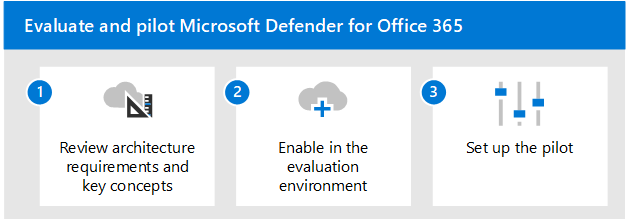

# 평가 Microsoft Cloud App Security

**적용 대상:**
- Microsoft 365 Defender

이 문서에서는 사용자와 함께 파일럿 기능을 사용하도록 설정하고 Microsoft Cloud App Security 프로세스를 Microsoft 365 Defender. 이 프로세스를 시작하기 전에 전체 프로세스를 검토하여 Microsoft 365 Defender  평가 환경을 Microsoft 365 Defender [합니다.](eval-create-eval-environment.md) 
 

다음 단계에 따라 Microsoft 클라우드 앱 보안을 사용하도록 설정하고 파일럿합니다.

|단계  |설명  |
|---------|---------|
|[아키텍처 요구 사항 및 주요 개념 검토](eval-defender-mcas-architecture.md)    | Cloud App Security 아키텍처와 통합하는 방법을 이해합니다Microsoft 365 Defender, 끝점용 Microsoft Defender 및 Azure Active Directory.        |
|[평가 환경 사용](eval-defender-mcas-enable-eval.md)     | 커넥트 포털에서 ID 및/또는 조직의 네트워크 장치에 대한 Defender와의 통합을 구성하고 클라우드 앱을 보고 관리하기 시작하세요.         |
|[파일럿 설정 ](eval-defender-mcas-pilot.md)    | 배포 범위를 특정 사용자 그룹으로 지정하고, 조건부 액세스 앱 제어를 구성하고, 환경 보호를 위한 자습서를 시도해 하세요.       |

