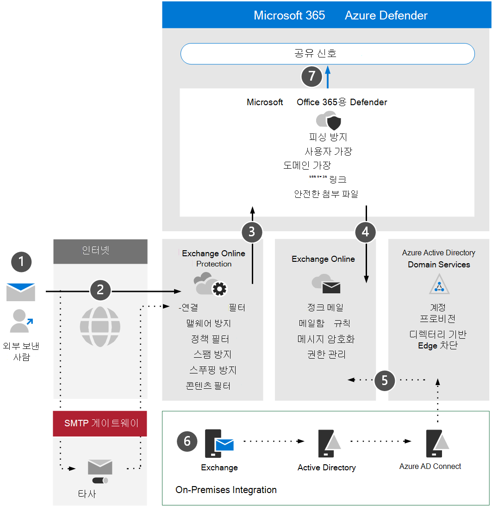

# Microsoft Defender에서 아키텍처 요구 Office 365 주요 개념 검토

**적용 대상:**
- Microsoft 365 Defender

이 문서는 Microsoft Defender의 평가 환경을 설정하는 프로세스의 [3단계](eval-defender-office-365-overview.md) 중 1단계입니다Office 365. 이 프로세스에 대한 자세한 내용은 개요 문서를 [참조하세요.](eval-defender-office-365-overview.md)

사용자에 대해 Defender를 Office 365 아키텍처를 이해하고 요구 사항을 충족할 수 있는지 확인합니다. 이 문서에서는 사용자 환경이 충족해야 하는 아키텍처, 주요 개념 및 Exchange Online 설명합니다.

## 아키텍처 이해

다음 다이어그램은 타사 SMTP 게이트웨이 또는 Office 통합을 포함할 수 있는 Microsoft Defender for Office 아키텍처를 보여 제공합니다. 하이브리드 동시 사용 시나리오(즉, 프로덕션 사서함은 모두 사내 사서함과 온라인 사서함)에는 더 복잡한 구성이 필요하며 이 문서 또는 평가 지침에서는 다루지 않습니다.

다음 표에서는 이 그림에 대해 설명합니다.

|Call-out  |설명  |
|---------|---------|
|1     | 외부 보낸 사람에 대한 호스트 서버는 일반적으로 메시지를 릴레이할 대상 서버를 제공하는 MX 레코드에 대한 공용 DNS 쿼리를 수행합니다.  이 참조는 EXO(Exchange Online)나 EXO에 대해 릴레이하도록 구성된 SMTP 게이트웨이일 수 있습니다.  |
|2     | Exchange Online Protection 연결의 유효성을 검사하고 메시지 헤더 및 콘텐츠를 검사하여 필요한 추가 정책, 태그 지정 또는 처리를 확인합니다.  |
|3      | Exchange Online Microsoft Defender for Office 365 통합하여 보다 고급 위협 방지, 완화 및 수정을 제공합니다. |
|4      | 악의적, 차단 또는 격리되지 않은 메시지는 처리된 후 정크 메일, 사서함 규칙 또는 기타 설정과 관련된 사용자 기본 설정을 평가하고 트리거하는 EXO의 받는 사람에게 배달됩니다. |
|5     | Azure AD 디렉토리를 사용하여 메일 사용이 가능한 개체 및 계정을 동기화하고 커넥트 Active Directory와의 통합을 Azure Active Directory 최종적으로 Exchange Online. |
|6      | 사내 환경을 통합할 때 메일 관련 특성, 설정 및 구성의 지원되는 관리 및 관리에 Exchange 서버를 사용하는 것이 좋습니다. |
|7      | Microsoft Defender for Office 365 XDR(확장된 Microsoft 365 Defender 및 응답)에 대한 신호를 공유합니다.|

사내 통합은 일반적이지만 선택 사항입니다. 환경이 클라우드 전용인 경우 이 지침도 도움이 됩니다.

## 주요 개념 이해

다음 표에서는 MDO를 평가, 구성 및 배포할 때 이해해야 하는 주요 개념을 확인했습니다.

|개념  |설명 |추가 정보  |
|---------|---------|---------|
|Exchange Online Protection      |    Exchange Online Protection(EOP)는 스팸 및 맬웨어 전자 메일로부터 조직을 보호하는 데 도움이 되는 클라우드 기반 필터링 서비스입니다. EOP는 EOP가 포함된 모든 Microsoft 365 라이선스에 Exchange Online.     |   [Exchange Online Protection 개요](../office-365-security/exchange-online-protection-overview.md)      |
|맬웨어 방지 보호 기능     |    EXO에 사서함이 있는 조직은 맬웨어로부터 자동으로 보호됩니다.     |  [EOP의 맬웨어 방지 보호 기능](../office-365-security/anti-malware-protection.md)       |
|스팸 방지 보호 기능     |   EXO에 사서함이 있는 조직은 정크 메일 및 스팸 정책으로부터 자동으로 보호됩니다.      |  [EOP의 스팸 방지 보호 기능](../office-365-security/anti-spam-protection.md)       |
|피싱 방지 보호 기능 |  MDO는 스피어 피싱, 래싱, 랜섬웨어 및 기타 악의적인 활동과 관련된 고급 피싱 방지 보호 기능을 제공합니다.   | [Office 365용 Microsoft Defender의 추가 피싱 방지 보호 기능](../office-365-security/anti-phishing-protection.md)   |
|스푸핑 방지 보호 기능     |   EOP에는 스푸핑된(위조된) 보낸 사람으로부터 조직을 보호하는 데 도움이 되는 기능이 포함되어 있습니다.      |   [EOP의 스푸핑 방지 보호 기능](../office-365-security/anti-spoofing-protection.md)      |
|안전한 첨부 파일     |   금고 첨부 파일은 배달되기 전에 가상 환경을 사용하여 전자 메일 메시지의 첨부 파일을 확인하고 "확인"하여 추가 보호 계층을 제공합니다.      |   [금고 Microsoft Defender for Office 365](../office-365-security/safe-attachments.md)      |
|금고, SharePoint, OneDrive 및 Microsoft Teams     |    또한 금고, SharePoint, OneDrive 및 Microsoft Teams 첨부 파일은 클라우드 저장소 저장소에 업로드된 파일에 대한 추가 보호 계층을 제공합니다.     |  [SharePoint, OneDrive 및 Microsoft Teams용 안전한 첨부 파일](../office-365-security/mdo-for-spo-odb-and-teams.md)       |
|안전한 링크     | 금고 링크는 인바운드 전자 메일 메시지 내에서 URL 검색 및 다시 를 제공하는 기능으로, 링크가 배달되거나 클릭되기 전에 해당 링크에 대한 확인을 제공합니다.        |   [금고 Microsoft Defender for Office 365](../office-365-security/safe-links.md)      |
|    |         |         |

Microsoft Defender for Office 기능에 대한 자세한 내용은 microsoft [Defender for Office 365 참조하세요.](/office365/servicedescriptions/office-365-advanced-threat-protection-service-description)

## 아키텍처 요구 사항 리뷰
성공적인 MDO 평가 또는 프로덕션 파일럿에서는 다음과 같은 전제가 있는 것으로 가정합니다.
- 모든 받는 사람 사서함이 현재 사서함에 Exchange Online.
- 공용 MX 레코드는 EOP 또는 타사 SMTP 게이트웨이로 직접 확인하여 인바운드 외부 전자 메일을 EOP에 직접 릴레이합니다.
- 기본 전자 메일 도메인은  기본 전자 메일 도메인에서 Exchange Online.
- DBEB(디렉터리 기반 *Edge* 차단)를 적절하게 배포하고 구성했습니다. 자세한 내용은 [디렉터리 기반 에지 차단을 사용하여 잘못된 받는 사람에게 전송된 메시지 거부](/exchange/mail-flow-best-practices/use-directory-based-edge-blocking)를 참조하세요.

> [!IMPORTANT]
> 이러한 요구 사항이 적용되지 않는 경우 또는 여전히 하이브리드 동시 사용 시나리오에 있는 경우 Office 365 평가용 Microsoft Defender 평가에는 이 지침에서 완전히 다루지 않는 더 복잡하거나 고급 구성이 필요할 수 있습니다.

## SIEM 통합

Microsoft Defender for Office 365 Azure Sentinel과 통합하여 조직 전체의 보안 이벤트를 보다 포괄적으로 분석하고 효과적이고 즉각적인 응답을 위한 플레이북을 빌드할 수 있습니다. 자세한 내용은 커넥트 [Microsoft Defender에서](/azure/sentinel/connect-office-365-advanced-threat-protection)경고를 Office 365.

Microsoft Defender for Office 365 Activity Management API를 사용하여 다른 SIEM(보안 정보 및 이벤트 관리) 솔루션에 Office 365 [수 있습니다.](/office/office-365-management-api/office-365-management-activity-api-reference)

## 다음 단계

3단계 중 2단계: Microsoft [Defender](eval-defender-office-365-enable-eval.md) for Office 365

Microsoft [Defender](eval-defender-office-365-overview.md) for Office 365

평가 및 파일럿 테스트 [개요로 Microsoft 365 Defender](eval-overview.md) 

