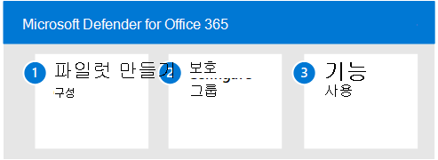

# 파일럿 Microsoft Defender for Office 365

**적용 대상:**
- Microsoft 365 Defender

이 [문서는](eval-defender-office-365-overview.md) Microsoft Defender for Office 365. 이 프로세스에 대한 자세한 내용은 개요 문서를 [참조하세요.](eval-defender-office-365-overview.md)

다음 단계에 따라 Microsoft Defender for Office 365.

- [1단계: 파일럿 그룹 만들기](#step-1-create-pilot-groups)
- [2단계: 보호 구성](#step-2-configure-protection)
- [3단계: 기능 시험 사용 - 시뮬레이션, 모니터링 및 메트릭에 익숙해지기](#step-3-try-out-capabilities--get-familiar-with-simulation-monitoring-and-metrics)

Microsoft Defender에서 Office 365 평가할 때 전체 조직에 대해 정책을 사용하도록 설정하고 적용하기 전에 특정 사용자를 파일럿하도록 선택할 수 있습니다. 메일 그룹을 만들면 배포 프로세스를 관리하는 데 도움이 될 수 있습니다. 예를 들어 Office 365 사용자용 *Defender - 표준* 보호, Office 365 사용자용 *Defender - 엄격한* 보호, Office 365 사용자에 대한 *Defender -* 사용자 지정 보호 또는 Office 365 사용자용 *Defender - 예외와* 같은 그룹을 만들 수 있습니다.

'표준' 및 '엄격한' 용어가 이 용어에 사용되는 이유는 명확하지 않을 수 있지만, 보안 사전 설정에 대한 Defender에 대해 더 Office 365 것입니다. '사용자 지정' 및 '예외' 이름을 지정하는 그룹은 자체적으로 말하고, 대부분의 사용자는 표준 및 엄격한 *,* 사용자 지정 및 예외 그룹은 위험 관리와 관련하여 중요한 데이터를 수집합니다. 

## 1단계: 파일럿 그룹 만들기

메일 그룹은 프레미스 Active Directory에서 직접 만들어 Exchange Online 동기화할 수 있습니다.

1. 받는 사람 Exchange 권한을 위임받은 계정을 사용하여 EAC(관리 센터)에 로그온합니다.
2. 탐색 메뉴에서 받는 사람을 *확장하고* 그룹을 *선택합니다.*

   :::image type="content" source="../../media/mdo-eval/1_mdo-eval-pilot.png" alt-text="Exchange(빠른 실행)에 있는 관리 센터에서 그룹 화살표를 가리 니다. 그룹을 클릭합니다.":::

3. 그룹 대시보드에서 "그룹 추가"를 선택합니다.

   :::image type="content" source="../../media/mdo-eval/2_mdo-eval-pilot-add-group.png" alt-text="그룹 패널에서 그룹을 추가합니다.":::

4. 그룹 유형에 대해 *배포를 선택하고* 다음을 클릭합니다.

   :::image type="content" source="../../media/mdo-eval/3-mdo-eval-pilot-group-type.png" alt-text="여기에서 메일 그룹 유형을 선택하세요.":::

5. 그룹에 이름과 설명을 지정하고 다음을 클릭합니다.

   :::image type="content" source="../../media/mdo-eval/4_mdo-eval-pilot-set-up-basics.png" alt-text="그룹 이름을 지정하고 설명합니다.":::

## 2단계: 보호 구성

Office 365 Defender의 일부 기능은 기본적으로 구성 및 켜져 있지만 보안 운영에서 보호 수준을 기본값에서 높이고자 할 수 있습니다.

일부 기능은 아직 *구성되지* 않았습니다. 보호를 구성하는 세 가지 옵션이 있습니다.

- **미리 설정한** 보안 정책을 자동으로 할당 [-](../office-365-security/preset-security-policies.md) 모든 기능에 대해 균일한 수준의 보호를 신속하게 할당하는 방법으로 미리 설정한 보안 정책이 제공됩니다. standard _ 또는 _ strict ***에서 선택할*_수 있습니다._** 좋은 방법은 미리 설정한 보안 정책으로 시작한 다음 기능 및 고유한 위협 환경에 대해 자세히 알아보는 경우 정책을 미세 조정하는 것입니다. 여기서의 장점은 사용자 그룹을 최대한 빨리 보호하고 이후에 보호를 조정하는 기능을 사용할 수 있는 것입니다. 이 방법은 권장됩니다.
- **수동으로 기준** 보호 구성 - 환경을 직접 구성하려면 위협으로부터  보호의 지침에 따라 보호 기준을 빠르게 [달성할 수 있습니다.](../office-365-security/protect-against-threats.md) 이 방법을 사용하면 구성 가능한 설정에 대해 자세히 알아보게 됩니다. 또한 나중에 정책을 미세 조정할 수 있습니다.
- **사용자 *지정 보호* 정책** 구성 - 평가의 일부로 사용자 지정 보호 정책을 빌드하고 할당할 수도 있습니다. 정책을 사용자 지정하기 전에 이러한 보호 정책이 적용되고 적용되는 우선 순위를 이해하는 것이 중요합니다. 보안 작업에서는 미리 설정이 적용된 경우에도 일부 정책을 만들어야 합니다. 특히 링크 및 첨부 파일에 대한 보안 정책을 정의하려면 금고 금고 수 있습니다.

> [!IMPORTANT]
> **사용자 지정** 보호 정책을 구성해야 하는 경우 표준 및  엄격한  보안 정의를 구성하는 값을 검사해야 합니다. 보안에 대한 EOP 및 *[Microsoft Defender에](../office-365-security/recommended-settings-for-eop-and-office365.md)* 대한 권장 Office 365 합니다. 구성이 진행되기 전과 같은 기본값도 나열됩니다. 사용자 지정 빌드가 분산되는 위치의 스프레드시트를 보관합니다.

### 미리 설정한 보안 정책 할당

MDO를 평가할 때  권장되는 기준 정책으로 시작한 다음 평가 기간 동안 필요한 경우 구체화하는 것이 좋습니다.

보안 보호 정책에 대해 권장 EOP 및 Defender를 Office 365 평가의 일부로 특정 파일럿 사용자 또는 정의된 그룹에 할당할 수 있습니다. 미리 설정한 정책은  독립적으로 할당하거나 결합할 수 있는 기준 표준 보호 템플릿 또는 보다 적극적인 **Strict** 보호 템플릿을 제공합니다.

다음은 단계에 대한 자세한 정보를 위한 [EOP 및 Microsoft Defender의](../office-365-security/preset-security-policies.md) Office 365 정책입니다.

1. 테넌트에 Microsoft 365 로그온합니다. Microsoft 365 Defender 포털에 대한 액세스 권한이 있는 계정을 사용하여 Office 365 또는 보안 관리자 역할에 Microsoft 365.
2. 탐색 메뉴에서 전자 메일 및 공동 작업 *& 정책* & 선택합니다.

   :::image type="content" source="../../media/mdo-eval/5_mdo-eval-pilot-policies.png" alt-text="탐색 & 전자 메일 관리 공동 작업에서 정책 정책 & 클릭합니다.":::

3. 정책 정책 & 대시보드에서 위협 *정책을 클릭합니다.*

   :::image type="content" source="../../media/mdo-eval/6-mdo-eval-pilot-threat-policies.png" alt-text="a.":::

4. Microsoft 365 Defender 포털에서 탐색 메뉴에서 위협 관리를 확장한 다음 하위 메뉴에서 정책을 선택합니다.
5. 정책 대시보드에서 보안 정책 *미리 설정 을 클릭합니다.*

   :::image type="content" source="../../media/mdo-eval/7-mdo-eval-pilot-template-policies.png" alt-text="미리 설정 보안 정책 타일을 클릭합니다.":::

6. *편집을* 클릭하여 표준 정책 및/또는 엄격한 정책을 구성하고 할당합니다.

   :::image type="content" source="../../media/mdo-eval/8-mdo-eval-pilot-preset.png" alt-text="보안 정책 미리 설정 패널에서 편집을 클릭합니다.":::

7. 특정 파일럿 사용자 또는 사용자 그룹에 기준 ***EOP** _ 보호를 적용하기 위한 조건을 추가하고, _Next*를 선택하여 계속합니다.

   예를 들어 Office 365 평가를 위한 Defender 조건은 받는 사람이 Office 365  Standard Protection 그룹에 정의된 *Defender의* 구성원인 경우 해당 그룹에 계정을 추가하거나 그룹에서 계정을 제거하여 관리할 수 있습니다.

   :::image type="content" source="../../media/mdo-eval/9-mdo-eval-pilot-eop-protections.png" alt-text="파일럿 그룹에 EOP 보안 수준을 적용하는 데 필요한 조건을 추가합니다.":::

8. 필요한 경우 특정 파일럿 사용자 또는 사용자 그룹에 기준 ***MDO** _ 보호를 적용하는 조건을 추가합니다. 계속하려면 _Next*를 클릭합니다.

   예를 들어 Office 365 평가에 대한 Defender for Office 365 Standard *Protection* 그룹의  구성원인 경우 해당 그룹을 통해 계정을 추가/제거하여 관리할 수 있습니다.

   :::image type="content" source="../../media/mdo-eval/10-mdo-eval-pilot-mdo-protections.png" alt-text="파일럿 그룹에 보안 수준을 Office 365 Defender를 적용하는 데 필요한 조건을 추가합니다.":::

9. 미리 설정한 보안 정책을 할당하기 위한 변경 내용을 검토하고 확인할 수 있습니다.
10. Microsoft 365 Defender 포털 > 정책 & 규칙> 위협 정책>으로 돌아가 미리 설정 보안 정책 타일을 클릭하여 미리 설정한 보호 정책을 관리할 수 있습니다(다시 구성, 다시  적용, 사용 안 하도록 설정).

### 사용자 지정 보호 정책 구성

기본 정책 템플릿에 대해 미리 정의된 *Standard* 또는 *Strict* Defender Office 365 템플릿을 사용하면 파일럿 사용자에게 권장 기준 보호가 제공됩니다. 그러나 평가의 일부로 사용자 지정 보호 정책을 빌드하고 할당할 수도 있습니다.

전자 메일 *보호의* 순서 및 우선 순위와 설명에 따라 이러한 보호 정책이 적용되고 적용될 때 Office 365 [유의해야](../office-365-security/how-policies-and-protections-are-combined.md) 합니다.

아래 표에서는 사용자 지정 보호 정책을 구성 및 할당하기 위한 참조 및 추가 지침을 제공합니다.

 

****

|정책|설명|참조|
|:---:|---|---|
|연결 필터링|해당 IP 주소로 양호하거나 잘못된 원본 전자 메일 서버를 식별합니다.|[EOP에서 기본 연결 필터 정책 구성](../office-365-security/configure-the-connection-filter-policy.md)|
|맬웨어 방지|수행할 작업 및 맬웨어가 감지된 경우 알림을 보낼 사용자를 포함하여 전자 메일 맬웨어로부터 사용자를 보호합니다.|[EOP에서 맬웨어 방지 정책 구성](../office-365-security/configure-anti-malware-policies.md)|
|스푸핑 방지|스푸핑 인텔리전스 및 스푸핑 인텔리전스 정보를 사용하여 스푸핑 시도로부터 사용자를 보호합니다.|[Defender에서 스푸핑 인텔리전스를 Office 365](../office-365-security/learn-about-spoof-intelligence.md)|
|스팸 방지|스팸이 검색된 경우 수행할 작업을 포함하여 전자 메일 스팸으로부터 사용자를 보호합니다.|[Defender에서 스팸 방지 정책 Office 365](../office-365-security/configure-your-spam-filter-policies.md)|
|피싱 방지|피싱 공격으로부터 사용자를 보호하고 의심스러운 메시지에 대한 안전 팁 구성|[Office 365용 Defender에서 피싱 방지 정책 구성](../office-365-security/configure-mdo-anti-phishing-policies.md)|
|안전한 첨부 파일|전자 메일 첨부 파일 및 전자 메일 첨부 파일의 악성 콘텐츠로부터 사용자를 SharePoint, OneDrive 및 Teams.|[Defender에서 안전한 첨부 파일 정책 Office 365](../office-365-security/set-up-safe-attachments-policies.md)|
|안전한 링크|전자 메일 메시지 또는 데스크톱 앱에서 악의적인 링크를 열고 공유하지 Office 보호합니다.|[Defender에서 안전한 링크 정책 Office 365](../office-365-security/set-up-safe-links-policies.md)|
|

## 3단계: 기능 시험 사용 - 시뮬레이션, 모니터링 및 메트릭에 익숙해지기

파일럿을 설정하고 구성한 후 Microsoft Defender에서 사용할 수 있는 보고, 모니터링 및 공격 시뮬레이션 도구에 익숙해지도록 Microsoft 365.

 

****

|기능|설명|추가 정보|
|---|---|---|
|위협 탐색기|위협 탐색기는 보안 운영 팀이 위협을 조사하고 대응하는 데 도움이 되는 강력한 실시간 도구로, 조직에 대한 기타 보안 위협 및 위험뿐만 아니라 Office 365 및 파일의 전자 메일 및 파일에 맬웨어 및 피싱으로 의심되는 정보를 표시합니다.|[위협 탐색기 및 실시간 검색의 보기](../office-365-security/threat-explorer-views.md)|
|공격 시뮬레이터|Microsoft Defender 365 포털의 공격 시뮬레이션 교육을 사용하여 실제 공격이 환경에 영향을 미치기 전에 조직에서 취약한 사용자를 식별하고 찾는 데 도움이 되는 실제 공격 시나리오를 실행할 수 있습니다.|[공격의 신나는 교육 사용 시작](../office-365-security/attack-simulation-training-get-started.md)|
|보고서 대시보드|왼쪽 탐색 메뉴에서 보고서를 클릭하고 전자 메일 & 제목을 확장합니다. 전자 메일 & 공동 작업 보고서는 보안 추세를 파악하는 작업(예: '제출로 이동' 단추를 통해) 및 메일 흐름 상태 요약, 상위 맬웨어, 스푸핑 감지, 손상된 사용자, 메일 대기 시간, 금고 링크 및 금고 첨부 파일 보고서와 같은 추세를 표시하는 기타 정보를 제공합니다. 이러한 메트릭은 자동으로 생성됩니다.|[보고서 보기](../office-365-security/view-email-security-reports.md)|
|

## 다음 단계

[엔드포인트용 Microsoft Defender 평가](eval-defender-endpoint-overview.md)

Microsoft [Defender](eval-defender-office-365-overview.md) for Office 365

평가 및 파일럿 테스트 [개요로 Microsoft 365 Defender](eval-overview.md)
