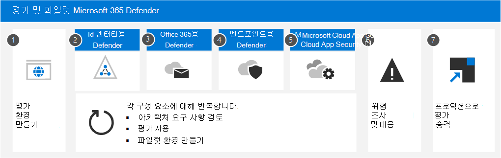

# Microsoft 365 Defender 평가 및 파일럿

**적용 대상:**

- Microsoft 365 Defender

Microsoft 365 Defender XDR(확장된 검색 및 응답) 솔루션으로, 끝점, 전자 메일, 응용 프로그램 및 ID를 포함하여 Microsoft 365 환경에서 신호, 위협 및 경고 데이터를 자동으로 수집, 상관 관계화 및 분석합니다. 광범위한 AI 및 자동화를 활용하여 공격을 자동으로 중지하고 영향을 받는 자산을 안전한 상태로 수정합니다. 다음 문서에서는 평가판 환경의 기능을 평가할 수 있도록 평가 환경을 설정하는 프로세스를 Microsoft 365 Defender. 

이러한 문서를 진행할 때 각 구성 요소를 사용하도록 설정하고, 설정을 구성하고, 파일럿 그룹을 사용하여 모니터링을 시작하는 방법을 단계별로 보여 주는 단계가 설명되어 있습니다. 준비가 완료되면 평가 환경을 프로덕션 환경으로 직접 승격하여 완료할 수 있습니다.

Microsoft는 기존 프로덕션 구독에서 평가판을 만드는 것이 Office 365. 이렇게 하면 즉시 실제 정보를 얻을 수 있으며 환경의 현재 위협에 대해 작동할 수 있도록 설정을 조정할 수 있습니다. 경험을 얻고 플랫폼에 대해 잘 아는 경우 각 구성 요소를 한 번씩 프로덕션 환경으로 승격하기만 합니다.

## 공격의 구조

Microsoft 365 Defender 클라우드 기반의 통합, 사전 및 사후 침해 엔터프라이즈 방어 제품군입니다. 끝점,  *ID,* 앱,  전자 메일, 공동 작업 응용 프로그램 및 모든 데이터에서 방지, 검색, 조사 및 응답을 조정합니다. 

이 그림에서는 공격이 진행 중입니다. 피싱 전자 메일은 조직에 있는 직원의 받은 편지함으로 도착하여 전자 메일 첨부 파일을 무의미하게 여는 것입니다. 이렇게 하면 맬웨어가 설치됩니다. 이로 인해 중요한 데이터의 도난으로 끝나는 이벤트 체인이 발생하게 됩니다. 그러나 이 경우 Defender for Office 365 작동 중입니다.

이 그림의 내용

- **Exchange Online Protection** Microsoft Defender의 일부인 Office 365 피싱 전자 메일을 감지하고 메일 흐름 규칙을 사용하여 받은 편지함으로 도착하지 못하게 할 수 있습니다.
- Office 365 첨부 파일에 대한 **Defender는** 첨부 파일을 테스트하고 유해한 것으로 확인하여 사용자가 도착하는 메일이 실행될 수 없는 경우 또는 정책으로 인해 메일이 도착하지 못하도록 합니다.
- **Endpoint용 Defender는** 회사 네트워크에 연결하고 악용될 수 있는 장치 및 네트워크 취약점을 감지하는 장치를 관리합니다.
- **ID에 대한 Defender는** 권한 에스컬레이터 또는 고위험 측면 이동과 같은 갑작스러운 계정 변경에 대해 메모합니다. 또한 보안 팀의 수정을 위해 제약이 없는 Kerberos 위임과 같은 쉽게 악용된 ID 문제를 보고합니다.
- **Microsoft Cloud App Security** 불가능한 출장, 자격 증명 액세스, 비정상적인 다운로드, 파일 공유 또는 메일 전달 활동과 같은 비정상적인 동작을 발견하여 보안 팀에 보고합니다.

### Microsoft 365 Defender 구성 요소

Microsoft 365 Defender 보안 기술로 나란하게 작동됩니다. XDR 및 XDR 기능의 이점을 위해 이러한 구성 요소를 모두 사용할 필요는 Microsoft 365 Defender. 1-2도 사용하여 이득과 효율성을 실현할 수 있습니다. 

|구성 요소  |설명  |참조 자료  |
|---------|---------|---------|
|ID용 Microsoft Defender     |      Microsoft Defender for Identity는 Active Directory 신호를 사용하여 조직에 대한 고급 위협, 손상된 ID 및 악의적인 내부자 작업을 식별, 감지 및 조사합니다.     |     [Microsoft Defender for Identity란?](/defender-for-identity/what-is)   |
|Exchange Online Protection     |      Exchange Online Protection 스팸 및 맬웨어로부터 조직을 보호하는 데 도움이 되는 기본 클라우드 기반 SMTP 릴레이 및 필터링 서비스입니다.      |   [Exchange Online Protection(EOP) 개요 - Office 365](../office-365-security/overview.md)     |
|Office 365용 Microsoft Defender     |     Microsoft Defender for Office 365 전자 메일 메시지, 링크(URL) 및 공동 작업 도구로 위협되는 악의적인 위협에 대해 조직을 보호합니다.      |    [Microsoft Defender for Office 365 - Office 365](../office-365-security/overview.md)    |
|엔드포인트용 Microsoft Defender     |     끝점용 Microsoft Defender는 장치 보호, 위반 후 감지, 자동화된 조사 및 권장 응답을 위한 통합 플랫폼입니다.      |   [끝점용 Microsoft Defender - Windows 보안](../defender-endpoint/microsoft-defender-endpoint.md)    |
|Microsoft 클라우드 앱 보안     |      Microsoft Cloud App security는 클라우드 앱에 심층 가시성, 강력한 데이터 제어 및 향상된 위협 방지를 도입하는 포괄적인 교차 SaaS 솔루션입니다.       |    [Cloud App Security란 무엇인가요?](/cloud-app-security/what-is-cloud-app-security)    |
|Azure AD ID 보호|Azure AD ID 보호는 수 억 번의 로그인 시도에서 위험 데이터를 평가하고 이 데이터를 사용하여 사용자 환경에 대한 각 로그인의 위험을 평가합니다. 이 데이터는 조건부 액세스 정책이 구성된 방식에 따라 Azure AD에서 계정 액세스를 허용하거나 차단하는 데 사용됩니다. Azure AD ID 보호는 사용자와 별도로 Microsoft 365 Defender. 이 패키지는 2016에 Azure Active Directory Premium P2.|[ID 보호란?](/azure/active-directory/identity-protection/overview-identity-protection)|
| | | |

## Microsoft 365 Defender 아키텍처

아래 다이어그램에서는 주요 구성 요소 및 통합에 대한 Microsoft 365 Defender 아키텍처를 보여 제공합니다. *각* Defender 구성 요소 및 사용 사례 시나리오에 대한 자세한 아키텍처는 이 문서 시리즈 전체에서 제공됩니다.

이 그림에서는 다음을 참조합니다.

- Microsoft 365 Defender 모든 Defender 구성 요소의 신호를 결합하여 도메인 전체에서 XDR(확장된 검색 및 응답)을 제공합니다. 여기에는 통합 인시던트 큐, 공격 중지에 대한 자동화된 응답, 자동 복구(손상된 장치, 사용자 ID 및 사서함), 교차 위협 헌팅 및 위협 분석이 포함됩니다.
- Microsoft 365 Defender 메시지, 링크(URL) 및 공동 작업 도구로 위협되는 악의적인 위협에 대해 조직을 보호할 수 있습니다. 이 매크로는 이러한 활동의 결과로 발생하는 신호를 공유하는 Microsoft 365 Defender. Exchange Online Protection(EOP)는 받는 전자 메일 및 첨부 파일에 대한 종단으로 보호를 제공하기 위해 통합되어 있습니다.
- Id용 Microsoft Defender는 AD FS(Active Directory Federated Services) 및 AD DS(Active Directory 도메인 서비스)를 실행하는 서버에서 신호를 수집합니다. 이 신호는 이러한 신호를 사용하여 하이브리드 ID 환경을 보호합니다. 여기에는 손상된 계정을 사용하여 사내 환경의 통합에서 가로로 이동하는 해커로부터 보호할 수 있습니다.
- Microsoft Defender for Endpoint는 조직에서 사용하는 디바이스에서 신호를 수집하고 보호합니다.
- Microsoft Cloud App Security 사용하여 조직의 클라우드 앱 사용 신호를 수집하고, 사용 환경과 이러한 앱 간의 데이터 흐름(인가 및 비인식 클라우드 앱 포함)을 보호합니다.
- Azure AD ID 보호는 수 억 번의 로그인 시도에서 위험 데이터를 평가하고 이 데이터를 사용하여 사용자 환경에 대한 각 로그인의 위험을 평가합니다. 이 데이터는 조건부 액세스 정책이 구성된 방식에 따라 Azure AD에서 계정 액세스를 허용하거나 차단하는 데 사용됩니다. Azure AD ID 보호는 사용자와 별도로 Microsoft 365 Defender. 이 패키지는 2016에 Azure Active Directory Premium P2.  

이 그림에 포함되지 않은 추가 선택적 아키텍처 구성 요소:

- 모든 Microsoft 365 Defender 구성 요소의 자세한 신호 데이터를 Azure Sentinel에 통합하고 다른 로깅 소스와 결합하여 전체 SIEM 및 SOAR 기능 및 인사이트를 제공할 수 있습니다.

## 평가 프로세스

Microsoft는 설명된 순서대로 Microsoft 365 구성 요소를 사용하도록 설정하는 것이 좋습니다.

다음 표에서는 이 그림에 대해 설명합니다.

|      |단계  |설명  |
|------|---------|---------|
|1     | [평가 환경 만들기](eval-create-eval-environment.md)       |이 단계를 통해 사용자에 대한 평가판 라이선스가 Microsoft 365 Defender.         |
|2     | [ID에 Defender 사용](eval-defender-identity-overview.md)        | 아키텍처 요구 사항을 검토하고, 평가를 사용하도록 설정하고, 다양한 공격 유형을 식별하고 수정하기 위한 자습서를 진행합니다.   |
|3      | [사용자에 대해 Defender를 Office 365 ](eval-defender-office-365-overview.md)       | 아키텍처 요구 사항을 충족하는지 확인한 다음 평가를 사용하도록 설정한 다음 파일럿 환경을 만드세요. 이 구성 요소에는 Exchange Online Protection 포함되어 있으므로 여기서 실제로 두 가지를 *모두 평가합니다.*      |
|4     | [끝점에 Defender 사용 ](eval-defender-endpoint-overview.md)       | 아키텍처 요구 사항을 충족하는지 확인한 다음 평가를 사용하도록 설정한 다음 파일럿 환경을 만드세요.         |
|5     | [사용자 Microsoft Cloud App Security](eval-defender-mcas-overview.md)        |  아키텍처 요구 사항을 충족하는지 확인한 다음 평가를 사용하도록 설정한 다음 파일럿 환경을 만드세요.        |
|6      | [위협 탐지 및 응답](eval-defender-investigate-respond.md)        |   공격을 시뮬레이트하고 인시던트 대응 기능을 사용을 시작합니다.      |
|7      | [평가판을 제품으로 승격](eval-defender-promote-to-production.md)        | Microsoft 365 구성 요소를 일대일 프로덕션으로 승격합니다.        |
| | | |

일반적으로 기능을 배포 및 구성하는 데 필요한 노력의 정도에 따라 기능의 가치를 빠르게 얻도록 디자인된 일반적으로 권장되는 순서입니다. 예를 들어, Office 365 Defender for Office 365 등록하는 데 걸리는 시간보다 더 적은 시간으로 구성할 수 있습니다. 물론 비즈니스 요구에 따라 구성 요소의 우선 순위를 지정하고 이러한 구성 요소를 다른 순서로 사용하도록 설정할 수 있습니다.

## 다음 단계

[Microsoft 365 Defender 환경 만들기](eval-create-eval-environment.md)
