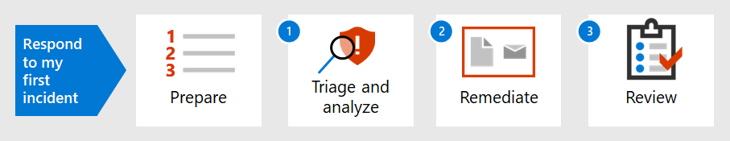

# 첫 번째 인시던트에 대한 응답 소개

[!INCLUDE [Microsoft 365 Defender rebranding](../includes/microsoft-defender.md)]

**적용 대상:**
- Microsoft 365 Defender

조직의 인시던트 대응 전략에 따라 점점 더 파괴적인 보안 인시던트 및 사이버 범죄를 다루는 능력이 결정됩니다. 예방 조치를 취하는 것이 중요하지만 감지된 인시던트의 포함, 지우기 및 복구를 신속하게 할 수 있는 능력은 손상 및 비즈니스 손실을 최소화할 수 있습니다.

이 인시던트 대응 절차에서는 보안 운영 팀의 일부로 사용자들이 보안 운영 팀 내에서 대부분의 주요 인시던트 대응 단계를 수행하는 방법을 Microsoft 365 Defender. 그 단계는 다음과 같습니다.

- 보안 준비
- 각 인시던트에 대해:
  - 1단계: Triage and analysis
  - 2단계: 수정(포함, 지우기 및 복구)
  - 3단계: 인시던트 사후 검토

보안 인시던트는 NIST(National Institute of Standards and Technology)에서 "정보 시스템의 기밀성, 무결성 또는 가용성을 실제로 또는 잠재적으로 위협하는 사건"으로 정의됩니다. 또는 시스템에서 처리, 저장 또는 전송하는 정보 또는 보안 정책, 보안 절차 또는 허용되는 사용 정책을 위반하거나 임박한 위협을 구성할 수 있습니다."

인시던트는 Microsoft 365 Defender 대응을 위한 논리적인 시작점입니다. 인시던트 분석 및 수정은 일반적으로 보안 운영 팀의 작업을 대부분 수행합니다.

## 다음 단계

조직 및 Microsoft 365 테넌트가 인시던트 [처리를 준비해야 합니다.](first-incident-prepare.md)

## 참고 항목

다음에 대한 인시던트 Microsoft 365 Defender.

- [사고 개요](incidents-overview.md)
- [사고 조사](investigate-incidents.md)
- [인시던트 관리](manage-incidents.md)

첫 번째 인시던트 대응의 추가 예:

- [피싱 전자 메일](first-incident-path-phishing.md)
- [ID 기반 공격](first-incident-path-identity.md)

[자세한 인시던트 대응 플레이북](/security/compass/incident-response-playbooks)

