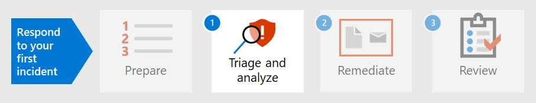

# 첫 번째 인시던트에 대한 보안 준비Prepare your security posture for your first incident

[!INCLUDE [Microsoft 365 Defender rebranding](../includes/microsoft-defender.md)]

**적용 대상:****Applies to:**
- Microsoft 365 DefenderMicrosoft 365 Defender

인시던트 처리를 준비하는 과정에는 다양한 종류의 보안 인시던트에서 조직의 네트워크를 충분히 보호할 수 있는 설정이 필요합니다.Preparing for incident handling involves setting up sufficient protection of an organization's network from different kinds of security incidents. NIST(National Institute of Standards and Technology)는 보안 인시던트 위험을 줄이기 위해 위험 평가, 호스트 보안 강화, 네트워크를 안전하게 구성 및 맬웨어 방지를 비롯한 몇 가지 보안 관행을 권장합니다.To reduce the risk of security incidents, National Institute of Standards and Technology (NIST) recommends several security practices including risk assessments, hardening host security, configuring networks securely, and preventing malware. 

Microsoft 365 Defender는 인시던트 방지의 여러 측면을 해결할 수 있습니다.Microsoft 365 Defender can help address several aspects of incident prevention: 

- Zero [Trust](https://docs.microsoft.com/security/zero-trust/) 프레임워크 구현Implementing a [Zero Trust](https://docs.microsoft.com/security/zero-trust/) framework
- Microsoft 보안 점수를 통해 점수를 할당하여 보안 설정 [결정](microsoft-secure-score.md)Determining your security posture by assigning a score with [Microsoft Secure Score](microsoft-secure-score.md)
- 위협 및 취약성 관리의 취약점 평가를 통해 위협 [방지](../defender-endpoint/next-gen-threat-and-vuln-mgt.md)Preventing threats through vulnerability assessments in [Threat and Vulnerability Management](../defender-endpoint/next-gen-threat-and-vuln-mgt.md)
- 준비할 수 있도록 최신 보안 위협 이해Understanding the latest security threats so you can prepare for them

## 1단계.Step 1. 제로 트러스트 구현Implement Zero Trust

[Zero Trust는](https://docs.microsoft.com/security/zero-trust/) 모바일 인력, 사용자, 장치, 응용 프로그램 및 데이터를 비롯한 모든 최신 환경의 복잡한 특성을 고려하는 통합 보안 철학 및 종단식 전략입니다.[Zero Trust](https://docs.microsoft.com/security/zero-trust/) is an integrated security philosophy and end-to-end strategy that considers the complex nature of any modern environment, including the mobile workforce and the users, devices, applications and data, wherever they may be located. 단일 창을 제공하여 일관된 방식으로 모든 끝점 검색을 관리함으로써 Microsoft 365 Defender를 사용하면 보안 운영 팀이 Zero  Trust의 기본 원칙을 보다 쉽게 구현할 수 있습니다.By providing a single pane of glass to manage all endpoint detections in a consistent way, Microsoft 365 Defender can make it easier for your security operations team to implement the [guiding principles](https://docs.microsoft.com/security/zero-trust/#guiding-principles-of-zero-trust) of Zero Trust. 

Microsoft 365 Defender의 구성 요소는 MDE(Microsoft Defender for Endpoint) 또는 기타 모바일 보안 공급업체의 데이터를 장치 준수 정책 및 장치 기반 조건부 액세스 정책 구현에 대한 정보 원본으로 통합하여 Zero Trust에 대한 조건부 액세스 정책을 설정하기 위해 구현된 규칙의 위반을 표시할 수 있습니다.Components of Microsoft 365 Defender can display violations of rules that have been implemented to establish Conditional Access policies for Zero Trust by integrating data from Microsoft Defender for Endpoint (MDE) or other mobile security vendors as an information source for device compliance policies and implementation of device-based Conditional Access policies. 

장치 위험은 해당 장치의 사용자가 액세스할 수 있는 리소스에 직접적인 영향을 미치게 됩니다.Device risk directly influences what resources will be accessible by the user of that device. 특정 기준에 따라 리소스에 대한 액세스 거부는 Zero Trust의 주요 테마이고 Microsoft 365 Defender는 신뢰 수준 조건을 결정하는 데 필요한 정보를 제공합니다.The denial of access to resources based on certain criteria is the main theme of Zero Trust and Microsoft 365 Defender provides information needed to determine the trust level criteria. 예를 들어 Microsoft 365 Defender는 위협 및 취약성 관리 페이지를 통해 장치의 소프트웨어 버전 수준을 제공할 수 있으며, 조건부 액세스 정책은 기한이 지난 또는 취약한 버전을 제한합니다.For example, Microsoft 365 Defender can provide the software version level of a device through the Threat and Vulnerability Management page while Conditional Access policies restrict devices that have outdated or vulnerable versions.

자동화는 제로 트러스트 환경을 구현하고 유지 관리하는 데 중요한 부분입니다. 또한 잠재적으로 IR(인시던트 대응) 이벤트로 이어질 수 있는 경고 수를 줄입니다.Automation is a crucial part of implementing and maintaining a Zero Trust environment while also reducing the number of alerts that would potentially lead to incident response (IR) events. Microsoft 365 Defender의 구성 요소는 수정 작업(Microsoft 365 보안 센터의 인시던트에 대한 조사), 알림 작업, [ServiceNow와](https://microsoft.service-now.com/sp/)같은 지원 티켓 생성과 같은 자동화될 수 있습니다. Components of Microsoft 365 Defender can be automated such as [remediation actions](m365d-autoir.md) (known as investigations for an incident in the Microsoft 365 security center), notification actions, and even the creation of support tickets such as in [ServiceNow](https://microsoft.service-now.com/sp/).

## 2단계.Step 2. 조직의 보안 설정 결정Determine your organization’s security posture

다음으로, 조직은 Microsoft 365 Defender의 [Microsoft 보안](microsoft-secure-score.md) 점수를 사용하여 현재 보안 위치를 결정하고 이를 개선하는 방법에 대한 권장 사항을 고려할 수 있습니다.Next, organizations can use the [Microsoft Secure Score](microsoft-secure-score.md) in Microsoft 365 Defender to determine your current security posture and consider recommendations on how to improve it. 점수가 높을수록 조직에서 보안 권장 사항 및 개선 작업을 더 많이 수행했습니다.The higher the score is, the more security recommendations and improvement actions have been taken by the organization. 보안 점수 권장 사항은 여러 제품에서 사용할 수 있으며 조직에서 점수를 더 높게 올 수 있도록 허용할 수 있습니다.Secure Score recommendations can be taken across different products and allow organizations to raise their scores even higher. 

:::image type="content" source="../../media/first-incident-prepare/first-incident-secure-score.png" alt-text="Microsoft 보안 센터의 Microsoft 보안 점수 예제":::
 
## 3단계.Step 3. 조직의 취약성 노출 평가Assess your organization’s vulnerability exposure

인시던트 방지는 중요하고 중요한 보안 인시던트에 집중하기 위한 보안 운영 노력을 간소화하는 데 도움이 될 수 있습니다.Preventing incidents can help streamline security operations efforts to focus on on-going critical and important security incidents. 소프트웨어 취약성은 종종 데이터 도용, 데이터 손실 또는 비즈니스 운영 중단으로 이어질 수 있는 공격에 대한 예방 가능한 진입점입니다.Software vulnerabilities are often a preventable entry point for attacks that can lead to data theft, data loss, or disruption of business operations. 계속되는 공격이 없는 경우 보안 운영은 조직에서 허용되는 수준의  취약점 노출을 달성하고 유지 관리하기 위해 노력해야 합니다.If no attacks are on-going, security operations must strive to achieve and maintain an acceptable level of [vulnerability exposure](../defender-endpoint/tvm-exposure-score.md) in their organization.

소프트웨어 패치 진행률을 확인하기  위해 추가 리소스 탭을 통해 Microsoft 365 Defender에서 액세스할 수 있는 Endpoint용 Defender의 위협 및 취약성 관리 페이지를 **방문하세요.**To check your software patching progress, visit the [Threat and Vulnerability Management](../defender-endpoint/next-gen-threat-and-vuln-mgt.md) page in Defender for Endpoint, which you can access from Microsoft 365 Defender through the **More resources** tab.

:::image type="content" source="../../media/first-incident-prepare/first-incident-vulnerability.png" alt-text="Microsoft 보안 센터의 위협 및 취약성 페이지 예"::: 
 
## 4. 새로운 위협 이해4. Understand emerging threats

보안 [센터의](threat-analytics.md) 위협 Microsoft 365 사용하여 현재 보안 위협 환경과 함께 최신 정보를 유지할 수 있습니다.Use [threat analytics](threat-analytics.md) in the Microsoft 365 security center to keep up-to-date with the current security threat landscape. 전문가 Microsoft 보안 연구원은 최신 사이버 위협을 자세히 설명하는 보고서를 만들어 사용자의 구독, 장치 및 사용자에게 어떤 Microsoft 365 영향을 줄 수 있습니다.Expert Microsoft security researchers create reports that describe the latest cyber-threats in detail so you can understand how they might affect your Microsoft 365 subscription, devices, and users. 이러한 보고서에는 다음이 포함됩니다.These reports can include:

- 활성 위협 요소 및 캠페인Active threat actors and their campaigns
- 인기 있는 새로운 공격 기술Popular and new attack techniques
- 중요한 취약성Critical vulnerabilities
- 일반적인 공격 표면Common attack surfaces
- 맬웨어가 보인 경우Prevalent malware

새로운 위협에 대한 권장 사항을 구현하여 보안 자세를 강화하고 공격 노출 영역을 최소화할 수 있습니다.You can implement the recommendations of an emerging threat to strengthen your security posture and minimize your attack surface area.

일정을 정해 두어 보안 센터의 [Threat Analytics](threat-analytics.md) 섹션을 Microsoft 365 합니다.Make time in your schedule to regularly check the [Threat Analytics](threat-analytics.md) section of the Microsoft 365 security center.

## 다음 단계Next step

인시던트 [를 분석하고 을(를) 분석하는 방법을 배워야 합니다.](first-incident-analyze.md)Learn how to [triage and analyze incidents](first-incident-analyze.md).

## 참고 항목See also

- [사고 개요Incidents overview](incidents-overview.md)
- [사고 조사Investigate incidents](investigate-incidents.md)
- [인시던트 관리Manage incidents](manage-incidents.md)
