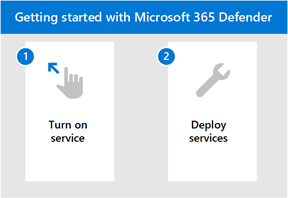

# Defender용 Microsoft 365 시작Get started with Microsoft 365 for Defender

[!INCLUDE [Microsoft 365 Defender rebranding](../includes/microsoft-defender.md)]

**적용 대상:****Applies to:**
- Microsoft 365 DefenderMicrosoft 365 Defender

Microsoft 365 Defender는 기업 전체에서 보안을 모니터링하고 관리할 수 있는 통합 환경입니다.Microsoft 365 Defender is a unified experience where you can monitor and manage security across your enterprise. ID, 끝점, 데이터, 앱, 전자 메일 및 공동 작업 도구 전반에 걸쳐 통합된 경고를 통해 위협을 조사하고 대응하는 것이 이제 중앙 위치에서 진행됩니다.With the integrated alerts across identities, endpoints, data, apps, email, and collaboration tools - investigating and responding to threats now happen in a central location. 

Microsoft 보안 제품 제품군을 새로 사용하거나 개별 워크플로에 익숙한 경우 이 항목에서는 Microsoft 365 Defender를 시작하는 데 필요한 간단한 단계를 안내합니다.Whether you're new to the Microsoft suite of security products or familiar with individual workflows, this topic will guide you in the simple steps you need to take to get started with Microsoft 365 Defender.

일반적으로 다음 단계를 수행하여 시작해야 합니다.In general, you'll need to take the following steps to get started:

- **[1단계: Microsoft 365 Defender 켜기](m365d-enable.md)****[Step 1: Turn on Microsoft 365 Defender](m365d-enable.md)**  
    먼저 올바른 라이선스가 있으며 포털에 액세스할 수 있도록 역할이 할당되어 있는지 확인하여 서비스를 켜야 합니다.You'll first need to turn on the service by making sure you have the right license in place and roles are assigned so that you can access the portal. 

    그런 다음 몇 가지 간단한 설정을 진행한 다음 서비스가 사용 중이지 확인할 수 있습니다.You'll then go through some simple settings and then you can confirm that the service is on.

- **[2단계: 지원되는 서비스 배포](deploy-supported-services.md)****[Step 2: Deploy supported services](deploy-supported-services.md)**  
    초기 단계를 완료한 후 Microsoft 365 Defender와 함께 제공된 지원되는 서비스를 배포해야 합니다.After completing the initial steps, you'll need to deploy the supported services that come with Microsoft 365 Defender. 서비스를 효과적으로 배포하면 네트워크를 통해 자산의 신호에 대한 가시성이 향상됩니다.Deploying services effectively increases your visibility in the signals from assets across your network.

## 주요 기능Key capabilities
Microsoft 365 Defender를 켜고 서비스를 배포하면 다음과 같은 주요 기능에 액세스할 수 있습니다.Turning on Microsoft 365 Defender and deploying services will give you access to the following key capabilities:

| 기능Capability | 설명Description |
| ------ | ------ |
| 끝점용 Microsoft DefenderMicrosoft Defender for Endpoint | 강력한 동작 센서, 클라우드 분석 및 위협 인텔리전스를 중심으로 구축된 엔드포인트 보호 제품군Endpoint protection suite built around powerful behavioral sensors, cloud analytics, and threat intelligence |
|Office 365용 Microsoft DefenderMicrosoft Defender for Office 365 | 전자 메일 및 기타 공동 작업 도구를 포함하여 Office 365의 앱 및 데이터에 대한 고급 보호Advanced protection for your apps and data in Office 365, including email and other collaboration tools |
| ID용 Microsoft DefenderMicrosoft Defender for Identity | 상관된 Active Directory 신호를 사용하여 고급 위협, ID 손상 및 악의적인 내부자 보호Defend against advanced threats, compromised identities, and malicious insiders using correlated Active Directory signals |
| Microsoft Cloud App SecurityMicrosoft Cloud App Security | Microsoft 및 타사 클라우드 서비스 전반에서 사이버 위협 식별 및 퇴치Identify and combat cyberthreats across your Microsoft and third-party cloud services |

