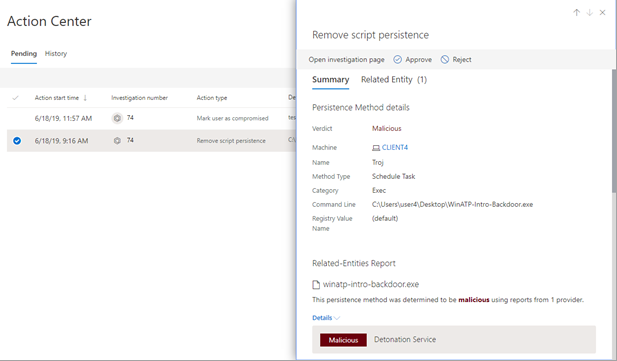

# 관리 센터에서 작업 보기 및 관리View and manage actions in the Action center

[!INCLUDE [Microsoft 365 Defender rebranding](../includes/microsoft-defender.md)]

**적용 대상:****Applies to:**
- Microsoft 365 DefenderMicrosoft 365 Defender

Defender의 위협 방지 Microsoft 365 특정 수정 작업이 수행될 수 있습니다.Threat protection features in Microsoft 365 Defender can result in certain remediation actions. 다음은 몇 가지 예입니다.Here are some examples:
- [자동화된 조사를](m365d-autoir.md) 수행하면 자동으로 수행되거나 승인 대기하는 수정 작업이 수행될 수 있습니다.[Automated investigations](m365d-autoir.md) can result in remediation actions that are taken automatically or await approval.
- 바이러스 백신, 맬웨어 방지 및 기타 위협 방지 기능은 파일, URL 또는 프로세스를 차단하거나 아티팩트를 검역에 보내는 등의 수정 작업을 수행할 수 있습니다.Antivirus, antimalware, and other threat protection features can result in remediation actions, such as blocking a file, URL, or process, or sending an artifact to quarantine.
- 보안 운영 팀은 고급 헌팅 중이나 경고  또는 인시던트  조사 중과 같은 수동으로 수정 작업을 수행할 [수 있습니다.](investigate-incidents.md)Your security operations team can take remediation actions manually, such as during [advanced hunting](advanced-hunting-overview.md) or while investigating [alerts](investigate-alerts.md) or [incidents](investigate-incidents.md).

> [!NOTE]
> 수정 작업을 승인하거나 거부하려면 [적절한 사용 권한](m365d-action-center.md#required-permissions-for-action-center-tasks)이 있어야 합니다.You must have [appropriate permissions](m365d-action-center.md#required-permissions-for-action-center-tasks) to approve or reject remediation actions. 자세한 내용은 Defender에서 자동화된 조사 및 대응을 위한 Microsoft 365 [참조하세요.](m365d-configure-auto-investigation-response.md#prerequisites-for-automated-investigation-and-response-in-microsoft-365-defender)For more information, see [Prerequisites for automated investigation and response in Microsoft 365 Defender](m365d-configure-auto-investigation-response.md#prerequisites-for-automated-investigation-and-response-in-microsoft-365-defender).

## 작업 센터에서 보류 중인 작업 검토Review pending actions in the Action center

자동화된 조사가 진행되고 적시에 완료될 수 있도록 가능한 한 빨리 보류 중인 작업을 승인하거나 거부하는 것이 중요합니다.It's important to approve (or reject) pending actions as soon as possible so that your automated investigations can proceed and complete in a timely manner. 

1. [https://security.microsoft.com](https://security.microsoft.com)으로 이동하여 로그인합니다.Go to [https://security.microsoft.com](https://security.microsoft.com) and sign in. 

2. 탐색 창에서 **알림 센터** 를 선택합니다.In the navigation pane, choose **Action center**. 

3. 알림 센터의 **보류 중인** 탭의 목록에서 항목을 선택합니다.In the Action Center, on the **Pending** tab, select an item in the list. 플라이아웃 창이 열립니다.Its flyout pane opens.

4. 플라이아웃 창의 정보를 검토한 후 다음 단계 중 하나를 수행합니다.Review the information in the flyout pane, and then take one of the following steps:
   - 조사에 대한 자세한 내용을 **확인하려면** 조사 페이지 열기 를 선택합니다.Select **Open investigation page** to view more details about the investigation.
   - **승인을** 선택하여 보류 중인 작업을 초기화합니다.Select **Approve** to initiate a pending action.
   - 보류 **중인** 작업이 수행되지 않도록 방지하려면 거부를 선택합니다.Select **Reject** to prevent a pending action from being taken.
   - 이동을 **선택하여** 고급 헌팅으로 [이동합니다.](advanced-hunting-overview.md)Select **Go hunt** to go into [Advanced hunting](advanced-hunting-overview.md). 

## 완료된 작업 취소Undo completed actions

장치 또는 파일이 위협이 아닌 것으로 확인되면 해당 작업이 자동으로 또는 수동으로 수행된 경우 수행된 수정 작업을 실행 취소할 수 있습니다.If you’ve determined that a device or a file is not a threat, you can undo remediation actions that were taken, whether those actions were taken automatically or manually. 작업 센터의 사용 기록 **탭에서** 다음 작업을 실행 취소할 수 있습니다.In the Action center, on the **History** tab, you can undo any of the following actions:  

| 작업 원본Action source | 지원되는 작업Supported Actions |
|:---|:---|
| - 자동화된 조사- Automated investigation  - Microsoft Defender 바이러스 백신- Microsoft Defender Antivirus  - 수동 응답 작업- Manual response actions | - 장치 격리- Isolate device  - 코드 실행 제한- Restrict code execution  - 파일 Quarantine a file- Quarantine a file  - 레지스트리 키 제거- Remove a registry key  - 서비스 중지- Stop a service  - 드라이버를 사용하지 않도록 설정- Disable a driver  - 예약된 작업 제거- Remove a scheduled task |

### 한 가지 수정 작업 실행 취소Undo one remediation action

1. Go to the Action center ( [https://security.microsoft.com/action-center](https://security.microsoft.com/action-center) ) and sign in.Go to the Action center ([https://security.microsoft.com/action-center](https://security.microsoft.com/action-center)) and sign in.

2. 사용 **기록 탭에서** 실행 취소할 작업을 선택합니다.On the **History** tab, select an action that you want to undo.

3. 화면 오른쪽 창에서 **취소를 선택합니다.**In the pane on the right side of the screen, select **Undo**.

### 여러 수정 작업 취소Undo multiple remediation actions

1. Go to the Action Center ( https://security.microsoft.com/action-center) and sign in.Go to the Action center (https://security.microsoft.com/action-center) and sign in.

2. 사용 **기록 탭에서** 취소할 작업을 선택합니다.On the **History** tab, select the actions that you want to undo. 동일한 작업 유형이 있는 항목을 선택해야 합니다.Make sure to select items that have the same Action type. 플라이아웃 창이 열립니다.A flyout pane opens.

3. 플라이아웃 창에서 **취소를 선택합니다.**In the flyout pane, select **Undo**.

### 여러 장치에서 파일을 검지에서 제거하려면To remove a file from quarantine across multiple devices 

1. Go to the Action center ( [https://security.microsoft.com/action-center](https://security.microsoft.com/action-center) ) and sign in.Go to the Action center ([https://security.microsoft.com/action-center](https://security.microsoft.com/action-center)) and sign in.

2. 사용 기록 **탭에서** 작업 유형이 **Quarantine** file인 파일을 선택합니다.On the **History** tab, select a file that has the Action type **Quarantine file**.

3. 화면 오른쪽 창에서 이 파일의 X **추가** 인스턴스에 적용을 선택한 다음 실행 **취소를 선택합니다.**In the pane on the right side of the screen, select **Apply to X more instances of this file**, and then select **Undo**.

## 다음 단계Next steps

- [자동화 조사 세부정보 및 결과 보기View the details and results of an automated investigation](m365d-autoir-results.md)
- [가음성/음수 처리 방법 학습(가인 경우)Learn how to handle false positives/negatives (if you get one)](m365d-autoir-report-false-positives-negatives.md)
