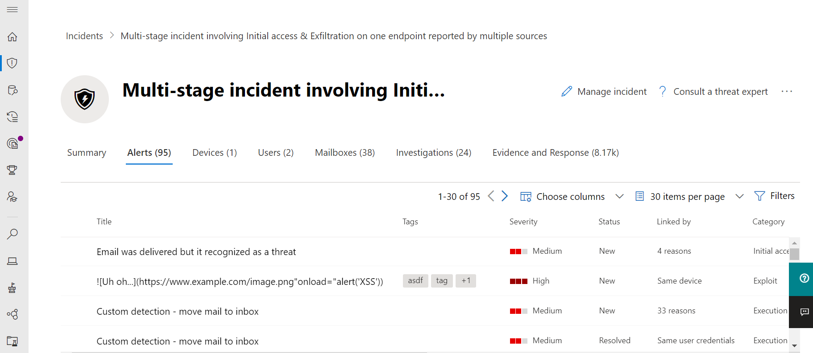

# Microsoft 365 Defender

[!INCLUDE [Microsoft 365 Defender rebranding](../includes/microsoft-defender.md)]

**적용 대상:**
- Microsoft 365 Defender

> Microsoft 365 Defender를 경험하고 싶으신가요? [실험실 환경에서 평가](m365d-evaluation.md?ocid=cx-docs-MTPtriallab)하거나 [프로덕션에서 파일럿 프로젝트를 실행](m365d-pilot.md?ocid=cx-evalpilot)할 수 있습니다.
>

Microsoft 365 Defender는 기본적으로 엔드포인트, ID, 전자 메일 및 응용프로그램 전반에서 탐지, 방지, 조사 및 응답을 조정하여 정교한 공격에 대한 통합 보호를 제공하는 통합된 위반 전 및 위반 후 엔터프라이즈 보안 제품군입니다.

통합된 Microsoft 365 Defender 솔루션을 사용하여 보안 전문가는 이러한 각 제품이 수신하는 위협 신호를 통합하고 위협의 전체 범위와 영향을 확인할 수 있습니다. 환경이 환경에 들어오고 있는 방법, 영향을 받는 방법 및 현재 조직에 미치는 영향 Microsoft 365 Defender 공격을 방지하거나 중지하고 영향을 받는 사서함, 끝점 및 사용자 ID를 자동으로 조치를 취합니다.  

<h2>Microsoft 365 Defender 서비스
</h2>
<table><tr><td>
<b><a href="/microsoft-365/security/defender-endpoint/microsoft-defender-endpoint"><b>끝점용 Microsoft Defender</b>
</a></td>
<td>
<b><a href="/microsoft-365/security/office-365-security/overview"><b>Microsoft Defender for Office 365</b>
</a></td>
<td>
<b><a href="/defender-for-identity/"><b>Id용 Microsoft Defender</b></a>
</td>
<td>
<b><a href="/cloud-app-security/"><b>Microsoft Cloud App Security</b></a>
</td>
</tr>
</table>
 

## Microsoft 365 Defender 대화형 가이드

이 대화형 가이드에서는 조직을 보호하는 방법을 Microsoft 365 Defender. 보안 위험을 Microsoft 365 Defender 조직에 대한 공격을 조사하고 유해한 활동을 자동으로 방지하는 데 도움이 되는 방법을 알 수 있습니다.

[대화형 가이드 확인](https://aka.ms/M365Defender-InteractiveGuide)

Microsoft 365 Defender 제품군은 다음을 보호합니다. 
- **Endpoint용 Defender가** 있는 끝점 - 끝점용 Defender는 예방적 보호, 위반 후 감지, 자동화된 조사 및 대응을 위한 통합된 끝점 플랫폼입니다. 
- **Defender for Office 365** 전자 메일 및 공동 작업 - Office 365 메시지, 링크(URL) 및 공동 작업 도구로 위협이되는 악의적인 위협에 대해 조직을 보호합니다. 
- ID에 대한 Defender 및 Azure Active Directory **(Azure AD) ID** 보호 - ID에 대한 Defender는 AD DS(Active Directory 도메인 서비스) 신호를 사용하여 조직에 대한 고급 위협, 손상된 ID 및 악의적인 내부자 작업을 식별, 감지 및 조사합니다. Azure AD ID 보호는 클라우드 기반 Azure AD에서 ID 기반 위험을 감지하고 수정합니다.
- **Microsoft Cloud App security를** 사용하는 응용 프로그램 - Microsoft Cloud App security는 클라우드 앱에 심층 가시성, 강력한 데이터 제어 및 향상된 위협 보호를 가져오는 포괄적인 교차 SaaS 솔루션입니다. 

>[!VIDEO https://www.microsoft.com/en-us/videoplayer/embed/RE4Bzww] 

Microsoft 365 Defender 제품 간 계층은 개별 제품군 구성 요소를 다음으로 향상합니다.

- 신호 공유 및 자동화된 작업을 통해 공격으로부터 보호하고 제품군 전체에서 방어 대응을 조정합니다.
- 경고, 의심스러운 이벤트 및 영향을 미치는 자산에 '인시던트'에 데이터를 가입하여 보안 팀을 위한 제품 경고, 동작 및 컨텍스트 전반에 걸쳐 공격의 전체 스토리를 내레이션합니다.
- 자동화된 수정을 통해 영향을 미치는 자산에 대한 자동 복구를 트리거하여 손상에 대한 대응을 자동화합니다.
- 보안 팀이 끝점 및 데이터 전체에서 상세하고 효과적인 위협 헌팅을 Office 수 있습니다.

다음은 Microsoft 365 Defender 포털이 제품군 전체의 모든 관련 경고를 단일 인시던트로 연관하는 방법의 예입니다.

  

다음은 인시던트에 대한 관련 경고 목록의 예입니다.

 

다음은 전자 메일 및 끝점 원시 데이터 위에 있는 쿼리 기반 헌팅의 예입니다.

 

Microsoft 365 Defender 제품 간 기능에는 다음이 포함됩니다. 

- **제품 간** 단일 창 - 검색, 영향을 미치는 자산, 수행된 자동화된 작업 및 단일 큐의 관련 증거에 대한 모든 정보 및 단일 큐의 단일 창에 대한 중앙 [security.microsoft.com.](https://security.microsoft.com) 
- **결합된** 인시던트 큐 - 전체 공격 범위를 보장하여 보안 전문가가 중요한 작업에 집중할 수 있도록 영향을 미치는 자산 및 자동화된 수정 작업이 그룹화되어 시기적합한 방식으로 표시됩니다. 
- **위협에 대한** 자동 대응 - 위험 위협 정보는 공격의 진행을 Microsoft 365 Defender 제품 간에 실시간으로 공유됩니다. 

   예를 들어 끝점용 Defender로 보호되는 끝점에서 악성 파일이 감지되면 Defender에 모든 전자 메일 메시지에서 파일을 Office 365 파일을 검사하고 제거합니다. 이 파일은 전체 보안 제품군에 의해 Microsoft 365 차단됩니다.
- **손상된 장치,** 사용자 ID 및 사서함에 대한 자체 복구 - Microsoft 365 Defender AI 기반 자동 작업 및 플레이북을 사용하여 영향을 받는 자산을 안전한 상태로 다시 수정합니다. Microsoft 365 Defender 제품군 제품의 자동 수정 기능을 활용하여 인시던트와 관련된 모든 영향을 미치는 자산이 가능한 경우 자동으로 수정되도록 합니다.
- **제품** 간 위협 헌팅 - 보안 팀은 다양한 보호 제품에서 수집한 원시 데이터에 대해 자체 사용자 지정 쿼리를 만들어 고유한 조직 지식을 활용하여 손상 징후를 찾을 수 있습니다. Microsoft 365 Defender 30일 동안의 기록된 원시 신호에 대한 쿼리 기반 액세스 권한을 제공하며, 끝점에서 경고 데이터를 보내고 Office 365 데이터를 제공합니다. 

## 시작하기

Microsoft 365 Defender 라이선스 요구 사항을 충족해야 Microsoft 365 Defender 포털에서 서비스를 사용하도록 설정할 [수 security.microsoft.com.](https://security.microsoft.com) 자세한 내용은 다음을 참조하세요.

- [라이선스 요구사항](prerequisites.md#licensing-requirements)
- [Microsoft 365 Defender 켜기](m365d-enable.md)

## 보안 분석가를 위한 교육

Microsoft Learn의 이 학습 경로를 통해 보안 위협을 식별, Microsoft 365 Defender 및 수정하는 방법에 대해 이해할 수 있습니다.

|교육:|Microsoft 365 Defender를 통한 사이버 공격 감지 및 대응|
|---|---|
||Microsoft 365 Defender는 엔드포인트, ID, 전자 메일, 애플리케이션 전체의 위협 신호를 통합하여 정교한 사이버 공격에 대한 통합된 보호를 제공합니다. Microsoft 365 Defender는 인시던트를 조사하고 이에 대응하고, 적극적으로 현재 진행 중인 악성 사이버 보안 활동을 조사하기 위한 중앙 집중식 환경입니다.
 1 hr 38분 - Learning 경로 - 5개 모듈|

> [!div class="nextstepaction"]
> [시작 >](/learn/paths/defender-detect-respond/)

## 참고 항목
- [Microsoft 365 테넌트용 랜섬웨어 보호 배포](/microsoft-365/solutions/ransomware-protection-microsoft-365)
