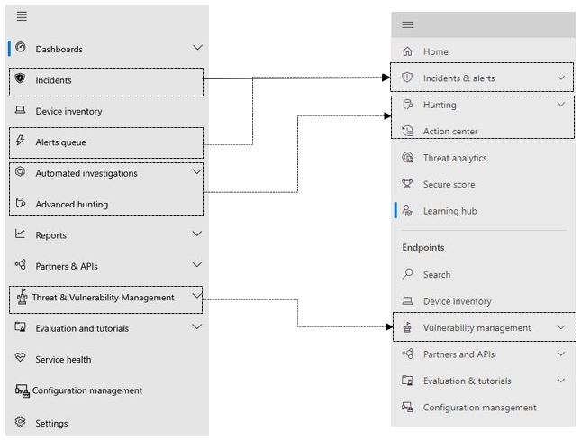
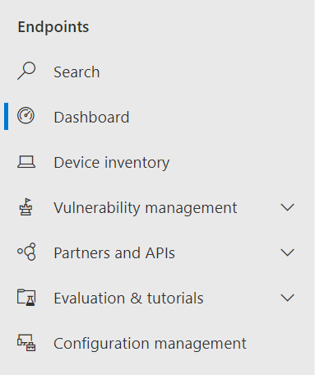
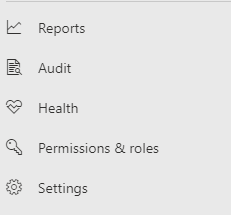

# Microsoft Defender for Endpoint in <DICT__Microsoft⚐365⚐Defender>Microsoft 365 Defender</DICT__Microsoft⚐365⚐Defender>

[!INCLUDE [Microsoft 365 Defender rebranding](../includes/microsoft-defender.md)]

**적용 대상:**

- [Microsoft 365 Defender](microsoft-365-defender.md)
- [엔드포인트용 Microsoft Defender](https://go.microsoft.com/fwlink/p/?linkid=2154037)

## 빠른 참조

아래 이미지와 아래 표에는 이미지와 웹 페이지 간의 탐색 Microsoft Defender 보안 센터 Microsoft 365 Defender.

> [!div class="mx-imgBorder"]
> 

| Microsoft Defender 보안 센터 | Microsoft 365 Defender |
|---------|---------|
| 대시보드 <ul><li>보안 운영</li><li>위협 분석</li></ul>  |홈 <ul><li>위협 분석</li></ul>   |
| 인시던트 | 인시던트 및 경고 |
| 장치 인벤토리 | 장치 인벤토리 |
| 경고 큐 | 인시던트 및 경고 |
| 자동화된 조사 | 알림 센터  |
| 고급 헌팅 | 헌팅 |
| 보고서 | 보고서 |
| 파트너 & API | 파트너 & API |
| 위협 & 취약성 관리 | 취약성 관리 |
| 평가 및 자습서 | 평가판 & 자습서 |
| 구성 관리 | 구성 관리 |
| 설정 | 설정 | 

향상된 Microsoft 365 Defender  기능은 전자 메일, 공동 작업, ID 및 장치 위협을 보호, 감지, 조사 및 대응하는 [https://security.microsoft.com](https://security.microsoft.com) 보안 기능을 결합합니다. 이를 통해 보안 및 규정 준수 센터를 비롯한 기존 Microsoft Microsoft Defender 보안 센터 기능을 Office 365 & 있습니다.

이 문서의 내용에 익숙한 Microsoft Defender 보안 센터 이 문서는 사용자 관리의 일부 변경 및 개선 Microsoft 365 Defender. 그러나 인식해야 할 몇 가지 새 요소와 업데이트된 요소가 있습니다.

지금까지는 Microsoft Defender 보안 센터  Microsoft Defender for Endpoint의 홈입니다. Enterprise 보안 팀은 이를 사용하여 잠재적인 지속적인 위협 활동 또는 데이터 위반에 대한 경고를 모니터링하고 대응하는 데 도움을 주었다. 포털 수를 줄이기 위해 Microsoft 365 Defender, 데이터, 장치, 앱 및 인프라에서 보안을 모니터링하고 관리하는 홈이 될 것입니다.

Microsoft Defender for Endpoint Microsoft 365 Defender Microsoft Defender 보안 센터에서 액세스 권한을 부여하는 동일한 방식으로 관리되는 보안 서비스 [공급자(MSSP)에](/windows/security/threat-protection/microsoft-defender-atp/grant-mssp-access) 대한 액세스 권한을 [부여할 수 있습니다.](mssp-access.md)

> [!IMPORTANT]
> 현재 구독에 따라 Microsoft 365 Defender 볼 수 있습니다. 예를 들어 Microsoft Defender for Office 365 라이선스가 없는 경우 전자 메일 & 공동 작업 섹션이 표시되지 않습니다.

> [!Note]
> Microsoft 365 Defender 사용할 수 없습니다.
>- US 정부 커뮤니티 클라우드(GCC)
>- US 정부 커뮤니티 클라우드 High(GCC High)
>- 미 국방부
>- 상업용 라이선스가 있는 모든 미국 정부 기관

다음을 [https://security.microsoft.com](https://security.microsoft.com) Microsoft 365 Defender.

이점에 대한 자세한 내용은 [Overview of Microsoft 365 Defender](overview-security-center.md)

## 변경된 기능

이 표에서는 변경 내용에 대한 간단한 Microsoft Defender 보안 센터 Microsoft 365 Defender.

### 경고 및 작업

| 영역 | 변경 설명 |
|---------|---------|
| [인시던트 & 경고](incidents-overview.md)  | 이 Microsoft 365 Defender 모든 끝점, 전자 메일 및 ID에서 인시던트 및 알림을 관리할 수 있습니다. 관련 이벤트를 보다 쉽게 찾을 수 있도록 환경을 수렴했습니다. 자세한 내용은 인시던트 [개요를 참조하세요.](incidents-overview.md)   |
| [헌팅](advanced-hunting-overview.md)  |  ID 및 전자 메일 테이블을 포함하도록 끝점용 Microsoft Defender에서 만든 사용자 지정 검색 규칙을 수정하면 자동으로 검색 규칙이 Microsoft 365 Defender. 해당 경고는 해당 경고에도 Microsoft 365 Defender. 이러한 변경 내용에 대한 자세한 내용은 사용자 지정 검색 규칙 [마이그레이션을 참조합니다.](advanced-hunting-migrate-from-mde.md#migrate-custom-detection-rules)   고급 헌팅 테이블은 헌팅 테이블에서 사용할 `DeviceAlertEvents` 수 Microsoft 365 Defender. 데이터 원본에서 장치별 경고 정보를 Microsoft 365 Defender 및 테이블을 사용하여 다양한 원본 집합의 더 많은 정보를 `AlertInfo` `AlertEvidence` 수용할 수 있습니다. [DeviceAlertEvents](advanced-hunting-migrate-from-mde.md#write-queries-without-devicealertevents)없이 쓰기 쿼리를 수행하여 다음 장치 관련 쿼리를 작성합니다.|
|[알림 센터 ](m365d-action-center.md)    | 자동화된 조사 및 수정 조치에 따라 수행된 보류 중인 작업 및 완료된 작업을 나열합니다. 이전의 알림 센터에는 Microsoft Defender 보안 센터 조치에 대한 보류 중 및 완료된 조치가 나열되어 있으며 자동화된 조사에는 경고 및 상태가 나열되어 있습니다. 향상된 Microsoft 365 Defender 관리 센터는 전자 메일, 장치 및 사용자 전체에서 재구성 작업 및 조사를 한 위치에 모습니다.  |
| [위협 분석](threat-analytics.md) |  탐색 모음의 위쪽으로 이동하여 보다 쉽게 검색하고 사용할 수 있습니다. 이제 끝점과 전자 메일 및 공동 작업 둘 다에 대한 위협 정보를 포함합니다.    |

### 끝점

| 영역 | 변경 설명 |
|---------|---------|
|검색   |  제목 대신 끝점용 Microsoft Defender 검색 표시줄이 끝점 섹션에서 이동됩니다. 장치, 파일, 사용자, URL, IP, 취약성, 소프트웨어 및 권장 사항을 계속 검색할 수 있습니다.  |
|[대시보드](/windows/security/threat-protection/microsoft-defender-atp/security-operations-dashboard)   |  보안 작업 대시보드입니다. 트리거된 활성 경고 수, 위험에 노출된 장치, 위험 상태의 사용자 및 경고, 장치 및 사용자에 대한 심각도 수준에 대한 개요를 참조하세요. 또한 센서 문제가 있는 장치, 전반적인 서비스 상태 및 해결되지 않은 경고가 감지된 방법을 볼 수도 있습니다. |
|장치 인벤토리 | 변경 내용이 없습니다. |
|[취약성 관리](/windows/security/threat-protection/microsoft-defender-atp/next-gen-threat-and-vuln-mgt)    |    이름이 탐색 창에 맞게 단축됩니다. 이 섹션은 모든 페이지가 위협 및 취약성 관리 섹션과 동일합니다.     |
| 파트너 및 API | 변경 내용이 없습니다. |
| 평가판 & 자습서    |     새로운 테스트 및 학습 기능.     |
| 구성 관리   |  변경 내용이 없습니다.  |

> [!NOTE]
> **자동 조사 및 수정은** 이제 인시던트의 일부입니다. 인시던트 및 조사 탭에서 **자동화된 조사 및 수정 이벤트를 > 있습니다.**

> [!TIP]
> 디바이스 검색은 끝점 및 검색에서 > 수행됩니다.

### 액세스 및 보고

| 영역 | 변경 설명 |
|---------|---------|
| 보고서  | 위협 방지, 장치 상태 및 규정 & 취약한 장치를 비롯한 엔드포인트 및 전자 메일 공동 작업용 보고서를 참조하세요. |
| 상태  |  현재 에서 "서비스 상태" 페이지로 [Microsoft 365 관리 센터.](https://admin.microsoft.com/) |
| 설정 |  메일, 끝점, Microsoft 365 Defender, 전자 메일 &, ID 및 장치 검색에 대한 설정을 관리합니다.   |

## Microsoft 365 탐색 및 기능

왼쪽 탐색 또는 빠른 실행 표시줄이 친숙하게 개선됩니다. 그러나 이 보안 센터에는 몇 가지 새 요소와 업데이트된 요소가 있습니다.

### 인시던트 및 경고

전자 메일, 장치 및 ID의 인시던트 및 경고 관리를 통합합니다. 경고 페이지에서는 공격 신호를 결합하여 자세한 스토리를 생성하여 경고에 대한 전체 컨텍스트를 제공합니다. 이제 새로운 통합 환경을 통해 여러 작업 부하에서 일관된 경고를 볼 수 있습니다. 효과적인 작업을 빠르게 심사하고, 조사하고, 진행할 수 있습니다.

- [인시던트에 대해 자세히 알아보기](incidents-overview.md)
- [경고 관리에 대한 자세한 정보](investigate-alerts.md)

### 헌팅

[고급 헌팅 쿼리](advanced-hunting-overview.md)를 사용하여 엔드포인트, Office 365 사서함 등에서의 위협, 맬웨어 및 악의적인 활동을 사전에 검색합니다. 이러한 강력한 쿼리를 사용하여 알려진 위협과 잠재적인 위협에 대한 위협 지표 및 엔터티를 찾고 검토할 수 있습니다.

[고급 헌팅](custom-detection-rules.md) 쿼리를 통해 사용자 지정 검색 규칙을 구축하면 위반 활동 및 잘못 구성된 장치를 표시하는 이벤트를 사전 예방적으로 감시할 수 있습니다.

### 작업 센터

작업 센터에서는 자동화된 조사 및 응답 기능으로 만든 조사가 표시됩니다. Microsoft 365 Defender의 자동화된 자동 복구에서 특정 이벤트에 자동으로 응답하여 보안 팀을 도울 수 있습니다.

[자세한 내용은 Action Center를 통해 자세히 알아보실 수 있습니다.](m365d-action-center.md)

### 위협 분석

전문적인 Microsoft 보안 연구원으로부터 위협 인텔리전스를 받을 수 있습니다. 위협 분석은 새로운 위협에 직면할 때 보안 팀이 더 효율적으로 대처할 수 있도록 지원합니다. 위협 분석의 포함 항목:

- Office 365용 Microsoft Defender의 전자 메일 관련 감지 및 완화. 이 외에도 엔드포인트용 Microsoft Defender에서 이미 사용 가능한 엔드포인트 데이터도 사용할 수 있습니다.
- 위협과 관련된 인시던트 보기.
- 보고서에서 실행 가능한 정보를 빠르게 식별하고 사용할 수 있는 향상된 환경.

조직의 왼쪽 위 탐색 모음 또는 조직의 최상위 위협을 Microsoft 365 Defender 대시보드 카드에서 위협 분석에 액세스할 수 있습니다.

위협 분석을 사용하여 새로운 위협을 추적하고 [대응하는 방법에 대해 자세히 알아보십시오.](./threat-analytics.md)

### Endpoints 섹션

조직의 끝점 보안을 보고 관리합니다. 해당 응용 Microsoft Defender 보안 센터 익숙해 보이게 됩니다.

### 액세스 및 보고서

보고서를 보고, 설정을 변경하고, 사용자 역할을 수정합니다.

### SIEM API 연결

Endpoint [SIEM API용 Defender를](../defender-endpoint/enable-siem-integration.md)사용하는 경우 계속 진행할 수 있습니다. API 페이로드에 경고 페이지 또는 보안 포털의 인시던트 페이지를 Microsoft 365 추가했습니다. 새 API 필드에는 LinkToMTP 및 IncidentLinkToMTP가 포함됩니다. 자세한 내용은 [끝점용 Microsoft Defender에서](./microsoft-365-security-mde-redirection.md)으로 계정 리디렉션을 Microsoft 365 Defender.

### 전자 메일 알림

Endpoint용 Defender에 대한 전자 메일 알림을 계속 사용할 수 있습니다. 전자 메일에서 경고 페이지 또는 문제 페이지를 지점하는 새 링크가 전자 메일에 Microsoft 365 Defender. 자세한 내용은 [끝점용 Microsoft Defender에서](./microsoft-365-security-mde-redirection.md)으로 계정 리디렉션을 Microsoft 365 Defender.

### MSSP(관리되는 보안 서비스 공급자)

동일한 검색 세션에서 동시에 여러 테넌트에 로그인하는 것은 현재 통합 포털에서 지원되지 않습니다. 문제가 해결될 때까지 이 기능을 유지 관리하기 위해 [이전의 Microsoft Defender for Endpoint](microsoft-365-security-mde-redirection.md#can-i-go-back-to-using-the-former-portal)포털로 되전하여 자동 리디렉션을 옵트아웃(opt-out)할 수 있습니다.

## 관련 정보

- [Microsoft 365 Defender](overview-security-center.md)
- [Microsoft Defender for Endpoint in Microsoft 365 Defender](microsoft-365-security-center-mde.md)
- [끝점용 Microsoft Defender에서 계정으로 Microsoft 365 Defender](microsoft-365-security-mde-redirection.md)
