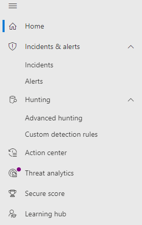

# Microsoft 365 끝점용 Microsoft DefenderMicrosoft Defender for Endpoint in the Microsoft 365 security center

[!INCLUDE [Microsoft 365 Defender rebranding](../includes/microsoft-defender.md)]

**적용 대상:****Applies to:**

- [Microsoft 365 DefenderMicrosoft 365 Defender](microsoft-365-defender.md)
- [엔드포인트용 Microsoft DefenderMicrosoft Defender for Endpoint](https://go.microsoft.com/fwlink/p/?linkid=2154037)
- [Office 365용 Microsoft DefenderMicrosoft Defender for Office 365](/microsoft-365/security/office-365-security/defender-for-office-365)

## 빠른 참조Quick reference

아래 이미지와 아래 표에는 보안 센터와 Microsoft Defender 보안 센터 탐색의 Microsoft 365 나열되어 있습니다.The image and the table below lists the changes in navigation between the Microsoft Defender Security Center and the Microsoft 365 security center.

> [!div class="mx-imgBorder"]
> 

| Microsoft Defender 보안 센터Microsoft Defender Security Center | Microsoft 365 보안 센터Microsoft 365 security center |
|---------|---------|
| 대시보드Dashboards <ul><li>보안 운영Security Operations</li><li>위협 분석Threat Analytics</li></ul>  |홈Home <ul><li>위협 분석Threat analytics</li></ul>   |
| 인시던트Incidents | 인시던트 & 경고Incidents & alerts |
| 장치 인벤토리Device inventory | 장치 인벤토리Device inventory |
| 경고 큐Alerts queue | 인시던트 & 경고Incidents & alerts |
| 자동화된 조사Automated investigations | 작업 센터Action center |
| 고급 헌팅Advanced hunting | 헌팅Hunting |
| 보고서Reports | 보고서Reports |
| 파트너 & APIPartners & APIs | 파트너 & APIPartners & APIs |
| 위협 & 취약성 관리Threat & Vulnerability Management | 취약성 관리Vulnerability management |
| 평가 및 자습서Evaluation and tutorials | 평가판 & 자습서Evaluation & tutorials |
| 구성 관리Configuration management | 구성 관리Configuration management |
| 설정Settings | 설정Settings | 

향상된 Microsoft 365 보안 센터는 전자 메일, 공동 [작업,](overview-security-center.md) ID 및 장치 위협을 보호, 감지, 조사 및 대응하는 보안 [https://security.microsoft.com](https://security.microsoft.com) 기능을 결합합니다.The improved [Microsoft 365 security center](overview-security-center.md) at [https://security.microsoft.com](https://security.microsoft.com) combines security capabilities that protect, detect, investigate, and respond to email, collaboration, identity, and device threats. 이 보안 센터는 보안 및 규정 준수 센터를 비롯한 기존 Microsoft Microsoft Defender 보안 센터 기능을 Office 365 & 제공합니다.This security center brings together functionality from existing Microsoft security portals, including Microsoft Defender Security Center and the Office 365 Security & Compliance center.

이 문서의 내용에 익숙한 Microsoft Defender 보안 센터 이 문서는 향상된 보안 센터의 일부 변경 및 Microsoft 365 설명하는 데 도움이 됩니다.If you're familiar with the Microsoft Defender Security Center, this article helps describe some of the changes and improvements in the improved Microsoft 365 security center. 그러나 인식해야 할 몇 가지 새 요소와 업데이트된 요소가 있습니다.However there are some new and updated elements to be aware of.

지금까지는 Microsoft Defender 보안 센터  Microsoft Defender for Endpoint의 홈입니다.Historically, the [Microsoft Defender Security Center](/windows/security/threat-protection/microsoft-defender-atp/portal-overview) has been the home for Microsoft Defender for Endpoint. Enterprise 보안 팀은 이를 사용하여 잠재적인 지속적인 위협 활동 또는 데이터 위반에 대한 경고를 모니터링하고 대응하는 데 도움을 주었다.Enterprise security teams have used it to monitor and help responding to alerts of potential advanced persistent threat activity or data breaches. 포털 수를 줄이기 위해 Microsoft 365 보안 센터는 Microsoft ID, 데이터, 장치, 앱 및 인프라에서 보안을 모니터링하고 관리할 수 있는 홈이 됩니다.To help reduce the number of portals, the Microsoft 365 security center will be the home for monitoring and managing security across your Microsoft identities, data, devices, apps, and infrastructure.

Microsoft 365 보안 센터의 끝점용 Microsoft Defender는 Microsoft Defender 보안 센터에서 액세스 권한을 부여하는 동일한 방식으로 [MSSP(관리되는](/windows/security/threat-protection/microsoft-defender-atp/grant-mssp-access) 보안 서비스 공급자)에 대한 액세스 권한을 [부여할 수 있도록 지원합니다.](mssp-access.md)Microsoft Defender for Endpoint in the Microsoft 365 security center supports [granting access to managed security service providers (MSSPs)](/windows/security/threat-protection/microsoft-defender-atp/grant-mssp-access) in the same way [access is granted in the Microsoft Defender security center](mssp-access.md).

> [!IMPORTANT]
> 보안 센터에 Microsoft 365 내용은 현재 구독에 따라 다를 수 있습니다.What you see in the Microsoft 365 security center depends on your current subscriptions. 예를 들어 Microsoft Defender for Office 365 라이선스가 없는 경우 전자 메일 & 공동 작업 섹션이 표시되지 않습니다.For example, if you don't have a license for Microsoft Defender for Office 365, then the Email & Collaboration section will not be shown.

>[!Note]
>새 통합 포털은 다음에 사용할 수 없습니다.The new unified portal is not available for:
>- US 정부 커뮤니티 클라우드(GCC)US Government Community Cloud (GCC)
>- US 정부 커뮤니티 클라우드 High(GCC High)US Government Community Cloud High (GCC High)
>- 미 국방부US Department of Defense
>- 상업용 라이선스가 있는 모든 미국 정부 기관All US government institutions with commercial licenses

향상된 보안 센터를 Microsoft 365 살펴보아야 [https://security.microsoft.com](https://security.microsoft.com) 합니다.Take a look at the improved Microsoft 365 security center: [https://security.microsoft.com](https://security.microsoft.com).

이점에 대한 자세한 정보: [Microsoft 365 보안 센터 개요](overview-security-center.md)Learn more about the benefits: [Overview of the Microsoft 365 security center](overview-security-center.md)

## 변경된 기능What's changed

이 표는 보안 센터와 Microsoft Defender 보안 센터 보안 센터 간의 변경 Microsoft 365 참조입니다.This table is a quick reference of the changes between the Microsoft Defender Security Center and the Microsoft 365 security center.

### 경고 및 작업Alerts and actions

| 영역Area | 변경 설명Description of change |
|---------|---------|
| [인시던트 & 경고Incidents & alerts](incidents-overview.md)  | 보안 Microsoft 365 센터에서 모든 끝점, 전자 메일 및 ID에서 인시던트 및 알림을 관리할 수 있습니다.In the Microsoft 365 security center, you can manage incidents and alerts across all of your endpoints, email, and identities. 관련 이벤트를 보다 쉽게 찾을 수 있도록 환경을 수렴했습니다.We've converged the experience to help you find related events more easily. 자세한 내용은 인시던트 [개요를 참조하세요.](incidents-overview.md)For more information, see [Incidents Overview](incidents-overview.md).   |
| [헌팅Hunting](advanced-hunting-overview.md)  |  ID 및 전자 메일 테이블을 포함하도록 끝점용 Microsoft Defender에서 만든 사용자 지정 검색 규칙을 수정하면 자동으로 해당 사용자 지정 Microsoft 365 이동됩니다.Modifying custom detection rules created in Microsoft Defender for Endpoint to include identity and email tables automatically moves them to Microsoft 365 Defender. 해당 경고는 Defender에 Microsoft 365 표시됩니다.Their corresponding alerts will also appear in Microsoft 365 Defender. 이러한 변경 내용에 대한 자세한 내용은 사용자 지정 검색 규칙 [마이그레이션을 참조합니다.](advanced-hunting-migrate-from-mde.md#migrate-custom-detection-rules)For more details about these changes, read [Migrate custom detection rules](advanced-hunting-migrate-from-mde.md#migrate-custom-detection-rules).   고급 `DeviceAlertEvents` 헌팅 표는 Defender에서 사용할 Microsoft 365 없습니다.The `DeviceAlertEvents` table for advanced hunting isn't available in Microsoft 365 Defender. Microsoft 365 Defender에서 장치별 경고 정보를 쿼리하려면 및 테이블을 사용하여 다양한 원본 집합의 추가 정보를 `AlertInfo` `AlertEvidence` 수용할 수 있습니다.To query device-specific alert information in Microsoft 365 Defender, you can use the `AlertInfo` and `AlertEvidence` tables to accommodate even more information from a diverse set of sources. [DeviceAlertEvents](advanced-hunting-migrate-from-mde.md#write-queries-without-devicealertevents)없이 쓰기 쿼리를 수행하여 다음 장치 관련 쿼리를 작성합니다.Craft your next device-related query by following [Write queries without DeviceAlertEvents](advanced-hunting-migrate-from-mde.md#write-queries-without-devicealertevents).|
|[작업 센터Action center](m365d-action-center.md)    | 자동화된 조사 및 수정 조치에 따라 수행된 보류 중인 작업 및 완료된 작업을 나열합니다.Lists pending and completed actions that were taken following automated investigations and remediation actions. 이전의 알림 센터에는 Microsoft Defender 보안 센터 조치에 대한 보류 중 및 완료된 조치가 나열되어 있으며 자동화된 조사에는 경고 및 상태가 나열되어 있습니다.Formerly, the Action center in the Microsoft Defender Security Center listed pending and completed actions for remediation actions taken on devices only, while Automated investigations listed alerts and status. 향상된 Microsoft 365 보안 센터에서 알림 센터는 전자 메일, 장치 및 사용자 전반에 걸쳐 재구성 작업 및 조사를 한 위치에 모습니다.In the  improved Microsoft 365 security center, the Action center brings together remediation actions and investigations across email, devices, and users—all in one location.  |
| [위협 분석Threat analytics](threat-analytics.md) |  탐색 모음의 위쪽으로 이동하여 보다 쉽게 검색하고 사용할 수 있습니다.Moved to the top of the navigation bar for easier discovery and use. 이제 끝점과 전자 메일 및 공동 작업 둘 다에 대한 위협 정보를 포함합니다.Now includes threat information for both endpoints and email and collaboration.    |

### 끝점Endpoints

| 영역Area | 변경 설명Description of change |
|---------|---------|
|검색Search   |  제목 대신 끝점용 Microsoft Defender 검색 표시줄이 끝점 섹션에서 이동됩니다.Instead of being in the heading, Microsoft Defender for Endpoint search bar is moving under the Endpoints section. 장치, 파일, 사용자, URL, IP, 취약성, 소프트웨어 및 권장 사항을 계속 검색할 수 있습니다.You can continue to search for devices, files, users, URLs, IPs, vulnerabilities, software, and recommendations.  |
|[DashboardDashboard](/windows/security/threat-protection/microsoft-defender-atp/security-operations-dashboard)   |  보안 작업 대시보드입니다.This is your security operations dashboard. 트리거된 활성 경고 수, 위험에 노출된 장치, 위험 상태의 사용자 및 경고, 장치 및 사용자에 대한 심각도 수준에 대한 개요를 참조하세요.See an overview of how many active alerts were triggered, which devices are at risk, which users are at risk, and severity level for alerts, devices, and users. 또한 센서 문제가 있는 장치, 전반적인 서비스 상태 및 해결되지 않은 경고가 감지된 방법을 볼 수도 있습니다.You can also see if any devices have sensor issues, your overall service health, and how any unresolved alerts were detected. |
|장치 인벤토리Device inventory | 변경 내용이 없습니다.No changes. |
|[취약성 관리Vulnerability management](/windows/security/threat-protection/microsoft-defender-atp/next-gen-threat-and-vuln-mgt)    |    이름이 탐색 창에 맞게 단축됩니다.Name was shortened to fit in the navigation pane. 이 섹션은 모든 페이지가 위협 및 취약성 관리 섹션과 동일합니다.It's the same as the threat and vulnerability management section, with all the pages underneath.     |
| 파트너 및 APIPartners and APIs | 변경 내용이 없습니다.No changes. |
| 평가판 & 자습서Evaluations & tutorials    |     새로운 테스트 및 학습 기능.New testing and learning capabilities.     |
| 구성 관리Configuration management   |  변경 내용이 없습니다.No changes.  |

> [!NOTE]
> **자동 조사 및 수정은** 이제 인시던트의 일부입니다.**Automatic investigation and remediation** is now a part of  incidents. 인시던트 및 조사 탭에서 **자동화된 조사 및 수정 이벤트를 > 있습니다.**You can see Automated  investigation and remediation events in the **Incident > Investigation** tab.

> [!TIP]
> 디바이스 검색은 끝점 및 검색에서 > 수행됩니다.Device search is done from Endpoints > Search.

### 액세스 및 보고Access and reporting

| 영역Area | 변경 설명Description of change |
|---------|---------|
| 보고서Reports  | 위협 방지, 장치 상태 및 규정 & 취약한 장치를 비롯한 엔드포인트 및 전자 메일 공동 작업용 보고서를 참조하세요.See reports for endpoints and email & collaboration, including Threat protection, Device health and compliance, and Vulnerable devices. |
| 상태Health  |  현재 Microsoft 365 관리 센터의 "서비스 상태" [페이지로 연결됩니다.](https://admin.microsoft.com/)Currently links out to the "Service health" page in the [Microsoft 365 admin center](https://admin.microsoft.com/). |
| 설정Settings |  보안 센터, Microsoft 365, Microsoft 365, 전자 메일 &, ID 및 장치 검색에 대한 설정을 관리합니다.Manage your settings for the Microsoft 365 security center, Microsoft 365 Defender, Endpoints, Email & collaboration, Identities, and Device discovery.   |

## Microsoft 365 탐색 및 기능Microsoft 365 security navigation and capabilities

왼쪽 탐색 또는 빠른 실행 표시줄이 친숙하게 개선됩니다.The left navigation, or quick launch bar, will look familiar. 그러나 이 보안 센터에는 몇 가지 새 요소와 업데이트된 요소가 있습니다.However, there are some new and updated elements in this security center.

### 인시던트 및 경고Incidents and alerts

전자 메일, 장치 및 ID의 인시던트 및 경고 관리를 통합합니다.Brings together incident and alert management across your email, devices, and identities. 경고 페이지에서는 공격 신호를 결합하여 자세한 스토리를 생성하여 경고에 대한 전체 컨텍스트를 제공합니다.The alert page provides full context to the alert by combining attack signals to construct a detailed story. 이제 새로운 통합 환경을 통해 여러 작업 부하에서 일관된 경고를 볼 수 있습니다.A new, unified experience now brings together a consistent view of alerts across workloads. 효과적인 작업을 빠르게 심사하고, 조사하고, 진행할 수 있습니다.You can quickly triage, investigate, and take effective action.

- [인시던트에 대해 자세히 알아보기Learn more about incidents](incidents-overview.md)
- [경고 관리에 대한 자세한 정보Learn more about managing alerts](investigate-alerts.md)

### 헌팅Hunting

[고급 헌팅 쿼리](advanced-hunting-overview.md)를 사용하여 엔드포인트, Office 365 사서함 등에서의 위협, 맬웨어 및 악의적인 활동을 사전에 검색합니다.Proactively search for threats, malware, and malicious activity across your endpoints, Office 365 mailboxes, and more by using [advanced hunting queries](advanced-hunting-overview.md). 이러한 강력한 쿼리를 사용하여 알려진 위협과 잠재적인 위협에 대한 위협 지표 및 엔터티를 찾고 검토할 수 있습니다.These powerful queries can be used to locate and review threat indicators and entities for both known and potential threats.

[고급 헌팅](custom-detection-rules.md) 쿼리를 통해 사용자 지정 검색 규칙을 구축하면 위반 활동 및 잘못 구성된 장치를 표시하는 이벤트를 사전 예방적으로 감시할 수 있습니다.[Custom detection rules](custom-detection-rules.md) can be built from advanced hunting queries to help you proactively watch for events that might be indicative of breach activity and misconfigured devices.

### 작업 센터Action center

작업 센터에서는 자동화된 조사 및 응답 기능으로 만든 조사가 표시됩니다.Action center shows you the investigations created by automated investigation and response capabilities. Microsoft 365 Defender의 자동화된 자동 복구에서 특정 이벤트에 자동으로 응답하여 보안 팀을 도울 수 있습니다.This automated, self-healing in Microsoft 365 Defender can help security teams by automatically responding to specific events.

[자세한 내용은 Action Center를 통해 자세히 알아보실 수 있습니다.](m365d-action-center.md)[Learn more about the Action center](m365d-action-center.md).

### 위협 분석Threat Analytics

전문적인 Microsoft 보안 연구원으로부터 위협 인텔리전스를 받을 수 있습니다.Get threat intelligence from expert Microsoft security researchers. 위협 분석은 새로운 위협에 직면할 때 보안 팀이 더 효율적으로 대처할 수 있도록 지원합니다.Threat Analytics helps security teams be more efficient when facing emerging threats. 위협 분석의 포함 항목:Threat Analytics includes:

- Office 365용 Microsoft Defender의 전자 메일 관련 감지 및 완화.Email-related detections and mitigations from Microsoft Defender for Office 365. 이 외에도 엔드포인트용 Microsoft Defender에서 이미 사용 가능한 엔드포인트 데이터도 사용할 수 있습니다.This is in addition to the endpoint data already available from Microsoft Defender for Endpoint.
- 위협과 관련된 인시던트 보기.Incidents view related to the threats.
- 보고서에서 실행 가능한 정보를 빠르게 식별하고 사용할 수 있는 향상된 환경.Enhanced experience for quickly identifying and using actionable information in the reports.

보안 센터의 왼쪽 위 탐색 모음에서 위협 분석에 액세스할 Microsoft 365 또는 조직의 최상위 위협을 표시하는 전용 대시보드 카드에서 위협 분석에 액세스할 수 있습니다.You can access threat analytics either from the upper left navigation bar in the Microsoft 365 security center, or from a dedicated dashboard card that shows the top threats for your organization.

위협 분석을 사용하여 새로운 위협을 추적하고 [대응하는 방법에 대해 자세히 알아보십시오.](./threat-analytics.md)Learn more about how to [track and respond to emerging threats with threat analytics](./threat-analytics.md).

### Endpoints 섹션Endpoints section

조직의 끝점 보안을 보고 관리합니다.View and manage the security of endpoints in your organization. 해당 응용 Microsoft Defender 보안 센터 익숙해 보이게 됩니다.If you've used the Microsoft Defender Security Center, it will look familiar.

### 액세스 및 보고서Access and reports

보고서를 보고, 설정을 변경하고, 사용자 역할을 수정합니다.View reports, change your settings, and modify user roles.

### SIEM API 연결SIEM API connections

Endpoint [SIEM API용 Defender를](../defender-endpoint/enable-siem-integration.md)사용하는 경우 계속 진행할 수 있습니다.If you use the [Defender for Endpoint SIEM API](../defender-endpoint/enable-siem-integration.md), you can continue to do so. API 페이로드에 경고 페이지 또는 보안 포털의 인시던트 페이지를 Microsoft 365 추가했습니다.We’ve added new links on the API payload that point to the alert page or the incident page in the Microsoft 365 security portal. 새 API 필드에는 LinkToMTP 및 IncidentLinkToMTP가 포함됩니다.New API fields include LinkToMTP and IncidentLinkToMTP. 자세한 내용은 [끝점용 Microsoft Defender에서](./microsoft-365-security-mde-redirection.md)보안 센터로 계정 Microsoft 365 참조하세요.For more information, see [Redirecting accounts from Microsoft Defender for Endpoint to the Microsoft 365 security center](./microsoft-365-security-mde-redirection.md).

### 전자 메일 알림Email alerts

Endpoint용 Defender에 대한 전자 메일 알림을 계속 사용할 수 있습니다.You can continue to use email alerts for Defender for Endpoint. 전자 메일에 보안 센터의 경고 페이지 또는 인시던트 페이지를 Microsoft 365 추가했습니다.We've added new links in the emails that point to the alert page or the incident page in the Microsoft 365 security center. 자세한 내용은 [끝점용 Microsoft Defender에서](./microsoft-365-security-mde-redirection.md)보안 센터로 계정 Microsoft 365 참조하세요.For more information, see [Redirecting accounts from Microsoft Defender for Endpoint to the Microsoft 365 security center](./microsoft-365-security-mde-redirection.md).

### MSSP(관리되는 보안 서비스 공급자)Managed Security Service Providers (MSSP)

동일한 검색 세션에서 동시에 여러 테넌트에 로그인하는 것은 현재 통합 포털에서 지원되지 않습니다.Logging in to multiple tenants simultaneously in the same browsing session is currently not supported in the unified portal. 문제가 해결될 때까지 이 기능을 유지 관리하기 위해 [이전의 Microsoft Defender for Endpoint](microsoft-365-security-mde-redirection.md#can-i-go-back-to-using-the-former-portal)포털로 되전하여 자동 리디렉션을 옵트아웃(opt-out)할 수 있습니다.You can opt-out of the automatic redirection by [reverting to the former Microsoft Defender for Endpoint portal](microsoft-365-security-mde-redirection.md#can-i-go-back-to-using-the-former-portal), to maintain this functionality until the issue is resolved.

## 관련 정보Related information

- [Microsoft 365 보안 센터Microsoft 365 security center](overview-security-center.md)
- [Microsoft 365 끝점용 Microsoft DefenderMicrosoft Defender for Endpoint in the Microsoft 365 security center](microsoft-365-security-center-mde.md)
- [끝점용 Microsoft Defender에서 보안 센터로 Microsoft 365 리디렉션Redirecting accounts from Microsoft Defender for Endpoint to the Microsoft 365 security center](microsoft-365-security-mde-redirection.md)
