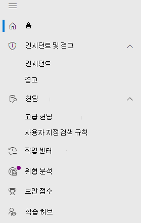

# Microsoft Defender for Office 365 Microsoft 365 Defender

[!INCLUDE [Microsoft 365 Defender rebranding](../includes/microsoft-defender.md)]

**적용 대상:**
- [Microsoft 365 Defender](microsoft-365-defender.md)
- [Office 365용 Microsoft Defender](/microsoft-365/security/office-365-security/defender-for-office-365)

## 빠른 참조

아래 표에는 보안 및 준수 센터와 보안 준수 센터 & 탐색이 Microsoft 365 Defender.

 

****

|[보안 및 준수 센터](https://protection.office.com)|[Microsoft 365 Defender](https://security.microsoft.com)|[Microsoft 365 규정 준수 센터](https://compliance.microsoft.com/homepage)|[Exchange 관리 센터](https://admin.exchange.microsoft.com)|
|---|---|---|---|
|경고|<ul><li>[경고 정책](https://security.microsoft.com/alertpolicies)</li><li>[인시던트 & 경고](https://security.microsoft.com/alerts)</li></ul>|[경고 페이지](https://compliance.microsoft.com/homepage)||
|분류||자세한 [내용은 Microsoft 365 규정 준수 센터](https://compliance.microsoft.com/homepage)||
|데이터 손실 방지||자세한 [내용은 Microsoft 365 규정 준수 센터](https://compliance.microsoft.com/homepage)||
|레코드 관리||자세한 [내용은 Microsoft 365 규정 준수 센터](https://compliance.microsoft.com/homepage)||
|정보 거버넌스||자세한 [내용은 Microsoft 365 규정 준수 센터](https://compliance.microsoft.com/homepage)||
|위협 관리|[전자 메일 & 공동 작업](https://security.microsoft.com/homepage)|||
|권한|[역할에 & 사용 권한](https://security.microsoft.com/emailandcollabpermissions)|자세한 [내용은 Microsoft 365 규정 준수 센터](https://compliance.microsoft.com/homepage)||
|메일 흐름|||관리 [Exchange 참조](https://admin.exchange.microsoft.com/#/)|
|데이터 개인 정보||자세한 [내용은 Microsoft 365 규정 준수 센터](https://compliance.microsoft.com/homepage)||
|검색|[감사](https://security.microsoft.com/auditlogsearch?viewid=Async%20Search)|검색(콘텐츠 검색)||
|보고서|[보고서](https://security.microsoft.com/emailandcollabreport)|||
|서비스 보증||자세한 [내용은 Microsoft 365 규정 준수 센터](https://compliance.microsoft.com/homepage)||
|감독||자세한 [내용은 Microsoft 365 규정 준수 센터](https://compliance.microsoft.com/homepage)||
|eDiscovery||자세한 [내용은 Microsoft 365 규정 준수 센터](https://compliance.microsoft.com/homepage)||
|||||

[Microsoft 365 Defender](./overview-security-center.md) 보안 및 준수 센터를 포함하여 기존 Microsoft 보안 포털의 보안 <https://security.microsoft.com> & 결합되어 있습니다. 이 개선된 센터는 보안 팀이 더 효과적이고 효율적으로 위협으로부터 조직을 보호하는 데 도움이 됩니다.

이 문서에서는 보안 & 준수 센터(protection.office.com)에 대해 잘 알고 있는 경우 Microsoft 365 Defender.

이점에 대한 자세한 내용은 [Overview of Microsoft 365 Defender](overview-security-center.md)

규정 준수 관련 항목을 찾고 있는 경우 [Microsoft 365 규정 준수 센터](https://compliance.microsoft.com/homepage)를 방문하세요.

## 새 기능 및 향상된 기능

왼쪽 탐색 또는 빠른 실행 표시줄이 친숙하게 개선됩니다. 그러나 이 보안 센터에는 몇 가지 새 요소와 업데이트된 요소가 있습니다.

통합된 Microsoft 365 Defender 솔루션을 사용하여 위협 신호를 통합하고 위협의 전체 범위 및 영향과 위협이 현재 조직에 미치는 영향을 확인할 수 있습니다.

:::image type="content" source="../../media/M365-defender-converge-experience.png" alt-text="수렴형 Microsoft 365 Defender 이미지입니다.":::

보호를 위한 Office 365 전자 메일 메시지, 링크(URL) 및 공동 작업 도구로 위협되는 악의적인 위협에 대해 조직을 보호합니다.

:::image type="content" source="../../media/Defender-for-O365.png" alt-text="에 대한 Defender의 Office 365.":::

### 인시던트 및 경고

전자 메일, 장치 및 ID의 인시던트 및 경고 관리를 통합합니다. 이제 조사 노드에서 경고를 확인할 수 있으며 경고를 통해 공격을 더욱 폭넓게 볼 수 있습니다. 경고 페이지에서는 공격 신호를 결합하여 자세한 내용을 구성하여 경고의 전체 컨텍스트를 제공합니다. 이전에는 경고가 서로 다른 작업 부하에 지정되었습니다. 이제 새로운 통합 환경을 통해 여러 작업 부하에서 일관된 경고를 볼 수 있습니다. 효과적인 작업을 빠르게 심사하고, 조사하고, 진행할 수 있습니다.

- [조사에 대한 자세한 정보](incidents-overview.md)
- [경고 관리에 대한 자세한 정보](/windows/security/threat-protection/microsoft-defender-atp/review-alerts)

### 헌팅

[고급 헌팅 쿼리](advanced-hunting-overview.md)를 사용하여 엔드포인트, Office 365 사서함 등에서의 위협, 맬웨어 및 악의적인 활동을 사전에 검색합니다. 이러한 강력한 쿼리를 사용하여 알려진 위협과 잠재적 위협에 대한 위협 표시기 및 엔터티를 찾고 검토할 수 있습니다.

[고급 헌팅](/windows/security/threat-protection/microsoft-defender-atp/custom-detection-rules) 쿼리를 통해 사용자 지정 검색 규칙을 구축하면 위반 활동 및 잘못 구성된 장치를 표시하는 이벤트를 사전 예방적으로 감시할 수 있습니다.

다음은 Microsoft Defender [for](advanced-hunting-example.md) Office 365.

### 작업 센터

작업 센터에서는 자동화된 조사 및 응답 기능으로 만든 조사가 표시됩니다. Microsoft 365 Defender의 자동화된 자동 복구에서 특정 이벤트에 자동으로 응답하여 보안 팀을 도울 수 있습니다.

자세한 내용은 [Action Center를 통해 자세히 알아보실 수 있습니다.](m365d-action-center.md)

#### 위협 분석

전문적인 Microsoft 보안 연구원으로부터 위협 인텔리전스를 받을 수 있습니다. 위협 분석은 새로운 위협에 직면할 때 보안 팀이 더 효율적으로 대처할 수 있도록 지원합니다. 위협 분석의 포함 항목:

- Office 365용 Microsoft Defender의 전자 메일 관련 감지 및 완화. 이 외에도 엔드포인트용 Microsoft Defender에서 이미 사용 가능한 엔드포인트 데이터도 사용할 수 있습니다.
- 위협과 관련된 인시던트 보기.
- 보고서에서 실행 가능한 정보를 빠르게 식별하고 사용할 수 있는 향상된 환경.

조직의 왼쪽 위 탐색 모음 또는 조직의 최상위 위협을 Microsoft 365 Defender 전용 대시보드 카드에서 위협 분석에 액세스할 수 있습니다.

위협 분석을 사용하여 새로운 위협을 추적하고 [대응하는 방법에 대해 자세히 알아보십시오.](./threat-analytics.md)

### 전자 메일 및 공동 작업

사용자의 전자 메일 위협을 추적 및 조사, 캠페인 추적 등. 보안 및 준수 센터를 & 익숙합니다.

:::image type="content" source="../../media/converge-3-email-and-collab-new.png" alt-text="전자 메일 메시지의 왼쪽에 있는 &(또는 MSDO)에 대한 빠른 실행 메뉴를 Microsoft 365 Defender.":::

#### 전자 메일 엔터티 페이지

전자 [메일 엔터티 페이지는](../office-365-security/mdo-email-entity-page.md)  과거의 여러 페이지 또는 보기에 분산된 전자 메일 정보를 통일합니다. 위협과 추세 조사가 *중앙화* 됩니다. 헤더 정보 및 전자 메일 미리 보기는 같은 전자 메일 페이지에서 다른 유용한 전자 메일 관련 정보와 함께 액세스할 수 있습니다. 마찬가지로 악성 파일 첨부 파일 또는 URL에 대한 데토네이션 상태는 같은 페이지의 탭에서 찾을 수 있습니다. 전자 메일 엔터티 페이지를 통해 관리자와 보안 운영 팀이 전자 메일 위협과 해당 상태를 빠르게 파악한 다음 처리를 신속하게 결정할 수 있습니다.

### 액세스 및 보고서

보고서를 보고, 설정을 변경하고, 사용자 역할을 수정합니다.

:::image type="content" source="../../media/converge-4-access-and-reporting-new.png" alt-text="보안 센터 왼쪽에 있는 Microsoft 365 Defender 및 보고를 위한 빠른 실행 메뉴입니다.":::

> [!NOTE]
> DomainKeys 식별 메일(DKIM)을 사용하면 대상 전자 메일 시스템에서 사용자 지정 도메인에서 아웃바운드로 전송된 메시지를 신뢰합니다.
> Office 365 사용자용 Defender의 경우 이제  다음을 통해 DKIM 키를 관리하고 회전할 수 있습니다. 또는 Microsoft 365 Defender 규칙 위협 정책 & 섹션 <https://security.microsoft.com/threatpolicy>  \>  \> \>  \> **DKIM으로 이동할 수** 있습니다.
>
> 자세한 내용은 [DKIM을 사용하여](/microsoft-365/security/office-365-security/use-dkim-to-validate-outbound-email)사용자 지정 도메인에서 보낸 아웃바운드 전자 메일의 유효성 검사를 참조하세요.

## 변경된 기능

이 표는 보안 및 준수 센터와 보안 포털 간에 **변경이 &** 위협 **관리에 대한 Microsoft 365 Defender** 참조입니다. 이러한 영역에 대해 자세히 읽으려면 링크를 클릭하세요.

 

****

|영역|변경 설명|
|---|---|
|[조사](../office-365-security/office-365-air.md#changes-are-coming-soon-in-your-microsoft-365-defender-portal)|[Office 365용 Defender](/microsoft-365/security/office-365-security/defender-for-office-365) 및 [엔드포인트용 Defender](../defender-endpoint/automated-investigations.md)의 AIR 기능을 결합합니다. 이러한 업데이트 및 개선 사항을 통해 보안 운영 팀에서는 전자 메일, 공동 작업 콘텐츠, 사용자 계정 및 장치 전체에서 자동 조사 및 수정 작업에 대한 세부 정보를 한 장소에서 볼 수 있습니다.|
|[경고 큐](../../compliance/alert-policies.md)|보안 **및 준수** 센터의 경고 보기 플라이아웃 & 이제 경고에 대한 링크가 Microsoft 365 Defender. 경고 페이지 **열기** 링크를 클릭하고 Microsoft 365 Defender 열립니다. 경고 큐에서 Office 365 경고를 클릭하여 **경고보기** 페이지에 액세스할 수 있습니다.|
|[공격 시뮬레이션 교육](../office-365-security/attack-simulation-training-insights.md)|공격 시뮬레이션 교육을 사용하여 조직에서 현실적인 공격 시나리오를 실행합니다. 이렇게 시뮬레이션된 공격은 실제 공격이 조직에 영향을 미치기 전에 인력을 교육하는 데 도움이 될 수 있습니다. 공격 시뮬레이션 교육에는 추가 옵션, 향상된 보고서 및 향상된 교육 흐름이 포함되어 공격 시뮬레이션 및 교육 시나리오를 더 쉽게 전달하고 관리할 수 있도록 지원합니다.|
|

변경 내용이 없는 영역:

- [탐색기](../office-365-security/threat-explorer.md)
- [정책 및 규칙](../../compliance/alert-policies.md)
- [캠페인](../office-365-security/campaigns.md)
- [제출](../office-365-security/admin-submission.md)
- [검토](./m365d-action-center.md)
- [위협 추적기](../office-365-security/threat-trackers.md)

또한 이 문서 아래에 있는 **관련 정보** 섹션을 참조하세요.

> [!IMPORTANT]
> Microsoft 365 Defender 포털( )은 및 의 보안 <https://security.microsoft.com> 기능을 <https://securitycenter.windows.com> <https://protection.office.com> 결합합니다. 그러나 표시되는 내용은 구독에 따라 다를 수 있습니다. 예를 들어 독립 실행형 구독으로 Office 365용 Microsoft Defender 플랜 1 또는 2만 있는 경우 엔드포인트용 보안과 관련된 기능이 표시되지 않으며 Office용 Defender 플랜 1 고객에게는 위협 분석과 같은 항목이 표시되지 않습니다.

> [!TIP]
> EOP는 Exchange Online Protection Defender의 핵심 요소이기 때문에 모든 EOP(Microsoft 365 Defender) 함수가 Office 365.

## Microsoft 365 Defender 홈페이지

포털 홈 페이지에는 포털 환경의 보안 상태에 대한 중요한 Microsoft 365 표시됩니다.

**안내 받기** 를 사용하여 엔드포인트와 전자 메일 및 공동 작업 페이지를 빠르게 둘러보세요. 여기에 표시될 내용은 Office 365용 Defender 및/또는 엔드포인트용 Defender에 대한 라이선스가 있는지 여부에 따라 다를 수 있습니다.

또한 비교를 위해 보안 및 **준수 & 링크도** 포함되어 있습니다. 마지막 링크는 최근 업데이트를 설명하는 **새로운 기능** 페이지로 이동합니다.

## 관련 정보

- [보안 및 & 센터로 Microsoft 365 Defender](microsoft-365-security-mdo-redirection.md)
- [알림 센터](./m365d-action-center.md)
- [전자 메일 및 공동 작업 경고](../../compliance/alert-policies.md#default-alert-policies)
- [사용자 지정 검색 규칙](/microsoft-365/security/defender-endpoint/custom-detection-rules)
- [피싱 공격 시뮬레이션 만들기](../office-365-security/attack-simulation-training.md) 및 [직원교육을 위한 페이로드 만들기](../office-365-security/attack-simulation-training-payloads.md)
