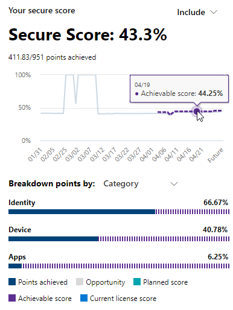

# Microsoft 보안 점수를 통해 보안 환경 평가

[!INCLUDE [Microsoft 365 Defender rebranding](../includes/microsoft-defender.md)]

Microsoft Secure Score는 조직의 보안 태세에 대한 평가 점수로, 점수가 높을수록 더 많은 개선 작업이 수행되었다는 뜻입니다. 이 사이트는 사이트 포털 https://security.microsoft.com/securescore [에서 Microsoft 365 Defender 있습니다.](overview-security-center.md)

필요한 정보를 더 빠르게 찾을 수 있도록 Microsoft 개선 작업은 그룹으로 구성됩니다.

- ID(Azure Active Directory 계정 & 역할)
- Device (Microsoft Defender for Endpoint, known [as Microsoft Secure Score for Devices)](/windows/security/threat-protection/microsoft-defender-atp/tvm-microsoft-secure-score-devices)
- 앱(전자 메일 및 클라우드 앱(Office 365 및 Microsoft Cloud App Security)

>[!NOTE]
>Microsoft 보안 점수의 최근 릴리스에서는 향상된 점수 모델이 릴리스되어 Microsoft 보안 점수가 ID 보안 점수 및 Graph API와 일시적으로 Graph 있습니다. [자세히 보기](microsoft-secure-score-whats-new.md)

Microsoft 보안 점수 개요 페이지에서 이러한 그룹 간에 점수가 분할된 방법과 사용 가능한 포인트를 들을 수 있습니다. 또한 총 점수, 벤치마크 비교를 통해 보안 점수의 기록 추세, 점수를 개선하기 위해 수행할 수 있는 우선 순위가 높은 개선 작업에 대한 전체 보기를 얻을 수도 있습니다.

## 현재 점수 확인

현재 점수를 확인하기 위해 Microsoft 보안 점수 개요 페이지로 이동하여 보안 점수 를 표시하는 **타일을 검색합니다.** 점수는 가능한 총 점수 중 달성한 점수 수와 함께 백분율로 표시됩니다.

또한 점수 옆에 있는  포함 단추를 선택하는 경우 점수의 다양한 보기를 선택할 수 있습니다. 이러한 서로 다른 점수 보기는 점수 타일 및 점 분석 차트의 그래프에 표시됩니다.

다음은 전체 점수의 보기에 추가하여 전체 점수에 대한 전체적인 그림을 볼 수 있는 점수입니다.

- **계획된 점수:** 계획된 작업이 완료된 경우의 예정된 점수 표시
- **현재 라이선스 점수:** 현재 Microsoft 라이선스로 달성할 수 있는 점수 표시
- **달성 가능한 점수:** Microsoft 라이선스 및 현재 위험 수용으로 달성할 수 있는 점수 표시

이 보기는 가능한 모든 점수 보기를 포함하면 다음과 같이 표시됩니다.

## 점수 향상을 위한 조치 수행

개선 **작업 탭에는** 가능한 공격 표면을 해결하기 위한 보안 권장 사항이 나열됩니다. 또한 해당 상태(해결, 계획, 위험 수락, 타사를 통해 해결, 대체 완화를 통해 해결 및 완료)도 포함됩니다. 모든 개선 작업을 검색, 필터링 및 그룹화할 수 있습니다.  

### 순위

순위는 달성하기 위해 남은 포인트 수, 구현 난이도, 사용자 영향 및 복잡성을 기반으로 합니다. 가장 높은 순위의 개선 작업에는 난이도, 사용자 영향 및 복잡성이 낮은 점수가 남습니다.

### 개선 작업 세부 정보 보기

특정 개선 작업을 선택하면 전체 페이지 플라이아웃이 나타납니다.  

작업을 완료하기 위해 다음과 같은 몇 가지 옵션이 있습니다.

- 관리를 **선택하여** 구성 화면으로 이동하고 변경합니다. 그런 다음 작업의 가치와 플라이아웃에 표시되는 포인트를 얻게 됩니다. 포인트는 일반적으로 업데이트하는 데 24시간 정도 소요됩니다.

- **공유를** 선택하여 개선 작업으로 직접 링크를 복사합니다. 전자 메일, 메일 또는 Microsoft Planner와 같은 링크를 공유할 플랫폼을 Microsoft Teams 있습니다.

**메모를** 추가하여 진행 상황을 추적하거나 메모를 남기고자 하는 기타 모든 것을 추적합니다. 개선 작업에서  자체 태그를 추가하는 경우 해당 태그를 사용하여 필터링할 수 있습니다.

### 개선 작업 상태 선택

상태를 선택하고 개선 작업과 관련한 메모를 기록합니다.

- **주소 -** 개선 작업이 필요하다는 사실과 향후에 해결될 계획입니다. 이 상태는 부분적으로 검색되지만 완전히 완료되지는 않은 작업에도 적용됩니다.
- **계획** - 개선 작업을 완료하기 위한 구체적인 계획이 있습니다.
- **위험 수락** - 보안은 항상 사용 가능성과 균형을 조정해야 합니다. 모든 권장이 사용자 환경에 대해 작동하지는 않습니다. 이 경우 위험 또는 남은 위험을 수용할 수 있으며 개선 작업을 실행하지 않을 수 있습니다. 점은 제공되지 않지만 동작이 개선 작업 목록에 더 이상 표시되지 않습니다. 이 작업은 기록에서 보거나 실행 취소할 수 있습니다.
- **타사를 통해** 해결되고 대체 완화를 통해 해결 **-** 개선 작업은 타사 응용 프로그램 또는 소프트웨어 또는 내부 도구를 통해 이미 해결되었습니다. 작업의 가치가 있는 점수를 얻게 있으므로 점수가 전반적인 보안 자세를 더 잘 반영합니다. 타사 또는 내부 도구가 더 이상 컨트롤을 덮지 못하면 다른 상태를 선택할 수 있습니다. 개선 작업이 이러한 상태 중 하나로 표시된 경우 Microsoft는 구현의 완전성을 확인할 수 없습니다.

#### 위협 & 취약성 관리 개선 작업

"장치" 범주의 개선 작업의 경우 상태를 선택할 수 없습니다. 대신 작업 수행을 위한 위협 및 취약성 관리 보안  권장 Microsoft Defender 보안 센터 합니다.  선택한 예외 및 작성 사당성은 해당 포털과 관련이 있습니다. Microsoft 보안 점수 포털에는 존재하지 않습니다.

#### 개선 작업 완료

개선 작업에 대해 가능한 모든 점수가 달성된 경우 개선 작업은 "완료" 상태가 됩니다. Microsoft 데이터를 통해 개선 작업이 완료된 것으로 확인되면 상태를 변경할 수 없습니다.

### 정보 평가 및 사용자 영향 검토

이라는 **섹션은** 범주, 범주가 보호할 수 있는 공격 및 제품을 한눈에 알 수 있습니다.

**사용자 영향** 개선 작업이 제정된 경우 사용자에게 미치는 영향은 영향을 받는 사용자입니다. 

### 개선 작업 구현

구현 **섹션에는** 개선 작업을 완료하기 위한 모든 선행 작업, 단계별 다음 단계, 개선 작업의 현재 구현 상태 및 자세한 링크가 표시됩니다.

사전 요구에는 필요한 라이선스 또는 개선 작업이 해결되기 전에 완료해야 하는 작업이 포함됩니다. 라이선스에 사용자 수가 충분한지 확인하여 개선 작업을 완료하고 해당 라이선스가 필요한 사용자에게 적용해야 합니다.  

## 의견을 보내 주세요.

문제가 있는 경우 보안, 개인 정보 보호 및 규정 준수 커뮤니티에 게시하여 & [알려주세요.](https://techcommunity.microsoft.com/t5/Security-Privacy-Compliance/bd-p/security_privacy) 커뮤니티를 모니터링하고 있으며 도움을 제공할 것입니다.

## 관련 리소스

- [Microsoft 보안 점수 개요](microsoft-secure-score.md)
- [Microsoft 보안 점수 기록 추적 및 목표 충족](microsoft-secure-score-history-metrics-trends.md)
- [향후 계획](microsoft-secure-score-whats-coming.md)
- [새로운 기능](microsoft-secure-score-whats-new.md)
