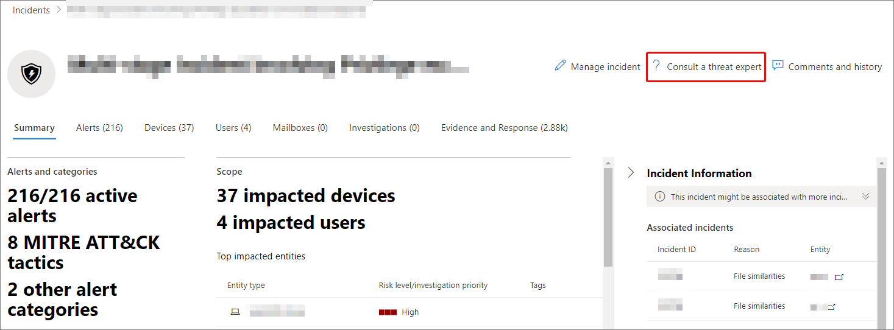

# Microsoft 위협 전문가 Microsoft 365 개요

[!INCLUDE [Microsoft 365 Defender rebranding](../includes/microsoft-defender.md)]

**적용 대상:**

- [Microsoft 365 Defender](https://go.microsoft.com/fwlink/?linkid=2118804)
- [엔드포인트용 Microsoft Defender](https://go.microsoft.com/fwlink/p/?linkid=2154037)

[!INCLUDE [Prerelease](../includes/prerelease.md)]

Microsoft 위협 전문가 - 대상 공격 알림은 관리되는 위협 헌팅 서비스입니다. 적용하고 수락하면 Microsoft 위협 전문가로부터 대상 공격 알림을 받으며, 환경에 대한 중요한 위협을 놓치지 않습니다. 이러한 알림은 조직의 끝점, 전자 메일 및 ID를 보호하는 데 도움이 됩니다.
Microsoft 위협 전문가 – 요구 시 전문가를 통해 조직이 직면하고 있는 위협에 대한 전문가의 조언을 얻을 수 있습니다. 조직이 직면한 위협에 대한 도움말을 볼 수 있습니다. 구독 서비스로 사용할 수 있습니다.

## 대상 Microsoft 위협 전문가 - 대상 공격 알림

> [!IMPORTANT]
> 적용하기 전에 Microsoft 기술 서비스 공급자 및 계정 팀과 Microsoft 위협 전문가 - 대상 공격 알림의 자격 요구 사항을 논의해야 합니다.

끝점용 Microsoft Defender 및 Microsoft 365 Defender 이미 있는 경우 Microsoft 위협 전문가 포털을 통해 Microsoft 위협 전문가 – 대상 공격 알림을 Microsoft 365 Defender 있습니다. 설정 > **Endpoints > General > Advanced features > Microsoft 위협 전문가 – Targeted Attack Notifications(대상** 공격 알림> Microsoft 위협 전문가 적용)으로 **이동하고 적용을 선택합니다.** 자세한 [Microsoft 위협 전문가 기능](./configure-microsoft-threat-experts.md) 구성을 참조하세요.

응용 프로그램이 승인되면 위협 전문가가 환경에 대한 위협을 감지할 때마다 대상 공격 알림을 수신하게 됩니다.

## 구독 - Microsoft 위협 전문가 전문가

Microsoft 담당자에게 문의하여 전문가에게 문의합니다.  자세한 [내용은 Microsoft 위협 전문가 기능](./configure-microsoft-threat-experts.md) 구성을 참조합니다.

## 대상 공격 알림 수신

Microsoft 위협 전문가 - 대상 공격 알림 기능은 네트워크에 대한 가장 중요한 위협에 대한 사전 헌팅을 제공합니다. 위협 전문가는 악의적인 침입, 키보드 실습 및 사이버 공격과 같은 고급 공격을 헌팅합니다. 이러한 알림은 새 경고로 표시됩니다. 관리되는 헌팅 서비스에는 다음이 포함됩니다.

- 위협 모니터링 및 분석, 에스밍 시간 및 비즈니스에 대한 위험 감소
- 알려진 공격과 새로운 위협을 모두 검색하고 대상을 지정하기 위해 헌터가 학습한 인공 지능
- 가장 관련성 있는 위험을 식별하여 SOC의 효율성 최대화
- 손상의 스위핑을 지원하고 신속하게 전달될 수 있는 많은 컨텍스트를 제공하여 신속한 SOC 응답을 가능하게 합니다.

## 전문가와 공동 작업

또한 보안 포털 내에서 직접 Microsoft 위협 전문가에게 연락하여 신속하고 Microsoft 365 위협에 대응할 수 있습니다.  전문가는 조직이 직면할 수 있는 복잡한 위협을 더 잘 이해할 수 있는 통찰력을 제공할 수 있습니다.  전문가에게 문의하여:

- 근본 원인 및 범위를 포함하여 경고 및 인시던트에 대한 추가 정보 수집
- 의심스러운 장치, 경고 또는 인시던트에 대한 명확성을 확보하고 고급 공격자가 직면할 경우 다음 단계를 수행합니다.
- 위협 공격자, 캠페인 또는 새로운 공격자 기술과 관련된 위험 및 사용 가능한 보호 결정

위협 **전문가에게 문의** 옵션은 포털 전체의 여러 곳에서 사용할 수 있습니다.

- <i>**장치 페이지 작업 메뉴**</i> 

- <i>**장치 인벤토리 페이지 플라이아웃 메뉴**</i> 

- <i>**경고 페이지 플라이아웃 메뉴**</i> 

- <i>**인시던트 페이지 작업 메뉴**</i> 

- <i>**인시던트 인벤토리 페이지**</i> 

> [!NOTE]
> Microsoft Defender for Office 365 라이선스에 매핑된 프리미어 지원 구독이 있는 경우 Microsoft 서비스 허브를 통해 요구 시 전문가 사례의 상태를 추적할 수 있습니다.

이 비디오를 시청하여 Microsoft 서비스 허브에 대한 간략한 개요를 확인할 수 있습니다.

> [!VIDEO https://www.microsoft.com/videoplayer/embed/RE4pk9f]

## 참고 항목

- [Microsoft 위협 전문가 기능 구성](./configure-microsoft-threat-experts.md)
