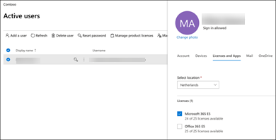
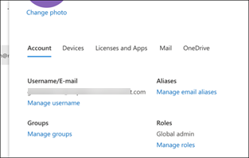

# 랩 환경에서 Microsoft 365 Defender 평가판 설정 

[!INCLUDE [Microsoft 365 Defender rebranding](../includes/microsoft-defender.md)]

**적용 대상:**
- Microsoft 365 Defender 

이 항목에서는 전용 랩 환경을 설정하는 데 대해 안내합니다. 프로덕션 환경의 평가판 설정에 대한  자세한 내용은 새로운 평가 및 파일럿 테스트 Microsoft 365 Defender 참조하세요. 

## 평가판 Office 365 E5 테넌트 만들기
>[!NOTE]
>기존 Office 365 또는 Azure Active Directory 있는 경우 평가판 테넌트 만들기 Office 365 E5 건너뛸 수 있습니다.

1. 제품 [포털로 Office 365 E5 무료](https://www.microsoft.com/microsoft-365/business/office-365-enterprise-e5-business-software?activetab=pivot%3aoverviewtab) **평가판 을 선택합니다.**

   
  
2. 전자 메일 주소(개인 또는 회사)를 입력하여 평가판 등록을 완료합니다. 계정 **설정 을 클릭합니다.**

   

3. 이름, 성, 회사 전화 번호, 회사 이름, 회사 크기, 국가 또는 지역을 입력합니다.  

   
   
   > [!NOTE]
   > 여기서 설정한 국가 또는 지역은 호스트할 데이터 센터 Office 365 결정됩니다.
  
4. 확인 기본 설정 선택: 문자 메시지 또는 전화를 통해 선택 확인 **코드 보내기 를 클릭합니다.** 

   

5. 테넌트에 대한 사용자 지정 도메인 이름을 설정하고 다음 을 **클릭합니다.**

   
 
6. 테넌트의 전역 관리자가 될 첫 번째 ID를 설정합니다. 이름 및 **암호를** **입력합니다.** **등록** 을 클릭합니다.

   

7. 설치로 **이동을 클릭하여** Office 365 E5 테넌트 프로비전을 완료합니다.

   

8. 커넥트 도메인을 Office 365 테넌트에 등록합니다. [선택 사항] 이미 **커넥트** 도메인을 선택하고 도메인 이름을 입력합니다. **다음** 을 클릭합니다.

   
 
9. TXT 또는 MX 레코드를 추가하여 도메인 소유권의 유효성을 검사합니다. 도메인에 TXT 또는 MX 레코드를 추가한 후 확인 을 **선택합니다.**

   
 
10. [선택 사항] 테넌트에 대한 사용자 계정을 더 만들 수 있습니다. 다음 을 클릭하여 이 단계를 건너뛸 **수 있습니다.**

    
 
11. [선택 사항] 앱 Office 다운로드합니다. 이 **단계를** 건너뛰려면 다음을 클릭합니다. 

    

12. [선택 사항] 전자 메일 메시지를 마이그레이션합니다. 이 단계를 건너뛸 수 있습니다.

    
 
13. 온라인 서비스를 선택하세요. 다음 **Exchange** 선택하고 다음 을 **클릭합니다.** 

    

14. 도메인에 MX, CNAME 및 TXT 레코드를 추가합니다. 완료되면 확인 **을 선택합니다.**

    
 
15. 축하합니다. 사용자 테넌트의 프로비전을 Office 365 있습니다.

    

## 평가판 Microsoft 365 사용

>[!NOTE]
>평가판에 등록하면 한 달 동안 사용할 25개 사용자 라이선스가 부여됩니다. 자세한 [내용은 M365](../../commerce/try-or-buy-microsoft-365.md) 구독 시도 또는 구입을 참조하세요.

1. Microsoft 365 관리 [센터에서](https://admin.microsoft.com/)청구를 **클릭한** 다음 서비스 **구매로 이동합니다.**

2. 선택 **Microsoft 365 E5** 무료 평가판 **시작 을 클릭합니다.** 

   

3. 확인 기본 설정 선택: 문자 메시지 또는 전화를 통해 선택 결정한 후 전화 번호를 입력하고 **선택에** 따라 문자 보내기 또는 전화 걸기 를 선택합니다. 

   
 
4. 확인 코드를 입력하고 무료 **평가판 시작 을 클릭합니다.**

   

5. 지금 **사용해 보시고** 평가판을 Microsoft 365 E5 클릭합니다.

   
 
6. 사용자 센터 **Microsoft 365 관리 활성**  >    >  **사용자로 이동 합니다.** 사용자 계정을 선택하고 제품 라이선스 관리를 선택한 다음 라이선스를 사용자 계정에서 Office 365 E5 **Microsoft 365 E5.** **저장** 을 클릭합니다.

   
 
7. 전역 관리자 계정을 다시 선택한 다음 사용자 이름 **관리를 클릭합니다.**

   

8. [선택 사항] 이전 단계에서  onmicrosoft.com 따라 도메인을 사용자 도메인으로 변경합니다. **변경 내용 저장** 을 클릭합니다.

   

## 다음 단계
|[3단계: 온보드 & 구성](config-m365d-eval.md) | Microsoft 365 Defender 랩 또는 파일럿 환경에 대한 각 Microsoft 365 Defender 구성하고 끝점을 온보드합니다.
|:-------|:-----|
