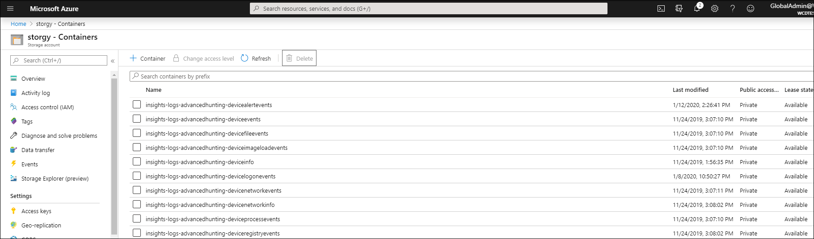

# <a name="configure-microsoft-365-defender-to-stream-advanced-hunting-events-to-your-storage-account"></a>고급 Microsoft 365 Defender 헌팅 이벤트를 사용자 계정으로 Storage 구성

[!INCLUDE [Microsoft 365 Defender rebranding](../../includes/microsoft-defender.md)]


**적용 대상:**
- [Microsoft 365 Defender](https://go.microsoft.com/fwlink/?linkid=2118804)

[!include[Prerelease information](../../includes/prerelease.md)]

## <a name="before-you-begin"></a>시작하기 전에

1. [테넌트에서 Storage 계정을](/azure/storage/common/storage-account-overview) 만들 수 있습니다.

2. [Azure](https://ms.portal.azure.com/)테넌트에 로그인하고, **Microsoft.>** 구독 > 리소스 공급자로 >.Insights.

## <a name="enable-raw-data-streaming"></a>원시 데이터 스트리밍 사용

1. * Microsoft 365 Defender 포털( )에 * 전역 관리자 _ 또는 _* 보안 <https://security.microsoft.com> 관리자 **로 _로그인합니다._

2. 스트리밍 **API 설정** \> **Microsoft 365 Defender** \> **로 이동 합니다.** 스트리밍 API 페이지로 직접 이동하기 위해 **를** <https://security.microsoft.com/settings/mtp_settings/raw_data_export> 사용하세요.

3. **추가** 를 클릭합니다.

4. 새 **스트리밍 API 설정** 추가 플라이아웃이 나타나면 다음 설정을 구성합니다.
   1. **이름:** 새 설정의 이름을 선택합니다.
   2. 에 **전달 이벤트를 Azure Storage.**
   3. 나타나는 **Storage 계정** 리소스 ID 상자에 Storage 계정 리소스 **ID 를 입력합니다.** 계정 **Storage ID를** 얻려면 에서 Azure Portal을 열고 Storage 계정이 속성 탭으로 이동하여 계정 리소스 ID의 Storage <https://portal.azure.com>  \> \> **복사합니다.**

      

   4. 새 스트리밍 **API 설정** 추가 플라이아웃으로 돌아가서 스트리밍할 이벤트 유형을 선택합니다. 

   작업을 마쳤으면 **제출** 을 클릭합니다.

## <a name="the-schema-of-the-events-in-the-storage-account"></a>이벤트 계정의 이벤트 Storage

- 각 이벤트 유형에 대해 Blob 컨테이너가 만들어집니다.

  

- Blob에 있는 각 행의 Schema는 다음과 같은 JSON입니다.

  ```JSON
  {
          "time": "<The time Microsoft 365 Defender received the event>"
          "tenantId": "<Your tenant ID>"
          "category": "<The Advanced Hunting table name with 'AdvancedHunting-' prefix>"
          "properties": { <Microsoft 365 Defender Advanced Hunting event as Json> }
  }
  ```

- 각 Blob에는 여러 행이 포함되어 있습니다.

- 각 행에는 이벤트 이름, Endpoint용 Defender가 이벤트를 수신한 시간, 해당 이벤트가 속한 테넌트(테넌트에서 이벤트만 수신) 및 JSON 형식의 이벤트가 "properties"라는 속성으로 포함되어 있습니다.

- 이벤트의 SCHEMA에 대한 자세한 내용은 Microsoft 365 Defender [헌팅 개요를 참조하세요.](../defender/advanced-hunting-overview.md)

## <a name="data-types-mapping"></a>데이터 형식 매핑

이벤트 속성에 대한 데이터 형식을 얻기 위해 다음을 합니다.

1. Microsoft 365 Defender 포털()에 <https://security.microsoft.com> 로그인하고 헌팅 고급 헌팅으로  \> **이동합니다.** 고급 헌팅 **페이지로** 직접 이동하기 위해 헌팅 <security.microsoft.com/advanced-hunting>.

2. 쿼리 **탭에서** 다음 쿼리를 실행하여 각 이벤트에 대한 데이터 형식 매핑을 구합니다.

   ```text
   {EventType}
   | getschema
   | project ColumnName, ColumnType
   ```

- 장치 정보 이벤트의 예는 다음과 같습니다.

  

## <a name="related-topics"></a>관련 항목

- [고급 헌팅 개요](../defender/advanced-hunting-overview.md)
- [Microsoft 365 Defender 스트리밍 API](streaming-api.md)
- [Azure Microsoft 365 Defender 이벤트 스트림](streaming-api-storage.md)
- [Azure Storage 계정 설명서](/azure/storage/common/storage-account-overview)
