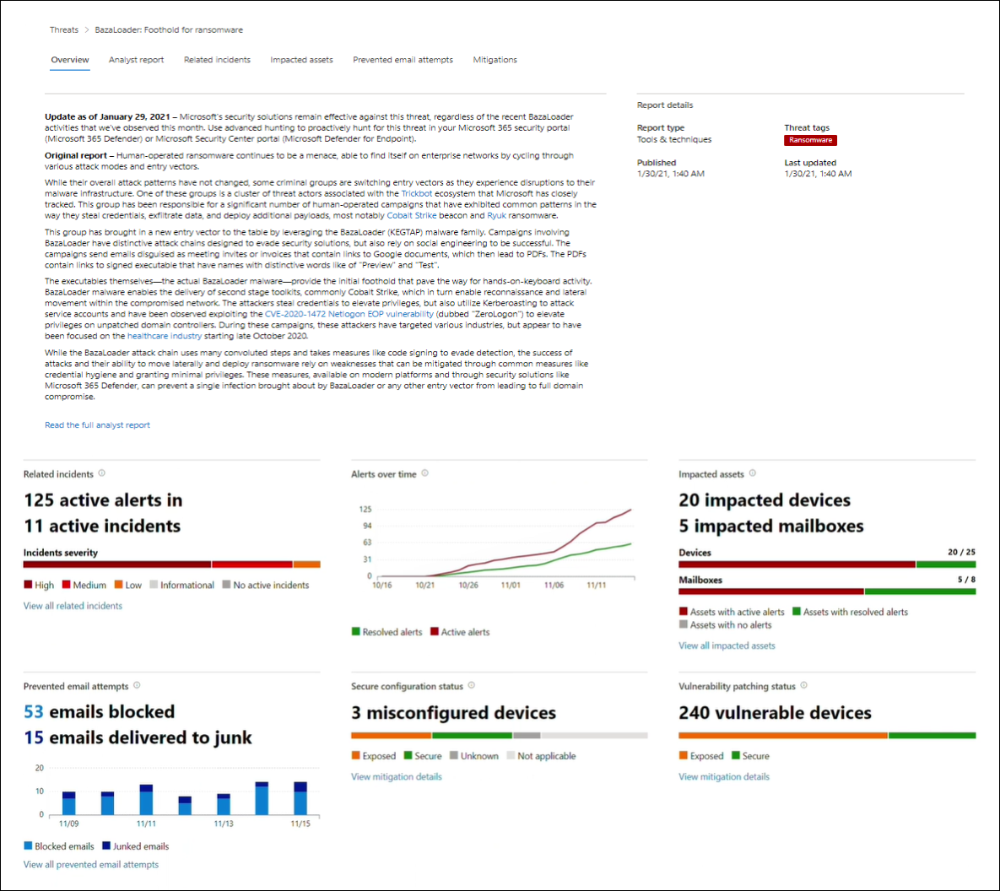
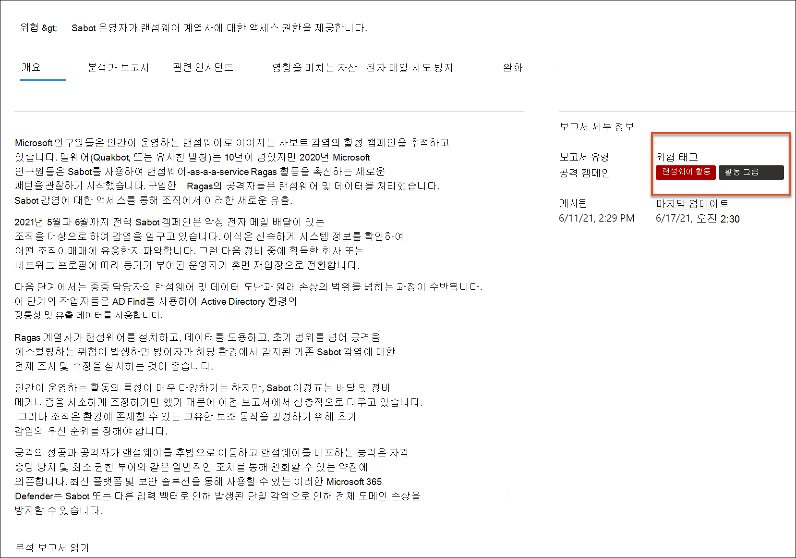
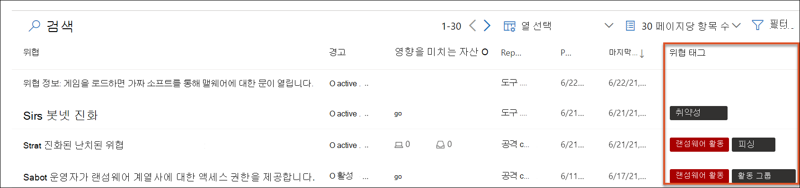
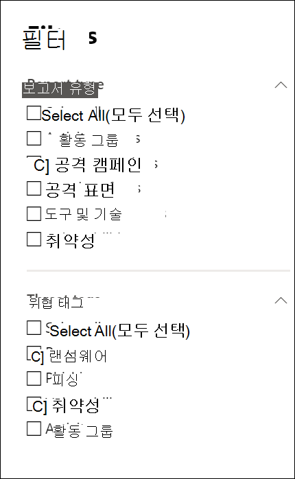
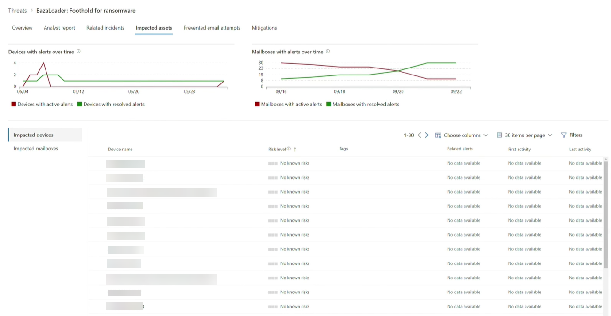

# 보안 위협 분석 Microsoft 365 Defender 

[!INCLUDE [Microsoft 365 Defender rebranding](../includes/microsoft-defender.md)]

**적용 대상:**
- Microsoft 365 Defender

> Microsoft 365 Defender를 경험하고 싶으신가요? [실험실 환경에서 평가](m365d-evaluation.md?ocid=cx-docs-MTPtriallab)하거나 [프로덕션에서 파일럿 프로젝트를 실행](m365d-pilot.md?ocid=cx-evalpilot)할 수 있습니다.
>

[!INCLUDE [Prerelease](../includes/prerelease.md)]

위협 분석은 전문 Microsoft 보안 연구원이 제공하는 제품 내 위협 인텔리전스 솔루션으로, 다음을 비롯한 새로운 위협에 직면할 때 보안 팀이 가능한 한 효율적으로 하도록 지원하도록 디자인된 제품 내 위협 인텔리전스 솔루션입니다.

- 활성 위협 요소 및 캠페인
- 인기 있는 새로운 공격 기술
- 중요한 취약성
- 일반적인 공격 표면
- 널리 사용되는 맬웨어

이 짧은 비디오를 시청하여 위협 분석을 통해 최신 위협을 추적하고 중지하는 방법에 대해 자세히 알아보십시오.

>[!VIDEO https://www.microsoft.com/en-us/videoplayer/embed/RWwJfU]

보안 포털의 탐색 모음 왼쪽 위 또는 Microsoft 365 가장 큰 위협을 표시하는 전용 대시보드 카드에서 위협 분석에 액세스할 수 있습니다. 활성 또는 지속적인 캠페인에 대한 가시성을 확보하고 위협 분석을 통해 무엇을 할지 알면 보안 운영 팀에 정보를 제공한 결정을 내리는 데 도움이 될 수 있습니다. 

_위협 분석에 액세스하는 위치_

더욱 정교한 공격자 및 새로운 위협이 자주 발생하고 자주 등장하는 경우 빠르게 다음을 할 수 있는 것이 중요합니다.

- 새로운 위협 식별 및 대응
- 현재 공격을 중인지 자세히 알아보기
- 자산에 대한 위협의 영향 평가
- 위협에 대한 또는 노출에 대한 탄력성 검토
- 위협을 중지하거나 포함하기 위해 취할 수 있는 완화, 복구 또는 방지 작업 식별

각 보고서는 추적된 위협에 대한 분석과 위협을 방어하는 방법에 대한 광범위한 지침을 제공합니다. 또한 네트워크의 데이터를 통합하여 위협이 활성 상태인지 여부와 적용 가능한 보호가 설정되어 있는지 여부를 나타 내보입니다.

## 위협 분석 대시보드 보기

위협 분석[대시보드(security.microsoft.com/threatanalytics3](https://security.microsoft.com/threatanalytics3))는 조직과 가장 관련이 있는 보고서를 강조합니다. 다음 섹션에서는 위협을 요약하여 설명합니다.

- **최신 위협**- 최근 게시되거나 업데이트된 위협 보고서와 활성 및 해결된 경고 수를 나열합니다.
- **영향력이 큰 위협**- 조직에 가장 큰 영향을 미치는 위협을 나열합니다. 이 섹션에서는 활성 및 해결된 경고가 가장 많은 위협을 먼저 나열합니다.
- **위협 요약**- 활성 및 해결된 경고와 함께 위협 수를 표시하여 추적된 모든 위협에 대한 전반적인 영향을 제공합니다.

대시보드에서 위협을 선택하여 해당 위협에 대한 보고서를 볼 수 있습니다.

_위협 분석 대시보드. 검색 아이콘을 클릭하여 읽은 위협 분석 보고서와 관련된 키워드의 키를 클릭할 수도 있습니다._ 

## 위협 분석 보고서 보기

각 위협 분석 보고서는 몇 가지 섹션에 정보를 제공합니다.

- [**개요**](#overview-quickly-understand-the-threat-assess-its-impact-and-review-defenses)
- [**분석가 보고서**](#analyst-report-get-expert-insight-from-microsoft-security-researchers)
- [**관련 인시던트**](#related-incidents-view-and-manage-related-incidents)
- [**영향을 미치는 자산**](#impacted-assets-get-list-of-impacted-devices-and-mailboxes)
- [**전자 메일 시도 방지**](#prevented-email-attempts-view-blocked-or-junked-threat-emails)
- [**완화**](#mitigations-review-list-of-mitigations-and-the-status-of-your-devices)

### 개요: 위협을 신속하게 이해하고, 영향을 평가하고, 방어를 검토합니다.

개요 **섹션에서는** 자세한 분석 보고서의 미리 보기를 제공합니다. 또한 잘못 구성 및 패치되지 않은 장치를 통해 조직에 위협이 미치는 영향과 노출을 강조하는 차트도 제공합니다.

_위협 분석 보고서의 개요 섹션_

#### 조직에 미치는 영향 평가

각 보고서에는 위협의 조직적 영향에 대한 정보를 제공하도록 디자인된 차트가 포함되어 있습니다.

- **관련 인시던트**- 다음 데이터를 사용하여 추적된 위협이 조직에 미치는 영향에 대한 개요를 제공합니다.
  - 활성 경고 수 및 활성 경고와 연관된 활성 인시던트 수
  - 활성 인시던트의 심각도
- **시간의 지난** 알림 - 시간의  지난 관련 **활성** 및 해결된 경고 수를 보여줍니다. 해결된 경고 수는 조직이 위협과 관련된 경고에 얼마나 빠르게 응답하는지 나타냅니다. 이상적으로는 며칠 내에 해결된 경고가 차트에 표시됩니다.
- **영향을 받는 자산**- 추적된 위협과 연관된 활성 경고가 하나 이상 있는 고유한 장치 및 전자 메일 계정(사서함)의 수를 보여줍니다. 위협 전자 메일을 받은 사서함에 대해 경고가 트리거됩니다. 위협 전자 메일 배달을 유발하는 재지정에 대한 org-and user-level policies for overrides를 검토합니다.
- **금지된 전자** 메일 시도 - 배달 전에 차단되거나 정크 메일 폴더로 배달된 지난 7일간의 전자 메일 수를 보여 주며,

#### 보안 탄력성 및 자세 검토

각 보고서에는 조직이 주어진 위협에 대해 얼마나 탄력적인지 간략하게 설명하는 차트가 포함되어 있습니다.

- **보안 구성 상태**- 잘못 구성된 보안 설정이 있는 장치 수를 보여줍니다. 권장 보안 설정을 적용하여 위협을 완화합니다. 추적된 **모든** 설정을 적용한 장치는 보안으로 간주됩니다. 
- **취약성 패치 상태**- 취약한 디바이스의 수를 보여줍니다. 보안 업데이트 또는 패치를 적용하여 위협에 악용된 취약점을 해결합니다.

#### 위협 태그당 보고서 보기

위협 보고서 목록을 필터링하고 특정 위협 태그(범주) 또는 보고서 유형에 따라 가장 관련성이 높은 보고서를 볼 수 있습니다.

- **위협 태그**- 특정 위협 범주에 따라 가장 관련성이 높은 보고서를 볼 수 있도록 합니다. 예를 들어 랜섬웨어와 관련된 모든 보고서입니다.
- **보고서 유형**- 특정 보고서 유형에 따라 가장 관련성이 높은 보고서를 볼 수 있도록 합니다. 예를 들어 도구 및 기술을 다루는 모든 보고서입니다. 
- **필터**- 위협 보고서 목록을 효율적으로 검토하고 특정 위협 태그 또는 보고서 유형을 기준으로 보기를 필터링하는 데 도움이 됩니다. 예를 들어 랜섬웨어 범주와 관련된 모든 위협 보고서 또는 취약점을 다루는 위협 보고서를 검토합니다.

##### 작동 방식

Microsoft 위협 인텔리전스 팀에서 각 위협 보고서에 위협 태그를 추가했습니다.

- 이제 4개의 위협 태그를 사용할 수 있습니다.
  - 랜섬웨어
  - 피싱
  - 취약성
  - 활동 그룹
- 위협 태그는 위협 분석 페이지의 맨 위에 표시하고 각 태그 아래에 사용 가능한 보고서 수에 대한 카운터를 제공합니다.

  

- 위협 태그를 사용하여 목록을 정렬할 수도 있습니다.

  

- 필터는 위협 태그 및 보고서 유형별로 사용할 수 있습니다.

  

### 분석가 보고서: Microsoft 보안 연구원으로부터 전문가 인사이트 얻기

분석가 **보고서 섹션에서** 자세한 전문가 쓰기를 읽어 읽습니다. 대부분의 보고서는 MITRE ATT&CK 프레임워크에 매핑된 전략 및 기술, 권장 사항의 전체 목록 및 강력한 위협 헌팅 지침을 포함하여 공격 체인에 대한 자세한 [설명을](advanced-hunting-overview.md) 제공합니다.

[분석 보고서에 대해 자세히 알아보시다](threat-analytics-analyst-reports.md)

### 관련 인시던트: 관련 인시던트 보기 및 관리

관련 **인시던트 탭은** 추적된 위협과 관련된 모든 인시던트 목록을 제공합니다. 인시던트를 할당하거나 각 인시던트에 연결된 알림을 관리할 수 있습니다. 

_위협 분석 보고서의 관련 인시던트 섹션_

### 영향을 받는 자산: 영향을 받는 장치 및 사서함 목록 확인

활성으로 해결되지 않은 활성 경고의 영향을 받는 자산은 영향을 받는 것으로 간주됩니다. 영향을 **미치는 자산 탭에는** 다음과 같은 유형의 영향을 미치는 자산이 나열됩니다.

- **영향을 미치는 장치**- 끝점 경고에 대한 Microsoft Defender를 해결하지 않은 끝점입니다. 이러한 경고는 일반적으로 알려진 위협 표시기 및 활동을 볼 때 발생됩니다.
- **영향을 받는 사서함**- 경고에 대해 Microsoft Defender를 트리거한 전자 메일 메시지를 받은 Office 365. 경고를 트리거하는 대부분의 메시지는 일반적으로 차단되는 반면, 사용자 수준 정책은 필터를 대체할 수 있습니다.

_위협 분석 보고서의 영향을 미치는 자산 섹션_

### 차단된 전자 메일 시도: 차단 또는 정크 메일 보기

Microsoft Defender for Office 365 악성 링크 또는 첨부 파일을 포함하여 알려진 위협 표시기가 있는 전자 메일을 차단합니다. 경우에 따라 의심스러운 콘텐츠를 검사하는 사전 필터링 메커니즘은 대신 위협 전자 메일을 정크 메일 폴더로 전송합니다. 두 경우 모두 위협으로 디바이스에서 맬웨어 코드를 시작하게 될 가능성이 줄어듭니다.

**금지된** 전자 메일 시도 탭에는 배달 전에 차단되거나 Microsoft Defender에서 정크 메일 폴더로 전송한 모든 전자 메일이 Office 365. 

_위협 분석 보고서의 전자 메일 시도 방지 섹션_

### 완화: 완화 목록 및 장치 상태 검토

완화 **섹션에서** 위협에 대한 조직 탄력을 강화하는 데 도움이 될 수 있는 실행 가능한 특정 권장 사항 목록을 검토합니다. 추적된 완화 목록은 다음과 같습니다.

- **보안 업데이트**- 온보드 장치에서 발견된 취약점에 대해 지원되는 소프트웨어 보안 업데이트 배포
- **지원되는 보안 구성**
  - 클라우드 제공 보호  
  - 잠재적으로 원치 않는 응용 프로그램(PUA) 보호
  - 실시간 보호

이 섹션의 완화 정보는 보고서의 다양한 링크에 위협 및 취약성 관리 자세한 드릴다운 정보도 제공하는 위협 및 취약성 관리 데이터를 통합합니다.

_위협 분석 보고서의 완화 섹션_

## 추가 보고서 세부 정보 및 제한 사항

> [!NOTE]
> 통합 보안 환경의 일부로, 위협 분석은 끝점용 Microsoft Defender 뿐만 아니라 Microsoft Defender for Office 사용할 수 있습니다.
>
> Microsoft 365 보안 포털(Microsoft 365 Defender)을 사용하지 않는 경우 Microsoft Defender 보안 센터 포털(끝점용 Microsoft Defender)에서 보고서 세부 정보(Office 데이터에 대한 Microsoft Defender 없이)를 볼 수 있습니다.

위협 분석 보고서에 액세스하려면 특정 역할 및 사용 권한이 필요합니다. 자세한 내용은 역할 기반 액세스 [제어의](custom-roles.md) 사용자 지정 Microsoft 365 Defender 참조합니다.

- 경고, 인시던트 또는 영향을 미치는 자산 데이터를 보기 위해 Microsoft Defender에 대한 사용 권한을 Office 또는 끝점 경고 데이터용 Microsoft Defender에 대한 사용 권한이 Office 또는 둘 다에 대한 권한이 필요합니다.
- 금지된 전자 메일 시도를 확인하려면 헌팅 데이터에 대한 Microsoft Defender에 Office 필요합니다. 
- 완화를 보기 위해 끝점용 Microsoft Defender에서 데이터를 위협 및 취약성 관리 권한이 필요합니다.

위협 분석 데이터를 보는 경우 다음 요인에 유의하세요.

- 차트에는 추적되는 완화만 반영됩니다. 보고서 개요에서 차트에 나와 있지 않은 추가 완화를 확인할 수 있습니다.
- 완화는 완전한 탄력을 보장하지 않습니다. 제공된 완화에는 탄력성을 개선하는 데 필요한 최상의 조치가 반영됩니다.
- 장치가 서비스로 데이터를 전송하지 않은 경우 장치는 "사용할 수 없음"으로 계산됩니다.
- 바이러스 백신 관련 통계는 설정에 Microsoft Defender 바이러스 백신 합니다. 타사 바이러스 백신 솔루션이 있는 장치는 "노출"으로 표시될 수 있습니다.

## 관련 항목

- [고급 헌팅을 통해 위협을 사전 대응적으로 찾기](advanced-hunting-overview.md) 
- [분석가 보고서 섹션 이해](threat-analytics-analyst-reports.md)
- [보안 약점 및 노출 평가 및 해결](/windows/security/threat-protection/microsoft-defender-atp/next-gen-threat-and-vuln-mgt)
