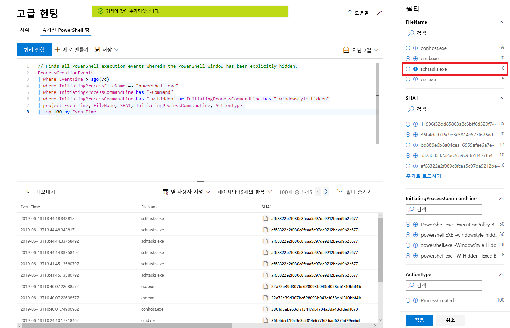

# Microsoft Threat Protection의 고급 헌팅을 통한 위협에 대한 사전 대응Proactively hunt for threats with advanced hunting in Microsoft Threat Protection

**적용 대상:****Applies to:**
- Microsoft 위협 방지Microsoft Threat Protection

[!INCLUDE [Prerelease information](../includes/prerelease.md)]

고급 헌팅은 최대 30일간의 원시 데이터를 탐색할 수 있는 쿼리 기반의 위협 헌팅 도구입니다.Advanced hunting is a query-based threat-hunting tool that lets you explore up to 30 days of raw data. 네트워크의 이벤트를 사전에 검사하여 흥미로운 지표와 엔티티를 찾을 수 있습니다.You can proactively inspect events in your network to locate interesting indicators and entities. 데이터에 대한 유연한 액세스는 알려진 위협과 잠재적 위협 모두에 대한 제한없는 헌팅을 용이하게 합니다.The flexible access to data facilitates unconstrained hunting for both known and potential threats.

Microsoft 365 보안 센터에서 고급 구하기는 전자 메일의 데이터를 제공 하 여 Microsoft Defender ATP, 등록 장치 및 Office 365 ATP의 데이터를 조회 하는 쿼리를 지원 합니다.In the Microsoft 365 security center, advanced hunting supports queries that look into data from both Microsoft Defender ATP, covering data from onboarded devices, and Office 365 ATP, providing data from emails. 고급 헌팅을 사용하려면 [Microsoft Threat Protection](mtp-enable.md)을 설정합니다.To use advanced hunting, [turn on Microsoft Threat Protection](mtp-enable.md).

## 고급 헌팅 시작Get started with advanced hunting

고급 헌팅을 빠르게 시작하고 실행하려면 몇가지 단계를 수행하는 것이 좋습니다.We recommend going through several steps to quickly get up and running with advanced hunting.

| 학습 목표Learning goal | 설명Description | 리소스Resource |
|--|--|--|
| **언어에 대한 느낌을 받아보세요.****Get a feel for the language** | 고급 헌팅은 [Kusto 쿼리 언어](https://docs.microsoft.com/azure/kusto/query/)을 기반으로 하며, 동일한 구문 및 연산자를 지원합니다.Advanced hunting is based on the [Kusto query language](https://docs.microsoft.com/azure/kusto/query/), supporting the same syntax and operators. 첫 번째 쿼리를 실행하여 쿼리 언어 학습을 시작합니다.Start learning the query language by running your first query. | [쿼리 언어 개요Query language overview](advanced-hunting-query-language.md) |
| **스키마의 이해****Understand the schema** | 스키마와 해당 열에 있는 테이블에 대한 이해를 높이세요.Get a good, high-level understanding of the tables in the schema and their columns. 이는 데이터를 찾을 위치와 쿼리를 구성하는 방법을 결정하는 데 도움이 됩니다.This will help you determine where to look for data and how to construct your queries. | [스키마 참조Schema reference](advanced-hunting-schema-tables.md) |
| **미리 정의된 쿼리 사용****Use predefined queries** | 다양한 위협 헌팅 시나리오를 다루는 미리 정의된 쿼리 모음을 탐색합니다.Explore collections of predefined queries covering different threat hunting scenarios. | [공유 쿼리 사용Use shared queries](advanced-hunting-shared-queries.md)
| **쿼리 최적화****Optimize queries** | 전자 메일 및 장치에서 데이터를 결합하는 효율적인 쿼리 및 쿼리를 만드는 방법에 대해 알아봅니다.Understand how to create efficient queries and queries that combine data from emails and devices. | [쿼리 모범 사례](advanced-hunting-shared-queries.md), [여러 장치 및 전자 메일에서 헌팅](advanced-hunting-best-practices.md)[Query best practices](advanced-hunting-shared-queries.md), [Hunt across devices and emails](advanced-hunting-best-practices.md)

## 쿼리 작성시 도움말 보기Get help as you write queries
다음 기능을 활용하여 쿼리를 더 빠르게 작성하세요.Take advantage of the following functionality to write queries faster:
- **자동 제안** — 쿼리를 작성할 때 고급 헌팅에서 제안을 제공합니다.**Autosuggest** — as you write queries, advanced hunting provides suggestions. 
- **스키마 참조** — 테이블 및 해당 열 목록이 포함된 스키마 참조가 작업 영역 옆에 제공됩니다.**Schema reference** — a schema reference that includes the list of tables and their columns is provided next to your working area. 자세한 내용을 보려면 항목 위로 마우스를 가져갑니다.For more information, hover over an item. 항목을 두 번 클릭하여 쿼리 편집기에 삽입합니다.Double-click an item to insert it to the query editor.

## 쿼리 결과에서 드릴 다운Drilldown from query results
쿼리 결과에서 컴퓨터, 파일, 사용자, IP 주소 및 URL과 같은 엔터티에 대한 자세한 정보를 보려면 엔터티 식별자를 클릭하기만 하면 됩니다.To view more information about entities, such as machines, files, users, IP addresses, and URLs, in your query results, simply click the entity identifier. 그러면 Microsoft Defender 보안 센터에서 선택한 엔터티에 대한 자세한 프로필 페이지가 열립니다.This opens a detailed profile page for the selected entity in Microsoft Defender Security Center.

## 결과에서 쿼리 조정Tweak your queries from the results
결과 집합의 값을 마우스 오른쪽 단추로 클릭하면 쿼리가 빠르게 향상됩니다.Right-click a value in the result set to quickly enhance your query. 옵션을 사용하여 다음을 수행할 수 있습니다.You can use the options to:

- 선택한 값을 명시적으로 찾습니다 (`==`)Explicitly look for the selected value (`==`)
- 쿼리에서 선택한 값을 제외합니다 (`!=`)Exclude the selected value from the query (`!=`)
- 쿼리에 값을 추가하는 고급 연산자를 사용합니다 (예: `contains`, `starts with` 및 `ends with`)Get more advanced operators for adding the value to your query, such as `contains`, `starts with` and `ends with` 

## 쿼리 결과 필터링Filter the query results
오른쪽에 표시되는 필터는 결과 집합에 대한 요약을 제공합니다.The filters displayed to the right provide a summary of the result set. 각 열에는 해당 열에 대해 발견된 고유 값과 인스턴스 수를 나열하는 자체적인 섹션이 있습니다.Each column has its own section that lists the distinct values found for that column and the number of instances.

포함하거나 제외하려는 값에서 "+" 또는 "-" 단추를 선택한 다음 **쿼리 실행**을 선택하여 쿼리를 구체화합니다.Refine your query by selecting the "+" or "-" buttons on the values that you want to include or exclude and then selecting **Run query**.

필터를 적용하여 쿼리를 수정한 다음 쿼리를 실행하면 그에 따라 결과가 업데이트됩니다.Once you apply the filter to modify the query and then run the query, the results are updated accordingly.

## 관련 항목Related topics
- [쿼리 언어 배우기Learn the query language](advanced-hunting-query-language.md)
- [공유 쿼리 사용Use shared queries](advanced-hunting-shared-queries.md)
- [여러 장치 및 전자 메일에서 위협을 탐지Hunt for threats across devices and emails](advanced-hunting-query-emails-devices.md)
- [스키마의 이해Understand the schema](advanced-hunting-schema-tables.md)
- [쿼리 모범 사례 적용Apply query best practices](advanced-hunting-best-practices.md)