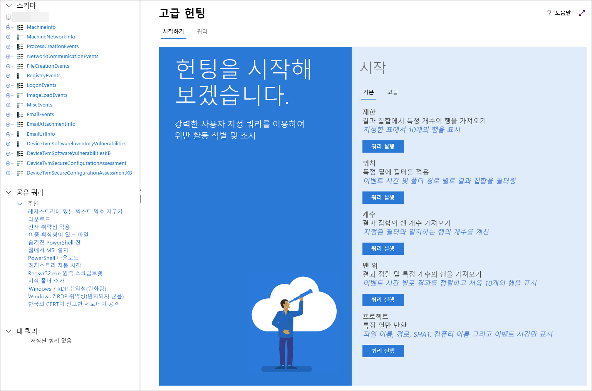

# <a name="learn-the-advanced-hunting-query-language"></a>고급 헌팅 쿼리 언어 알아보기

**적용 대상:**
- Microsoft Threat Protection

[!INCLUDE [Prerelease information](../includes/prerelease.md)]

고급 헌팅은 [Kusto 쿼리 언어](https://docs.microsoft.com/azure/kusto/query/)를 기반으로 합니다. Kusto 구문 및 연산자를 사용하여 고급 헌팅을 위해 특별히 구성된 [스키마](advanced-hunting-schema-tables.md)에서 정보를 찾는 쿼리를 만들 수 있습니다. 이러한 개념을 보다 잘 이해하려면 첫 번째 쿼리를 실행합니다.

## <a name="try-your-first-query"></a>첫 번째 쿼리 시도하기

Microsoft 365 보안 센터에서 **헌팅**으로 이동하여 첫 번째 쿼리를 실행합니다. 다음 예제를 사용합니다.

```
// Finds PowerShell execution events that could involve a download.
DeviceProcessEvents 
| where Timestamp > ago(7d)
| where FileName in ("powershell.exe", "POWERSHELL.EXE", "powershell_ise.exe", "POWERSHELL_ISE.EXE") 
| where ProcessCommandLine has "Net.WebClient"
        or ProcessCommandLine has "DownloadFile"
        or ProcessCommandLine has "Invoke-WebRequest"
        or ProcessCommandLine has "Invoke-Shellcode"
        or ProcessCommandLine contains "http:"
| project Timestamp, DeviceName, InitiatingProcessFileName, FileName, ProcessCommandLine
| top 100 by Timestamp
```

이는 고급 헌팅에서 표시되는 모습입니다.


쿼리는 내용을 설명하는 짧은 메모로 시작합니다. 이렇게 하면 나중에 쿼리를 저장하여 조직의 다른 사용자와 공유하도록 결정한 경우에 도움이 됩니다.

```
// Finds PowerShell execution events that could involve a download.
DeviceProcessEvents
```

일반적으로 쿼리 자체는 표 이름으로 시작하고 다음으로 파이프(`|`)로 시작되는 일련의 요소가 옵니다. 이 예제에서는 표 이름 `DeviceProcessEvents`로 추가하고, 필요에 따라 파이프된 요소를 추가하는 것으로 시작합니다.

첫 번째 파이프된 요소는 이전 7일 이내에 범위가 지정된 시간 필터입니다. 시간 범위를 가능한 한 좁게 유지하면 쿼리가 제대로 수행되고 관리 가능한 결과를 반환하며 시간 초과되지 않습니다.

```
| where Timestamp > ago(7d)
```

시간 범위 바로 다음으로 PowerShell 응용 프로그램을 나타내는 파일을 검색합니다.

```
| where FileName in ("powershell.exe", "POWERSHELL.EXE", "powershell_ise.exe", "POWERSHELL_ISE.EXE")
```

그런 다음 쿼리는 PowerShell과 함께 일반적으로 파일을 다운로드하는 데 사용되는 명령줄을 검색합니다.

```
| where ProcessCommandLine has "Net.WebClient"
        or ProcessCommandLine has "DownloadFile"
        or ProcessCommandLine has "Invoke-WebRequest"
        or ProcessCommandLine has "Invoke-Shellcode"
        or ProcessCommandLine contains "http:"
```

쿼리에서 찾으려고 하는 데이터를 명확하게 식별하므로 결과 모양을 정의하는 요소를 추가할 수 있습니다. `project`은(는) 특정 열을 반환하고 `top`은(는) 결과 수를 제한하여 결과를 잘 서식화하고 상당히 크고 쉽게 처리할 수 있도록 합니다.

```
| project Timestamp, DeviceName, InitiatingProcessFileName, FileName, ProcessCommandLine
| top 100 by Timestamp'
```

**쿼리 실행**을 클릭하여 결과를 확인합니다. 헌팅 쿼리와 결과에 집중할 수 있도록 화면 보기를 확장할 수 있습니다.

## <a name="learn-common-query-operators-for-advanced-hunting"></a>고급 헌팅에 대한 일반적인 쿼리 연산자 살펴보기

첫 번째 쿼리를 실행하고 해당 구성 요소에 대한 일반적인 아이디어를 얻었으므로 약간 되돌아가서 몇 가지 기본 사항을 배울 차례입니다. 고급 헌팅에서 사용하는 Kusto 쿼리 언어는 다음을 포함하여 다양한 연산자를 지원합니다.

| 연산자 | 설명 및 사용법 |
|--|--|
| `where` | 조건자를 충족하는 행의 하위 집합으로 표를 필터링합니다. |
| `summarize` | 입력 표의 내용을 집계하는 표를 생성합니다. |
| `join` | 각 표에서 지정된 열의 값을 일치시켜 새 표를 구성하는 두 테이블의 행을 병합합니다. |
| `count` | 입력 레코드 집합의 레코드 수를 반환합니다. |
| `top` | 지정된 열을 기준으로 정렬된 처음 N개의 레코드를 반환합니다. |
| `limit` | 지정된 수의 행까지 반환합니다. |
| `project` | 포함할 열을 선택하고 이름을 바꾸거나 삭제하고 새 계산된 열을 삽입합니다. |
| `extend` | 계산된 열을 만들고 결과 집합에 추가합니다. |
| `makeset` |  Expr이 그룹에서 사용하는 고유한 값 집합의 동적(JSON) 배열을 반환합니다. |
| `find` | 표 집합에서 조건자와 일치하는 행을 찾습니다. |

이러한 연산자의 실제 예제를 보려면 고급 헌팅의 **시작** 섹션에서 해당 연산자를 실행합니다.

## <a name="understand-data-types-and-their-query-syntax-implications"></a>데이터 형식 및 해당 쿼리 구문의 영향 이해

고급 헌팅 표에서 데이터는 일반적으로 다음과 같은 데이터 형식으로 분류됩니다.

| 데이터 형식 | 설명 및 쿼리 의미 |
|--|--|
| `datetime` | 일반적으로 이벤트 타임 스탬프를 나타내는 데이터 및 시간 정보 |
| `string` | 문자열 |
| `bool` | True 또는 False |
| `int` | 32비트 숫자 값  |
| `long` | 64비트 숫자 값 |

## <a name="use-sample-queries"></a>샘플 쿼리 사용

**시작** 섹션에서는 자주 사용하는 연산자를 사용하는 몇 가지 간단한 쿼리를 제공합니다. 이러한 쿼리를 실행하고 약간 수정해 보세요.



>[!NOTE]
>기본 쿼리 샘플과는 별도로 특정 위협 헌팅 시나리오에 대한 [공유 쿼리](advanced-hunting-shared-queries.md)에 액세스할 수도 있습니다. 페이지의 왼쪽에 있는 공유 쿼리 또는 GitHub 쿼리 리포지토리를 탐색합니다.

## <a name="access-query-language-documentation"></a>쿼리 언어 설명서에 액세스

Kusto 쿼리 언어와 지원되는 연산자에 대한 자세한 내용은 [Kusto 쿼리 언어 설명서](https://docs.microsoft.com/azure/kusto/query/)를 참조하세요.

## <a name="related-topics"></a>관련 항목
- [사전 대응식 위협 탐지](advanced-hunting-overview.md)
- [공유 쿼리 사용](advanced-hunting-shared-queries.md)
- [여러 장치 및 전자 메일에서 위협을 탐지](advanced-hunting-query-emails-devices.md)
- [스키마의 이해](advanced-hunting-schema-tables.md)
- [쿼리 모범 사례 적용](advanced-hunting-best-practices.md)