# 평가판 랩 환경용 Microsoft Threat Protection 핵심 요소로 구성Configure Microsoft Threat Protection pillars for your trial lab environment

**적용 대상:****Applies to:**
- Microsoft 위협 방지Microsoft Threat Protection

Microsoft Threat Protection 평가판 랩 환경을 만들고 배포 하는 과정은 다음 세 단계로 진행 됩니다.Creating a Microsoft Threat Protection trial lab environment and deploying it is a three-phase process:

 
<table border="0" width="100%" align="center">
  <tr style="text-align:center;">
    <td align="center" style="width:25%; border:0;" >
      <a href= "https://docs.microsoft.com/microsoft-365/security/mtp/prepare-mtpeval?view=o365-worldwide"> 
        
       1 단계: 준비</a>Phase 1: Prepare </a> 
    </td>
     <td align="center">
      <a href="https://docs.microsoft.com/microsoft-365/security/mtp/setup-mtpeval?view=o365-worldwide">
        
       2 단계: 설치</a>Phase 2: Setup </a> 
    </td>
    <td align="center" bgcolor="#d5f5e3">
      <a href="https://docs.microsoft.com/microsoft-365/security/mtp/config-mtpeval?view=o365-worldwide">
        
       3 단계: 온보드 & 구성</a>Phase 3: Configure & Onboard </a> 
</td>

  </tr>
</table>

현재 구성 단계입니다.You are currently in the configuration phase.

준비는 성공적인 배포의 핵심입니다.Preparation is key to any successful deployment. 이 문서에서는 Microsoft Defender ATP 배포를 준비할 때 고려해 야 할 사항을 안내 합니다.In this article, you'll be guided on the points you'll need to consider as you prepare to deploy Microsoft Defender ATP.

## Microsoft Threat Protection 핵심 요소로Microsoft Threat Protection pillars
Microsoft Threat Protection은 핵심 요소로 4 개로 구성 됩니다.Microsoft Threat Protection consists of four pillars. 한 번에 네트워크 조직의 보안에 대 한 가치를 제공할 수 있지만 Microsoft Threat Protection 핵심 요소로 4 개를 사용 하도록 설정 하면 조직에 가장 많은 값이 제공 됩니다.Although one pillar can already provide value to your network organization's security, enabling the four Microsoft Threat Protection pillars will give your organization the most value.

![사용자, Azure Advanced threat protection, 끝점에 대 한 위협 보호 솔루션, Microsoft Defender Advanced Threat Protection, 클라우드 앱, Microsoft Cloud App Security 및 data의 경우 Office 365 Advanced Threat Protection of_MicrosoftImage of_Microsoft Threat Protection solution for users, Azure Advanced Threat Protection, for endpoints Microsoft Defender Advanced Threat Protection, for cloud apps, Microsoft Cloud App Security, and for data, Office 365 Advanced Threat Protection  ](../../media/mtp-eval-31.png)  

이 섹션에서는 다음을 구성할 수 있도록 안내 합니다.This section will guide you to configure:
-   Office 365 Advanced Threat ProtectionOffice 365 Advanced Threat Protection
-   Azure Advanced Threat ProtectionAzure Advanced Threat Protection 
-   Microsoft Cloud App SecurityMicrosoft Cloud App Security
-   Microsoft Defender Advanced Threat ProtectionMicrosoft Defender Advanced Threat Protection

## Office 365 Advanced Threat Protection 구성Configure Office 365 Advanced Threat Protection
>[!NOTE]
>이미 Office 365 Advanced Threat Protection을 사용 하도록 설정한 경우에는이 단계를 건너뜁니다.Skip this step if you have already enabled Office 365 Advanced Threat Protection. 

이러한 설정 중 일부를 결정 하는 데 도움이 되는 *Office 365 Advanced Threat Protection 권장 구성 분석기 (ORCA)* 라는 PowerShell 모듈이 있습니다.There is a PowerShell Module called the *Office 365 Advanced Threat Protection Recommended Configuration Analyzer (ORCA)* that helps determine some of these settings. ORCAReport에서 관리자 권한으로 실행 하는 경우, get-스팸 방지, 피싱 및 기타 메시지 바이러스 백신 설정을 평가 하는 데 도움이 됩니다.When run as an administrator in your tenant, get-ORCAReport will help generate an assessment of the anti-spam, anti-phish, and other message hygiene settings. 이 모듈은에서 다운로드할 수 있습니다 https://www.powershellgallery.com/packages/ORCA/ .You can download this module from https://www.powershellgallery.com/packages/ORCA/. 

1. [Office 365 보안 & 준수 센터](https://protection.office.com/homepage)  >  **위협 관리**  >  **정책**으로 이동 합니다.Navigate to [Office 365 Security & Compliance Center](https://protection.office.com/homepage) > **Threat management** > **Policy**.
  
 
2. **ATP 피싱 방지**를 클릭 하 고 정책 이름과 설명을 **작성** 하 여 채웁니다 .를 선택 합니다.Click **ATP anti-phishing**, select **Create** and fill in the policy name and description. **다음**을 클릭합니다.Click **Next**.
  

>[!NOTE]
>고급 ATP 피싱 방지 정책을 편집 합니다.Edit your Advanced ATP anti-phishing policy. **Advanced 피싱 임계값** 을 **2-적극적**으로 변경 합니다.Change **Advanced Phishing Threshold** to **2 - Aggressive**.
 

3. **조건 추가** 드롭다운 메뉴를 클릭 하 고 도메인을 받는 사람 도메인으로 선택 합니다.Click the **Add a condition** drop-down menu and select your domain(s) as recipient domain. **다음**을 클릭합니다.Click **Next**.
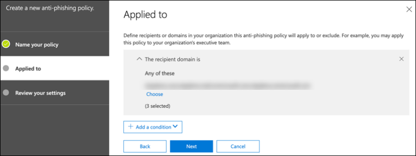  
 
4. 설정을 검토 합니다.Review your settings. **이 정책 만들기** 를 클릭 하 여 확인 합니다.Click **Create this policy** to confirm. 
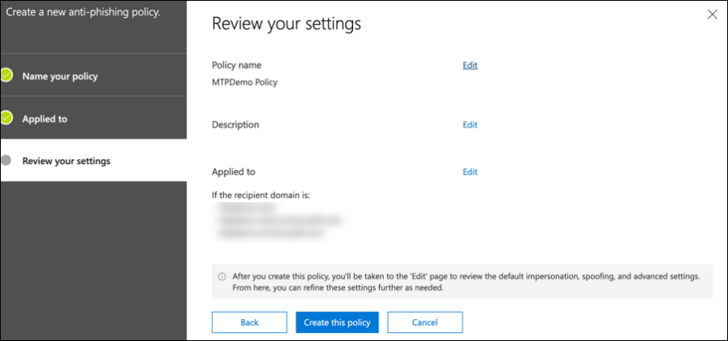  
 
5. **Atp 안전한 첨부 파일** 을 선택 하 고 **SharePoint, OneDrive 및 Microsoft 팀에 게 atp 설정** 옵션을 선택 합니다.Select **ATP Safe attachments** and select the **Turn on ATP for SharePoint, OneDrive, and Microsoft Teams** option.  
  

6. + 아이콘을 클릭 하 여 새 안전한 첨부 파일 정책을 만들려면 도메인에 받는 사람 도메인으로 적용 합니다.Click the + icon to create a new safe attachment policy, apply it as recipient domain to your domains. **저장**을 클릭합니다.Click **Save**.
  
 
7. 다음으로 **ATP 안전한 링크** 정책을 선택 하 고 연필 아이콘을 클릭 하 여 기본 정책을 편집 합니다.Next, select the **ATP Safe Links** policy, then click the pencil icon to edit the default policy.

8. **사용자가 안전 링크를 클릭 하면 추적 안 함** 옵션이 선택 되어 있지 않은 동안 나머지 옵션이 선택 되어 있는지 확인 합니다.Make sure that the **Do not track when users click safe links** option is not selected, while the rest of the options are selected. 자세한 내용은 [안전한 링크 설정을](https://docs.microsoft.com/microsoft-365/security/office-365-security/recommended-settings-for-eop-and-office365-atp?view=o365-worldwide) 참조 하십시오.See [Safe Links settings](https://docs.microsoft.com/microsoft-365/security/office-365-security/recommended-settings-for-eop-and-office365-atp?view=o365-worldwide) for details. **저장**을 클릭합니다.Click **Save**. 
  

9. 다음으로, **맬웨어 방지** 정책을 선택 하 고 기본값을 선택한 다음 연필 아이콘을 선택 합니다.Next select the **Anti-malware** policy, select the default, and choose the pencil icon.

10. **설정을** 클릭 하 고 **예를 선택 하 고 기본 알림 텍스트를 사용** 하 여 **맬웨어 검색 응답**을 사용 하도록 설정 합니다.Click **Settings** and select **Yes and use the default notification text** to enable **Malware Detection Response**. **일반 첨부 파일 형식 필터** 를 설정 합니다.Turn the **Common Attachment Types Filter** on. **저장**을 클릭합니다.Click **Save**.
   
  
11. [Office 365 Security & 준수 센터](https://protection.office.com/homepage)  >  **검색**  >  **감사 로그 검색** 및 감사 설정으로 이동 합니다.Navigate to [Office 365 Security & Compliance Center](https://protection.office.com/homepage) > **Search** > **Audit log search** and turn Auditing on.  
  

12. Office 365 ATP와 Microsoft Defender ATP를 통합 합니다.Integrate Office 365 ATP with Microsoft Defender ATP. [Office 365 Security & 준수 센터](https://protection.office.com/homepage)  >  **Threat management**  >  **Explorer** 로 이동 하 여 화면의 오른쪽 위 모서리에 있는 **wdatp 설정을** 선택 합니다.Navigate to [Office 365 Security & Compliance Center](https://protection.office.com/homepage) > **Threat management** > **Explorer** and select **WDATP Settings** on the upper right corner of the screen. Microsoft Defender ATP 연결 대화 상자에서 **WINDOWS ATP에 연결**을 설정 합니다.In the Microsoft Defender ATP connection dialog box, turn on **Connect to Windows ATP**.
  

## Azure Advanced Threat Protection 구성Configure Azure Advanced Threat Protection
>[!NOTE]
>Azure Advanced Threat Protection을 이미 사용 하도록 설정한 경우에는이 단계를 건너뜁니다.Skip this step if you have already enabled Azure Advanced Threat Protection

1. [Microsoft 365 보안 센터로](https://security.microsoft.com/info) 이동 하 > **기타 리소스**  >  **Azure Advanced Threat Protection**를 선택 합니다.Navigate to [Microsoft 365 Security Center](https://security.microsoft.com/info) > select **More Resources** > **Azure Advanced Threat Protection**.
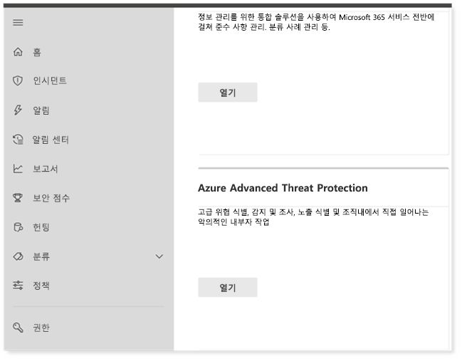  

2. **만들기** 를 클릭 하 여 Azure Advanced Threat Protection 마법사를 시작 합니다.Click **Create** to start the Azure Advanced Threat Protection wizard. 
 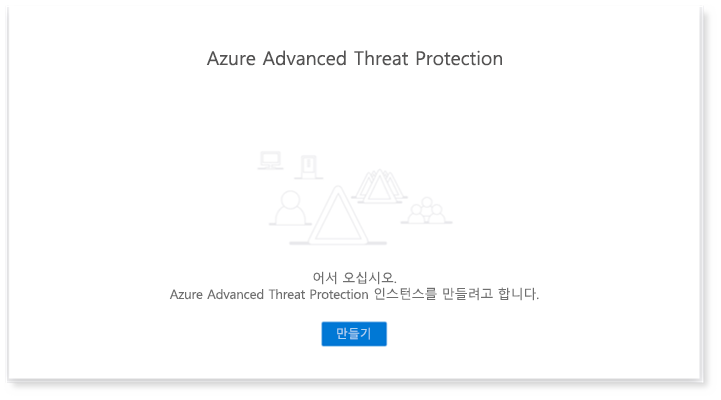  

3. **Active Directory 포리스트에 연결 하려면 사용자 이름 및 암호 입력**을 선택 합니다.Choose **Provide a username and password to connect to your Active Directory forest**.  
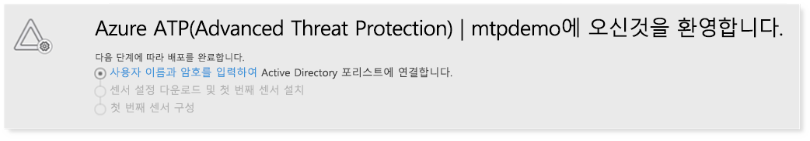  

4. Active Directory 온-프레미스 자격 증명을 입력 합니다.Enter your Active Directory on-premises credentials. 이 계정에는 Active Directory에 대 한 읽기 액세스 권한이 있는 모든 사용자 계정이 있을 수 있습니다.This can be any user account that has read access to Active Directory.
  

5. 그런 다음 **센서 설정 다운로드** 및 도메인 컨트롤러로 파일 전송을 선택 합니다.Next, choose **Download Sensor Setup** and transfer file to your domain controller. 
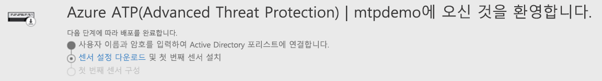  

6. Azure ATP 센서 설정을 실행 하 고 마법사 팔 로우를 시작 합니다.Execute the Azure ATP Sensor Setup and begin following the wizard.
 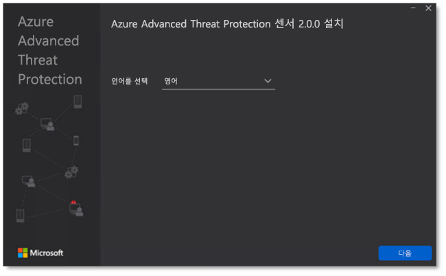  
 
7. 센서 배포 유형에서 **다음** 을 클릭 합니다.Click **Next** at the sensor deployment type.
 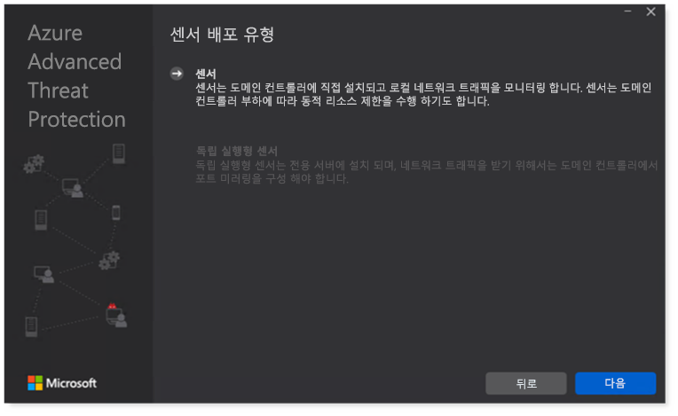  
 
8. 마법사의 다음에 입력 하는 데 필요한 대로 액세스 키를 복사 합니다.Copy the access key as you will need to enter it next in the Wizard.
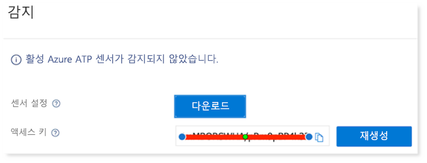  
 
9. Access 키를 마법사에 복사 하 고 **설치**를 클릭 합니다.Copy the access key into the Wizard and click **Install**. 
 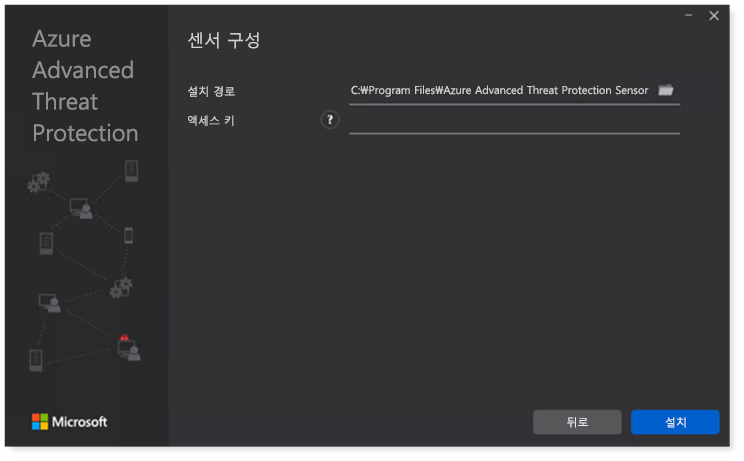  

10. 축 하 합니다. 도메인 컨트롤러에서 Azure Advanced Threat Protection을 구성 했습니다.Congratulations, you have successfully configured Azure Advanced Threat Protection on your domain controller.
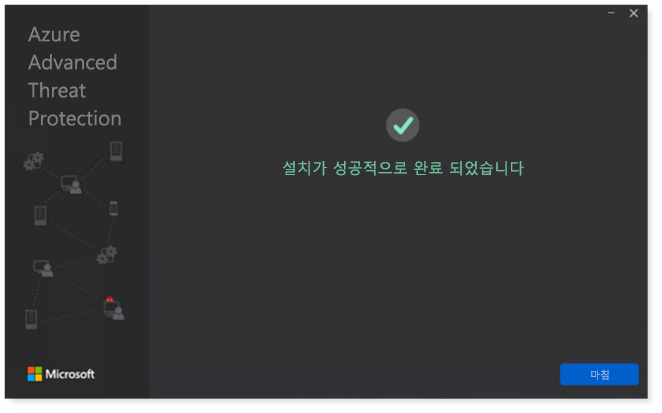  
 
11. [Azure AZURE atp](https://go.microsoft.com/fwlink/?linkid=2040449) 설정 섹션에서 **Windows Defender atp**를 선택한 다음 전환 켜기를 선택 합니다.Under the [Azure Azure ATP](https://go.microsoft.com/fwlink/?linkid=2040449) settings section, select **Windows Defender ATP**, then turn the toggle on. **저장**을 클릭합니다.Click **Save**. 
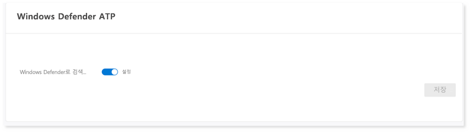  

>[!NOTE]
>Windows Defender ATP가 Microsoft Defender ATP와 다시 브랜드 되었습니다.Windows Defender ATP has been rebranded as Microsoft Defender ATP. 모든 포털에서 다시 브랜딩 변경을 수행 하는 것은 일관성을 위해 롤업 되 고 있습니다.Rebranding changes across all of our portals are being rolled out the for consistency.

## Microsoft Cloud App Security 구성Configure Microsoft Cloud App Security
>[!NOTE]
>Microsoft Cloud App Security를 이미 사용 하도록 설정한 경우에는이 단계를 건너뜁니다.Skip this step if you have already enabled Microsoft Cloud App Security. 

1. [Microsoft 365 보안 센터로](https://security.microsoft.com/info)이동  >  **More Resources**  >  **microsoft Cloud App security**.Navigate to [Microsoft 365 Security Center](https://security.microsoft.com/info) > **More Resources** > **Microsoft Cloud App Security**.
  

2. Azure ATP를 통합 하는 정보 프롬프트에서 **AZURE atp 데이터 통합 사용**을 선택 합니다.At the information prompt to integrate Azure ATP, select **Enable Azure ATP data integration**. 
   

>[!NOTE]
>이 메시지가 표시 되지 않으면 Azure ATP 데이터 통합이 이미 사용 하도록 설정 되었음을 의미할 수 있습니다.If you don’t see this prompt, it might mean that your Azure ATP data integration has already been enabled. 그러나 확실히 모르는 경우 IT 관리자에 게 문의 하 여 확인 합니다.However, if you are not sure, contact your IT Administrator to confirm. 

3. **설정**으로 이동 하 여 **Azure ATP 통합** 설정/해제를 켠 다음 **저장**을 클릭 합니다.Go to **Settings**, turn the **Azure ATP integration** toggle on, then click **Save**. 
  
>[!NOTE]
>새 Azure ATP 인스턴스의 경우이 통합 토글이 자동으로 설정 됩니다.For new Azure ATP instances, this integration toggle is automatically turned on. 다음 단계를 진행 하기 전에 Azure ATP 통합을 사용 하도록 설정 했는지 확인 합니다.Confirm that your Azure ATP integration has been enabled before you proceed to the next step.
 
4. 클라우드 검색 설정 아래에서 **Microsoft DEFENDER ATP 통합**을 선택한 다음 통합을 사용 하도록 설정 합니다.Under the Cloud discovery settings, select **Microsoft Defender ATP integration**, then enable the integration. **저장**을 클릭합니다.Click **Save**.
Click save.](../../media/mtp-eval-56.png)  

5. 클라우드 검색 설정에서 **사용자 향상**을 선택한 다음 Azure Active Directory와의 통합을 사용 하도록 설정 합니다.Under Cloud discovery settings, select **User enrichment**, then enable the integration with Azure Active Directory.
  

## Microsoft Defender Advanced Threat Protection 구성Configure Microsoft Defender Advanced Threat Protection
>[!NOTE]
>Microsoft Defender Advanced Threat Protection을 이미 사용 하도록 설정한 경우에는이 단계를 건너뜁니다.Skip this step if you have already enabled Microsoft Defender Advanced Threat Protection.

1. [Microsoft 365 보안 센터](https://security.microsoft.com/info)  >  **More Resources**  >  **microsoft Defender 보안 센터**리소스로 이동 합니다.Navigate to [Microsoft 365 Security Center](https://security.microsoft.com/info) > **More Resources** > **Microsoft Defender Security Center**. **열기**를 클릭합니다. Click **Open**.
   
 
2. Microsoft Defender Advanced Threat Protection 마법사를 따릅니다.Follow the Microsoft Defender Advanced Threat Protection wizard. **다음**을 클릭합니다.Click **Next**. 
   

3. 기본 설정 데이터 저장소 위치, 데이터 보존 정책, 조직 크기 및 미리 보기 기능의 옵트인에 따라를 선택 합니다.Choose based on your preferred data storage location, data retention policy, organization size, and opt-in for preview features. 
 Click next when you're done selecting.](../../media/mtp-eval-60.png)  
>[!NOTE]
>나중에 데이터 저장 위치와 같은 일부 설정은 변경할 수 없습니다.You cannot change some of the settings, like data storage location, afterwards. 
 

**다음**을 클릭합니다.Click **Next**. 

4. **계속** 을 클릭 하 고 MICROSOFT Defender ATP 테 넌 트를 프로 비전 합니다.Click **Continue** and it will provision your Microsoft Defender ATP tenant.
   

5. 그룹 정책, Microsoft Endpoint Manager 또는 Microsoft Defender ATP에 대 한 로컬 스크립트를 실행 하 여 끝점을 온보드 했습니다.Onboard your endpoints through Group Policies, Microsoft Endpoint Manager or by running a local script to Microsoft Defender ATP. 편의상이 가이드에서는 로컬 스크립트를 사용 합니다.For simplicity, this guide uses the local script.

6. **패키지 다운로드** 를 클릭 하 고 사용자의 끝점에 온 보 딩 스크립트를 복사 합니다.Click **Download package** and copy the onboarding script to your endpoint(s).  
   

7. 끝점에서 온 보 딩 스크립트를 관리자로 실행 하 고 Y를 선택 합니다.On your endpoint, run the onboarding script as Administrator and choose Y.
   

8. 축 하 합니다, 첫 번째 끝점을 등록 했습니다.Congratulations, you have onboarded your first endpoint.  
   

9. Microsoft Defender ATP 마법사의 검색 테스트를 복사 하 여 붙여 넣습니다.Copy-paste the detection test from the Microsoft Defender ATP wizard.
   

10. 관리자 권한 명령 프롬프트에 PowerShell 스크립트를 복사 하 고 실행 합니다.Copy the PowerShell script to an elevated command prompt and run it. 
   

11. 마법사에서 **Microsoft DEFENDER ATP 사용 시작** 을 선택 합니다.Select **Start using Microsoft Defender ATP** from the Wizard.
   
 
12. [Microsoft Defender 보안 센터](https://securitycenter.windows.com/)를 방문 합니다.Visit the [Microsoft Defender Security Center](https://securitycenter.windows.com/). **설정** 으로 이동한 후 **고급 기능**을 선택 합니다.Go to **Settings** and then select **Advanced features**. 
   

13. **Azure Advanced Threat Protection**과의 통합을 사용 하도록 설정 합니다.Turn on the integration with **Azure Advanced Threat Protection**.  
   

14. **Office 365 위협 인텔리전스**와의 통합을 설정 합니다.Turn on the integration with **Office 365 Threat Intelligence**.
   

15. **Microsoft Cloud App Security**와의 통합을 설정 합니다.Turn on integration with **Microsoft Cloud App Security**.
   

16. 아래로 스크롤한 후 **기본 설정 저장** 을 클릭 하 여 새 통합을 확인 합니다.Scroll down and click **Save preferences** to confirm the new integrations.
   

## Microsoft Threat Protection 사용 설정Turn on Microsoft Threat Protection
>[!NOTE]
>2020 년 6 월 1 일부 부터는 Microsoft에서 모든 적격 테 넌 트에 대해 Microsoft Threat Protection 기능을 자동으로 사용 하도록 설정 합니다.Starting June 1, 2020, Microsoft automatically enables Microsoft Threat Protection features for all eligible tenants. 자세한 내용은 [라이선스 자격에 대 한 Microsoft 기술 커뮤니티 문서를](https://techcommunity.microsoft.com/t5/security-privacy-and-compliance/microsoft-threat-protection-will-automatically-turn-on-for/ba-p/1345426) 참조 하세요.See this [Microsoft Tech Community article on license eligibility](https://techcommunity.microsoft.com/t5/security-privacy-and-compliance/microsoft-threat-protection-will-automatically-turn-on-for/ba-p/1345426) for details. 
 
1. [Microsoft 365 보안 센터로](https://security.microsoft.com/homepage)이동 합니다.Go to [Microsoft 365 Security Center](https://security.microsoft.com/homepage). **설정** 으로 이동한 후 **Microsoft Threat Protection**을 선택 합니다.Navigate to **Settings** and then select **Microsoft Threat Protection**.
   

2. **Microsoft Threat Protection 설정** 확인란을 선택 하 고 **저장**을 클릭 합니다.Select the **Turn on Microsoft Threat Protection** checkbox, then click **Save**.
   

축하합니다!Congratulations! Microsoft Threat Protection 평가판 테스트 환경을 방금 만들었습니다.You've just created your Microsoft Threat Protection trial lab environment! 이제 공격을 시뮬레이트하고 외적 기능에서 검색 하는 방법을 확인 하 고, 알림을 생성 하 고, 끝점에서 fileless 공격에 자동으로 응답할 수 있습니다.You can now simulate an attack and see how the cross product capabilities detect, create alerts, and automatically respond to a fileless attack on an endpoint.

## 다음 단계Next steps
[테스트 경고를 생성](generate-test-alert.md)합니다.[Generate a test alert](generate-test-alert.md).
