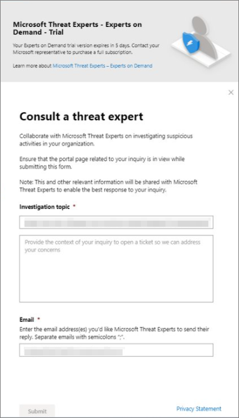

# 다음을 통해 Microsoft 위협 전문가 기능을 구성하고 Microsoft 365 Defender

[!INCLUDE [Microsoft 365 Defender rebranding](../includes/microsoft-defender.md)]

**적용 대상:**

- [Microsoft 365 Defender](https://go.microsoft.com/fwlink/?linkid=2118804)
- [엔드포인트용 Microsoft Defender](https://go.microsoft.com/fwlink/p/?linkid=2154037)

[!INCLUDE [Prerelease](../includes/prerelease.md)]

## 시작하기 전에

> [!IMPORTANT]
> 적용하기 전에 Microsoft 기술 서비스 공급자 및 계정 팀과 함께 Microsoft 위협 전문가 – 대상 공격 알림 관리 위협 헌팅 서비스에 대한 자격 요구 사항을 논의해야 합니다.

대상 공격 알림을 받으하려면 등록된 장치로 Microsoft 365 Defender 배포해야 합니다. 그런 다음 M365 포털을 통해 응용 프로그램을 Microsoft 위협 전문가 - 대상 공격 알림을 제출합니다.

계정 팀 또는 Microsoft 담당자에게 문의하여 Microsoft 위협 전문가 - 전문가에게 문의하세요. 요구 전문가를 통해 위협 전문가와 협의하여 조직을 관련 탐지 및 공격자로부터 보호하는 방법에 대해 상담할 수 있습니다.

## 대상 Microsoft 위협 전문가 - 대상 공격 알림 서비스

끝점용 Microsoft Defender 및 Microsoft 365 Defender 이미 있는 경우 Microsoft 위협 전문가 포털을 통해 Microsoft 위협 전문가 – 대상 공격 알림을 Microsoft 365 Defender 있습니다.  대상 공격 알림은 조직에 가장 중요한 위협을 식별하는 데 도움이 되는 특별한 인사이트 및 분석을 부여하여 신속하게 대응할 수 있도록 합니다.

1. 탐색 창에서 설정 > Endpoints > General > **Advanced features > Microsoft 위협 전문가 - Targeted Attack Notifications 로 이동합니다.**

2. **적용** 을 선택합니다.

    

3. Microsoft에서 응용 프로그램에 대해 연락할 수 있도록 이름과 전자 메일 주소를 입력합니다.

    

4. 개인 정보 [취급 방침 을 읽은](https://privacy.microsoft.com/en-us/privacystatement)다음 완료되면 제출을 선택합니다.  응용 프로그램이 승인되면 환영 전자 메일을 받게 됩니다.

    

5. 환영 전자 메일을 받은 후 자동으로 대상 공격 알림을 받기 시작하게 됩니다.

6. 일반 및 고급 기능의 끝점 설정 > 방문하여 > **> 있습니다.** 승인되면 Microsoft 위협 전문가 **-** 대상 공격 알림 토글이 표시 및 **켜기됩니다.**

## 대상이 지정한 공격 알림을 볼 수 있는 위치는 Microsoft 위협 전문가

다음 중간 규모를 통해 Microsoft 위협 전문가 대상 공격 알림을 받을 수 있습니다.

- Microsoft 365 Defender 포털의 **인시던트 페이지**
- Microsoft 365 Defender 포털의 경고 **대시보드**
- OData 경고 [API 및](/windows/security/threat-protection/microsoft-defender-atp/get-alerts) REST [API](/windows/security/threat-protection/microsoft-defender-atp/pull-alerts-using-rest-api)
- [고급 헌팅의 DeviceAlertEvents](/windows/security/threat-protection/microsoft-defender-atp/advanced-hunting-devicealertevents-table) 테이블
- 받은 편지함( 전자 메일을 통해 대상 공격 알림을 전송하기로 선택한 경우). 아래 [전자 메일 알림 규칙 만들기를 참조하세요.](#create-an-email-notification-rule)

### 전자 메일 알림 규칙 만들기

알림 받는 사람에 대한 전자 메일 알림을 보내는 규칙을 만들 수 있습니다. 자세한 내용은  [전자](/windows/security/threat-protection/microsoft-defender-atp/configure-email-notifications) 메일 알림 만들기, 편집, 삭제 또는 문제 해결을 위한 경고 알림 구성을 참조하세요.

## 대상 공격 알림 보기

전자 메일 알림을 받도록 시스템을 구성한 후 Microsoft 위협 전문가 대상 공격 알림 수신을 시작할 것입니다.

1. 전자 메일의 링크를 선택하여 위협 전문가로 태그가 지정된 대시보드의 해당 경고 컨텍스트로 **이동하세요.**

2. 경고 **페이지에서** 추가 세부 정보를 확인하려면 전자 메일에서 받은 경고 항목과 동일한 경고 항목을 선택합니다.

## 구독 - Microsoft 위협 전문가 전문가

이미 Endpoint용 Microsoft Defender 고객인 경우 Microsoft 담당자에게 문의하여 Microsoft 위협 전문가 - 전문가에게 문의할 수 있습니다.

## 조직의 의심스러운 사이버 보안 활동에 대한 Microsoft 위협 전문가에게 문의

포털 내부에서 Microsoft 위협 전문가 연락처를 Microsoft 365 Defender 있습니다. 전문가는 복잡한 위협과 대상 공격 알림을 이해하는 데 도움을 줄 수 있습니다. 경고 및 인시던트에 대한 자세한 내용이나 손상 처리에 대한 조언을 전문가와 협력합니다. 포털 대시보드에서 설명하는 위협 인텔리전스 컨텍스트에 대한 정보를 얻습니다.

> [!NOTE]
>
> - 조직의 사용자 지정된 위협 인텔리전스 데이터와 관련된 경고 문의는 현재 지원되지 않습니다. 자세한 내용은 보안 운영 또는 인시던트 대응 팀에 문의합니다.
> - 위협 전문가 문의  양식을 통해 문의를 제출하려면 Microsoft 365 Defender 포털의 보안 센터에서 보안 설정 관리 권한이 **필요합니다.**

1. 조사할 정보와 관련된 포털 페이지(예: **장치,** 경고 또는 인시던트)로 **이동합니다.**  조사 요청을 보내기 전에 문의와 관련된 포털 페이지가 보기에 있는지 확인하십시오.

2. 위쪽 메뉴에서 **?를 선택합니다. 위협 전문가에게 문의합니다.**

    

    플라이아웃 화면이 열립니다.

    헤더는 평가판 구독을 사용 중이거나 전체 평가판 - Microsoft 위협 전문가 - 전문가가 구독하는지 나타냅니다.

    

    조사 **항목** 필드에는 요청에 대한 관련 페이지에 대한 링크가 이미 채워진 것입니다.

3. 다음 필드에서 조사를 시작할 수 있는 Microsoft 위협 전문가 충분한 정보를 제공합니다.

4. 전자 메일 주소와 대응하는 데 사용할 전자 메일 주소를 Microsoft 위협 전문가.

> [!NOTE]
> Microsoft 서비스 허브를 통해 전문가 관련 사례의 상태를 추적하려면 기술 계정 관리자에게 문의하세요.

이 비디오를 시청하여 Microsoft 서비스 허브에 대한 간략한 개요를 확인할 수 있습니다.

> [!VIDEO https://www.microsoft.com/videoplayer/embed/RE4pk9f]

## 샘플 조사 항목

### 경고 정보

- 이진수 이진에 대한 새로운 유형의 경고를 보했습니다. 경고 ID를 제공할 수 있습니다. 이 경고와 이 경고를 추가로 조사하는 방법에 대해 더 많은 정보를 알려 주시겠습니까?
- 두 가지 유사한 공격이 관찰되었습니다. 두 공격 모두 악성 PowerShell 스크립트를 실행하려고 하지만 다른 경고를 생성합니다. 하나는 "의심스러운 PowerShell 명령줄"이고 다른 하나는 "O365에서 제공한 표시에 따라 악성 파일이 검색되었습니다."입니다. 차이점은 무엇입니까?
- 현재, 프로필이 많은 사용자의 장치에서 비정상적인 로그인 실패 수에 대한 이상한 경고를 수신했습니다. 이러한 시도에 대한 추가 증거는 찾을 수 없습니다. 이러한 Microsoft 365 Defender 어떻게 볼 수 있나요? 어떤 유형의 로그인이 모니터링되고 있나요?
- "시스템 유틸리티의 의심스러운 동작이 관찰되었습니다."라는 경고에 대한 더 많은 컨텍스트나 정보를 얻을 수 있나요?
- "전달/리디렉션 규칙 만들기"라는 경고가 표시되었습니다. 활동이 무해한 것으로 생각됩니다. 알림을 받은 이유를 알 수 있나요?

### 가능한 컴퓨터 손상

- 조직의 여러 장치에서 "알 수 없는 프로세스가 관찰되었습니다."라는 메시지 또는 경고가 표시되는 이유를 설명하는 데 도움이 될 수 있나요? 이 메시지 또는 경고가 악의적인 활동과 관련이 있는지를 명확히 하여 감사드립니다.
- 지난 주부터 다음 시스템에서 가능한 손상의 유효성을 검사할 수 있나요? 6개월 전에 동일한 시스템에서 이전 맬웨어 검색과 유사하게 행동하고 있습니다.

### 위협 인텔리전스 세부 정보

- 사용자에게 악성 Word 문서를 전달하는 피싱 전자 메일을 검색했습니다. 이 문서에서는 일련의 의심스러운 이벤트가 발생하여 특정 맬웨어 패밀리에 대한 여러 경고가 트리거되었습니다. 이 맬웨어에 대한 정보가 있나요? 그렇다면 링크를 보낼 수 있나요?
- 최근에 업계를 대상으로 하는 위협에 대한 블로그 게시물을 보했습니다. 이 위협 공격자에 대해 어떤 보호 Microsoft 365 Defender 보호 기능을 제공하는지 이해하는 데 도움이 될 수 있나요?
- 최근에 조직에 대해 수행된 피싱 캠페인을 관찰했습니다. 이 대상이 회사 또는 수직을 대상으로 하는지 알려 주시겠습니까?

### Microsoft 위협 전문가 알림 통신

- 인시던트 대응 팀이 수신한 대상 공격 알림을 해결할 수 있나요?
- 사용자로부터 이 대상 공격 Microsoft 위협 전문가. 자체 인시던트 대응 팀이 없습니다. 지금 할 수 있는 일과 인시던트가 어떻게 포함될 수 있나요?
- 사용자로부터 대상 공격 Microsoft 위협 전문가. 인시던트 대응 팀에 전달할 수 있는 어떤 데이터를 제공할 수 있나요?

> [!NOTE]
> Microsoft 위협 전문가 서비스는 인시던트 대응 서비스가 아닌 관리되는 위협 헌팅 서비스입니다. 그러나 인시던트 대응이 필요한 문제를 해결하기 위해 자체 인시던트 대응 팀과 의할 수 있습니다. 자체 인시던트 대응 팀이 없는 경우 Microsoft의 도움을 요청하는 경우 CSS CIRT(사이버 보안 인시던트 대응 팀)에 참여할 수 있습니다. 티켓을 열어 문의를 해결할 수 있습니다.

## 시나리오

### 관리되는 헌팅 문의에 대한 진행률 보고서 받기

응답은 Microsoft 위협 전문가 따라 달라집니다. 일반적으로 다음 응답 중 하나를 받게됩니다.

- 조사를 계속하려면 추가 정보가 필요합니다.
- 기술 컨텍스트를 확인하려면 파일 또는 여러 파일 샘플이 필요합니다.
- 조사에 더 많은 시간이 필요합니다.
- 초기 정보가 조사를 이행하기에 충분했습니다.

전문가가 추가 정보 또는 파일 샘플을 요청하는 경우 조사를 계속 진행하기 위해 신속하게 대응하는 것이 중요합니다.

## 참고 항목

- [Microsoft 위협 전문가 개요](microsoft-threat-experts.md)
