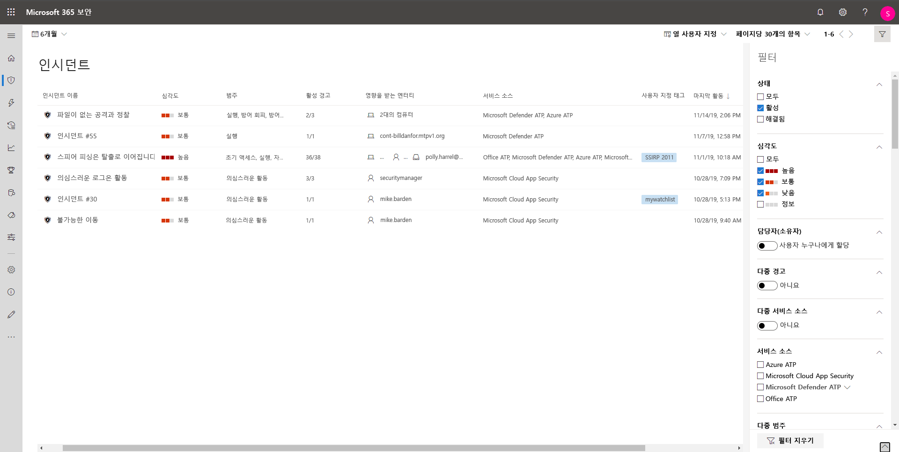

# Microsoft Threat Protection 사고 우선순위Prioritize incidents in Microsoft Threat Protection

**적용 대상:****Applies to:**
- Microsoft Threat Protection Microsoft Threat Protection

[!include[Prerelease information](prerelease.md)]

Microsoft Threat Protection은 상관 관계 분석을 하고 관련된 모든 알람을 수집한 뒤 각각의 다른 제품에서 발생한 알람을 하나의 사고로 조사합니다. Microsoft Threat Protection applies correlation analytics and aggregates all related alerts and investigations from different products into one incident. Microsoft Threat Protection 전체 항목 및 제품군 엔드 투 엔드 가시성에서 악성으로 판단된 작업에 대해서는 특별 알람을 발생시킵니다. Microsoft Threat Protection also triggers unique alerts on activities that can only be identified as malicious given the end-to-end visibility that Microsoft Threat Protection has across the entire estate and suite of products. Microsoft Threat Protection은 보다 광범위한 공격내용을 구연함으로써 보안 운영 분석가가 조직 전반을 위협하는 복잡한 공격을 이해하고 처리할 수 있도록 합니다. By doing so, Microsoft Threat Protection narrates the broader attack story, allowing a security operations analyst to understand and deal with complex threats across the organization.

**사고 큐**는 장치, 사용자 및 사서함에 대해 플래그가 지정 된 사고의 모음을 보여 줍니다.The **Incidents queue** shows a collection of incidents that were flagged from across devices, users, and mailboxes. 이 기능은 사고 우선순위를 정하고 사이버 보안 반응 결정을 내리는 데 도움을 줍니다.It helps you sort through incidents to prioritize and create an informed cybersecurity response decision.

 

기본적으로 Microsoft 365 보안 센터의 큐에는\ 최근 30일 동안 발생한 사고가 표시 되며, 최신 사고가 목록의 맨 위에 표시 되어 최신 사고를 가장 먼저 확인 할 수 있습니다. By default, the queue in the Microsoft 365 security center displays incidents seen in the last 30 days, with the most recent incident showing at the top of the list, helping you see the most recent incidents first.

사고 큐는 사고나 사고 관련 항목을 알려주는 커스터마이징이 가능한 열을 보여줌으로써 사고 처리 우선수위를 결정하는데 도움을 줍니다.The incident queue exposes customizable columns that give you visibility into different characteristics of the incident or the contained entities, helping you make an informed decision regarding prioritization of incidents to handle. 

또한 사고 큐는 여러 개의 필터링 옵션을 제공 합니다. 이 옵션을 적용 하면 환경이 허용하는 모든 기존 사고에 대한 광범위 한 스위프를 수행 하도록 선택 하거나 특정 시나리오 또는 위협에 집중할 수 있도록 결정할 수 있습니다.The incident queue also exposes multiple filtering options, that when applied, enable you to choose to perform a broad sweep of all existing incidents in your environment, or decide to focus on a specific scenario or threat. 사고 큐 필터를 적용 하면 즉시 주의가 필요한 사고를 결정할 수 있습니다.Applying filters on the incident queue can help determine which incident requires immediate attention. 

## 사용 가능한 필터Available filters

### 상태Status
상태에 따라 표시 되는 사고의 목록을 제한하여 활성 또는 해결 완료 된 사고를 확인할 수 있습니다.You can choose to limit the list of incidents shown based on their status to see which ones are active or resolved.

### 심각도Severity
사고의 심각도는 자산에 미칠 수 있는 영향을 의미합니다. The severity of an incident is indicative of the impact it can have in your assets. 심각도가 높아지면 영향을 크게 받게 되므로 일반적으로 가장 즉각적으로 주의 해야 합니다.The higher the severity the bigger the impact and typically requires the most immediate attention. 

### 담당자(소유자)Assigned to (owner)
필터를 사용하여 특정 담당자에게 할당 된 목록이나 자신에게 할당된 목록을 선택할 수 있습니다. You can choose to filter the list by selecting assigned to anyone or ones that are assigned to you.

### 다중 경고 Multiple alerts 
하나 이상의 경고를 포함 하는 사고만 표시 하도록 필터링 할 수 있습니다. Filter to see only incidents containing more than one alert. 이는 보다 복잡하거나 진화된 킬체인 공격일 수 있습니다. This could be an indication for an attack that is more complex or progressed in the kill chain. 

### 다중 서비스 원인Multiple service sources 
다중 원인(Microsoft Defender ATP, Microsoft Cloud App Security, Azure ATP, Office 365 ATP) 알림이 포함 된 사고만 표시 하도록 필터링 할 수 있습니다. Filter to only see incidents that contain alerts from different sources (Microsoft Defender ATP, Microsoft Cloud App Security, Azure ATP, Office 365 ATP)
### 서비스 원인Service sources
특정 원인을 선택 하면 해당 원인에서 최소 하나의 알림을 포함 하는 사고에 집중할 수 있습니다.By choosing a specific source, you can focus on incidents that contain at least one alert from that chosen source. 

### 다중 범주Multiple categories are supported. 
킬체인의 다중 범주에 매핑된 사고 및 잠재적으로 더 큰 손상을 유발할만한 사고를 선택해서 표시할 수 있습니다.You can choose to see only incidents that have mapped to multiple categories of the kill chain and can potentially cause more damage. 

### 범주Categories
범주를 선택 하여 킬체인 특정 단계에 집중할 수 있습니다. Choose specific categories to focus on a specific step in the kill chain

### 데이터 민감도Data sensitivity
일부 공격은 민감하거나 가치있는 데이터 수집을 목적으로 합니다. Some attacks focus on targeting to exfiltrate sensitive or valuable data. 필터를 적용하여 민감한 데이터가 사건에 연루되었는지를 확인한 후 민감 정보의 누출 여부를 결정하고 해당 사고의 우선순위를 결정할 수 있습니다.  By applying a filter to see if sensitive data is involved in the incident, you can quickly determine if sensitive information has potentially been compromised and prioritize addressing those incidents.

>[!NOTE]
>Microsoft Threat Protection이 설정 된 경우에만 적용 됩니다.Only applicable if Microsoft Information Protection is turned on.

## 다음 단계Next steps
사고의 우선순위를 결정한 뒤 사고에 대한 조사를 진행할 수 있습니다. After you've determined which incident requires the highest priority, you can proceed to do further investigative work on an incident.
- [사고 조사Investigate incidents](investigate-incidents.md)

## 관련 항목Related topics
- [사고 개요Incidents overview](incidents-overview.md)
- [사고 조사Investigate incidents](investigate-incidents.md)
- [사고 관리Manage incidents](manage-incidents.md)