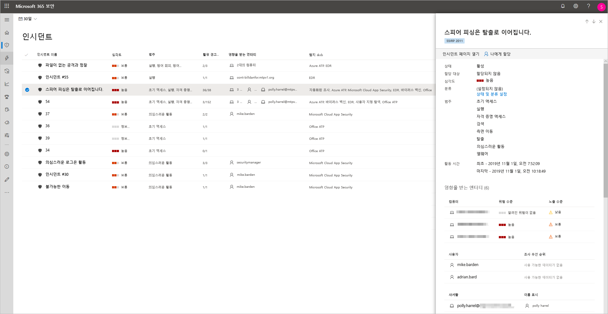
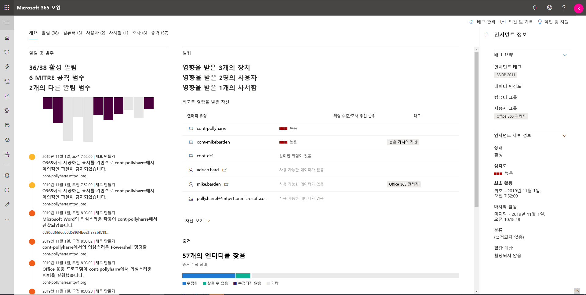
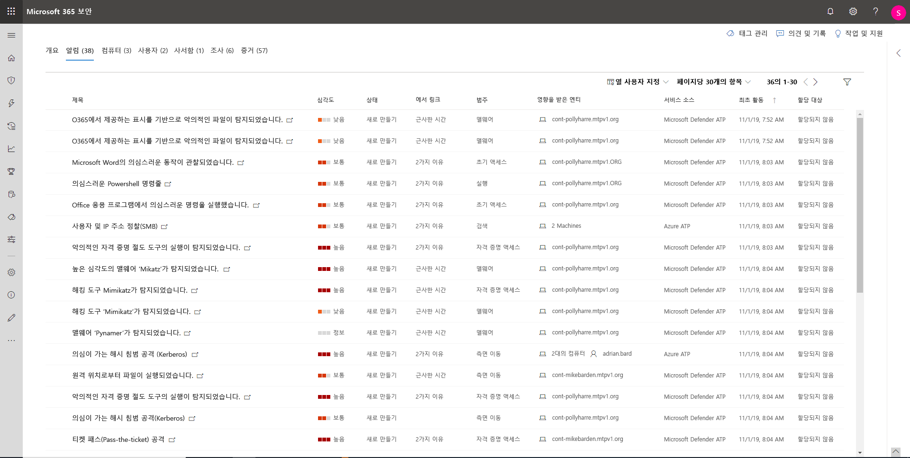
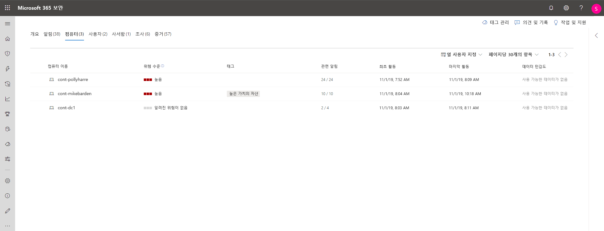
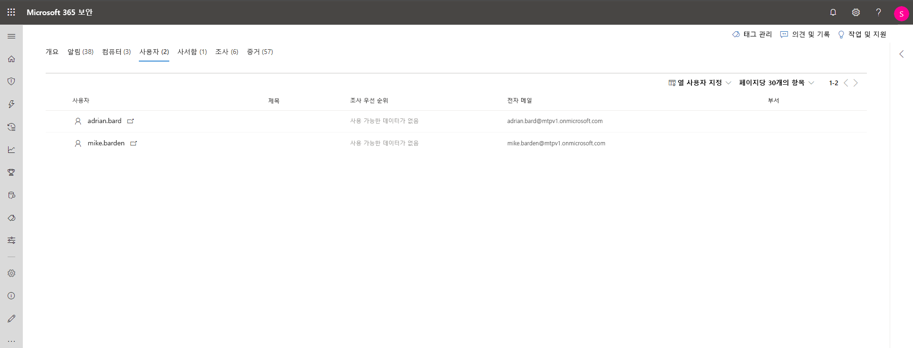
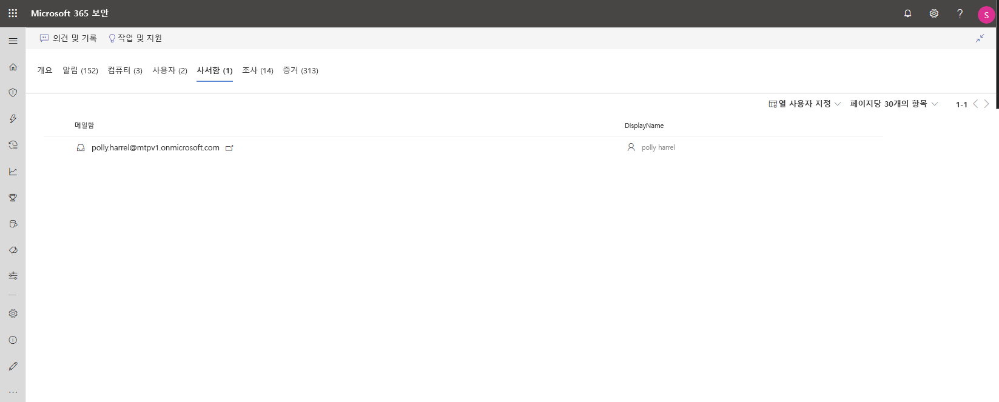
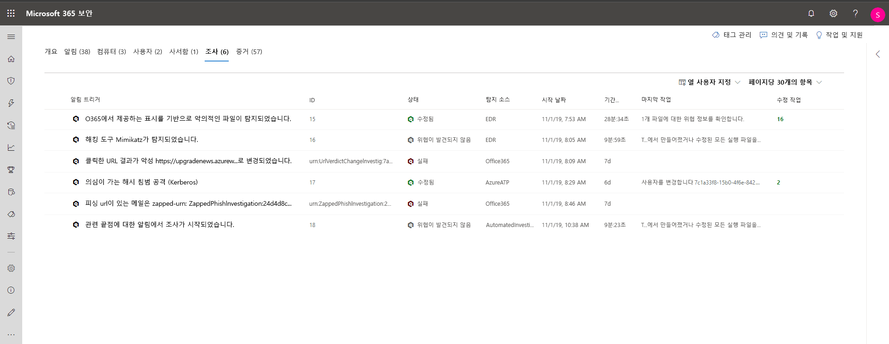
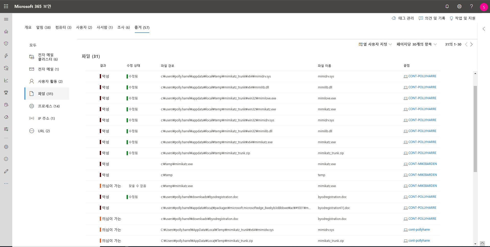

# Microsoft Threat Protection의 인시던트 조사

**적용 대상:**
- Microsoft 위협 방지

[!INCLUDE [Prerelease information](../includes/prerelease.md)]

Microsoft Threat Protection은 모든 장치, 사용자 및 사서함에 대한 모든 관련 알림, 자산, 조사 및 증거를 집계하여 공격의 전체 범위를 포괄적으로 파악합니다. 

네트워크에 영향을 미치는 알림을 조사하고, 해당 내용이 무엇인지 이해하고, 인시던트와 관련된 증거를 수집하여 효과적인 수정 계획을 세울 수 있습니다. 

## 인시던트 조사

1. 인시던트 대기열에서 인시던트를 선택합니다.   그러면 사이드 패널이 열리고 상태, 심각도, 범주, 영향을 받는 엔터티 등과 같은 중요한 정보를 미리 볼 수 있습니다.

    

2. **인시던트 페이지 열기**를 선택합니다.   그러면 인시던트 세부 정보, 메모 및 작업, 탭 (개요, 알림, 장치, 사용자, 조사, 증거)을 찾을 수있는 인시던트 페이지가 열립니다.

3. 인시던트에 관련된 알림, 장치, 사용자, 기타 엔터티를 검토합니다.

## 인시던트 개요 
개요 페이지에서는 인시던트에 대한 주요 정보를 볼 수 있는 스냅숏을 보여 줍니다.

공격 범주는 kill chain에 대한 공격 진행 정도를 시각적으로 그리고 수치적으로 보여줍니다. 다른 Microsoft 보안 제품과 마찬가지로 Microsoft Threat Protection은 [MITER ATT&CK&trade;](https://attack.mitre.org/) 프레임워크에 맞춰져 있습니다. 

범위 섹션에서는 이 인시던트의 일부인 영향을 받는 상위 자산 목록을 제공합니다. 위험 수준, 조사 우선 순위 및 자산에 대한 태그 지정과 같은 해당 자산에 관한 특정 정보가 있는 경우 이 섹션에도 표시됩니다.

알림 시간 표시 막대는 알림이 발생한 시간 순서와 해당 인시던트에 대해 이러한 알림이 발생한 이유에 대한 미리 보기를 제공합니다.

그리고 마지막인 증거 섹션에는 인시던트에 얼마나 많은 아티팩트가 포함되었는지와 치료 상태에 대한 요약 정보가 제공되므로 사용자 측에서 어떤 조치가 필요한지 즉시 확인할 수 있습니다. 

이 개요는 사용자가 알아야 할 인시던트의 주요 특징에 대한 통찰력을 제공함으로써 인시던트의 초기 분류를 도울 수 있습니다. 

## 알림 
인시던트와 관련된 모든 알림과 해당 인시던트에 대한 기타 정보를 볼 수 있습니다. 예를 들어 심각도, 알림과 관련된 엔터티, 알림 출처 (Azure ATP, Microsoft Defender ATP, Office 365 ATP), 그리고 이들이 연관된 이유들이 해당됩니다. 

기본적으로 알림은 시간을 기준으로 순서대로 정렬되며, 이를 통해 시간에 따라 처음부터 공격이 진행된 방식을 확인할 수 있습니다. 각 알림을 클릭하면 해당 경고에 대한 심도 있는 조사를 수행할 수 있는 관련 경고 페이지를 볼 수 있습니다. 

## 장치 
장치 탭에는 인시던트와 관련된 알림이 표시되는 모든 장치가 표시됩니다. 

공격이 수행된 컴퓨터의 이름을 클릭하면 컴퓨터 페이지로 이동하여 해당 컴퓨터에서 트리거된 알림 및 관련 이벤트를 쉽게 조사할 수 있습니다. 

시간 표시 막대 탭을 선택하면 컴퓨터 시간 표시 막대를 스크롤하여 컴퓨터에서 관찰된 경고와 함께 시간 순서 대로 관찰된 모든 이벤트와 동작을 볼 수 있습니다. 

## 사용자 
주어진 인시던트의 일부로 식별되거나 이와 관련된 사용자를 참조하세요. 

사용자 이름을 클릭하면 추가 조사를 수행할 수 있는 사용자의 클라우드 앱 보안 페이지로 이동합니다.

## 사서함
인시던트의 일부로 식별되거나 이와 관련된 사서함을 조사하세요. 추가 조사 작업을 수행하기 위해 메일 관련 알림을 선택하면 수정 작업을 취할 수 있는 Office 365 Advanced Threat Protection이 열립니다.

## 조사
해당 인시던트에서 알림에 의해 트리거된 모든 자동화된 조사를 보려면 **조사**를 선택하세요. 사용자가 Microsoft Defender ATP 및 Office 365 Advanced Threat Protection에서 자동화된 조사를 실행하도록 구성한 방법에 따라, 조사는 수정 작업을 수행하거나 분석가의 작업 승인을 기다립니다.

조사를 선택하여 조사 세부 사항 페이지로 이동하고 조사 및 수정 상태에 대한 전체 정보를 확인하세요. 조사의 일부로 승인 대기중인 작업이 있으면 보류중인 작업 탭에 나타납니다. 인시던트 수정의 일부로 조치를 취합니다.

## 증거
Microsoft Threat Protection은 알림에서 모든 인시던트 지원 이벤트 및 의심스러운 엔터티를 자동으로 조사하여 중요한 파일, 프로세스, 서비스, 전자 메일 등에 대한 자동 응답 및 정보를 제공합니다. 이를 통해 인시던트의 잠재적 위협을 신속하게 탐지하고 차단할 수 있습니다. 

분석된 각 엔터티에는 수정 상태뿐만 아니라 결과 (악성적임, 의심스러움, 깨끗함)가 표시됩니다. 이를 통해 전체 인시던트의 수정 상태를 파악하고 추가적인 치료를 위한 다음 단계를 확인하는 데 도움이 됩니다.

## 관련 항목
- [인시던트 개요](incidents-overview.md)
- [인시던트 우선 순위 지정](incident-queue.md)
- [인시던트 관리](manage-incidents.md)