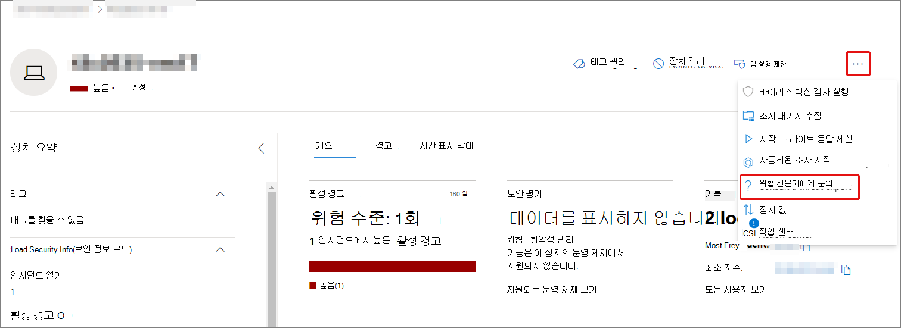
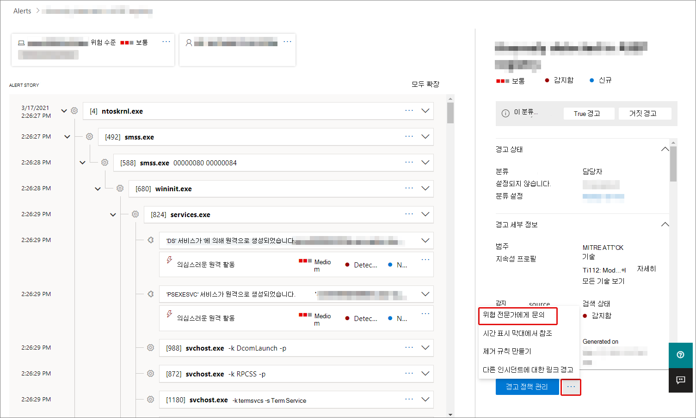

# Microsoft 365의 Microsoft 위협 전문가 개요Microsoft Threat Experts in Microsoft 365 overview

[!INCLUDE [Microsoft 365 Defender rebranding](../includes/microsoft-defender.md)]

**적용 대상:****Applies to:**

- [Microsoft 365 DefenderMicrosoft 365 Defender](https://go.microsoft.com/fwlink/?linkid=2118804)
- [엔드포인트용 Microsoft DefenderMicrosoft Defender for Endpoint](https://go.microsoft.com/fwlink/p/?linkid=2154037)

[!INCLUDE [Prerelease](../includes/prerelease.md)]

Microsoft 위협 전문가 - 대상 공격 알림은 관리되는 위협 헌팅 서비스입니다.Microsoft Threat Experts - Targeted Attack Notifications is a managed threat hunting service. 적용하고 수락하면 Microsoft 위협 전문가로부터 대상 공격 알림을 받으며, 환경에 대한 중요한 위협을 놓치지 않습니다.Once you apply and are accepted, you'll receive targeted attack notifications from Microsoft threat experts, so you won't miss critical threats to your environment. 이러한 알림은 조직의 끝점, 전자 메일 및 ID를 보호하는 데 도움이 됩니다.These notifications will help you protect your organization's endpoints, email, and identities.
Microsoft 위협 전문가 – 요구 시 전문가를 통해 조직이 직면하고 있는 위협에 대한 전문가의 조언을 얻을 수 있습니다.Microsoft Threat Experts – Experts on Demand lets you get expert advice about threats your organization is facing. 조직이 직면한 위협에 대한 도움말을 볼 수 있습니다.You can reach out for help on threats your organization is facing. 구독 서비스로 사용할 수 있습니다.It's available as a subscription service.

## Microsoft 위협 전문가 적용 - 대상 공격 알림Apply for Microsoft Threat Experts – Targeted Attack Notifications

> [!IMPORTANT]
> 적용하기 전에 Microsoft 위협 전문가 - Microsoft 기술 서비스 공급자 및 계정 팀과 대상 공격 알림에 대한 자격 요구 사항을 논의해야 합니다.Before you apply, make sure to discuss the eligibility requirements for Microsoft Threat Experts – Targeted Attack Notifications  with your Microsoft Technical Service provider and account team.

끝점용 Microsoft Defender 및 Microsoft 365 Defender가 이미 있는 경우 Microsoft 365 Defender 포털을 통해 Microsoft 위협 전문가 – 대상 공격 알림을 신청할 수 있습니다.If you already have Microsoft Defender for Endpoint and Microsoft 365 Defender, you can apply for Microsoft Threat Experts – Targeted Attack Notifications through their Microsoft 365 Defender portal. Microsoft **위협 전문가 -**> 공격 > 및 일반 > 고급 > 설정으로 이동한 후 적용을 **선택합니다.**Go to **Settings > Endpoints > General > Advanced features > Microsoft Threat Experts – Targeted Attack Notifications**, and select **Apply**. 자세한 [내용은 Microsoft Threat Experts 기능](./configure-microsoft-threat-experts.md) 구성을 참조하세요.See [Configure Microsoft Threat Experts capabilities](./configure-microsoft-threat-experts.md) for a full description.

응용 프로그램이 승인되면 위협 전문가가 환경에 대한 위협을 감지할 때마다 대상 공격 알림을 수신하게 됩니다.Once your application is approved, you'll start receiving targeted attack notifications whenever Threat Experts detect a threat to your environment.

## Microsoft 위협 전문가 - 전문가를 구독합니다.Subscribe to Microsoft Threat Experts - Experts on Demand

Microsoft 담당자에게 문의하여 전문가에게 문의합니다.Contact your Microsoft representative to subscribe to Experts on Demand.  자세한 [내용은 Microsoft Threat Experts 기능](./configure-microsoft-threat-experts.md) 구성을 참조합니다.See [Configure Microsoft Threat Experts capabilities](./configure-microsoft-threat-experts.md) for full details.

## 대상 공격 알림 수신Receive targeted attack notification

Microsoft 위협 전문가 – 대상 공격 알림 기능은 네트워크에 대한 가장 중요한 위협에 대한 사전 헌팅을 제공합니다.The Microsoft Threat Experts – Targeted Attack Notification capability provides proactive hunting for the most important threats to your network. 위협 전문가는 악의적인 침입, 키보드 실습 및 사이버 공격과 같은 고급 공격을 헌팅합니다.Our threat experts hunt for human adversary intrusions, hands-on-keyboard attacks, and advanced attacks, such as cyberespionage. 이러한 알림은 새 경고로 표시됩니다.These notifications will show up as a new alert. 관리되는 헌팅 서비스에는 다음이 포함됩니다.The managed hunting service includes:

- 위협 모니터링 및 분석, 에스밍 시간 및 비즈니스에 대한 위험 감소Threat monitoring and analysis, reducing dwell time and the risk to your business
- 알려진 공격과 새로운 위협을 모두 검색하고 대상을 지정하기 위해 헌터가 학습한 인공 지능Hunter-trained artificial intelligence to discover and target both known attacks and emerging threats
- 가장 관련성 있는 위험을 식별하여 SOC의 효율성 최대화Identification of the most pertinent risks, helping SOCs maximize their effectiveness
- 손상의 스위핑을 지원하고 신속하게 전달될 수 있는 많은 컨텍스트를 제공하여 신속한 SOC 응답을 가능하게 합니다.Help scoping compromises and providing as much context as can be quickly delivered to enable a swift SOC response.

## 전문가와 공동 작업Collaborate with experts on demand

Microsoft 365 보안 포털 내에서 직접 Microsoft 위협 전문가에게 연락하여 신속하고 정확한 위협 대응을 얻을 수 있습니다.You can also contact Microsoft threat experts from directly inside the Microsoft 365 security portal, for a swift and accurate threat response.  전문가는 조직이 직면할 수 있는 복잡한 위협을 더 잘 이해할 수 있는 통찰력을 제공할 수 있습니다.Experts can provide insight to better understand the complex threats your organization may face.  전문가에게 문의하여:Consult an expert to:

- 근본 원인 및 범위를 포함하여 경고 및 인시던트에 대한 추가 정보 수집Gather additional information on alerts and incidents, including root causes and scope
- 의심스러운 장치, 경고 또는 인시던트에 대한 명확성을 확보하고 고급 공격자가 직면할 경우 다음 단계를 수행합니다.Gain clarity into suspicious devices, alerts, or incidents and get next steps if faced with an advanced attacker
- 위협 공격자, 캠페인 또는 새로운 공격자 기술과 관련된 위험 및 사용 가능한 보호 결정Determine risks and available protections related to threat actors, campaigns, or emerging attacker techniques

위협 **전문가에게 문의** 옵션은 포털 전체의 여러 곳에서 사용할 수 있습니다.The option to **Consult a threat expert** is available in several places throughout the portal:

- <i>**장치 페이지 작업 메뉴**</i><i>**Device page actions menu**</i> 

- <i>**장치 인벤토리 페이지 플라이아웃 메뉴**</i><i>**Device inventory page flyout menu**</i> 

- <i>**경고 페이지 플라이아웃 메뉴**</i><i>**Alerts page flyout menu**</i> 

- <i>**인시던트 페이지 작업 메뉴**</i><i>**Incidents page actions menu**</i> 

- <i>**인시던트 인벤토리 페이지**</i><i>**Incidents inventory page**</i> 

> [!NOTE]
> Office 365용 Microsoft Defender 라이선스에 매핑된 프리미어 지원 구독이 있는 경우 Microsoft 서비스 허브를 통해 요구 시 전문가 사례의 상태를 추적할 수 있습니다.If you have Premier Support subscription mapped to your Microsoft Defender for Office 365 license, you can track the status of your Experts on Demand cases through Microsoft Services Hub.

이 비디오를 시청하여 Microsoft 서비스 허브에 대한 간략한 개요를 확인할 수 있습니다.Watch this video for a quick overview of the Microsoft Services Hub.

> [!VIDEO https://www.microsoft.com/videoplayer/embed/RE4pk9f]

## 참고 항목See also

- [Microsoft 위협 전문가 기능 구성Configure Microsoft Threat Experts capabilities](./configure-microsoft-threat-experts.md)
