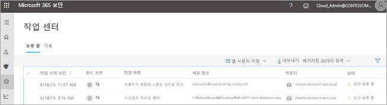
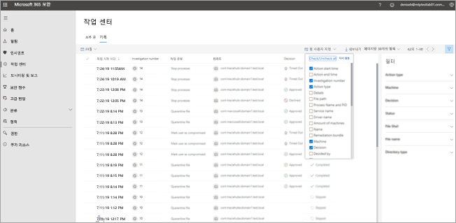
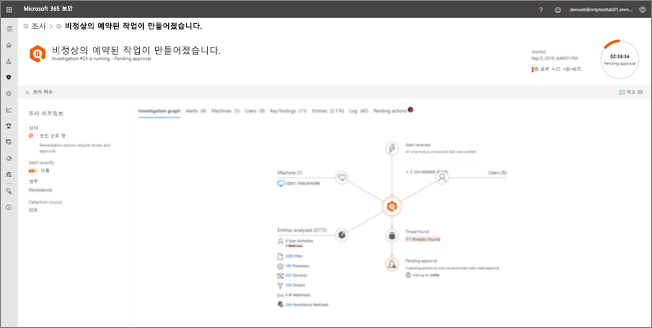

# 알림 센터로 이동하여 조치 작업을 봅니다.Go to the Action center to view remediation actions

**적용 대상:****Applies to:**
- Microsoft Threat ProtectionMicrosoft Threat Protection

[!include[Prerelease information](prerelease.md)]

## "단일 창 방식" 환경A "single pane of glass" experience

알림 센터를 사용하여 조직의 장치 및 사서함 전체에서 현재 및 과거 조사의 결과를 확인할 수 있습니다.Use the Action center to see the results of current and past investigations across your organization's devices and mailboxes. 위협 유형과 [결과 판정](mtp-autoir-results.md#remediation-actions-following-automated-investigation)에 따라 수정 작업이 자동으로 수행되거나 조직의 보안 운영 팀의 승인에 따라 발생합니다.Depending on the type of threat and [resulting verdict](mtp-autoir-results.md#remediation-actions-following-automated-investigation), remediation actions occur automatically or upon approval by your organization’s security operations team. 모든 수정 작업이 승인이 보류 중이든 이미 승인되었든 알림 센터에 통합되어 있습니다.All remediation actions, whether they are pending approval or were already approved, are consolidated in the Action center. 

알림 센터를 통해 다음과 같은 작업에 대한 "단일 창 방식" 환경을 제공합니다.The Action center provides a "single pane of glass" experience for tasks, such as:
- 보류 중인 수정 작업 승인.Approving pending remediation actions;
- 이미 승인된 수정 작업의 감사 로그 보기. 그리고Viewing an audit log of already approved remediation actions; and
- 완료된 수정 작업을 검토Reviewing completed remediation actions.

알림 센터를 통해 회사에서 Microsoft Threat Protection를 종합적으로 볼 수 있기 때문에 보안 운영팀이 보다 효과적이고 효율적으로 운영될 수 있습니다.Your security operations team can operate more effectively and efficiently, because the Action center provides a comprehensive view of Microsoft Threat Protection at work.

## 수정 작업Remediation actions

다음 표에는 알림 센터에서 현재 지원되는 수정 작업이 나와 있습니다.The following table lists remediation actions that are currently supported in the Action center: 

|끝점 수정 작업Endpoints remediation actions  |전자 메일 수정 작업Email remediation actions  |
|---------|---------|
|파일 격리Quarantine file 레지스트리 키 추가Remove registry key 프로세스 중단Kill process  서비스 중지Stop the service application  레지스트리 키 추가Remove registry key  드라이버 해제Disable driver  예약된 작업 제거Remove scheduled task      |전자 메일 메시지 또는 클러스터의 일시 삭제Soft delete email messages or clusters 차단 URL(클릭 시간)Block URL (time-of-click) 외부 메일 전달 해제Turn off external mail forwarding          |

## 알림 센터로 이동합니다.Go to the admin center.

1. [https://security.microsoft.com](https://security.microsoft.com)으로 이동하여 로그인합니다.Go to [https://security.microsoft.com](https://security.microsoft.com) and sign in with an admin account. 

2. 탐색 창에서 **알림 센터**를 선택합니다.In the navigation pane, choose **Action center**. 

3. 알림 센터에는 **보류 중**과 **기록**이라는 두 개의 탭이 표시됩니다.In the Action center, you’ll see two tabs: **Pending** and **History**.

    - **보류 중** 탭에는 보안 운영팀의 누군가가 계속 진행하기 위해 검토하고 승인해야 하는 조사가 나열됩니다.The **Pending** tab lists investigations that require review and approval by someone in your security operations team to continue. 여기에 표시되는 보류 중인 항목을 검토하여 조치를 취해야 합니다.Make sure to review and take action on pending items you see here.

    - **기록** 탭에는 자동으로 수행된 과거 조사와 수정 작업이 표시됩니다.The **History** tab lists past investigations and remediation actions that were taken automatically. 지난 일, 주, 월 또는 6개월에 대한 데이터를 볼 수 있습니다.You can view data for the past day, week, month, or six months.

4. 원하는 열만 표시하려면 **열 사용자 정의**를 선택합니다.To show only the columns you want to see, select **Customize columns**. 

5. 목록에서 항목을 선택하여 조사에 대한 자세한 정보를 확인합니다.Select an item in the list to view more details about an investigation. 조사 세부 정보 보기가 열립니다.The investigation details view opens. 

    - 조사가 전자 메일 콘텐츠와 관련된 경우(예: 엔터티가 사서함인 경우) 조사 세부 정보는 Office 365 보안 및 준수 센터([https://protection.office.com/threatinvestigation](https://protection.office.com/threatinvestigation))에서 열립니다.If the investigation pertains to email content (such as, the entity is a mailbox), investigation details open in the Office 365 Security & Compliance Center ([https://protection.office.com/threatinvestigation](https://protection.office.com/threatinvestigation)). 

    - 조사가 장치에 관련된 경우 조사 세부 정보는 보안 센터([https://security.microsoft.com](https://security.microsoft.com))에서 열립니다.If the investigation involves a device, investigation details open in the security center ([https://security.microsoft.com](https://security.microsoft.com)). 

## 알림 센터 작업에 필요한 사용 권한Required permissions for Action center tasks

알림 센터에서 보류 중인 작업을 승인하거나 거부하려면 다음 표에 나열된 대로 사용 권한이 할당되어 있어야 합니다.To approve or reject pending actions in the Action center, you must have permissions assigned as listed in the following table:

|수정 작업Remediation action |필요한 역할 및 사용 권한 할당Required licenses and permissions |
|--|----|
|Microsoft Defender ATP 수정(장치)Microsoft Defender ATP remediation (devices) |Azure Active Directory([https://portal.azure.com](https://portal.azure.com)) 또는 Microsoft 365 관리 센터([https://admin.microsoft.com](https://admin.microsoft.com))에 할당된 **보안 관리자** 역할**Security Administrator** role assigned in either Azure Active Directory ([https://portal.azure.com](https://portal.azure.com)) or the Microsoft 365 admin center ([https://admin.microsoft.com](https://admin.microsoft.com)) --- 또는 ---“+” or “-” Microsoft Defender ATP에서 할당된 **활성 수정 작업** 역할**Active remediation actions** role assigned in Microsoft Defender ATP     자세한 내용은 다음 리소스를 참조하세요.To learn more, see the following resources:  - [Azure Active Directory의 관리자 역할 권한](https://docs.microsoft.com/azure/active-directory/users-groups-roles/directory-assign-admin-roles)Administrator role permissions in Azure Active Directory - [역할 기반 액세스 제어(Microsoft Defender ATP)를 위한 역할 만들기 및 관리](https://docs.microsoft.com/windows/security/threat-protection/microsoft-defender-atp/user-roles)- [Create and manage roles for role-based access control (Microsoft Defender ATP)](https://docs.microsoft.com/windows/security/threat-protection/microsoft-defender-atp/user-roles)  |
|Office 365 ATP 수정(Office 콘텐츠 및 전자 메일)Office 365 ATP remediation (Office content and email)  |Azure Active Directory([https://portal.azure.com](https://portal.azure.com)) 또는 Microsoft 365 관리 센터([https://admin.microsoft.com](https://admin.microsoft.com))에 할당된 **보안 관리자** 역할**Security Administrator** role assigned in either Azure Active Directory ([https://portal.azure.com](https://portal.azure.com)) or the Microsoft 365 admin center ([https://admin.microsoft.com](https://admin.microsoft.com)) --- 및 ---“{” and “}”  Office 365 보안 및 규정 준수 센터([https://protection.office.com](https://protection.office.com))에 할당된 **검색 및 제거** 역할Search and Purge (this is assigned only in the Office 365 Security & Compliance Center)   **중요**: 보안 관리자 역할이 Office 365 보안 및 준수 센터에만 할당되어 있는 경우에는 알림 센터 또는 Microsoft Threat Protection 기능에 액세스할 수 없습니다.**IMPORTANT**: If you have the Security Administrator role assigned only in the Office 365 Security & Compliance Center, you will not be able to access the Action center or Microsoft Threat Protection capabilities. Azure Active Directory 또는 Microsoft 365 관리 센터에 할당된 보안 관리자 역할이 있어야 합니다.You must have the Security Administrator role assigned in Azure Active Directory or the Microsoft 365 admin center.   자세한 내용은 다음 리소스를 참조하세요.To learn more, see the following resources:  - [Azure Active Directory의 관리자 역할 권한](https://docs.microsoft.com/azure/active-directory/users-groups-roles/directory-assign-admin-roles)Administrator role permissions in Azure Active Directory - [Office 365 보안 및 준수 센터의 사용 권한](https://docs.microsoft.com/microsoft-365/security/office-365-security/permissions-in-the-security-and-compliance-center)Permissions in the Office 365 Security & Compliance Center |

> [!NOTE]
> Azure Active Directory에서 **전역 관리자** 역할이 할당된 사용자는 알림 센터에서 대기 중인 모든 작업을 승인하거나 거부할 수 있습니다.Users who have the **Global Administrator** role assigned in Azure Active Directory can approve or reject any pending action in the Action center. 그러나 조직에서 전역 관리자 역할이 할당된 사용자 수를 제한하는 것이 가장 좋습니다.However, as a best practice, your organization should limit the number of people who have the Global Administrator role assigned. 알림 센터 사용 권한에 대해 위에 나열한 **보안 관리자**, **활성 수정 작업**, **검색 및 제거** 역할을 사용하는 것이 좋습니다.We recommend using the **Security Administrator**, **Active remediation actions**, and **Search and Purge** roles listed above for Action center permissions.

## 다음 단계Next steps 

- [Microsoft Threat Protection에 관해 자세히 알아보기Learn more about incidents in Microsoft Threat Protection](incidents-overview.md)
- [자동화된 조사 결과 보기View the results of an automated investigation](mtp-autoir-results.md)
- [Microsoft Threat Protection의 헌팅에 대해 알아보기Learn about hunting in Microsoft Threat Protection](advanced-hunting-overview.md)

