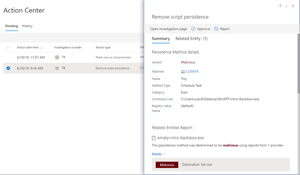

# 자동화 된 조사에 따라 보류 중인 작업 승인 또는 거부Approve or reject pending actions following an automated investigation

[!INCLUDE [Microsoft 365 Defender rebranding](../includes/microsoft-defender.md)]

**적용 대상:****Applies to:**
- Microsoft 위협 방지Microsoft Threat Protection

자동화 조사가 실행되면 승인이 필요한 [수정 작업](https://docs.microsoft.com/microsoft-365/security/mtp/mtp-remediation-actions)이 하나 이상 진행될 수 있습니다.When an automated investigation runs, it can result in one or more [remediation actions](https://docs.microsoft.com/microsoft-365/security/mtp/mtp-remediation-actions) that require approval to proceed. 예를 들어 전자 메일 메시지의 클러스터를 삭제 하거나 격리된 파일을 제거해야 할 수 있습니다.For example, a cluster of email messages might need to be deleted, or a quarantined file might need to be removed. 자동화된 조사가 진행되고 적시에 완료될 수 있도록 가능한 한 빨리 보류 중인 작업을 승인하거나 거부하는 것이 중요합니다.It's important to approve (or reject) pending actions as soon as possible so that your automated investigations can proceed and complete in a timely manner. 

> [!TIP]
> Microsoft Threat Protection의 자동화 된 조사 및 응답 기능을 통해 누락 되었거나 지워지는이 감지 되었다고 생각 되 면 알려주세요.If you think something was missed or wrongly detected by automated investigation and response features in Microsoft Threat Protection, let us know! [Microsoft Threat Protection에서 자동 조사 및 응답 (AIR) 기능을 통해 허위 긍정/네거티브를 보고 하는 방법을](mtp-autoir-report-false-positives-negatives.md)참조 하세요.See [How to report false positives/negatives in automated investigation and response (AIR) capabilities in Microsoft Threat Protection](mtp-autoir-report-false-positives-negatives.md).

[작업 센터](#review-a-pending-action-in-the-action-center) 또는 [조사 세부 정보 보기](#review-a-pending-action-in-the-investigation-details-view)를 사용 하 여 보류 중인 작업을 검토 하 고 승인할 수 있습니다.Pending actions can be reviewed and approved by using the [Action center](#review-a-pending-action-in-the-action-center) or the [investigation details view](#review-a-pending-action-in-the-investigation-details-view).

> [!NOTE]
> 수정 작업을 승인하거나 거부하려면 [적절한 사용 권한](mtp-action-center.md#required-permissions-for-action-center-tasks)이 있어야 합니다.You must have [appropriate permissions](mtp-action-center.md#required-permissions-for-action-center-tasks) to approve or reject remediation actions.

## 알림 센터에서 대기 중인 작업 검토Review a pending action in the Action center

1. [https://security.microsoft.com](https://security.microsoft.com)으로 이동하여 로그인합니다.Go to [https://security.microsoft.com](https://security.microsoft.com) and sign in. 

2. 탐색 창에서 **알림 센터**를 선택합니다.In the navigation pane, choose **Action center**. 

3. 알림 센터의 **보류 중인** 탭의 목록에서 항목을 선택합니다.In the Action Center, on the **Pending** tab, select an item in the list. 

    - **조사 번호** 열에서 항목을 선택하면 조사 세부 정보 페이지가 열립니다.If you select an item in the **Investigation number** column, the investigation details page opens. 거기에서 조사 결과를 보고 권장 조치를 승인하거나 거부할 수 있습니다.There, you can view the results of the investigation, and then either approve or reject the recommended action.
 
    - 목록에서 행을 선택하면 플라이 아웃이 열리면서 해당 항목에 대한 정보를 볼 수 있습니다.If you select a row in the list, a flyout opens, where you can view information about that item.   링크를 사용하여 연결 된 경고나 확인을 보고 작업을 승인하거나 거부합니다.Use the links to view an associated alert or an investigation, and approve or reject the action.

## 조사 세부 정보 보기에서 보류 중인 작업을 검토합니다.Review a pending action in the investigation details view

1. [조사 세부 정보](mtp-autoir-results.md) 페이지에서 **보류 중인 작업** (또는 **작업**) 탭을 선택합니다. 승인이 보류 중인 항목은 여기에 나열됩니다.On an [investigation details](mtp-autoir-results.md) page, select the **Pending actions** (or **Actions**) tab. Items that are pending approval are listed here.

2. 목록에서 항목을 선택한 다음 **승인** 또는 **거부**를 선택합니다.Select an item in the list, and then choose **Approve** or **Reject**.

## 다음 단계Next steps

- [자동화 조사 세부정보 및 결과 보기View the details and results of an automated investigation](mtp-autoir-results.md)
- [자동화 된 조사 및 응답 기능에서 가양성/네거티브 처리Handle false positives/negatives in automated investigation and response capabilities](mtp-autoir-report-false-positives-negatives.md)
