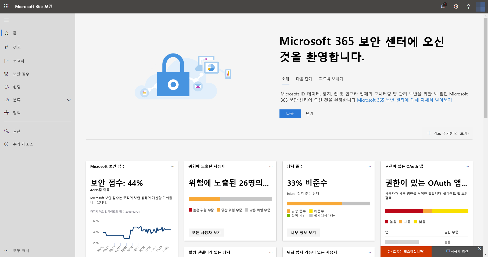
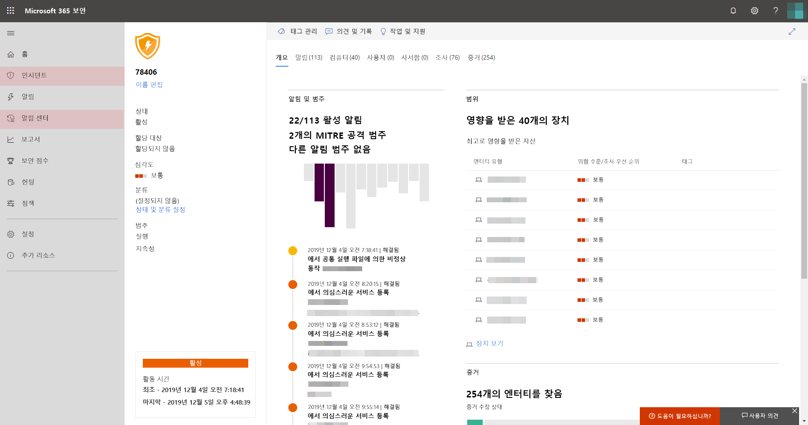

# Microsoft Threat Protection 테스트 복사본 켜기

**적용 대상:**
- Microsoft Threat Protection

[!INCLUDE [Prerelease information](../includes/prerelease.md)]

Microsoft Threat Protection은 Microsoft Defender의 ATP(Advanced Threat Protection), Office 365 ATP, Microsoft Cloud App Security, Azure ATP에 주요 기능을 통합하여 인시던트 대응 프로세스를 통합합니다. 이 통합된 환경은 Microsoft 365 보안 센터에서 액세스할 수 있는 강력한 기능을 추가합니다.

## 라이선스 자격 및 필요한 권한 확인
Microsoft 365 E5 또는 이와 동등한 라이선스가 있는 고객은 Microsoft Threat Protection을 사용할 수 있습니다. 자세한 내용은 [라이선스 요구 사항 읽기](prerequisites.md#licensing-requirements)를 참조하세요.

 Microsoft Threat Protection을 사용 하도록 설정 하려면 **전역 관리자** 이거나 [Azure Active Directory](https://docs.microsoft.com/azure/active-directory/users-groups-roles/directory-assign-admin-roles#available-roles)의 **보안 관리자** 여야 합니다.

## 서비스 사용 시작
Microsoft Threat Protection 서비스를 사용하도록 설정하면 다양한 통합된 서비스에서 데이터를 집계합니다. 데이터는 중앙에서 처리되고 저장되어 새 정보를 식별하고 중앙 집중식 대응 워크플로를 가능하게 합니다.

서비스를 설정 하기 전에 Microsoft 365 보안 센터 ([security.microsoft.com](https://security.microsoft.com))에 메뉴의 **인시던트** 및 **작업 센터** 옵션이 표시 되지 않습니다.

Microsoft Threat Protection이 꺼져 있는 Microsoft 365 보안 센터 **

Microsoft Threat Protection 서비스 사용을 설정하려면 Microsoft 365 보안 센터에서 **설정** > **Microsoft Threat Protection** > **옵트인/옵트아웃**으로 이동합니다.

Microsoft Defender ATP가 조직에 프로비전된 경우 [Microsoft Defender ATP 데이터](https://docs.microsoft.com/windows/security/threat-protection/microsoft-defender-atp/data-storage-privacy)를 위해 선택한 것과 동일한 데이터 센터 위치에 데이터가 저장되고 처리됩니다. Microsoft Defender ATP가 없는 경우 Microsoft Threat Protection를 위한 새로운 데이터 센터 위치를 선택하라는 메시지가 표시됩니다. 서비스와 집계된 데이터가 공유되기 전에 동의를 제공해야 합니다.

### 서비스가 켜져 있는지 확인합니다.
서비스를 프로비전하면 다음이 추가됩니다.

- [인시던트 관리](incidents-overview.md)
- [자동화 조사 및 대응](mtp-autoir.md)을 관리하는 알림 센터
- 기존 **헌팅** 페이지에 대한 [고급 헌팅](advanced-hunting-overview.md) 기능

*인시던트 관리와 Microsoft Threat Protection 기능이 있는 Microsoft 365 보안 센터*

### Azure ATP 데이터 가져오기
Azure ATP 데이터를 Microsoft Threat Protection 기능과 공유하려면 Microsoft Cloud App Security 및 Azure ATP 통합이 사용하도록 설정되어 있는지 확인하세요. [이 통합에 대한 자세한 정보](https://docs.microsoft.com/cloud-app-security/aatp-integration)

## Microsoft Threat Protection 해제
Microsoft Threat Protection 사용을 중지하려면 Microsoft 365 보안 센터에서 **설정** > **Microsoft Threat Protection** > **옵트인/옵트아웃**으로 이동합니다. **Microsoft Threat Protection 사용**을 선택 취소하고 변경 내용을 저장합니다.

데이터가 영구적으로 삭제 되 고 해당 기능이 Microsoft 365 보안 센터에서 제거 됩니다.

## 지원 받기

Microsoft 직원은 테넌트의 서비스 및 관련 리소스를 프로비저닝하거나 프로비전 해제하는 데 도움을 줄 수 있습니다. 도움이 필요 하면 Microsoft 365 보안 센터에서 **도움말 보기** 를 선택 합니다. 관심 사항을 설명할 때 "Microsoft Threat Protection"을 언급 합니다.

## 관련 항목

- [Microsoft Threat Protection 개요](microsoft-threat-protection.md)
- [라이선스 요구 사항 및 기타 필수 구성 요소](prerequisites.md)
- [Microsoft Defender ATP 개요](https://docs.microsoft.com/windows/security/threat-protection/microsoft-defender-atp/microsoft-defender-advanced-threat-protection)
- [Office 365 ATP 개요](../office-365-security/office-365-atp.md)
- [Microsoft Cloud App Security 개요](https://docs.microsoft.com/cloud-app-security/what-is-cloud-app-security)
- [Azure ATP 개요](https://docs.microsoft.com/azure-advanced-threat-protection/what-is-atp)
- [Microsoft Defender ATP 데이터 저장소](https://docs.microsoft.com/windows/security/threat-protection/microsoft-defender-atp/data-storage-privacy)
