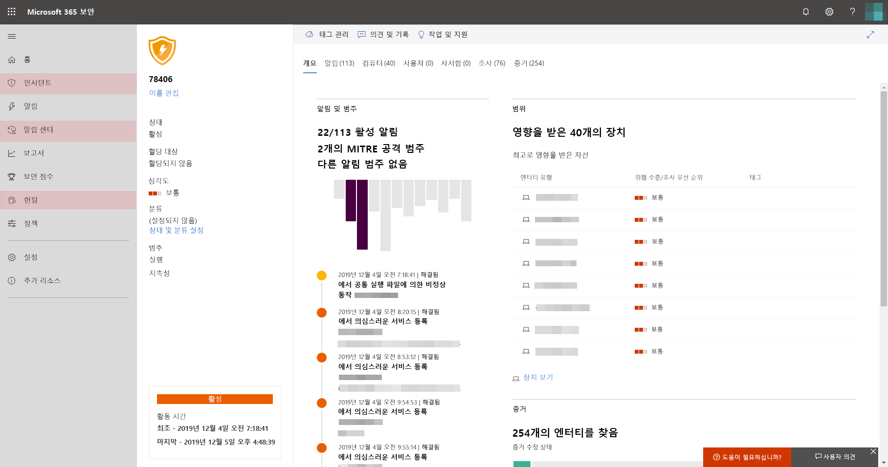

# Microsoft Threat Protection 사용 설정Turn on Microsoft Threat Protection

**적용 대상:****Applies to:**
- Microsoft Threat ProtectionMicrosoft Threat Protection

Microsoft Threat Protection은 Microsoft Defender의 ATP(Advanced Threat Protection), Office 365 ATP, Microsoft Cloud App Security, Azure ATP에 주요 기능을 통합하여 인시던트 대응 프로세스를 통합합니다.Microsoft Threat Protection unifies your incident response process by integrating key capabilities across Microsoft Defender Advanced Threat Protection (ATP), Office 365 ATP, Microsoft Cloud App Security, and Azure ATP. 이 통합된 환경은 Microsoft 365 보안 센터에서 액세스할 수 있는 강력한 기능을 추가합니다.This unified experience adds powerful features you can access in the Microsoft 365 security center.

## 라이선스 자격 및 필요한 권한 확인Check license eligibility and required permissions
Microsoft 365 E5, Microsoft 365 E5 보안 또는이에 해당 하는 라이선스 조합이 있는 고객은 Microsoft Threat Protection을 사용할 수 있습니다.Customers with Microsoft 365 E5, Microsoft 365 E5 Security, or an equivalent combination of licenses can use Microsoft Threat Protection. 자세한 내용은 [라이선스 요구 사항 읽기](prerequisites.md#licensing-requirements)를 참조하세요.For more information, [read the licensing requirements](prerequisites.md#licensing-requirements).

Microsoft Threat Protection을 켜려면 **전역 관리자** 이거나 [Azure Active Directory](https://docs.microsoft.com/azure/active-directory/users-groups-roles/directory-assign-admin-roles#available-roles) 의 **보안 관리자** 여야 합니다.You must be a **global administrator** or a **security administrator** in [Azure Active Directory](https://docs.microsoft.com/azure/active-directory/users-groups-roles/directory-assign-admin-roles#available-roles) to turn on Microsoft Threat Protection.

## 서비스 사용 시작Start using the service
Microsoft Threat Protection은 다양 한 통합 서비스에서 데이터를 집계 합니다.Microsoft Threat Protection aggregates data from the various integrated services. 새 정보를 식별 하 고 중앙 집중식 응답 워크플로를 수행할 수 있도록 중앙에서 데이터를 처리 및 저장 합니다.It will process and store data centrally to identify new insights and make centralized response workflows possible.

서비스를 설정 하기 전에 Microsoft 365 보안 센터 ([security.microsoft.com](https://security.microsoft.com))에 탐색 창에 **인시던트** 및 **작업 센터** 옵션이 표시 되지 않습니다.Before you turn on the service, the Microsoft 365 security center ([security.microsoft.com](https://security.microsoft.com)) doesn't show the **Incidents** and the **Action center** options in the navigation pane.

없는 microsoft 365 보안 센터 탐색 창 이미지 microsoft*threat protection이 해제 된 microsoft 365 보안 센터*
*Microsoft 365 security center with Microsoft Threat Protection turned off*

Microsoft Threat Protection을 설정 하려면 탐색 창에서 **설정을** 선택 합니다.To turn on Microsoft Threat Protection, select **Settings** in the navigation pane. **[설정 페이지](https://security.microsoft.com/settings)** 에서 **Microsoft Threat Protection** > **옵트인/옵트아웃**으로 이동 합니다.In the **[Settings page](https://security.microsoft.com/settings)**, go to **Microsoft Threat Protection** > **Opt-in / Opt-out**.

>[!NOTE]
>탐색 창에 **설정이** 표시 되지 않거나 페이지에 액세스할 수 없는 경우 사용 권한 및 라이선스를 확인 합니다.If you don't see **Settings** in the navigation pane or couldn't access the page, check your permissions and licenses.

### 데이터 센터 위치 선택Select data center location
Microsoft Defender ATP가 조직에 프로비전된 경우 [Microsoft Defender ATP 데이터](https://docs.microsoft.com/windows/security/threat-protection/microsoft-defender-atp/data-storage-privacy)를 위해 선택한 것과 동일한 데이터 센터 위치에 데이터가 저장되고 처리됩니다.If Microsoft Defender ATP has been provisioned for your organization, data will be stored and processed in the same data center location you have selected for [your Microsoft Defender ATP data](https://docs.microsoft.com/windows/security/threat-protection/microsoft-defender-atp/data-storage-privacy). Microsoft Defender ATP가 없는 경우 Microsoft Threat Protection를 위한 새로운 데이터 센터 위치를 선택하라는 메시지가 표시됩니다.If you don't have Microsoft Defender ATP, you will be asked to choose a new data center location specifically for Microsoft Threat Protection. 

서비스 간에 데이터를 공유 하 고 집계 하기 전에 동의를 제공 해야 합니다.You need to provide consent before data is shared between services and aggregated.

### 서비스가 켜져 있는지 확인합니다.Confirm that the service is on
서비스를 프로비전하면 다음이 추가됩니다.Once the service is provisioned, it adds:

- [인시던트 관리Incidents management](incidents-overview.md)
- [자동화 조사 및 대응](mtp-autoir.md)을 관리하는 알림 센터An action center for managing [automated investigation and response](mtp-autoir.md)
- 기존 **헌팅** 페이지에 대한 [고급 헌팅](advanced-hunting-overview.md) 기능[Advanced hunting](advanced-hunting-overview.md) capabilities to the existing **Hunting** page

있는 microsoft 365 보안 센터 탐색 창 이미지*문제 관리 및 기타 microsoft threat protection 기능을 가진 microsoft 365 보안 센터*
*Microsoft 365 security center with incidents management and other Microsoft Threat Protection capabilities*

### Azure ATP 데이터 가져오기Getting Azure ATP data
Azure ATP 데이터를 Microsoft Threat Protection 기능과 공유하려면 Microsoft Cloud App Security 및 Azure ATP 통합이 사용하도록 설정되어 있는지 확인하세요.To share Azure ATP data with Microsoft Threat Protection, ensure that Microsoft Cloud App Security and Azure ATP integration is turned on. [이 통합에 대한 자세한 정보Learn more about this integration](https://docs.microsoft.com/cloud-app-security/aatp-integration)

## Microsoft Threat Protection 해제Turn off Microsoft Threat Protection
Microsoft Threat Protection 사용을 중지하려면 Microsoft 365 보안 센터에서 **설정** > **Microsoft Threat Protection** > **옵트인/옵트아웃**으로 이동합니다.To stop using Microsoft Threat Protection, go to **Settings** > **Microsoft Threat Protection** > **Opt-in / Opt-out** in the Microsoft 365 security center. **Microsoft Threat Protection 사용**을 선택 취소하고 변경 내용을 저장합니다.Unselect **Turn on Microsoft Threat Protection** and save the changes.

데이터가 영구적으로 삭제 되 고 해당 기능이 Microsoft 365 보안 센터에서 제거 됩니다.Data will be permanently deleted and corresponding features will be removed from the Microsoft 365 security center.

## 지원 받기Get assistance

Microsoft 지원 요원은 테 넌 트에 서비스 및 관련 리소스를 구축 하거나 프로 비전 해제 하는 데 도움이 될 수 있습니다.Microsoft support staff can help provision or deprovision the service and related resources on your tenant. 도움이 필요 하면 Microsoft 365 보안 센터에서 **도움말 보기** 를 선택 합니다.For assistance, select **Need help?** in the Microsoft 365 security center. 지원 센터에 문의 하는 경우 Microsoft Threat Protection을 언급 합니다.When contacting support, mention Microsoft Threat Protection.

## 관련 항목Related topics

- [Microsoft Threat Protection 개요Microsoft Threat Protection overview](microsoft-threat-protection.md)
- [라이선스 요구 사항 및 기타 필수 구성 요소Licensing requirements and other prerequisites](prerequisites.md)
- [Microsoft Defender ATP 개요Microsoft Defender ATP overview](https://docs.microsoft.com/windows/security/threat-protection/microsoft-defender-atp/microsoft-defender-advanced-threat-protection)
- [Office 365 ATP 개요Office 365 ATP overview](../office-365-security/office-365-atp.md)
- [Microsoft Cloud App Security 개요Microsoft Cloud App Security overview](https://docs.microsoft.com/cloud-app-security/what-is-cloud-app-security)
- [Azure ATP 개요Azure ATP overview](https://docs.microsoft.com/azure-advanced-threat-protection/what-is-atp)
- [Microsoft Defender ATP 데이터 저장소Microsoft Defender ATP data storage](https://docs.microsoft.com/windows/security/threat-protection/microsoft-defender-atp/data-storage-privacy)
