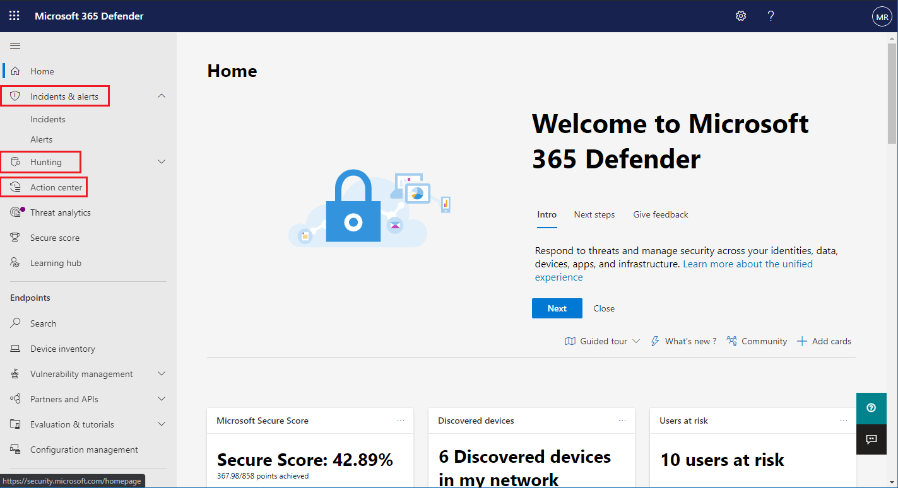

# Microsoft Threat Protection 사용 설정Turn on Microsoft Threat Protection

[!INCLUDE [Microsoft 365 Defender rebranding](../includes/microsoft-defender.md)]

**적용 대상:****Applies to:**
- Microsoft Threat ProtectionMicrosoft Threat Protection

[Microsoft Threat protection](microsoft-threat-protection.md) 은 MICROSOFT의 Atp (Advanced Threat Protection), OFFICE 365 ATP, Microsoft Cloud App Security 및 Azure ATP에서 주요 기능을 통합 하 여 문제 대응 프로세스를 결합 합니다.[Microsoft Threat Protection](microsoft-threat-protection.md) unifies your incident response process by integrating key capabilities across Microsoft Defender Advanced Threat Protection (ATP), Office 365 ATP, Microsoft Cloud App Security, and Azure ATP. 이 통합된 환경은 Microsoft 365 보안 센터에서 액세스할 수 있는 강력한 기능을 추가합니다.This unified experience adds powerful features you can access in the Microsoft 365 security center.

Microsoft Threat Protection은 필요한 권한이 있는 적합 한 고객이 Microsoft 365 보안 센터에 방문 하면 자동으로 켜 집니다.Microsoft Threat Protection automatically turns on when eligible customers with the required permissions visit Microsoft 365 security center. 이 문서를 읽으면 다양 한 필수 구성 요소와 Microsoft Threat Protection이 구축 되는 방식을 이해할 수 있습니다.Read this article to understand various prerequisites and how Microsoft Threat Protection is provisioned.

## 라이선스 자격 및 필요한 권한 확인Check license eligibility and required permissions
Microsoft 365 보안 제품에 대 한 라이선스는 일반적으로 추가 라이선스 비용 없이 microsoft 365 보안 센터에서 Microsoft Threat Protection을 사용 하는 통해입니다.A license to a Microsoft 365 security product generally entitles you to use Microsoft Threat Protection in Microsoft 365 security center without additional licensing cost. Microsoft 365 E5, E5 Security, A5 또는 A5 보안 라이선스를 가져오거나 지원 되는 모든 서비스에 대 한 액세스를 제공 하는 유효한 라이선스 조합을 사용 하는 것이 좋습니다.We do recommend getting a Microsoft 365 E5, E5 Security, A5, or A5 Security license or a valid combination of licenses that provides access to all supported services.

라이선스 정보에 대 한 자세한 내용은 [라이선스 요구 사항을 참조](prerequisites.md#licensing-requirements)하세요.For detailed licensing information, [read the licensing requirements](prerequisites.md#licensing-requirements).

### 역할 확인Check your role
Microsoft Threat Protection을 켜려면 **전역 관리자** 이거나 Azure Active Directory의 **보안 관리자** 여야 합니다.You must be a **global administrator** or a **security administrator** in Azure Active Directory to turn on Microsoft Threat Protection. [Azure AD에서 역할 보기View your roles in Azure AD](https://docs.microsoft.com//azure/active-directory/users-groups-roles/directory-manage-roles-portal)

## 지원 되는 서비스Supported services
Microsoft Threat Protection은 이미 배포한 다양 한 지원 서비스에서 데이터를 집계 합니다.Microsoft Threat Protection aggregates data from the various supported services that you've already deployed. 새 정보를 식별 하 고 중앙 집중식 응답 워크플로를 수행할 수 있도록 중앙에서 데이터를 처리 및 저장 합니다.It will process and store data centrally to identify new insights and make centralized response workflows possible. 통합 서비스와 연결 된 기존 배포, 설정 또는 데이터에 영향을 주지 않고이를 수행 합니다.It does this without affecting existing deployments, settings, or data associated with the integrated services.

최적의 보호를 위해 Microsoft 위협 보호를 얻으려면 해당 하는 모든 지원 서비스를 네트워크에 배포 하는 것이 좋습니다.To get the best protection and optimize Microsoft Threat Protection, we recommend deploying all applicable supported services on your network. 자세한 내용은 [지원 되는 서비스 배포에 대 한 내용을 참조](deploy-supported-services.md)하세요.For more information, [read about deploying supported services](deploy-supported-services.md).

## 서비스를 시작 하기 전에Before starting the service
서비스를 설정 하기 전에 Microsoft 365 보안 센터 ([security.microsoft.com](https://security.microsoft.com))는 탐색 창에서 **인시던트**, **작업 센터** **또는 검색** 을 선택할 때 microsoft 위협 보호 설정 페이지를 표시 합니다.Before you turn on the service, the Microsoft 365 security center ([security.microsoft.com](https://security.microsoft.com)) shows the Microsoft Threat Protection settings page when you select **Incidents**, **Action center**, or **Hunting** from the navigation pane. 이러한 탐색 항목은 Microsoft Threat Protection을 사용할 수 없는 경우에는 표시 되지 않습니다.These navigation items are not shown if you are not eligible to use Microsoft Threat Protection.

 *365 보안 센터의* microsoft threat Protection 설정에 microsoft threat protection이 설정 되지 않은 경우 표시 되는 microsoft threat protection 설정 페이지 이미지
*Microsoft Threat Protection settings in Microsoft 365 security center*

## 서비스 시작Starting the service
Microsoft Threat Protection을 설정 하려면 **Microsoft Threat Protection 설정을** 선택 하 고 변경 내용을 적용 하기만 하면 됩니다.To turn on Microsoft Threat Protection, simply select **Turn on Microsoft Threat Protection** and apply the change. 탐색 창에서 **설정** ([security.microsoft.com/settings](https://security.microsoft.com/settings))을 선택 하 고 **microsoft Threat Protection**을 선택 하 여이 옵션에 액세스할 수도 있습니다.You can also access this option by selecting **Settings** ([security.microsoft.com/settings](https://security.microsoft.com/settings)) in the navigation pane and then selecting **Microsoft Threat Protection**.

>[!NOTE]
>탐색 창에 **설정이** 표시 되지 않거나 페이지에 액세스할 수 없는 경우 사용 권한 및 라이선스를 확인 합니다.If you don't see **Settings** in the navigation pane or couldn't access the page, check your permissions and licenses.

### 데이터 센터 위치Data center location
Microsoft Threat Protection은 [Microsoft DEFENDER ATP에서 사용 하는 것과 동일한 위치](https://docs.microsoft.com/windows/security/threat-protection/microsoft-defender-atp/data-storage-privacy)에 데이터를 저장 하 고 처리 합니다.Microsoft Threat Protection will store and process data in the [same location used by Microsoft Defender ATP](https://docs.microsoft.com/windows/security/threat-protection/microsoft-defender-atp/data-storage-privacy). Microsoft Defender ATP가 없는 경우에는 활성 Microsoft 365 보안 서비스의 위치에 따라 새 데이터 센터 위치가 자동으로 선택 됩니다.If you don't have Microsoft Defender ATP, a new data center location is automatically selected based on the location of active Microsoft 365 security services. 선택한 데이터 센터 위치가 화면에 표시 됩니다.The selected data center location is shown in the screen. 

Microsoft 기술 지원 서비스에 문의 하 여 microsoft Threat Protection을 다른 데이터 센터 위치에 프로 비전 하는 방법에 연결 하 365는 **데 도움이 필요 하세요?** 를 선택 합니다.Select **Need help?** in the Microsoft 365 security center to contact Microsoft support about provisioning Microsoft Threat Protection in a different data center location. 

>[!NOTE]
>Azure 보안 센터를 통해 설정 하는 경우 Microsoft Defender ATP는 EU (유럽 연합) 데이터 센터를 자동으로 프로 비전 합니다.Microsoft Defender ATP automatically provisions in European Union (EU) data centers when turned on through Azure Security Center. Microsoft Threat Protection은 이러한 방식으로 Microsoft Defender ATP를 프로 비전 한 고객을 위해 동일한 EU 데이터 센터를 자동으로 프로 비전 합니다.Microsoft Threat Protection will automatically provision in the same EU data center for customers who have provisioned Microsoft Defender ATP in this manner. 

### 서비스가 켜져 있는지 확인합니다.Confirm that the service is on
서비스를 프로비전하면 다음이 추가됩니다.Once the service is provisioned, it adds:

- [인시던트 관리Incidents management](incidents-overview.md)
- [자동화 조사 및 대응](mtp-autoir.md)을 관리하는 알림 센터An action center for managing [automated investigation and response](mtp-autoir.md)
- [고급 구하기](advanced-hunting-overview.md) 기능[Advanced hunting](advanced-hunting-overview.md) capabilities

 *문제 관리 및 기타 Microsoft threat protection 기능을 가진 microsoft 365 보안 센터*
*Microsoft 365 security center with incidents management and other Microsoft Threat Protection capabilities*

### Azure ATP 데이터 가져오기Getting Azure ATP data
Azure ATP 데이터를 Microsoft Threat Protection 기능과 공유하려면 Microsoft Cloud App Security 및 Azure ATP 통합이 사용하도록 설정되어 있는지 확인하세요.To share Azure ATP data with Microsoft Threat Protection, ensure that Microsoft Cloud App Security and Azure ATP integration is turned on. [이 통합에 대한 자세한 정보Learn more about this integration](https://docs.microsoft.com/cloud-app-security/aatp-integration)

## Microsoft Threat Protection 해제Turn off Microsoft Threat Protection
Microsoft Threat Protection 사용을 중지하려면 Microsoft 365 보안 센터에서 **설정** > **Microsoft Threat Protection** > **옵트인/옵트아웃**으로 이동합니다.To stop using Microsoft Threat Protection, go to **Settings** > **Microsoft Threat Protection** > **Opt-in / Opt-out** in the Microsoft 365 security center. 선택 취소 **Microsoft Threat Protection을 설정** 하 고 변경 내용을 적용 합니다.Unselect **Turn on Microsoft Threat Protection** and apply the changes.

해당 기능은 Microsoft 365 보안 센터에서 제거 됩니다.Corresponding features will be removed from the Microsoft 365 security center.

## 지원 받기Get assistance

Microsoft Threat Protection을 설정 하는 방법에 대 한 가장 일반적인 질문과 대답을 보려면 [FAQ를 참조](mtp-enable-faq.md)하세요.To get answers to the most commonly asked questions about turning on Microsoft Threat Protection, [read the FAQ](mtp-enable-faq.md).

Microsoft 지원 요원은 테 넌 트에 서비스 및 관련 리소스를 구축 하거나 프로 비전 해제 하는 데 도움이 될 수 있습니다.Microsoft support staff can help provision or deprovision the service and related resources on your tenant. 도움이 필요 하면 Microsoft 365 보안 센터에서 **도움말 보기** 를 선택 합니다.For assistance, select **Need help?** in the Microsoft 365 security center. 지원 센터에 문의 하는 경우 Microsoft Threat Protection을 언급 합니다.When contacting support, mention Microsoft Threat Protection.

## 관련 항목Related topics

- [자주 묻는 질문과 대답Frequently asked questions](mtp-enable-faq.md)
- [라이선스 요구 사항 및 기타 필수 구성 요소Licensing requirements and other prerequisites](prerequisites.md)
- [지원 서비스 사용Deploy supported services](deploy-supported-services.md)
- [Microsoft 위협 방지 개요Microsoft Threat Protection overview](microsoft-threat-protection.md)
- [Microsoft Defender ATP 개요Microsoft Defender ATP overview](https://docs.microsoft.com/windows/security/threat-protection/microsoft-defender-atp/microsoft-defender-advanced-threat-protection)
- [Office 365 ATP 개요Office 365 ATP overview](../office-365-security/office-365-atp.md)
- [Microsoft Cloud App Security 개요Microsoft Cloud App Security overview](https://docs.microsoft.com/cloud-app-security/what-is-cloud-app-security)
- [Azure ATP 개요Azure ATP overview](https://docs.microsoft.com/azure-advanced-threat-protection/what-is-atp)
- [Microsoft Defender ATP 데이터 저장소Microsoft Defender ATP data storage](https://docs.microsoft.com/windows/security/threat-protection/microsoft-defender-atp/data-storage-privacy)
