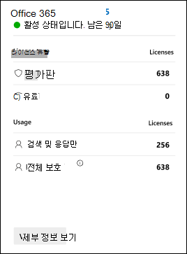

# Microsoft Defender for Office 365 평가판

> [!IMPORTANT]
> Microsoft Defender for Office 365 [시작해보아야 합니다.](https://download.microsoft.com/download/8/8/8/888e96ce-eb6a-487a-babc-a7e4ae1cd151/MDO%20Trial%20Playbook.pdf) 이 플레이북은 Microsoft Defender를 사용하여 조직을 보호하는 방법을 보여 주어 무료 평가판을 Office 365.

Microsoft Defender for Office 365 전자 메일 메시지, 링크(URL) 및 공동 작업 도구로 위협되는 악의적인 위협에 대해 조직을 보호합니다. Office 365용 Defender는 다음 사항을 포함합니다.

- **위협 방지 정책**: 위협 방지 정책을 정의하여 조직에 적합한 수준의 보호를 설정합니다.
- **보고서**: 조직의 Office 365용 Defender 성능을 모니터링하는 실시간 보고서를 볼 수 있습니다.
- **위협 조사 및 응답 기능**: 최첨단 도구를 사용하여 위협을 조사, 이해, 시뮬레이션 및 예방할 수 있습니다.
- **자동화된 조사 및 응답 기능**: 위협을 조사하고 완화하는 시간과 노력을 줄여줍니다.

A Microsoft Defender for Office 365 평가판은 몇 번의 클릭 후에 Office 365 요금제 2용 Defender의 기능을 사용해보는 간편한 방법입니다. 다음 표에는 이러한 높은 수준의 기능이 설명되어 있습니다.

 

****

|기능|설명|
|---|---|
|[피싱 방지 정책의 단독 설정](set-up-anti-phishing-policies.md#exclusive-settings-in-anti-phishing-policies-in-microsoft-defender-for-office-365)|사용자 가장 보호, 도메인 가장 보호, 사서함 인텔리전스 및 고급 피싱 임계값을 얻습니다.|
|[안전한 첨부 파일](safe-attachments.md)|제어된 검색 환경에서 전자 메일 첨부 파일 및 기타 파일을 검사하여 새로운 맬웨어와 공격적인 맬웨어를 탐지합니다.|
|[안전한 링크](safe-links.md)|클릭 시간 검사를 수행하여 초기 검사를 통과한 URL이 번지르지 않은지 확인할 수 있습니다.|
|[위협 트래커](threat-trackers.md)\*|정보 위젯 및 보기를 사용하여 조직에 영향을 줄 수 있는 사이버 보안 문제를 식별합니다.|
|[위협 탐색기](threat-explorer.md)\*|전자 메일의 위협에 대한 거의 실시간 정보를 Office 365.|
|[자동화된 조사 및 대응(AIR)](office-365-air.md)\*|경고가 트리거될 때 위협 개체를 자동으로 찾아 수정합니다.|
|[공격 시뮬레이션 교육](attack-simulation-training.md)\*|피싱 공격을 식별하고 적절하게 대응하도록 사용자를 교육합니다.|
|[캠페인 보기](campaigns.md)\*|대규모 악성 전자 메일 활동을 조사하고 이에 대응합니다.|
|[Office 365 기능으로 Defender를 사용하는 보고서](view-reports-for-mdo.md)|위협 방지 상태, URL 위협 방지, 메일 대기 시간 등을 포함한 보고서를 볼 수 있습니다.|
|[우선 순위 계정 보호](/microsoft-365/admin/setup/priority-accounts)\*|우선 순위 계정으로 식별하는 사용자에게는 경고, 보고서 및 조사에 태그가 지정됩니다. 필터에서 Priority 태그를 사용할 수도 있습니다.|
|

\*이 기능은 요금제 2용 Defender에서만 Office 365 있습니다.

## 평가판용 Defender Office 365 설정

평가판을 통해 조직은 평가판 기능을 위해 Defender를 Office 365 수 있습니다. 설치하는 동안 Office 365(특히 전자 메일 메시지에 대한 금고 첨부 파일), 전자 메일 메시지에 대한 금고 링크 및 Microsoft Teams 및 스팸 방지 정책의 가장 보호)에 대한 Defender 전용 정책은 미리 설정한 보안 정책의 표준 템플릿을 사용하여 [적용됩니다.](safe-attachments.md) 

기본적으로 이러한 정책의 범위는 조직의 모든 사용자로 지정되지만 평가판을 설정하는 동안 또는 이후에 특정 사용자로 정책 할당을 변경할 수 있습니다.

> [!NOTE]
> 기존 스팸 방지 정책은 스팸 방지  정책에서 높은 스팸 지수의 판정을 위해 메시지를 정크 메일 폴더로 이동 작업을 통해 구성될 수 있습니다. 미리 설정한 보안 정책에 대한  표준 템플릿은 높은 스팸 지수에 대해 메시지 차단 작업을 사용하며, 미리 설정한 보안 정책은 사용자 지정 스팸 방지 정책 또는 기본 스팸 방지 정책 전에 항상 적용됩니다. 기본, 표준 및 엄격한 설정에 대한 자세한 내용은 EOP 및 보안용 Microsoft Defender에 대한 권장 [Office 365 참조하세요.](recommended-settings-for-eop-and-office365.md)

지원되는 금고 앱에 대한 금고 [SharePoint,](mdo-for-spo-odb-and-teams.md) OneDrive 및 Microsoft Teams 및 금고 링크에 대한 Office 365 첨부 파일)도 보호할 [수 있습니다.](safe-links.md#safe-links-settings-for-office-365-apps)

평가판을 설정하는 동안 전체 조직에 대해 Office 365 Plan 2용 Defender 전용 응답 기능(예: [AIR](office-365-air.md) 및 위협 탐색기)도 설정됩니다. 정책의 스위핑은 필요하지 않습니다.

## 라이선싱

평가판 설정의 일부로, Office 365 대한 Defender 라이선스가 조직에 자동으로 적용됩니다. 라이선스는 처음 90일 동안 무료로 제공됩니다.

평가판의 라이선스 카드에는 다음 정보가 표시됩니다.

- **사용 유형 섹션:**
  - **평가판:** 사용할 수 있는 Office 365 라이선스에 대한 평가판 Defender 수입니다.

    > [!NOTE]
    > 다른 위치에서는 사용 가능한 평가판 라이선스 수에 대해 값 300이 표시될 수 있습니다. 이 값은 올바르지 않습니다(조직에서 정확히 300명을 들이지 않는 한). 사용 가능한 평가판 라이선스 수는 임의의 값 300이 아니라 조직의 크기에 해당합니다.

  - **유료:** 유료 라이선스의 Office 365 Defender 수입니다(있는 경우).

- **사용** 섹션: 정책에 대해 Defender가 적용하는 사용자의 Office 365.
  - **검색 & 응답만:** 다음 시나리오에 포함된 총 사용자 수입니다.
    - 평가판을 진행하는 동안 특정 사용자로 정책 범위를 지정했습니다.
    - 특정 사용자로 범위가 지정된 사용자 지정 제한이 있습니다.
  - **전체 보호:** Office 365 플랜 2 기능(AIR, 위협 탐색기, 공격 시뮬레이션 교육 등)에 대해 Defender가 보호하는 총 사용자 수입니다.

## 권한

평가판을 시작하거나 종료하려면 평가판에서 전역  관리자  또는 보안 관리자 역할의 구성원 Azure Active Directory. 자세한 내용은 [관리자 역할 정보](../../admin/add-users/about-admin-roles.md)를 참조하세요.

## 추가 정보

평가판을 시작한 후 변경 내용 및 업데이트를 사용할 수 있는 데 최대 2시간이 걸릴 수 있습니다. 또한 관리자는 로그아웃했다가 다시 로그인하여 변경 내용을 확인해야 합니다.

## 사용 가능성

Defender for Office 365 평가판은 특정 기준을 충족하고 Office 365 요금제 2 라이선스(구독 또는 추가 기능으로 포함)에 대한 기존 Defender가 없는 기존 고객에게 점진적으로 배포하고 있습니다.

## 사용 약관

자세한 내용은 [Microsoft Defender for Office 365 평가판 조건 & 참조하세요.](defender-for-office-365-trial-terms-and-conditions.md)

## 질문과 대답

### Q: 평가판을 확장하는 방법

A: [평가판 연장을 참조합니다.](/microsoft-365/commerce/try-or-buy-microsoft-365#extend-your-trial)

### Q: 평가판이 만료된 후 내 데이터는 어떻게 됩니까?

A: 평가판이 만료되면 30일 동안 평가판 데이터(이전에는 Office 365 않았던 기능의 데이터)에 액세스할 수 있습니다. 이 30일 기간이 지난 후 평가판을 위해 Defender와 Office 365 모든 정책 및 데이터가 삭제됩니다.

### Q: 조직에서 평가판을 위해 Defender를 Office 365 수 있나요?

A: 최대 2회 첫 번째 평가판이 만료되면 만료 날짜 이후 30일 이상 기다렸다가 2007년 10월 평가판용 Defender에 Office 365 있습니다. 두 번째 평가판을 시작한 후 다른 평가판에 등록할 수 없습니다.

## Defender for Office 365

비즈니스용 Defender Office 365 포괄적인 기능을 제공하면 조직이 엔터프라이즈를 보호하는 데 도움이 됩니다.

또한 이 대화형 가이드 에서 Office 365 대한 자세한 내용을 볼 [수 있습니다.](https://aka.ms/MS365D.InteractiveGuide)

### 방지

강력한 필터링 스택은 비즈니스 전자 메일 손상, 자격 증명 피싱, 랜섬웨어 및 고급 맬웨어를 비롯한 다양한 볼륨 기반 및 대상 공격을 방지합니다.

- [피싱 방지 정책: Defender for Office 365](set-up-anti-phishing-policies.md#exclusive-settings-in-anti-phishing-policies-in-microsoft-defender-for-office-365)
- [안전한 첨부 파일](safe-attachments.md)
- [안전한 링크](safe-links.md)

### 탐지

업계를 선도하는 AI는 악성 및 의심스러운 콘텐츠를 감지하고 공격 패턴을 상관하여 보호를 피하도록 설계된 캠페인을 식별합니다.

- [Microsoft Defender for Office 365](campaigns.md)

### 조사 및 헌팅

강력한 환경은 고급 헌팅 기능을 통해 위협을 식별, 우선 순위 지정 및 조사하는 데 도움을 주며, 여러 환경의 공격을 Office 365.

- [위협 탐색기 및 실시간 검색](threat-explorer.md)
- [Defender for Office 365](view-reports-for-mdo.md)
- [위협 추적기 - 신규 및 주목할 만한 요소](threat-trackers.md)
- 통합 [Microsoft 365 Defender](../defender/microsoft-365-defender.md)

### 대응 및 수정

광범위한 인시던트 대응 및 자동화 기능은 보안 팀의 효율성과 효율성을 향상시킵니다.

- [Microsoft Defender의 자동화된 조사 및 대응(AIR)Office 365](office-365-air.md)

### 인식과 교육

풍부한 시뮬레이션 및 교육 기능과 클라이언트 응용 프로그램 내의 통합된 환경을 통해 사용자 인식을 향상합니다.

- [공격의 신나는 교육 사용 시작](attack-simulation-training-get-started.md)

### 보안 자세

권장 템플릿 및 구성 정보를 통해 고객은 안전하게 보호할 수 있습니다.

- [EOP 및 Microsoft Defender for Office 365](preset-security-policies.md)
- [EOP의 보호 정책에](configuration-analyzer-for-security-policies.md)대한 구성 분석기 및 Microsoft Defender for Office 365.

## 피드백 제공

사용자 의견은 고급 공격으로부터 환경을 보호하는 데 도움이 됩니다. 제품 기능 및 평가판 결과의 경험과 노출을 공유합니다.
