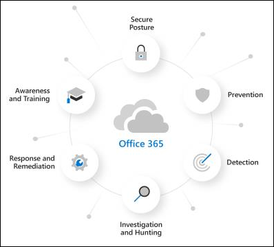

# Microsoft Defender for Office 365 평가판

Microsoft Defender for Office 365 전자 메일 메시지, 링크(URL) 및 공동 작업 도구로 위협되는 악의적인 위협에 대해 조직을 보호합니다. Office 365용 Defender는 다음 사항을 포함합니다.

- **위협 방지 정책**: 위협 방지 정책을 정의하여 조직에 적합한 수준의 보호를 설정합니다.
- **보고서**: 조직의 Office 365용 Defender 성능을 모니터링하는 실시간 보고서를 볼 수 있습니다.
- **위협 조사 및 응답 기능**: 최첨단 도구를 사용하여 위협을 조사, 이해, 시뮬레이션 및 예방할 수 있습니다.
- **자동화된 조사 및 응답 기능**: 위협을 조사하고 완화하는 시간과 노력을 줄여줍니다.

Microsoft Defender for Office 365 평가판은 Defender for Office 365 사용해 보는 가장 쉬운 방법으로, 몇 번의 클릭만 하면 됩니다. 평가판 설정이 완료되면 조직에서 Office 365 계획 1 및 계획 2 기능에 대한 모든 Defender를 최대 90일 동안 사용할 수 있습니다. 이러한 고급 기능은 다음 목록에 설명되어 있습니다.

 

****

|기능|설명|
|---|---|
|[피싱 방지 정책의 단독 설정](set-up-anti-phishing-policies.md#exclusive-settings-in-anti-phishing-policies-in-microsoft-defender-for-office-365)|사용자 가장 보호, 도메인 가장 보호, 사서함 인텔리전스 및 고급 피싱 임계값을 얻습니다.|
|[안전한 첨부 파일](safe-attachments.md)|제어된 검색 환경에서 전자 메일 첨부 파일 및 기타 파일을 검사하여 새로운 맬웨어와 공격적인 맬웨어를 탐지합니다.|
|[안전한 링크](safe-links.md)|클릭 시간 검사를 수행하여 초기 검사를 통과한 URL이 번지르지 않은지 확인할 수 있습니다.|
|[위협 트래커](threat-trackers.md)\*|정보 위젯 및 보기를 사용하여 조직에 영향을 줄 수 있는 사이버 보안 문제를 식별합니다.|
|[위협 탐색기](threat-explorer.md)\*|전자 메일의 위협에 대한 거의 실시간 정보를 Office 365.|
|[자동화된 조사 및 대응(AIR)](office-365-air.md)\*|경고가 트리거될 때 위협 개체를 자동으로 찾아 수정합니다.|
|[공격 시뮬레이션 교육](attack-simulation-training.md)\*|피싱 공격을 식별하고 적절하게 대응하도록 사용자를 교육합니다.|
|[캠페인 보기](campaigns.md)\*|대규모 악성 전자 메일 활동을 조사하고 이에 대응합니다.|
|[Office 365 기능으로 Defender를 사용하는 보고서](view-reports-for-mdo.md)|위협 방지 상태, URL 위협 방지, 메일 대기 시간 등을 포함한 보고서를 볼 수 있습니다.|

\*평가판의 Office 365 사용할 수 있는 계획 2 기능용 Defender.

> [!NOTE]
> 이 문서에서 설명하는 자동화된 구성은 현재 공개 미리 보기에 있으며 조직에서 사용할 수 없습니다.

## 사용 약관

Defender for Office 365 평가판은 90일 동안 사용할 수 있으며 모든 사용자에 대해 시작할 수 있습니다. 자세한 내용은 [Microsoft Defender for Office 365 평가판 조건 & 참조하세요.](defender-for-office-365-trial-terms-and-conditions.md)

## 평가판용 Defender Office 365 설정

평가판을 통해 조직은 평가판 기능을 위해 Defender를 Office 365 수 있습니다. 설치하는 동안 Office 365(특히 금고 첨부 파일, 금고 링크 및 스팸 방지 정책의 가장 보호)에 대한 Defender 전용 정책은 미리 설정한 보안 정책의 표준 템플릿을 사용하여 [적용됩니다.](safe-attachments.md) 

기본적으로 이러한 정책의 범위는 조직의 모든 사용자로 지정되지만 관리자는 설치 중에 또는 이후에 정책을 사용자 지정하여 특정 사용자에게만 적용할 수 있습니다.

설치하는 동안 Office 365 응답 기능에 대한 Defender(Office 365 P2 또는 동등한 기능에 대한 Defender)도 전체 조직에 대해 설정됩니다. 정책의 스위핑은 필요하지 않습니다.

## 라이선싱

평가판 설정의 일부로, Office 365 대한 Defender 라이선스가 조직에 자동으로 적용됩니다. 라이선스는 처음 90일 동안 무료로 제공됩니다.

## 사용 권한

평가판을 시작하거나 종료하려면 평가판에서 전역  관리자  또는 보안 관리자 역할의 구성원 Azure Active Directory. 자세한 내용은 관리자 역할 [정보를 참조하세요.](../../admin/add-users/about-admin-roles.md)

## 추가 정보

평가판에 등록한 후 변경 내용 및 업데이트를 사용할 수 있는 데 최대 2시간이 걸릴 수 있습니다. 또한 관리자는 로그아웃했다가 다시 로그인하여 변경 내용을 확인해야 합니다.

관리자는 모든 시점에서 평가판을 사용하지 않도록 설정할 수 <> 있습니다.

## 사용 가능

Office 365 평가판의 Defender는 특정 기준(지리 포함)을 충족하고 Office 365 플랜 1 또는 계획 2 라이선스(구독 또는 추가 기능으로 포함)에 대한 기존 Defender가 없는 기존 고객에게 점진적으로 배포하고 있습니다.

## Defender for Office 365

비즈니스용 Defender Office 365 포괄적인 기능을 제공하면 조직이 엔터프라이즈를 보호하는 데 도움이 됩니다.

또한 이 대화형 가이드 에서 Office 365 대한 자세한 내용을 볼 [수 있습니다.](https://techcommunity.microsoft.com/t5/video-hub/protect-your-organization-with-microsoft-365-defender/m-p/1671189)

### 방지

강력한 필터링 스택은 비즈니스 전자 메일 손상, 자격 증명 피싱, 랜섬웨어 및 고급 맬웨어를 비롯한 다양한 볼륨 기반 및 대상 공격을 방지합니다.

- [피싱 방지 정책: Defender for Office 365](set-up-anti-phishing-policies.md#exclusive-settings-in-anti-phishing-policies-in-microsoft-defender-for-office-365)
- [안전한 첨부 파일](safe-attachments.md)
- [안전한 링크](safe-links.md)

### 탐지

업계를 선도하는 AI는 악성 및 의심스러운 콘텐츠를 감지하고 공격 패턴을 상관하여 보호를 피하도록 설계된 캠페인을 식별합니다.

- [Microsoft Defender for Office 365](campaigns.md)

### 조사 및 헌팅

강력한 환경은 고급 헌팅 기능을 통해 위협을 식별, 우선 순위 지정 및 조사하는 데 도움을 주며, 여러 환경의 공격을 Office 365.

- [위협 탐색기 및 실시간 검색](threat-explorer.md)
- [Defender for Office 365](view-reports-for-mdo.md)
- [위협 추적기 - 신규 및 주목할 만한 요소](threat-trackers.md)
- 통합 [Microsoft 365 Defender](../defender/microsoft-365-defender.md)

### 대응 및 수정

광범위한 인시던트 대응 및 자동화 기능은 보안 팀의 효율성과 효율성을 향상시킵니다.

- [Microsoft Defender의 자동화된 조사 및 대응(AIR)Office 365](office-365-air.md)

### 인식과 교육

풍부한 시뮬레이션 및 교육 기능과 클라이언트 응용 프로그램 내의 통합된 환경을 통해 사용자 인식을 향상합니다.

- [공격의 신나는 교육 사용 시작](attack-simulation-training-get-started.md)

### 보안 자세

권장 템플릿 및 구성 정보를 통해 고객은 안전하게 보호할 수 있습니다.

- [EOP 및 Microsoft Defender for Office 365](preset-security-policies.md)
- [EOP의 보호 정책에](configuration-analyzer-for-security-policies.md)대한 구성 분석기 및 Microsoft Defender for Office 365.

## 피드백 제공

사용자 의견은 고급 공격으로부터 환경을 보호하는 데 도움이 됩니다. 제품 기능 및 평가판 결과의 경험과 노출을 공유합니다.
