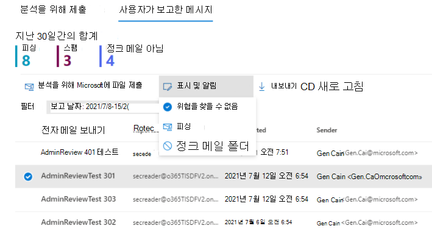

# 보고된 메시지에 대한 관리자 검토

[!INCLUDE [Microsoft 365 Defender rebranding](../includes/microsoft-defender-for-office.md)]

**적용 대상**
- [Office 365용 Microsoft Defender 플랜 1 및 플랜 2](defender-for-office-365.md)
- [Microsoft 365 Defender](../defender/microsoft-365-defender.md)

Microsoft 365 사서함이 Exchange Online 및 Microsoft Defender for Office 365 조직에서 관리자는 이제 보고된 메시지를 검토한 후 템플릿 기반 메시지를 최종 사용자에게 다시 보낼 수 있습니다. 템플릿은 조직에 맞게 사용자 지정하고 관리자의 판결에 따라 사용자 지정될 수 있습니다.

이 기능은 사용자에게 피드백을 제공하도록 설계되지만 시스템에서 메시지의 판정은 변경되지 않습니다. Microsoft에서 필터를 업데이트하고 개선할 수 있도록 관리자 제출을 사용하여 분석을 위해 메시지를 [제출해야 합니다.](admin-submission.md)

메시지가 가음성 또는 가음성으로 보고된 경우 검토 결과를 표시하고 사용자에게 [알릴 수만 있습니다.](report-false-positives-and-false-negatives.md)

## 시작하기 전에 알아야 할 내용은 무엇인가요?

- <https://security.microsoft.com/>에서 Microsoft 365 Defender 포털을 엽니다. 제출 **페이지로** 직접 이동하기 위해 를 <https://security.microsoft.com/reportsubmission> 사용하세요.

- 사용자 제출에 대한 구성을 수정하려면 다음 역할 그룹 중 하나의 구성원이 되어야 합니다.
  - 조직 포털의 조직 관리 [또는 Microsoft 365 Defender 관리자입니다.](permissions-microsoft-365-security-center.md)
  - 에서 조직 [Exchange Online.](/Exchange/permissions-exo/permissions-exo#role-groups)

- PowerShell을 사용할 수도 Exchange Online 있습니다. 사용하려는 계정이 Exchange Online PowerShell에 액세스할 수 없는 경우 도메인에 전자 메일 주소 지정 을 입력하는 오류가 *표시됩니다.* PowerShell에 대한 액세스를 활성화하거나 Exchange Online 자세한 내용은 다음 항목을 참조하세요.
  - [Exchange Online PowerShell에 대한 액세스 설정 또는 해제](/powershell/exchange/disable-access-to-exchange-online-powershell)
  - [클라이언트 액세스 규칙의 Exchange Online](/exchange/clients-and-mobile-in-exchange-online/client-access-rules/client-access-rules)

## 포털 내에서 사용자에게 알림

1. Microsoft 365 Defender 포털에서 제출 페이지로 **직접** 이동합니다. [ https://security.microsoft.com/reportsubmission}(https://security.microsoft.com/reportsubmission) .

2. 사용자가 **보고한 메시지를** 클릭한 다음 표시하고 알릴 메시지를 선택합니다.

3. **다음으로 표시 및** 알림 드롭다운을 선택한 다음 위협 **없음,** 피싱 **또는** 정크를 **선택합니다.**

   > [!div class="mx-imgBorder"]
   > 

보고된 메시지는 가짓 긍정 또는 거짓 부정으로 표시되며, 메시지를 보고한 사용자에게 알리는 전자 메일이 포털 내에서 자동으로 전송됩니다.

## 사용자에게 알리는 데 사용되는 메시지 사용자 지정

1. Microsoft 365 Defender 포털에서 전자 메일 **&** 공동 작업 정책 & 규칙 위협 정책 사용자가 기타 섹션에서 메시지 설정을 \>  \>  \>  **보고했습니다.**

2. 사용자  제출 페이지에서 보낸 사람 표시 이름을 지정하려면 관리자 검토 결과에 대한 전자 메일 알림 **섹션에서** 보낸  사람으로 사용할 Office 365 전자 메일 주소 지정 확인란을 확인하고 사용할 이름을 입력합니다. 전자 메일 주소가 메시지에 표시될 Outlook 모든 응답이 여기에 표시됩니다.

3. 서식 파일을 사용자 지정하려면 페이지 아래쪽의 전자 **메일** 알림 사용자 지정을 클릭합니다. 플라이아웃이 열리면 다음 사항만 사용자 지정할 수 있습니다.

    - 피싱
    - 정크
    - 위협이 발견되지 않음
    - 바닥글

    > [!div class="mx-imgBorder"]
    > 

4. 작업을 마쳤으면 **저장** 을 클릭합니다. 이러한 값을 지우려면 사용자 **제출** 페이지에서 삭제를 클릭합니다.
