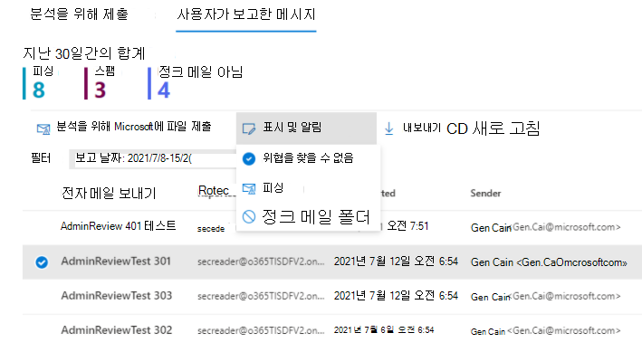
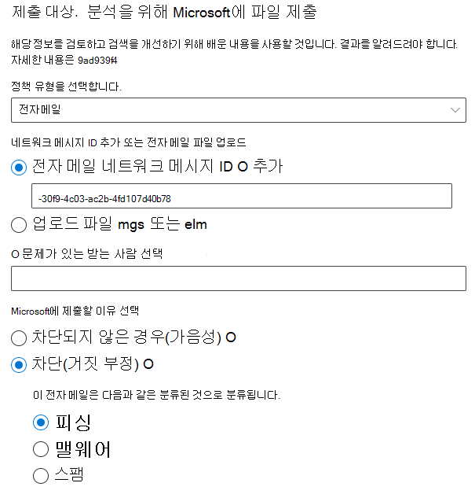
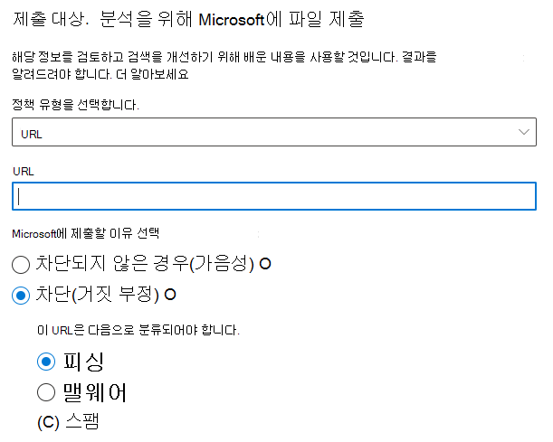
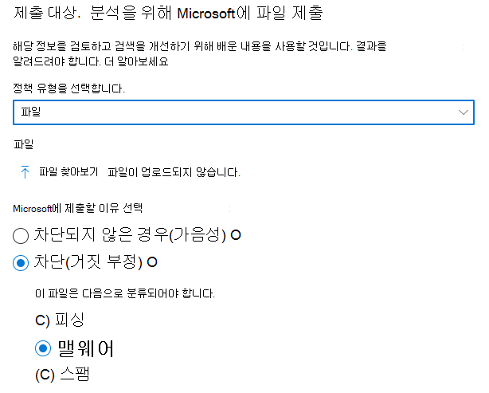
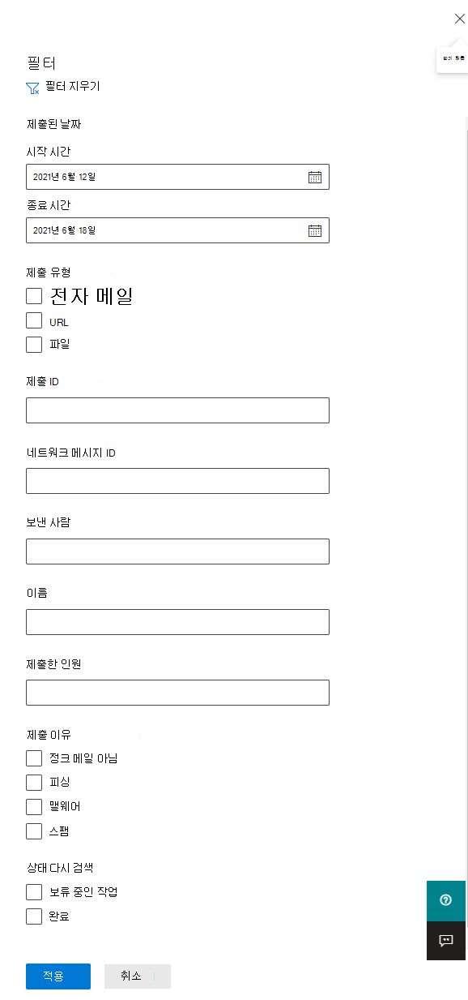
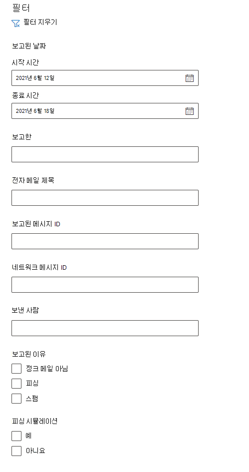
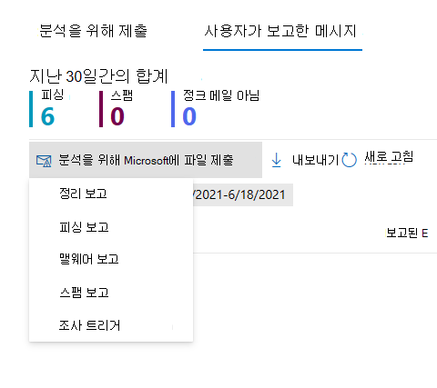

# 제출 포털을 사용하여 의심되는 스팸, 피싱, URL 및 파일을 Microsoft에 제출

[!INCLUDE [Microsoft 365 Defender rebranding](../includes/microsoft-defender-for-office.md)]

**적용 대상**
- [Exchange Online Protection](exchange-online-protection-overview.md)
- [Office 365용 Microsoft Defender 플랜 1 및 플랜 2](defender-for-office-365.md)

Microsoft 365 사서함이 Exchange Online 조직에서 관리자는 Microsoft 365 Defender 포털의 제출 포털을 사용하여 검색을 위해 전자 메일 메시지, URL 및 첨부 파일을 Microsoft에 제출할 수 있습니다.

분석을 위해 전자 메일 메시지를 제출하면 다음을 얻을 수 있습니다.

- **전자 메일 인증 확인:** 전자 메일 인증이 전달될 때 통과 또는 실패한 경우의 세부 정보입니다.
- **정책 적중:** 테넌트로 들어오는 전자 메일을 허용하거나 차단할 수 있는 정책에 대한 정보로, 서비스 필터 판정을 어버렸다.
- **페이로드 신뢰도/확인:** 메시지의 모든 URL 및 첨부 파일을 최신으로 검사합니다.
- **성적 분석:** 휴먼 등급이 수행한 검토를 통해 메시지가 악성인지 여부를 확인할 수 있습니다.

> [!IMPORTANT]
> 페이로드 신뢰도/분석 및 등급 분석은 모든 테넌트에서 수행되지 않습니다. 데이터가 규정 준수를 위해 테넌트 경계를 떠날 수 없는 경우 정보가 조직 외부로 나가지 못하도록 차단됩니다.

Microsoft에 전자 메일 메시지, URL 및 첨부 파일을 제출하는 다른 방법은 Microsoft에 메시지 및 파일 보고를 [참조하세요.](report-junk-email-messages-to-microsoft.md)

## 시작하기 전에 알아야 할 내용은 무엇인가요?

- <https://security.microsoft.com/>에서 Microsoft 365 Defender 포털을 엽니다. 제출 **페이지로** 직접 이동하기 위해 를 <https://security.microsoft.com/reportsubmission> 사용하세요.

- 메시지와 파일을 Microsoft에 제출하려면 다음 역할 그룹 중 하나의 구성원이 해야 합니다.
  - **조직 포털의** 조직 관리 [또는 보안 Microsoft 365 Defender.](permissions-microsoft-365-security-center.md) 
  
    이 역할 그룹의 구성원 자격은  이 문서의 부분에서 설명하는 사용자 지정 사서함에 대한 사용자 전송 보기에 필요합니다.

- 사서함에서 여전히 사용할 수 있으며 사용자 또는 다른 관리자가 제거하지 않은 경우 관리자는 30일 이전의 메시지를 전송할 수 있습니다.

- 관리자 제출은 다음과 같은 요금으로 스로틀됩니다.
  - 15분 동안의 최대 제출 수: 150개 제출
  - 24시간 동안 동일한 제출: 3회 제출
  - 15분 동안 동일한 제출: 1개 제출
  
- 사용자가 Microsoft에 메시지와 파일을 제출하는 방법에 대한 자세한 내용은 Microsoft에 메시지 및 파일 [보고를 참조하세요.](report-junk-email-messages-to-microsoft.md)

## Microsoft에 의심스러운 콘텐츠 보고

1. Microsoft 365 Defender <a href="https://go.microsoft.com/fwlink/p/?linkid=2077139" target="_blank">포털에서</a>전자 메일 &  \> **제출으로 이동하세요.**

2. 제출 **페이지에서** 분석용 **제출** 탭이 선택되어 있는지 확인한 다음 광고  **분석을 위해 Microsoft에 제출합니다.**

3. 다음 **섹션에** 설명된 메시지, URL 또는 전자 메일 첨부 파일을 제출하는 것으로 나타나는 검토 플라이아웃을 위해 Microsoft에 제출을 사용합니다.

   > [!NOTE]
   > 클라우드에서 데이터가 환경을 떠날 수 없는 경우 파일 및 URL 전송을 사용할 수 없습니다. 파일 또는 URL을 선택할 수 있는 능력은 회색으로 표시됩니다.

### 포털 내에서 사용자에게 알림

1. Microsoft 365 Defender 포털에서 의 제출 **페이지로** <https://security.microsoft.com/reportsubmission> 이동합니다.

2. 사용자가 **보고한 메시지를** 선택한 다음 표시하고 알릴 메시지를 선택합니다.

3. **다음으로 표시 및** 알림 드롭다운을 선택한 다음 피싱 또는 정크를 찾을 수 **없는** 위협 \>  없음을 **선택합니다.**

   > [!div class="mx-imgBorder"]
   > 

보고된 메시지는 가짓 긍정 또는 거짓 부정으로 표시됩니다. 전자 메일 알림은 포털 내에서 메시지를 보고한 사용자에게 자동으로 전송됩니다.

### Microsoft에 질문이 있는 전자 메일 제출

1. 제출 **유형 선택 상자의** 드롭다운 목록에서 전자 메일이 선택되어 있는지 확인해야 합니다. 

2. 네트워크 메시지 **ID 추가 또는** 전자 메일 파일 업로드 섹션에서 다음 옵션 중 하나를 사용하세요.
   - **전자** 메일 네트워크 메시지 ID 추가: 이 값은 메시지의 **X-MS-Exchange-Organization-Network-Message-Id** 헤더 또는 분리된 메시지의 **X-MS-Office365-Filtering-Correlation-Id** 헤더에서 사용할 수 있는 GUID 값입니다.
   - **업로드 파일(.msg 또는 .eml)**: 파일 **찾아보기를 클릭합니다.** 대화 상자가 열리면 .eml 또는 .msg 파일을 찾아 선택한 다음 열기 를 **클릭합니다.**

3. 문제가 **있는** 받는 사람 선택 상자에서 정책을 실행할 받는 사람을 지정합니다. 정책 검사는 사용자 또는 조직 정책으로 인해 전자 메일이 검사를 무시한지 여부를 판단합니다.

4. **Microsoft에** 제출할 이유 선택 섹션에서 다음 옵션 중 하나를 선택합니다.
   - **차단되지 않은 경우(가음성)**
   - **차단된** 항목: 전자  메일이 나타나는 섹션으로 분류됩니다. 섹션에서 다음 값 중 하나를 선택합니다(확실하지 않은 경우 최상의 판단 사용).
     - **피싱**
     - **스팸**
     - **맬웨어**

5. 완료되면 제출 **단추를** 클릭합니다.

> [!div class="mx-imgBorder"]
> 

### 의심되는 URL을 Microsoft로 보내기

1. 제출 **유형 선택 상자의** **드롭다운** 목록에서 URL을 선택합니다.

2. 나타나는 **URL 상자에** 전체 URL(예: )을 `https://www.fabrikam.com/marketing.html` 입력합니다.

3. **Microsoft에** 제출할 이유 선택 섹션에서 다음 옵션 중 하나를 선택합니다.
   - **차단되지 않은 경우(가음성)**
   - **차단된 항목:** 이 **URL이** 나타나는 섹션으로 분류되어 있습니다. 섹션에서 피싱 또는 맬웨어를 **선택합니다.** 

4. 완료되면 제출 **단추를** 클릭합니다.

> [!div class="mx-imgBorder"]
> 

### 의심되는 전자 메일 첨부 파일을 Microsoft에 제출

1. 제출 **유형 선택 상자의** **드롭다운** 목록에서 파일을 선택합니다.

2. 나타나는 **파일** 섹션에서 파일 **찾아보기를 클릭합니다.** 대화 상자가 열리면 파일을 찾아 선택한 다음 열기 를 **클릭합니다.**

3. **Microsoft에** 제출할 이유 선택 섹션에서 다음 옵션 중 하나를 선택합니다.
   - **차단되지 않은 경우(가음성)**
   - **차단된** 항목: 이 **URL을** 나타나는 섹션으로 분류해야 합니다.  맬웨어만 선택할 수 있으며 자동으로 선택됩니다.

4. 완료되면 제출 **단추를** 클릭합니다.

> [!div class="mx-imgBorder"]
> 

> [!NOTE]
> 맬웨어 필터링이 메시지 첨부 파일을 맬웨어 경고 파일로 Text.txt 경우 원본 첨부 파일이 포함된 원본 메시지를 검지에서 제출해야 합니다. 맬웨어 가극적 맬웨어가 있는 메시지를 릴리스하는 방법에 대한 자세한 내용은 관리자로 검사된 메시지 및 파일 관리를 [참조하세요.](manage-quarantined-messages-and-files.md)

## Microsoft에 대한 관리자 제출 보기

1. Microsoft 365 Defender <a href="https://go.microsoft.com/fwlink/p/?linkid=2077139" target="_blank">포털에서</a>전자 메일 &  \> **제출으로 이동하세요.**

2. 제출 **페이지에서** 분석을 위해 제출된 **탭이** 선택되어 있는지 확인하십시오.

   - 사용 가능한 열 헤더를 클릭하여 항목을 정렬할 수 있습니다. 열 **사용자 지정을 클릭하여** 최대 7개의 열을 나타냅니다. 기본값은 별표(\*)로 표시됩니다.
     - **제출 이름**\*
     - **보낸 사람**\*
     - **제출된 날짜**\*
     - **제출 유형**\*
     - **제출 이유**\*
     - **상태 다시 검색**\*
     - **결과 다시 검색**\*
     - **태그**\*
     - **필터 판정**
     - **배달/차단 이유**
     - **제출 ID**
     - **네트워크 메시지 ID/개체 ID**
     - **방향**
     - **보낸 사람 IP**
     - **BCL(대량 규격 수준)**
     - **대상**
     - **정책 작업**
     - **제출한 인원**

     완료되면 **적용** 을 클릭합니다.

   - 항목을 필터링하려면 필터 를 **클릭합니다.** 사용 가능한 필터:
     - **제출 날짜:** **시작 날짜 및** 종료 **날짜입니다.**
     - **제출 유형:** **전자 메일,** **URL** 또는 **파일입니다.**
     - **제출 ID:** 모든 제출에 할당된 GUID 값입니다.
     - **네트워크 메시지 ID**
     - **보낸 사람**
     - **태그**

     완료되면 **적용** 을 클릭합니다.

     > [!div class="mx-imgBorder"]
     > 

   - 항목을 그룹화하려면 그룹을 **클릭하고** 드롭다운 목록에서 다음 값 중 하나를 선택합니다.
     - **없음**
     - **유형**
     - **이유**
     - **상태**
     - **결과 다시 검색**

   - 항목을 내보내려면 내보내기 를 **클릭합니다.** 나타나는 대화 상자에서 파일 .csv 저장합니다.

### 관리자 제출 세부 정보 다시 검색

관리자 제출에 제출된 메시지는 검토 및 결과 제출 세부 정보 플라이아웃에 표시됩니다.

- 전송 시 보낸 사람의 전자 메일 인증에 오류가 있는 경우입니다.
- 메시지의 평가 결과에 영향을 주거나 재정의할 수 있는 정책 조회에 대한 정보입니다.
- 메시지에 포함된 URL 또는 파일이 악의적인지 여부를 확인하는 현재 데토네이션 결과입니다.
- 성적에 대한 피드백

재정의가 발견되면 몇 분 후에 다시 검색이 완료됩니다. 전자 메일 인증에 문제가 없는 경우 또는 배달이 오버라이드의 영향을 받지 않은 경우 등급의 피드백이 하루까지 걸릴 수 있습니다.

## Microsoft에 대한 사용자 제출 보기

보고서 메시지 추가 기능, 피싱 보고 추가 기능 또는 웹용 Outlook 기본 제공 보고를 사용하는 경우 사용자가 보고하는 메시지를 사용자 보고 탭에서 볼 수 **있습니다.** 

1. Microsoft 365 Defender <a href="https://go.microsoft.com/fwlink/p/?linkid=2077139" target="_blank">포털에서</a>전자 메일 &  \> **제출으로 이동하세요.**

2. 제출 **페이지에서** 사용자가 보고한 **메시지 탭을** 선택합니다.

   - 사용 가능한 열 헤더를 클릭하여 항목을 정렬할 수 있습니다. 열 **사용자 지정을 클릭하여** 최대 7개의 열을 나타냅니다. 기본값은 별표(\*)로 표시됩니다.

     - **전자 메일 제목**\*
     - **보고한**\*
     - **보고된 날짜**\*
     - **보낸 사람**\*
     - **보고된 이유**\*
     - **결과 다시 검색**\*
     - **태그**\*
     - **보고된 메시지 ID**
     - **네트워크 메시지 ID**
     - **보낸 사람 IP**
     - **피싱 시뮬레이션**

     완료되면 **적용** 을 클릭합니다.

   - 항목을 필터링하려면 필터 를 **클릭합니다.** 사용 가능한 필터:
     - **보고된 날짜:** **시작 날짜 및** 종료 **날짜입니다.**
     - **보고한**
     - **전자 메일 제목**
     - **보고된 메시지 ID**
     - **네트워크 메시지 ID**
     - **보낸 사람**
     - **보고된 이유:** **정크** 메일 아님, **피싱** **또는** 스팸 .
     - **피싱 시뮬레이션:** **예** 또는 **아니요**
     - **태그**

     완료되면 **적용** 을 클릭합니다.

     > [!div class="mx-imgBorder"]
     > 

   - 항목을 그룹화하려면 그룹을 **클릭하고** 드롭다운 목록에서 다음 값 중 하나를 선택합니다.
     - **없음**
     - **이유**
     - **보낸 사람**
     - **보고한**
     - **결과 다시 검색**
     - **피싱 시뮬레이션**

   - 항목을 내보내려면 내보내기 를 **클릭합니다.** 나타나는 대화 상자에서 파일 .csv 저장합니다.

> [!NOTE]
> 조직에서 사용자 지정 사서함으로만 사용자 보고 메시지를 보내도록 구성된 경우 보고된 메시지는 다시 검색을 위해 전송되지 않습니다. **사용자** 보고 메시지의 결과는 항상 비어 있습니다.

### 사용자 제출 취소

사용자가 의심스러운 전자 메일을 사용자 지정 사서함에 제출하면 사용자와 관리자는 제출을 취소할 수 있는 옵션이 없습니다. 사용자가 전자 메일을 복구하려면 지우기 항목 또는 정크 메일 폴더에서 복구할 수 있습니다.

### 사용자 지정 사서함에서 관리자 제출로 사용자가 보고한 메시지 변환 

Microsoft로 메시지를 보내지 않고 사용자가 보고한 메시지를 가로채도록 사용자 지정 사서함을 구성한 경우 분석을 위해 특정 메시지를 찾아 Microsoft로 보낼 수 있습니다.

사용자 **보고** 메시지 탭의 목록에서 메시지를 선택하고 분석을 위해 **Microsoft에** 제출을 클릭한 다음 드롭다운 목록에서 다음 값 중 하나를 선택합니다.

- **정리 보고**
- **피싱 보고**
- **맬웨어 보고**
- **스팸 보고**
- **조사 트리거**

> [!div class="mx-imgBorder"]
> 
