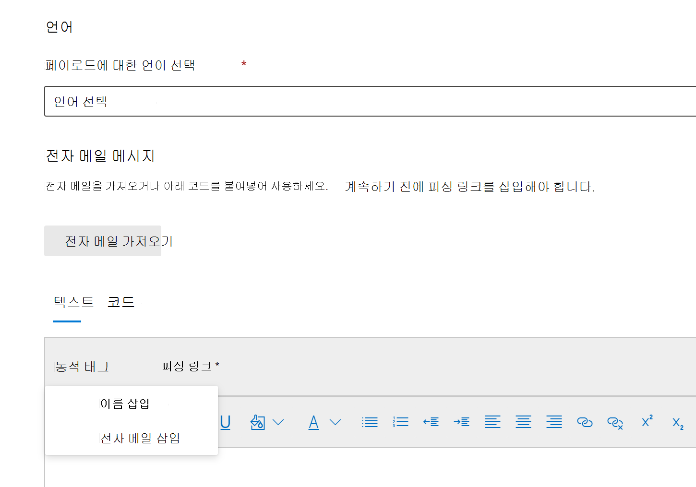

# 공격 시뮬레이션 교육에 대한 사용자 지정 페이로드 만들기

Microsoft는 공격 시뮬레이션 교육과 쌍을 이을 수 있는 다양한 소셜 엔지니어링 기술에 대한 강력한 페이로드 카탈로그를 제공합니다. 그러나 조직에 더 잘 작동할 수 있는 사용자 지정 페이로드를 만들 수 있습니다. 이 문서에서는 Microsoft Defender for Office 365의 공격 시뮬레이션 교육에서 페이로드를 만드는 방법을 설명합니다.

전용 페이로드 탭 또는 시뮬레이션  만들기 마법사 내에서 페이로드 만들기를 클릭하여 [페이로드를 만들 수 있습니다.](attack-simulation-training.md#selecting-a-payload) 

마법사의 첫 번째 단계에서 페이로드 유형을 선택합니다. **현재는 전자 메일만 사용할 수 있습니다.**

그런 다음 관련 기술을 선택합니다. 기술에 대한 자세한 내용은 소셜 엔지니어링 기술 [선택을 참조합니다.](attack-simulation-training.md#selecting-a-social-engineering-technique)

다음 단계에서 페이로드 이름을 지정합니다. 원하는 경우 설명을 입력할 수 있습니다.

## 페이로드 구성

이제 페이로드를 빌드해야 합니다. 보낸 사람 세부 정보 섹션에서 보낸 사람 이름, 전자 메일 주소 및 전자 메일 **제목을 입력합니다.** 제공된 목록에서 피싱 URL을 선택합니다. 이 URL은 나중에 메시지 본문에 추가됩니다.

> [!TIP]
> 페이로드의 보낸 사람에 대한 내부 전자 메일을 선택하면 페이로드가 회사의 다른 직원으로부터 보낸 것으로 표시될 수 있습니다. 이렇게 하면 페이로드에 대한 접근성이 높아지며 직원에게 내부 위협의 위험을 교육하는 데 도움이 됩니다.

페이로드를 만들 수 있는 텍스트 편집기를 사용할 수 있습니다. 또한 앞서 만든 전자 메일을 가져올 수도 있습니다. 전자 메일 본문을 만들 때 동적  태그를 사용하여 전자 메일을 대상에 맞게 개인 설정하세요. 피싱 **링크를 클릭하여** 메시지 본문에 이전에 선택한 피싱 URL을 추가합니다.

> [!TIP]
> 시간을 절약하려면 전자 메일 메시지의 모든 링크를 피싱 링크로 바꾸는 옵션을 **토글합니다.**

원하는 페이로드를 구축한 후 다음 을 **클릭합니다.**

## 표시기 추가

지표는 공격 시뮬레이션을 진행하는 직원이 향후 공격에서 찾아야 할 단서를 이해하는 데 도움이 될 것입니다. 시작하려면 **표시기 추가를 클릭합니다.**

드롭다운 목록에서 사용할 표시기를 선택합니다. 이 목록은 피싱 전자 메일 메시지에 나타나는 가장 일반적인 단서를 포함하기 위해 큐레이터로 구성됩니다. 선택한 후 표시기 배치가 전자 메일 **본문에서로** 설정되어 있는지 확인한 다음 텍스트 선택 **을 클릭합니다.** 이 표시기가 나타나는 페이로드 부분을 강조 표시하고 선택을 **클릭합니다.**

사용자 지정 설명을 추가하여 표시기를 설명하고 표시기 미리 보기 프레임 내에서 클릭하여 표시기 미리 보기를 볼 수 있습니다. 완료되면 추가를 **클릭합니다.** 페이로드의 모든 표시기를 다를 때까지 이러한 단계를 반복합니다.

## 페이로드 검토

페이로드를 완료했습니다. 이제 세부 정보를 검토하고 페이로드의 미리 보기를 볼 시간입니다. 미리 보기에는 만든 모든 표시기가 포함됩니다. 이 단계에서 페이로드의 각 부분을 편집할 수 있습니다. 충족하면 **페이로드를 제출할** 수 있습니다.

> [!IMPORTANT]
> 만든 페이로드에는 **테넌트가** 원본으로 있습니다. 페이로드를 선택할 때 테넌트 를 필터링하지 **않는지 확인 합니다.**

## 관련 링크

[공격의 신나는 교육 사용 시작](attack-simulation-training-get-started.md)

[피싱 공격 시뮬레이션 만들기](attack-simulation-training.md)

[공격 시뮬레이션 교육 활용](attack-simulation-training-insights.md)
