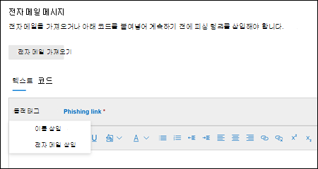

# Defender에서 공격 시뮬레이션 교육을 위한 사용자 지정 페이로드를 Office 365

**Microsoft** [Defender for Office 365 요금제 2에 적용](defender-for-office-365.md)

공격 시뮬레이션 교육에서  페이로드는 시뮬레이션 시 사용자에게 제시된 피싱 전자 메일 메시지 및 웹 페이지입니다. Microsoft 365 E5 또는 Microsoft Defender for Office 365 계획 2의 공격 시뮬레이션 교육은 사용 가능한 소셜 엔지니어링 기술에 대한 강력한 기본 제공 페이로드 카탈로그를 제공합니다. 그러나 조직에 더 잘 작동할 수 있는 사용자 지정 페이로드를 만들 수 있습니다.

이 문서에서는 공격 시뮬레이션 교육에서 직접 페이로드를 만드는 방법을 설명하고 있습니다. 다음 위치에서 사용자 지정 페이로드를 만들 수 있습니다.

- **페이로드** 탭: 의 Microsoft 365 Defender 포털에서 전자 메일 & 공격 시뮬레이션 <https://security.microsoft.com/>  \> **교육** \> **페이로드 탭으로** 이동하세요. 페이로드 탭으로 직접 **이동하기** 위해 를 <https://security.microsoft.com/attacksimulator?viewid=payload> 사용합니다.
- 시뮬레이션을 만드는 동안: 시뮬레이션 만들기 마법사의 페이로드 선택 페이지(세 번째 페이지)에서 사용자 지정 페이로드를 만들 수 있습니다.  자세한 내용은 에 대한 Defender의 피싱 공격 [시뮬레이션을 Office 365.](attack-simulation-training.md)

공격 시뮬레이션 교육에 대한 시작 정보는 공격 시뮬레이션 교육 사용 [시작을 참조하세요.](attack-simulation-training-get-started.md)

> [!NOTE]
> 특정 상표, 로고, 기호, 사인 및 기타 원본 식별자는 로컬, 주 및 연방법 및 법률에 따라 강화된 보호를 받을 수 있습니다. 이러한 표시기를 무단으로 사용할 경우 사용자에게 범죄 벌금을 비롯한 벌금을 부과할 수 있습니다. 광범위한 목록은 아니며, 여기에는 부사장, 부사장, 의회 봉인, CIA, FBI, 사회 보장, 메디케어 및 Medicaid, 미국 국세청 및 국세청이 포함됩니다. 이러한 상표 범주를 넘어 제3자 상표를 사용 및 수정하면 본질적인 위험이 수차차적으로 증가합니다. 페이로드에서 자체 상표 및 로고를 사용하는 것은 특히 조직에서 사용을 허용하는 경우 덜 위험합니다. 페이로드를 만들거나 구성할 때 사용하는 것이 적절하거나 적절하지 않은 경우 법률 자문가에게 문의해야 합니다.

## 페이로드 만들기

페이로드 만들기  **공격 시뮬레이션** 교육의 **페이로드** 탭 또는 시뮬레이션 만들기 **** 마법사의 페이로드 선택 페이지에서 페이로드 만들기 마법사가 시작되어 이 섹션에 설명되어 있습니다.

### 페이로드 유형 선택

유형 **선택 페이지에서** 현재 선택할 수 있는 값은 전자 메일뿐입니다. 

**다음** 을 클릭합니다.

### 소셜 엔지니어링 기술 선택

기술 **선택 페이지에서** 사용 가능한 옵션은 시뮬레이션 만들기  마법사의 기술 선택 페이지에서와 같습니다.

- **자격 증명 수집**
- **맬웨어 첨부 파일**
- **첨부 파일 링크**
- **맬웨어 링크**
- **URL 드라이브**

작업을 마친 후 **다음** 을 클릭합니다.

### 페이로드 이름 및 설명

페이로드 **이름 페이지에서** 다음 설정을 구성합니다.

- **이름:** 페이로드에 대한 설명이 있는 고유한 이름을 입력합니다.
- **설명:** 페이로드에 대한 선택적 자세한 설명을 입력합니다.

작업을 마친 후 **다음** 을 클릭합니다.

## 페이로드 구성

페이로드 **구성 페이지에서** 페이로드를 빌드할 시간입니다. 사용 가능한 대부분의 설정은 기술 선택 페이지에서  선택한 옵션(예: 링크 및 첨부 파일)에 따라 결정됩니다.

- **보낸 사람 세부 정보** 섹션: 다음 설정을 구성합니다.
  - **From name**
  - **표시 이름으로 이름 사용:** 기본적으로 이 설정은 선택되어 있지 않습니다.
  - **전자 메일:** 페이로드의 보낸 사람에 대한 내부 전자 메일 주소를 선택하면 페이로드가 동료 직원에게서 발송된 것으로 표시됩니다. 이 보낸 사람 전자 메일 주소는 페이로드에 대한 사용자의 접근성을 높이고 직원에게 내부 위협의 위험을 교육하는 데 도움이 됩니다.
  - **전자 메일 제목**

- **첨부 파일 세부 정보** 섹션: 이 섹션은 기술 선택 페이지에서  맬웨어 첨부 **파일,** 첨부 파일에서 링크 **또는** 맬웨어에 대한 링크를 선택한 **경우만 사용할 수** 있습니다. 다음 설정을 구성합니다.
  - **첨부 파일 이름 지정**
  - **첨부 파일 형식 선택:** 현재 사용 가능한 값은 **Docx뿐입니다.**

- **첨부 파일 링크 섹션:** 이 섹션은 기술 선택 페이지에서 맬웨어에 **대한** 링크를 선택한 **경우만 사용할 수** 있습니다. 맬웨어 첨부 파일로 사용할 **URL** 선택 링크 상자에서 사용 가능한 URL(피싱 링크 섹션에 설명된 URL) 중 하나를 **선택합니다.**

  나중에 메시지 본문에 URL을 추가합니다.

- **피싱 링크** 섹션: 이 섹션은 기술 선택 페이지에서 자격 증명 **수집,** 첨부 파일 링크 또는 **드라이브로 URL을** 선택한 **경우만 사용할 수** 있습니다.

  자격 **증명 수집** 또는 드라이브 BY **URL의** 경우 상자의 이름은 피싱 링크로 사용할 **URL을 선택합니다.** 나중에 메시지 본문에 URL을 추가합니다.

  첨부 **파일 링크의** 경우 상자의 이름은 이 첨부 파일에서 피싱 링크로 사용할 **URL을 선택합니다.** 나중에 첨부 파일에 URL을 포함하게 됩니다.

  사용 가능한 URL 값 중 하나를 선택합니다.
  
  - <https://www.mcsharepoint.com>
  - <https://www.attemplate.com>
  - <https://www.doctricant.com>
  - <https://www.mesharepoint.com>
  - <https://www.officence.com>
  - <https://www.officenced.com>
  - <https://www.officences.com>
  - <https://www.officentry.com>
  - <https://www.officested.com>
  - <https://www.prizegives.com>
  - <https://www.prizemons.com>
  - <https://www.prizewel.com>
  - <https://www.prizewings.com>
  - <https://www.shareholds.com>
  - <https://www.sharepointen.com>
  - <https://www.sharepointin.com>
  - <https://www.sharepointle.com>
  - <https://www.sharesbyte.com>
  - <https://www.sharession.com>
  - <https://www.sharestion.com>
  - <https://www.templateau.com>
  - <https://www.templatent.com>
  - <https://www.templatern.com>
  - <https://www.windocyte.com>

  > [!NOTE]
  > URL 신뢰도 서비스는 이러한 URL 중 하나 이상을 안전하지 않은 것으로 식별할 수 있습니다. 시뮬레이션에서 URL을 사용하기 전에 지원되는 웹 브라우저에서 URL의 가용성을 확인합니다. 자세한 내용은 Google 금고 검색에서 차단된 [피싱 시뮬레이션 URL을 참조하세요.](attack-simulation-training-faq.md#phishing-simulation-urls-blocked-by-google-safe-browsing)

- **첨부 파일 콘텐츠** 섹션: 이 섹션은 기술 선택 페이지에서 첨부 파일에서 **링크를** 선택한 **경우만 사용할 수** 있습니다.

  첨부 파일 페이로드에서 콘텐츠를 만들 수 있는 텍스트 편집기를 사용할 수 있습니다.

  피싱 **링크 컨트롤을** 사용하여 이전에 선택한 피싱 URL을 첨부 파일에 추가합니다.

- 일반 설정:
  - **태그 추가**
  - **테마:** 사용 가능한 값은 계정 **활성화,** 계정 **확인,** **청구,** 정리 **메일,** **문서** 수신, **경비,** **팩스,** **재무 보고서,** 받는 **메시지,** **송장,** **항목을 받은** **항목,** 로그인 알림, **메일** 수신, **기타,** **암호,** **결제,** 급여, 개인 설정 제품, **Quarantine입니다.**  , **원격 작업**, 검토 **메시지,** 보안 **업데이트,** **서비스** 일시 중단 , **서명 필요**, 사서함 업그레이드 Storage , 사서함 확인 또는 음성 **메일**.  
  - **브랜드**: 사용할 수 있는 값은 **American Express,** **Capital One,** **DHL,** **DocuSign,** **Dropbox**, **Facebook, First** **American**, **Microsoft**, Microsoft , **Microsoft ,,** **Scotiabank**, **SendGrid**, **Stewart Title**, **Tesco**, **Wells Fargo,** **Syrinx Cloud** 또는 **Other입니다.**
  - **산업:** 사용 가능한 값은 뱅킹,  **비즈니스** 서비스, **소비자** 서비스, **교육,** **에너지,**  **구성,** **컨설팅,** **금융** 서비스, **정부,** 병원, 보험, **법률,** **Courier 서비스,** **IT** **,** **의료,** **제조,** 소매, **Telecom,**   **부동산 또는 기타**.
  - **현재 이벤트:** 사용 가능한 값은 **예 또는 아니요입니다.** 
  - **논란:** 사용 가능한 값은 **예 또는 아니요입니다.** 

- **언어** 섹션: 페이로드의 언어를 선택합니다. 사용 가능한 값은 **영어,** **스페인어,** **독일어,** **일본어,** **프랑스어,** **포르투갈어,** **네덜란드어,** **이탈리아어,** **스웨덴어,** **중국어(간체)**, **노르웨이어 Bokmål,** **폴란드어,** 러시아어, **핀란드어,** **한국어,** **터키어,** **헝가리어,** **Hebrew,** **태국어,** **아랍어,** **베트남어,** 슬로바키아어,  **그리스어입니다.**, **인도네시아어,** **루마니아어,** **콜로베니아어,** **크로아티아어,** 카탈로니아어 또는 **기타**. 

- **전자 메일 메시지** 섹션:

  - 전자 메일 **가져오기,** 파일 선택을 클릭하여 기존 일반 텍스트 메시지 파일을 가져올 수 있습니다. 

  - 텍스트 **탭에서** 전자 메일 메시지 페이로드를 만들 수 있는 텍스트 편집기를 사용할 수 있습니다.

    - 동적 태그 **컨트롤을** 사용하여 사용 가능한 태그를 삽입하여 각 사용자의 전자 메일 메시지를 개인 설정합니다.
      - **삽입 이름:** 메시지 본문에 추가된 값은 `${userName}` 입니다.
      - **전자 메일 삽입**: 메시지 본문에 추가된 값은 입니다. `${emailAddress}`

      

      **피싱 링크** 컨트롤: 이 컨트롤은 기술 선택 페이지에서 자격 증명 **수집,** 첨부 파일 링크 또는 드라이브 내 **URL을** 선택한 **경우만 사용할 수** 있습니다. 이 컨트롤을 사용하여 이전에 피싱 링크 섹션에서 선택한 URL을 **삽입합니다.**

      **맬웨어 첨부 파일 링크** 컨트롤: 이 컨트롤은 기술 선택 페이지에서 맬웨어에 **대한** 링크를 선택한 **경우만 사용할 수** 있습니다. 이 컨트롤을 사용하여 첨부 파일 링크 섹션에서 이전에 선택한 **URL을 삽입할 수** 있습니다.

      피싱 링크 **또는** 맬웨어 첨부 파일 링크를 클릭하면 링크 이름을 지정하는 대화 상자가 열립니다.  완료되면 확인 을 **클릭합니다.**

      메시지 본문에 추가된 값은 입니다(코드  탭에 `<a href="${phishingUrl}" target="_blank">Name value you specified</a>` 표시).

  - 코드 **탭에서** HTML 코드를 직접 보고 수정할 수 있습니다. 동적 태그, 피싱 **링크**  또는 맬웨어 첨부 파일 링크와 같은 서식 및 기타 컨트롤은 **사용할** 수 없습니다.

  - 전자 **메일 메시지의** 모든 링크를 피싱 링크로 바꾸기 토글을 통해 메시지의 모든 링크를  이전에 선택한 피싱 링크 또는 첨부 파일 URL에 대한 링크로 바꾸면 시간을 **절약할 수** 있습니다. 이렇게 설정하기 위해 설정을 아이콘에서  전환합니다.

작업을 마친 후 **다음** 을 클릭합니다.

## 피싱 단서에 표시기 추가

> [!NOTE]
> 맬웨어 첨부 파일  또는 기술 선택 페이지에서 맬웨어에 **연결** 맬웨어를 선택한 경우 **표시기를 사용할 수** 없습니다.

지표는 직원이 공격 시뮬레이션을 통해 피싱 메시지의 말하기 기호를 식별하는 데 도움이 됩니다.

지표 **추가 페이지에서** 표시기 **추가를 클릭합니다.** 플라이아웃이 나타나면 다음 설정을 구성합니다.

- **표시기 이름** **및 표시기 위치:** 이러한 값은 상호 관련됩니다. 표시기를 두는 위치는 표시기 자체에 따라 다를 수 있습니다. 사용 가능한 값은 다음 표에 설명되어 있습니다.

   

  ****

  |표시기 이름|표시기 위치|
  |---|---|
  |**첨부 파일 형식**|메시지 본문|
  |**세부 정보를 산만하게**|메시지 본문|
  |**도메인 스푸핑**|메시지 본문 
 전자 메일 주소|
  |**일반 인사말**|메시지 본문|
  |**인권 이의 제기**|메시지 본문|
  |**불일치**|메시지 본문|
  |**보낸 사람 세부 정보 부족**|메시지 본문|
  |**법률 언어**|메시지 본문|
  |**제한된 시간 제공**|메시지 본문|
  |**로고 모방 또는 날짜가 정해진 브랜드**|메시지 본문|
  |**작업 또는 비즈니스 프로세스 모방**|메시지 본문|
  |**브랜드 없음/최소 브랜드**|메시지 본문|
  |**친구, 동료, 감독자 또는 기관 그림으로 포즈**|메시지 본문|
  |**중요한 정보 요청**|메시지 본문|
  |**보안 표시기 및 아이콘**|메시지 본문 
 메시지 제목|
  |**보낸 사람 표시 이름 및 전자 메일 주소**|From name 
 전자 메일 주소|
  |**긴급감**|메시지 본문 
 메시지 제목|
  |**맞춤법 및 문법 불일치**|메시지 본문 
 메시지 제목|
  |**위협 언어**|메시지 본문 
 메시지 제목|
  |**참 제안에 너무 좋음**|메시지 본문|
  |**비업무적 디자인 또는 서식**|메시지 본문|
  |**URL 하이퍼링크**|메시지 본문|
  |**특별한 경우**|메시지 본문|
  |
  
  이 목록은 피싱 메시지에 나타나는 가장 일반적인 단서를 포함하기 위해 큐레이터로 구성됩니다.

  전자 메일 메시지 제목 또는 메시지 본문을 표시기 위치로 선택하면 텍스트 선택 **단추를** 사용할 수 있습니다. 표시기를 표시하려는 메시지 제목이나 메시지 본문의 텍스트를 선택하려면 이 단추를 클릭합니다. 완료되면 선택을 **클릭합니다.**

  

  - **표시기 설명:** 표시기에 대한 기본 설명을 수락하거나 사용자 지정할 수 있습니다.

  - **표시기 미리** 보기: 현재 표시기가 어떻게 보이는지 보려면 이 섹션 내에서 클릭합니다.

  완료되면 **추가를 클릭합니다.**

이 섹션의 단계를 반복하여 여러 표시기를 추가합니다.

기존 표시기를 편집하려면 목록에서 해당 표시기를 선택하고 표시기 편집  **페이로드 편집**.

기존 표시기를 삭제하려면 목록에서 표시기를 선택한 다음 삭제  **삭제**.

작업을 마친 후 **다음** 을 클릭합니다.

## 페이로드 검토

페이로드 **검토 페이지에서** 페이로드의 세부 정보를 검토할 수 있습니다.

테스트  **테스트 단추를 보내** 검사를 위해 페이로드 전자 메일의 복사본을 자신(현재 로그인한 사용자)에게 전송합니다.

미리 보기  **미리 보기 표시기** 단추는 미리 보기 플라이아웃에서 페이로드를 니다. 미리 보기에는 만든 모든 페이로드 표시기가 포함됩니다.

페이로드  검토 페이지의 각 섹션에서  편집을 선택하여 섹션 내의 설정을 수정할 수 있습니다. 또는 **뒤로** 를 클릭하거나 마법사에서 특정 페이지를 선택할 수 있습니다.

작업을 마쳤으면 **제출** 을 클릭합니다. 표시되는 확인 페이지에서 **완료** 를 클릭합니다.

> [!IMPORTANT]
> 만든 페이로드에는 **Source** **속성에 대한 테넌트** 값이 있습니다. 시뮬레이션을 만들고 페이로드를 선택할 때 원본 값 테넌트 를 **필터링하지** **않는지 확인 합니다.**

## 관련 링크

[공격의 신나는 교육 사용 시작](attack-simulation-training-get-started.md)

[피싱 공격 시뮬레이션 만들기](attack-simulation-training.md)

[공격 시뮬레이션 교육 활용](attack-simulation-training-insights.md)
