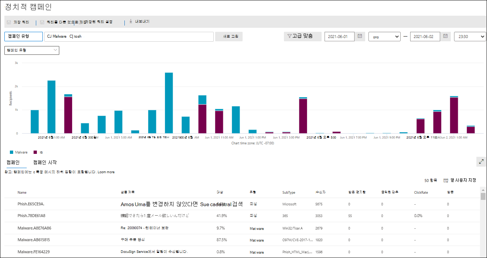
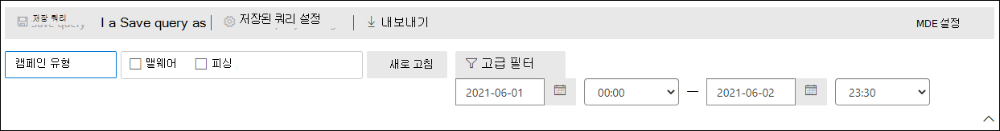
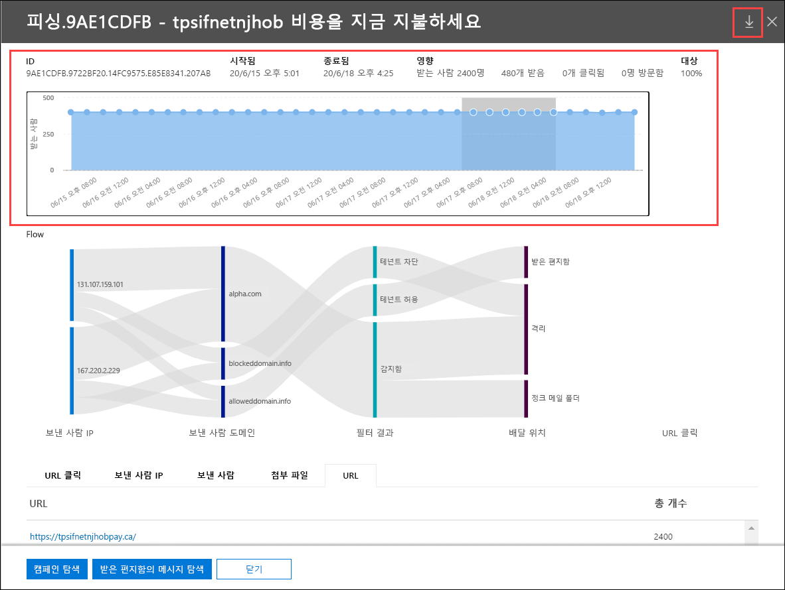
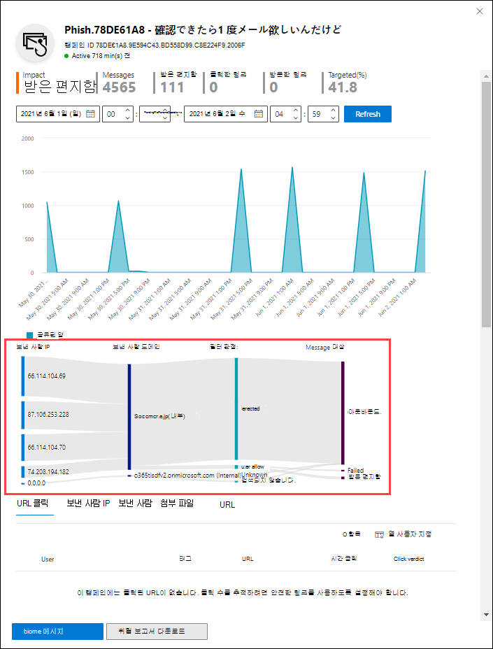

# Microsoft Defender for Office 365

[!INCLUDE [Microsoft 365 Defender rebranding](../includes/microsoft-defender-for-office.md)]

**적용 대상**
- [Office 365용 Microsoft Defender 플랜 2](defender-for-office-365.md)

캠페인 보기는 Microsoft Defender for Office 365 계획 2의 기능입니다(예: Microsoft 365 E5 요금제 2 추가 기능에 대한 Defender가 Office 365 조직). Microsoft 365 Defender 포털의 캠페인 보기는 서비스에서 피싱 공격을 식별하고 분류합니다. 캠페인 보기를 통해 다음을 수행할 수 있습니다.

- 피싱 공격을 효과적으로 조사하고 이에 대처합니다.
- 공격의 범위를 더 잘 이해 합니다.
- 의사 결정자에게 값을 보여줍니다.

캠페인 보기를 그 누구보다 빠르고 완벽하게 공격의 전체적인 상황을 이해할 수 있습니다.

## 캠페인이란 무엇입니까?

캠페인은 하나 이상의 조직에 대해 조율된 전자 메일 공격입니다. 자격 증명 및 회사 데이터를 도용하는 전자 메일 공격은 대규모의 기업입니다. 기술이 공격을 중지하기 위한 노력이 증가하면 공격자는 계속 성공하기 위해 방법을 수정합니다.

Microsoft는 전체 서비스에서 방대한 양의 피싱 방지, 스팸 방지 및 맬웨어 방지 데이터를 활용하여 캠페인을 식별합니다. 여러 요인에 따라 공격 정보를 분석하고 분류합니다. 예시:

- **공격 원본**: 원본 IP 주소 및 보낸 사람 전자 메일 도메인입니다.
- **메시지 속성:** 메시지의 콘텐츠, 스타일 및 톤입니다.
- **메시지 받는 사람:** 받는 사람 관련 방법 예를 들어 받는 사람 도메인, 받는 사람 작업 기능(관리자, 임원 등), 회사 유형(대규모, 소규모, 공용, 개인 등) 및 산업이 있습니다.
- **공격 페이로드:** 메시지의 악성 링크, 첨부 파일 또는 기타 페이로드입니다.

캠페인은 수명이 짧거나 활성 및 비활성 기간이 있는 며칠, 몇 주 또는 몇 달에 걸쳐 있을 수 있습니다. 특정 조직에 대해 캠페인이 시작되거나 조직이 여러 회사에서 대규모 캠페인에 참여할 수 있습니다.

## Microsoft 365 Defender 포털의 캠페인 보기

캠페인 보기는 Microsoft 365 Defender 포털( )의 전자 메일 & 공동 작업 캠페인 또는 에서 직접 사용할 수 <https://security.microsoft.com>  \>  <https://security.microsoft.com/campaigns> 있습니다.

다음에서 캠페인 보기를 볼 수 있습니다.

- **전자 메일 & 공동 작업** \> **탐색기** \> **보기** \> **캠페인**
- **전자 메일 & 공동 작업** \> **탐색기** \> **보기** \> **모든 전자 메일** \> **캠페인** 탭
- **전자 메일 & 공동 작업** \> **탐색기** \> **보기** \> **피싱** \> **캠페인** 탭
- **전자 메일 & 공동 작업** \> **탐색기** \> **보기** \> **맬웨어** \> **캠페인** 탭

캠페인 보기에 액세스하려면 조직 포털에서 조직 **관리,** 보안  관리자 또는 보안 읽기 권한자 역할 Microsoft 365 Defender 합니다.  자세한 내용은 [Microsoft 365 Defender 포털 권한](permissions-microsoft-365-security-center.md)을 참조하세요.

## 캠페인 개요

개요 페이지에는 모든 캠페인에 대한 정보가 표시됩니다.

기본 **캠페인** 탭에서 캠페인 유형 **영역에는** 하루 받는 사람 수를 표시하는 막대 그래프가 표시됩니다. 기본적으로 그래프에는 **피싱 및** 맬웨어 데이터가 **모두** 표시됩니다.

> [!TIP]
> 캠페인 데이터가 없는 경우 날짜 범위 또는 필터를 [변경해 봐야 합니다.](#filters-and-settings)

개요 페이지의 그래프 아래 표에는 캠페인 탭에 다음 정보가 **표시됩니다.**

- **이름**

- **샘플 제목**: 캠페인의 메시지 중 하나에 대한 제목 줄입니다. 캠페인의 모든 메시지의 제목이 같을 필요는 없습니다.

- **대상:** 계산된 비율: (조직의 캠페인 받는 사람 수) / (서비스의 모든 조직에서 캠페인의 총 받는 사람 수) 이 값은 캠페인이 조직에서만 진행되는 정도(더 높은 값)와 서비스의 다른 조직(더 낮은 값)을 나타냅니다.

- **유형:** 이 값은 **피싱 또는** 맬웨어입니다. 

- **하위 스타일:** 이 값에는 캠페인에 대한 자세한 정보가 포함되어 있습니다. 예시:
  - **피싱:** 사용 가능한 경우 이 캠페인에 의해 피싱되는 브랜드입니다. 예를 들면 `Microsoft` , , , 또는 `365` `Unknown` `Outlook` `DocuSign` 입니다.
  - **맬웨어**: 예: `HTML/PHISH` `HTML/<MalwareFamilyName>` 또는 .

  사용 가능한 경우 이 캠페인에 의해 피싱되는 브랜드입니다. 검색이 기본 기술에 대한 Defender에 Office 365 경우 **ATP-는** 하위 스타일 값에 추가됩니다.

- **받는 사람**: 이 캠페인을 대상으로 하는 사용자 수입니다.

- **받은 편지함:** 받은 편지함에서 이 캠페인에서 메시지를 받은 사용자 수(정크 메일 폴더로 배달되지 않습니다.

- **클릭한** 사용자: URL을 클릭하거나 피싱 메시지에서 첨부 파일을 연 사용자 수입니다.

- **클릭률**: "**받은** 편지함 " 클릭으로  /  **계산된 백분율입니다.** 이 값은 캠페인의 효율성을 나타내는 표시기입니다. 즉, 받는 사람이 메시지를 피싱으로 식별할 수 있으며 페이로드 URL을 클릭하지 않은 경우입니다.

  **클릭률은** 맬웨어 캠페인에서 사용되지 않습니다.

- **방문한** 사용자: 페이로드 웹 사이트를 통해 실제로 만든 사용자 수입니다. Clicked  값이 있지만 금고 링크로 웹 사이트에 대한 액세스가 차단된 경우 이 값은 0이 됩니다.

캠페인 **시작 탭에는** 세계 지도의 메시지 원본이 표시됩니다.

### 필터 및 설정

캠페인 페이지 맨  위에는 특정 캠페인을 찾아 격리하는 데 도움이 되는 몇 가지 필터 및 쿼리 설정이 있습니다.

가장 기본적인 필터링은 시작 날짜/시간 및 종료 날짜/시간입니다.

보기를 추가로 필터링하려면 캠페인 유형 단추를 클릭하고 선택한  다음 새로 고침을 클릭하여 여러 값을 필터링하여 단일 속성을 만들 **수 있습니다.**

캠페인 유형 단추에서 사용할 수  있는 필터링할 수 있는 캠페인 속성은 다음 목록에 설명되어 있습니다.

- **기본**:
  - **캠페인 유형**: **맬웨어 또는** **피싱을 선택합니다.** 선택을 지우면 두 가지를 모두 선택하는 결과와 결과가 동일합니다.
  - **캠페인 이름**
  - **캠페인 하위 스타일**
  - **보낸 사람**
  - **받는 사람**
  - **보낸 사람 도메인**
  - **제목**
  - **첨부 파일 이름**
  - **맬웨어 패밀리**
  - **태그:** 지정된 사용자 태그가 적용된 사용자 또는 그룹(우선 순위 계정 포함)입니다. 사용자 태그에 대한 자세한 내용은 사용자 태그 [를 참조하세요.](user-tags.md)
  - **배달 작업**
  - **추가 작업**
  - **방향**
  - **검색 기술**
  - **원본 배달 위치**
  - **최신 배달 위치**
  - **시스템 오버라이드**

- **고급**:
  - **인터넷 메시지 ID:** 메시지 헤더의 **Message-ID** 헤더 필드에서 사용할 수 있습니다. 값을 예로 들 수 `<08f1e0f6806a47b4ac103961109ae6ef@server.domain>` 있습니다(괄호 참고).
  - **네트워크 메시지 ID:** 메시지 헤더의 **X-MS-Exchange-Organization-Network-Message-Id** 헤더 필드에서 사용할 수 있는 GUID 값입니다.
  - **보낸 사람 IP**
  - **첨부 파일 SHA256:** 파일에서 파일의 SHA256 해시 값을 Windows 명령 프롬프트에서 다음 명령을 `certutil.exe -hashfile "<Path>\<Filename>" SHA256` 실행합니다. .
  - **클러스터 ID**
  - **경고 ID**
  - **경고 정책 ID**
  - **캠페인 ID**
  - **ZAP URL 신호**

- **URL**:
  - **URL 도메인**
  - **URL 도메인 및 경로**
  - **URL**
  - **URL 경로**
  - **Click verdict**

여러 속성에 대한 필터링을 비롯한 고급 필터링의  경우 고급 필터 단추를 클릭하여 쿼리를 만들 수 있습니다. 동일한 캠페인 속성을 사용할 수 있지만 다음과 같은 기능이 향상되었습니다.

- 조건 **추가를 클릭하여** 여러 조건을 선택할 수 있습니다.
- 조건 간에 **And** 또는 **Or 연산자를** 선택할 수 있습니다.
- 조건 목록 아래쪽에서 **조건** 그룹 항목을 선택하여 복합 조건을 구성할 수 있습니다.

완료되면 쿼리 **단추를** 클릭합니다.

기본 필터나 고급 필터를 만든 후 쿼리  저장 또는 쿼리를 로 저장을 사용하여 **저장할 수 있습니다.** 나중에 캠페인 페이지로  돌아오면 저장된 쿼리 설정 을 클릭하여 저장된 **필터를 로드할 수 있습니다.**

그래프 또는 캠페인 목록을 내보내려면 내보내기 를 클릭하고 차트 데이터 내보내기 **또는** 캠페인 목록  **내보내기 를 선택합니다.**

Endpoint용 Microsoft Defender 구독이 있는 경우 **MDE** 구독을 설정 끝점용 Microsoft Defender를 사용하여 캠페인 정보를 연결하거나 연결을 끊을 수 있습니다. 자세한 내용은 [Endpoint용 Microsoft Defender와 Office 365 Microsoft Defender 통합을 참조하세요.](integrate-office-365-ti-with-mde.md)

## 캠페인 세부 정보

캠페인 이름을 클릭하면 캠페인 세부 정보가 플라이아웃에 표시됩니다.

### 캠페인 정보

캠페인 세부 정보 보기 맨 위에 다음 캠페인 정보를 사용할 수 있습니다.

- **캠페인 ID:** 고유한 캠페인 식별자입니다.
- **활동**: 캠페인의 기간 및 활동입니다.
- 선택한 날짜 범위 필터 또는 시간 표시 막대에서 선택한 날짜 범위에 대한 다음 데이터
- **영향**
- **메시지:** 총 받는 사람 수입니다.
- **받은 편지함:** 정크 메일 폴더가 아니라 받은 편지함으로 배달된 메시지 수입니다.
- **클릭한 링크:** 피싱 메시지의 URL 페이로드를 클릭한 사용자 수입니다.
- **방문한 링크:** URL을 방문한 사용자 수입니다.
- **Targeted(%)**: 계산된 비율: (조직의 캠페인 받는 사람 수) / (서비스의 모든 조직에서 캠페인의 총 받는 사람 수). 이 값은 캠페인의 전체 수명 동안 계산하며 날짜 필터에 따라 변경되지 않습니다.
- 다음 섹션에 설명된 캠페인 흐름에 대한 시작 날짜/시간 및 종료 데이터/시간 필터입니다.
- 캠페인 활동의 대화형 타임라인: 타임라인에는 캠페인의 전체 수명 동안 활동이 표시됩니다. 검색된 메시지의 양을 확인하기 위해 그래프의 데이터 포인트 위에 마우스를 대면 됩니다.

### 캠페인 흐름

캠페인 세부 정보 보기 중간에 캠페인에 대한 중요한 세부 정보가 가로 흐름 _다이어그램(Sankey_ 다이어그램)에 표시됩니다. 이러한 세부 정보는 캠페인의 요소와 조직에서 발생할 수 있는 영향을 이해 하는 데 도움이 됩니다.

> [!TIP]
> 흐름 다이어그램에 표시되는 정보는 이전 섹션에 설명된 바와 같이 시간 표시 막대의 날짜 범위 필터에 의해 제어됩니다.

다이어그램에서 가로 밴드에 마우스를 올리면 관련 메시지 수(예: 특정 원본 IP의 메시지, 지정된 보낸 사람 도메인을 사용하는 원본 IP의 메시지)가 표시 됩니다.

흐름도에는 다음과 같은 정보가 포함됩니다.

- **보낸 사람 IP**
- **보낸 사람 도메인**
- **필터 판정:** 판정 값은 스팸 방지 메시지 헤더에 설명된 바와 같이 사용 가능한 피싱 및 스팸 필터링 [판정과 관련이 있습니다.](anti-spam-message-headers.md) 사용 가능한 값은 다음 표에 설명되어 있습니다.

   

  ****

  |값|스팸 필터 판정|설명|
  |---|---|---|
  |**허용됨**|`SFV:SKN` 
 `SFV:SKI`|메시지가 스팸 필터링에 의해 평가되기 전에 스팸 및/또는 건너뛴 필터링으로 표시되었습니다. 예를 들어 메시지는 메일 흐름 규칙(전송 규칙)에 의해 스팸이 아닌 것으로 표시되었습니다. 
 다른 이유로 메시지에서 스팸 필터링을 건너뜁니다. 예를 들어 보낸 사람 및 받는 사람이 같은 조직에 있는 것으로 표시됩니다.|
  |**차단됨**|`SFV:SKS`|메시지가 스팸 필터링에 의해 평가되기 전에 스팸으로 표시되었습니다. 예를 들어 메일 흐름 규칙에 의해|
  |**감지함**|`SFV:SPM`|메시지가 스팸 필터링에 의해 스팸으로 표시되었습니다.|
  |**검색되지 않습니다.**|`SFV:NSPM`|메시지가 스팸 필터링에 의해 스팸이 아닌 것으로 표시되었습니다.|
  |**릴리스됨**|`SFV:SKQ`|메시지가 스팸 필터링에서 릴리스되어 스팸 필터링을 건너뜁니다.|
  |**테넌트 허용**\*|`SFV:SKA`|스팸 방지 정책의 설정 때문에 메시지가 스팸 필터링을 건너뜁니다. 예를 들어 보낸 사람이 허용된 보낸 사람 목록 또는 허용된 도메인 목록에 있습니다.|
  |**테넌트 차단**\*\*|`SFV:SKA`|스팸 방지 정책의 설정 때문에 메시지가 스팸 필터링에 의해 차단되었습니다. 예를 들어 보낸 사람이 허용된 보낸 사람 목록 또는 허용된 도메인 목록에 있습니다.|
  |**사용자 허용**\*|`SFV:SFE`|보낸 사람이 사용자의 보낸 사람 목록에 있기 때문에 메시지가 스팸 필터링을 금고 건너뜁니다.|
  |**사용자 차단**\*\*|`SFV:BLK`|보낸 사람이 사용자의 수신 차단된 보낸 사람 목록에 있기 때문에 메시지가 스팸 필터링에 의해 차단되었습니다.|
  |**ZAP**|해당 없음|[ZAP(제로](zero-hour-auto-purge.md) 아워 자동 제거)는 배달된 메시지를 정크 메일 폴더 또는 검역소로 이동했습니다. 스팸 방지 정책에서 작업을 구성합니다.|
  |

  \* 허용된 메시지가 서비스에 의해 차단될 가능성이 높기 때문에 스팸 방지 정책을 검토합니다.

  \*\* 스팸 방지 정책을 검토합니다. 이러한 메시지는 배달되지 않습니다.

- **메시지 대상:** 사용자가 메시지의 페이로드 URL을 클릭하지 않았어도 받은 편지함 또는 정크 메일 폴더로 배달된 메시지를 조사할 수 있습니다. 또한 검지에서 분리된 메시지를 제거할 수도 있습니다. 자세한 내용은 [EOP에서 Quarantined email messages를 참조하세요.](quarantine-email-messages.md)
  - **폴더 삭제됨**
  - **삭제**
  - **외부:** 받는 사람이 하이브리드 환경의 사내 전자 메일 조직에 있습니다.
  - **실패**
  - **전달**
  - **받은 편지함**
  - **정크 메일 폴더**
  - **격리**
  - **알 수 없음**

- **URL 클릭:** 이러한 값은 다음 섹션에 설명되어 있습니다.

> [!NOTE]
> 10개가 넘는 항목이 포함된 모든 계층에는 상위 10개 항목이 표시된 반면 나머지 항목은 기타 에 **번들로 묶입니다.**

#### URL 클릭

피싱 메시지가 받는 사람의 받은 편지함 또는 정크 메일 폴더로 배달되는 경우 항상 사용자가 페이로드 URL을 클릭할 가능성이 있습니다. URL을 클릭하지 않는 것은 성공의 작은 측정값이지만 피싱 메시지가 사서함으로 배달된 이유를 파악해야 합니다.

사용자가 피싱 메시지의 페이로드 URL을 클릭하면 캠페인 세부 정보 보기에 있는 **다이어그램의 URL** 클릭 영역에 작업이 표시됩니다.

- **허용됨**
- **BlockPage:** 받는 사람이 페이로드 URL을 클릭했지만 악의적인 웹 사이트에 대한 액세스가 조직의 금고 링크 [정책에 의해](safe-links.md) 차단됩니다.
- **BlockPageOverride:** 받는 사람이 메시지의 페이로드 URL을 클릭하고금고 링크에서 해당 URL을 중지하려고 했지만 차단을 다시 지정하도록 허용했습니다. 금고 [링크](set-up-safe-links-policies.md) 정책을 검사하여 사용자가 금고 링크 판정을 금고 악성 웹 사이트로 계속할 수 있는 이유를 확인하세요.
- **PendingDetonationPage**: 금고 Microsoft Defender의 Office 365 첨부 파일이 가상 컴퓨터 환경에서 페이로드 URL을 열고 조사하는 중입니다.
- **PendingDetonationPageOverride:** 받는 사람이 페이로드 검색 프로세스를 다시 정하고 결과를 기다리지 않고 URL을 열 수 있습니다.

### 탭

캠페인 세부 정보 보기의 탭을 사용하면 캠페인을 더 자세히 조사할 수 있습니다.

> [!TIP]
> 탭에 표시되는 정보는 캠페인 정보 섹션에 설명된 바와 같이 타임라인의 날짜 범위 필터에 [의해 제어됩니다.](#campaign-information)

- **URL 클릭:** 사용자가 메시지의 페이로드 URL을 클릭하지 않은 경우 이 섹션은 비어 있습니다. 사용자가 URL을 클릭할 수 있는 경우 다음 값이 채워지게 됩니다.
  - **사용자**\*
  - **URL**\*
  - **클릭 시간**
  - **Click verdict**

- **보낸 사람 IP**
  - **보낸 사람 IP**\*
  - **총 개수**
  - **받은 편지함**
  - **받은 편지함 아미기**
  - **SPF 전달:** 보낸 사람이 [SPF(Sender Policy](how-office-365-uses-spf-to-prevent-spoofing.md)Framework)에 의해 인증되었습니다. SPF 유효성 검사를 통과하지 않은 보낸 사람이 확인되지 않은 보낸 사람 또는 메시지가 합법적인 보낸 사람 스푸핑을 나타냅니다.

- **보낸 사람**
  - **보낸 사람:** SMTP MAIL FROM 명령의 실제 보낸 사람 주소로, 사용자가 전자 메일 클라이언트에 표시하는 보낸 사람: 전자 메일 주소가 아닐 수도 있습니다.
  - **총 개수**
  - **받은 편지함**
  - **받은 편지함 아미기**
  - **DKIM 통과:** 보낸 사람이 [DKIM(Domain Keys Identified Mail)에 의해 인증되었습니다.](support-for-validation-of-dkim-signed-messages.md) DKIM 유효성 검사를 통과하지 않은 보낸 사람이 확인되지 않은 보낸 사람 또는 메시지가 합법적인 보낸 사람 스푸핑을 나타냅니다.
  - **DMARC 전달:** 보낸 사람이 도메인 기반 메시지 인증, 보고 및 [적합성(DMARC)에 의해 인증됩니다.](use-dmarc-to-validate-email.md) DMARC 유효성 검사를 통과하지 않은 보낸 사람이 확인되지 않은 보낸 사람 또는 메시지가 합법적인 보낸 사람 스푸핑을 나타냅니다.

- **첨부 파일**
  - **파일 이름**
  - **SHA256**
  - **맬웨어 패밀리**
  - **총 개수**

- **URL**
  - **URL**\*
  - **합계**

\*이 값을 클릭하면 캠페인 세부 정보 보기 위쪽에 지정된 항목(사용자, URL 등)에 대한 자세한 정보가 포함된 플라이 아웃이 새로 열립니다. 캠페인 세부 정보 보기로 돌아가려면 새 플라이 아웃에서 **완료** 을 클릭합니다.

### 버튼

캠페인 세부 정보 보기 아래쪽에 있는 단추를 사용하면 캠페인에 대한 세부 정보를 조사하고 기록할 수 있습니다.

- **메시지 탐색:** 위협 탐색기 기능을 사용하여 캠페인을 더 조사합니다.
  - **모든 메시지:** 캠페인 **ID** 값을 검색 필터로 사용하여 새 위협 탐색기 검색 탭을 니다.
  - **받은 편지함 메시지:** 캠페인 **ID** 및 배달 **위치:** 받은 편지함을 검색 필터로 사용하여 새 위협 탐색기 검색 탭을 여는 경우
  - **내부 메시지:** 캠페인 **ID** 및 방향: 검색 필터로 **반(Intra-org)를** 사용하여 새 위협 탐색기 검색 탭을 열 수 있습니다.

- **위협 보고서 다운로드:** 캠페인 세부 정보를 Word 문서에 다운로드합니다(기본적으로 CampaignReport.docx. 다운로드에는 선택한 필터 날짜만이 아니라 캠페인의 전체 수명에 대한 세부 정보가 포함되어 있습니다.
