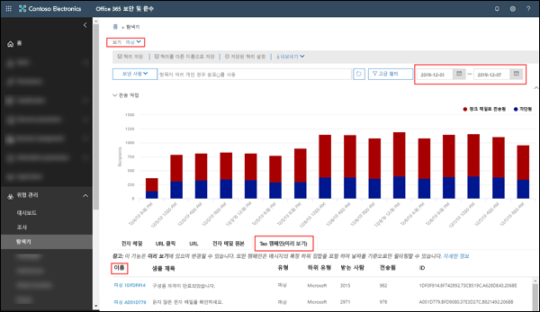
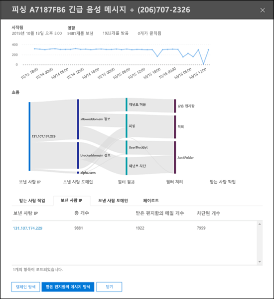
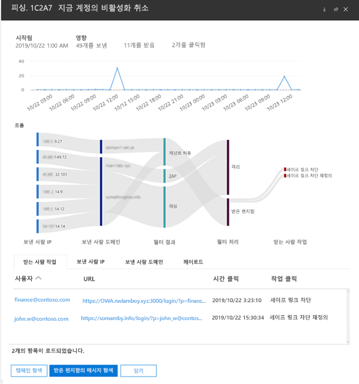

# Office 365 ATP의 캠페인보기

> [!NOTE]
> 이 주제에서 설명하는 기능은 현재 미리보기 상태이며 변경될 수 있습니다.

캠페인 보기는 서비스의 피싱 공격을 식별하고 분류하는 Office 365 보안 및 준수 센터의 ATP (Advanced Threat Protection)의 기능입니다. 캠페인 보기를 통해 다음을 수행할 수 있습니다.

- 피싱 공격을 효과적으로 조사하고 이에 대처합니다.

- 공격의 범위를 더 잘 이해 합니다.

- 의사 결정자에게 값을 보여줍니다.

캠페인 보기를 그 누구보다 빠르고 완벽하게 공격의 전체적인 상황을 이해할 수 있습니다.

## 캠페인이란 무엇입니까?

캠페인은 하나 이상의 조직에 대해 조율된 전자 메일 공격입니다. 오늘날 자격 증명과 회사 데이터를 도용하는 전자 메일 공격은 규모가 크고 수익성 있는 비즈니스입니다. 기술은 공격을 중지하는 데 도움이 되기 때문에 공격자는 정교한 노력을 통해 방법을 수정하며 지속적인 성공을 보장하려 합니다.

Microsoft는 전 세계의 Office 365 서비스 전체에서 방대한 양의 피싱 방지, 스팸 방지 및 맬웨어 방지 데이터 및 경험을 활용하여 캠페인을 식별합니다. 공격 정보는 몇 가지 요인에 따라 분석되고 분류됩니다. 예를 들면 다음과 같습니다.

- **원본 공격**: 원본 IP 주소와 보낸 사람의 전자 메일 도메인.

- **Attack 메시지 속성**: 공격 메시지의 내용, 스타일 및 어조.

- **받는 사람 공격**: 받는 사람 도메인, 받는 사람의 직무 기능(관리자, 임원 등), 회사 유형(대규모, 소규모, 공공 부문, 민간 부문 등) 및 산업.

- **공격 페이로드**: 악성 링크, 첨부 파일 또는 기타 페이로드.

## Office 365 보안 및 준수 센터 캠페인 보기

캠페인 보기는 [보안 및 준수](https://docs.microsoft.com/microsoft-365/compliance/go-to-the-securitycompliance-center) 센터의 다음 위치에서 사용할 수 있습니다.

- **위협 관리** \> **탐색기** \> **보기** \> **피싱** \> **주요 캠페인(미리 보기)**

- **위협 관리** \> **탐색기** \> **보기** \> **모든 전자 메일**\> **주요 캠페인(미리 보기)**

> [!TIP]
> 현재 사용 가능한 유일한 필터링은 날짜 범위입니다. 캠페인 데이터가 나타나지 않으면 기간을 변경해보십시오.

개요 페이지에는 캠페인에 대한 다음 정보가 표시됩니다.

- **이름**

- **샘플 제목**: 캠페인의 메시지 중 하나에 대한 제목 줄입니다. _모든_ 캠페인의 메시지에 이 동일한 주제 줄이 반드시 있는 것은 아닙니다.

- **유형**: 현재 이 값은 항상 **Phish**입니다.

- **하위 유형**: 가능한 경우, 이 캠페인에 의해 피싱되는 브랜드입니다. 검색이 ATP 기술에 의해 시작되면 **ATP** 접두사가 하위 형식 값에 추가됩니다.

- **받는 사람**: 이 캠페인을 대상으로 하는 사용자 수입니다.

- **전달됨**: 이 캠페인에서 받은 편지함으로 메시지를 받은 사용자 수입니다.

- **ID**: 이벤트의 고유 식별자입니다.

캠페인 이름을 클릭하면 캠페인 세부 정보가 플라이 아웃에 나타납니다.

## 캠페인 세부 정보

캠페인 세부 정보 보기에서 다음과 같이 캠페인에 대한 많은 정보를 볼 수 있습니다.

- 캠페인 정보:

  - **ID**: 개요 화면에서 캠페인의 고유 식별자입니다.

  - **시작** 및 **종료**: 선택한 날짜 범위 필터입니다.

  - **영향**: 선택한 날짜 범위에 보낸 메시지의 수, "받은 편지함"에 보관된 메시지의 수(즉, 받은 편지함으로 전달됨), 피싱 메시지의 URL 페이로드에서 클릭한 사용자의 수입니다.

  - 캠페인 활동의 타임라인: 캠페인이 시작되고 종료 된 시간과 시간 경과 동안 발생한 메시지의 양입니다.

### 캠페인 흐름

캠페인에 대한 중요 세부 정보는 **흐름** 섹션의 순서도(_Sankey_ 다이어그램이라고 함)에 나와 있습니다. 이러한 세부 정보는 캠페인의 요소와 조직에서 발생할 수 있는 영향을 이해 하는 데 도움이 됩니다.

다이어그램에서 가로 밴드에 마우스를 올리면 관련 메시지 수(예: 특정 원본 IP의 메시지, 지정된 보낸 사람 도메인을 사용하는 원본 IP의 메시지)가 표시 됩니다.

흐름도에는 다음과 같은 정보가 포함됩니다.

- **보낸 사람 IP**

- **보낸 사람 도메인**

- **결과 필터**: 여기에 있는 값은 [스팸 방지 메시지 머리글](anti-spam-message-headers.md)에 설명된 대로 사용 가능한 피싱 방지 및 스팸 방지 필터 결과와 관련이 있습니다. 여기서 매우 중요한 값은 **테넌트에서 허용**하는 값이며, 이는 조직에서 허용된 설정에 따라 다른 경우에는 서비스(예: 허용된 보낸 사람 목록에 있는 도메인)에 의해 차단되었을 메시지가 허용됨을 의미합니다.

  - **테넌트 차단**: 이 값은 조직의 설정(예: [차단된 보낸 사람 목록](create-block-sender-lists-in-office-365.md)에 있는 도메인 항목)에서 메시지를 감지하고 전달된 위치를 확인했음을 나타냅니다. 격리되지 않은 메시지의 경우 수신 거부 설정을 검토하여 메시지가 전달된 이유를 확인합니다.

  - **감지함**

  - **테넌트 허용**

- **전달 위치**: 사용자가 메시지에서 페이로드 URL을 클릭하지 않은 경우라도 (받은 편지함 또는 정크 메일 폴더로) 받는 사람에게 실제로 전달된 메시지를 조사하려 할 수 있습니다. [Office 365의 전자 메일 메시지 격리](quarantine-email-messages.md)에서 격리된 메시지를 제거할 수도 있습니다.

  - **정크 메일 폴더**

  - **격리**

  - **받은 편지함**

#### URL 클릭

받는 사람의 받은 편지함 또는 정크 메일 폴더로 전달되는 메시지가 사용자에 의해 실행될 가능성도 있습니다(즉, 사용자가 메시지에서 악의적인 URL을 클릭하는 경우). 그렇지 않은 경우에는 애초에 유해한 메시지가 메일함에 전달된 이유를 파악해야 하지만, 성공에 대한 작은 척도가 있습니다.

사용자가 악의적인 URL을 클릭한 경우 다이어그램 영역의 **URL 클릭**에 작업이 표시됩니다.

- **안전한 링크 차단**: 이 값은 받는 사람이 메시지에서 페이로드 URL을 클릭했지만 조직의 [ATP 안전한 링크](atp-safe-links.md) 정책에 의해 차단되었음을 나타냅니다.

- **안전한 링크 차단 재정의**: 이 값은 받는 사람이 메시지에서 페이로드 URL을 클릭하여 ATP가 이를 중지하려고 시도했지만 해당 차단을 재정의할 수 있었음을 나타냅니다. [안전한 링크 정책](set-up-atp-safe-links-policies.md)을 검토하여 사용자가 안전한 링크 정책 결과를 재정의하고 악의적인 URL을 클릭할 수 있었던 이유를 확인해야 합니다.

### 탭

캠페인 세부 정보 보기에는 캠페인을 더 자세히 조사할 수 있는 몇 가지 탭이 있습니다.

- **URL 클릭**: 피싱 메시지의 페이로드 URL을 클릭하지 않은 경우에는 이 섹션이 비어 있습니다. 사용자가 URL을 클릭할 수 있었던 경우

  - **사용자**\*

  - **URL**\*

  - **시간 클릭**

  - **동작 클릭**

- **보낸 사람 IP**

  - **보낸 사람 IP**\*

  - **합계**

  - **받은 편지함 개수**

  - **차단된 개수**

  - **통과된 SPF**

- **보낸 사람**

  - **보낸 사람**

  - **합계**

  - **받은 편지함 개수**

  - **차단된 개수**

  - **통과된 DKIM**

  - **통과된 DMARC**

- **페이로드**

  - **URL**\*

  - **합계**

\*이 값을 클릭하면 캠페인 세부 정보 보기 위쪽에 지정된 항목(사용자, URL 등)에 대한 자세한 정보가 포함된 플라이 아웃이 새로 열립니다. 캠페인 세부 정보 보기로 돌아가려면 새 플라이 아웃에서 **완료**을 클릭합니다.

### 버튼

캠페인 세부 정보 보기의 버튼을 통해 위협 탐색기 기능을 사용하여 캠페인을 더 자세히 조사할 수 있습니다.

- **캠페인 탐색**: **캠페인 ID** 값을 검색 필터로 사용하여 새로운 위협 탐색기 검색 탭을 엽니다.

- **받은 편지함 메시지 탐색**: **캠페인 ID**과 **전달 위치: 받은 편지함**을 검색 필터로 사용하여 새로운 위협 탐색기 검색 탭을 엽니다.
