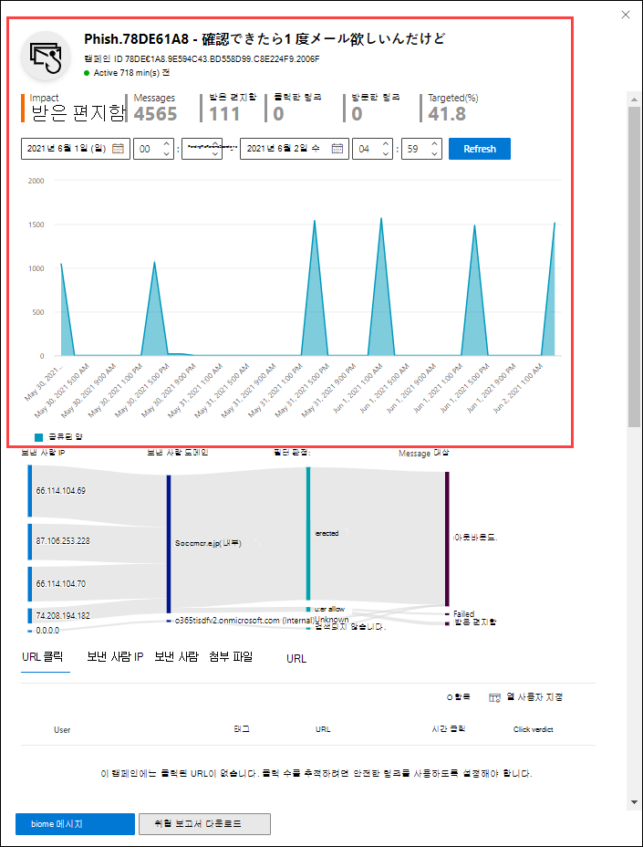

# Office 365 ATP의 캠페인보기Campaign Views in Office 365 ATP

[!INCLUDE [Microsoft 365 Defender rebranding](../includes/microsoft-defender-for-office.md)]

캠페인 보기는 ATP (Advanced Threat Protection) 계획 2의 기능입니다 (예: Microsoft 365 E5 또는 ATP 요금제 2 추가 기능이 있는 조직).Campaign Views is a feature in Advanced Threat Protection (ATP) Plan 2 (for example Microsoft 365 E5 or organizations with an ATP Plan 2 add-on). 보안 & 준수 센터의 캠페인 보기는 서비스의 피싱 공격을 식별 하 고 분류 합니다.Campaign Views in the Security & Compliance Center identifies and categorizes phishing attacks in the service. 캠페인 보기를 통해 다음을 수행할 수 있습니다.Campaign Views can help you to:

- 피싱 공격을 효과적으로 조사하고 이에 대처합니다.Efficiently investigate and respond to phishing attacks.
- 공격의 범위를 더 잘 이해 합니다.Better understand the scope of the attack.
- 의사 결정자에게 값을 보여줍니다.Show value to decision makers.

캠페인 보기를 그 누구보다 빠르고 완벽하게 공격의 전체적인 상황을 이해할 수 있습니다.Campaign Views lets you see the big picture of an attack faster and more complete than any human.

## 캠페인이란 무엇입니까?What is a campaign?

캠페인은 하나 이상의 조직에 대해 조율된 전자 메일 공격입니다.A campaign is a coordinated email attack against one or many organizations. 자격 증명 및 회사 데이터를 도용 하는 전자 메일 공격은 대규모이 고 lucrative 업계입니다.Email attacks that steal credentials and company data are a large and lucrative industry. 공격을 중지 하기 위해 기술이 증가 함에 따라 공격자는 성공적인 성공을 위해 해당 메서드를 수정 합니다.As technologies increase in an effort to stop attacks, attackers modify their methods in an effort to ensure continued success.

Microsoft는 캠페인을 식별 하는 데 도움이 되도록 전체 서비스에서 방대한 피싱 방지, 스팸 방지 및 맬웨어 방지 데이터를 활용 합니다.Microsoft leverages the vast amounts of anti-phishing, anti-spam, and anti-malware data across the entire service to help identify campaigns. 다양 한 요인에 따라 공격 정보를 분석 하 고 분류 합니다.We analyze and classify the attack information according to several factors. 예를 들면 다음과 같습니다.For example:

- **공격 원본**: 원본 IP 주소 및 보낸 사람 전자 메일 도메인**Attack source**: The source IP addresses and sender email domains.
- **메시지 속성**: 메시지의 콘텐츠, 스타일 및 톤입니다.**Message properties**: The content, style, and tone of the messages.
- **메시지 받는 사람**: 받는 사람이 연결 되는 방식입니다.**Message recipients**: How recipients are related. 예를 들어 받는 사람 도메인, 받는 사람 작업 기능 (관리자 및 임원 등), 회사 유형 (대규모, 소형, 공용, 개인 등), 산업 등이 있습니다.For example, recipient domains, recipient job functions (admins, executives, etc.), company types (large, small, public, private, etc.), and industries.
- **공격 페이로드**: 메시지에 있는 악의적인 링크, 첨부 파일 또는 기타 페이로드입니다.**Attack payload**: Malicious links, attachments, or other payloads in the messages.

캠페인은 수명이 짧고 며칠, 주 또는 몇 개월 동안 활성 및 비활성 기간으로 확장 될 수 있습니다.A campaign might be short-lived, or could span several days, weeks, or months with active and inactive periods. 특정 조직에 대해 캠페인을 시작할 수도 있고 조직이 여러 회사에 걸친 대규모 캠페인의 일부일 수도 있습니다.A campaign might be launched against your specific organization, or your organization might be part of a larger campaign across multiple companies.

## 보안 & 준수 센터의 캠페인 보기Campaign Views in the Security & Compliance Center

캠페인 보기는 **위협 관리** 캠페인의 [보안 & 준수 센터](https://protection.office.com) \> **Campaigns**또는에서 직접 제공 됩니다 <https://protection.office.com/campaigns> .Campaign Views is available in the [Security & Compliance Center](https://protection.office.com) at **Threat management** \> **Campaigns**, or directly at <https://protection.office.com/campaigns>.

다음을 통해 캠페인을 볼 수도 있습니다.You can also get to Campaign Views from:

- **위협 관리** \> **탐색기** \> **보기** \> **캠페인****Threat management** \> **Explorer** \> **View** \> **Campaigns**

- **위협 관리** \> **탐색기** \> **보기** \> **모든 전자 메일** \> **캠페인** 탭**Threat management** \> **Explorer** \> **View** \> **All email** \> **Campaign** tab

- **위협 관리** \> **탐색기** \> **보기** \> **피싱** \> **캠페인** 탭**Threat management** \> **Explorer** \> **View** \> **Phish** \> **Campaign** tab

- **위협 관리** \> **탐색기** \> **보기** \> **맬웨어** \> **캠페인** 탭**Threat management** \> **Explorer** \> **View** \> **Malware** \> **Campaign** tab

캠페인 보기에 액세스 하려면 보안 & 준수 센터에서 **조직 관리**, **보안 관리자**또는 **보안 독자** 역할 그룹의 구성원 이어야 합니다.To access Campaign Views, you need to be a member of the **Organization Management**, **Security Administrator**, or **Security Reader** role groups in the Security & Compliance Center. 자세한 내용은 [보안 및 준수 센터의 사용 권한](permissions-in-the-security-and-compliance-center.md)을 참조하세요.For more information, see [Permissions in the Security & Compliance Center](permissions-in-the-security-and-compliance-center.md).

## 캠페인 개요Campaigns overview

개요 페이지에는 모든 캠페인에 대 한 정보가 표시 됩니다.The overview page shows information about all campaigns.

기본 **캠페인** 탭의 **캠페인 유형** 영역에는 하루 당 받는 사람 수를 보여 주는 막대 그래프가 표시 됩니다.On the default **Campaign** tab, the **Campaign type** area shows a bar graph that shows the number of recipients per day. 기본적으로 그래프에는 **피싱** 및 **맬웨어** 데이터가 모두 표시 됩니다.By default, the graph shows both **Phish** and **Malware** data.

> [!TIP]
> 캠페인 데이터가 표시 되지 않으면 날짜 범위 또는 [필터](#filters-and-settings)를 변경해 봅니다.If you don't see any campaign data, try changing the date range or [filters](#filters-and-settings).

개요 페이지의 나머지 부분에는 **캠페인** 탭에 다음 정보가 표시 됩니다.The rest of the overview page shows the following information on the **Campaign** tab:

- **이름****Name**

- **샘플 제목**: 캠페인의 메시지 중 하나에 대한 제목 줄입니다.**Sample subject**: The subject line of one of the messages in the campaign. 캠페인의 모든 메시지에는 같은 주제가 포함 될 필요는 없습니다.Note that all messages in the campaign will not necessarily have the same subject.

- **대상**: 다음에 의해 계산 되는 백분율: (조직의 캠페인의 받는 사람 수)/(서비스의 모든 조직에서 캠페인에 있는 총 받는 사람 수)**Targeted**: The percentage as calculated by: (the number of campaign recipients in your organization) / (the total number of recipients in the campaign across all organizations in the service). 이 값은 캠페인을 조직 (더 높은 값)과 서비스의 다른 조직에서 지정 된 수준 (낮은 값)과 비교 하 여 나타냅니다.This value indicates the degree to which the campaign is directed only at your organization (a higher value) vs. also directed at other organizations in the service (a lower value).

- **Type**:이 값은 **피싱** 또는 **맬웨어**입니다.**Type**: This value is either **Phish** or **Malware**.

- **하위 유형**:이 값에는 캠페인에 대 한 자세한 정보가 포함 되어 있습니다.**Subtype**: This value contains more details about the campaign. 예제:For example:

  - **피싱**:이 캠페인에서 phished 되는 브랜드입니다.**Phish**: Where available, the brand that is being phished by this campaign. ,,,, 등을 예로 들 `Microsoft` `365` `Unknown` `Outlook` `DocuSign` 있습니다.For example, `Microsoft`, `365`, `Unknown`, `Outlook`, or `DocuSign`.

  - **맬웨어**: 또는 등이 `HTML/PHISH` `HTML/<MalwareFamilyName>` 있습니다.**Malware**: For example, `HTML/PHISH` or `HTML/<MalwareFamilyName>`.

사용 가능한 경우이 캠페인에 의해 phished 되는 브랜드입니다.Where available, the brand that is being phished by this campaign. 검색이 ATP 기술에 따라 구동 되 면 접두사 **ATP-** 가 하위 형식 값에 추가 됩니다.When the detection is driven by ATP technology, the prefix **ATP-** is added to the subtype value.

- **받는 사람**: 이 캠페인을 대상으로 하는 사용자 수입니다.**Recipients**: The number of users that were targeted by this campaign.

- **Inboxed**:이 캠페인에서 메시지를 받은 사용자 수 (정크 메일 폴더로 배달 되지 않음)입니다.**Inboxed**: The number of users that received messages from this campaign in their Inbox (not delivered to their Junk Email folder).

- **클릭 한**경우: URL을 클릭 하거나 피싱 메시지의 첨부 파일을 연 사용자 수입니다.**Clicked**: The number of users that clicked on the URL or opened the attachment in the phishing message.

- **급여**: "**클릭 한**사람"으로 계산 되는 백분율을 클릭  /  **Inboxed**합니다.**Click rate**: The percentage as calculated by "**Clicked** / **Inboxed**". 이 값은 캠페인의 효과에 대 한 지표입니다.This value is an indicator of the effectiveness of the campaign. 즉, 받는 사람이 메시지를 피싱 메일로 식별 하 고 페이로드 URL을 클릭 하지 않은 경우에도 가능 합니다.In other words, if the recipients were able to identify the message as phishing, and if they didn't click on the payload URL.

  맬웨어 캠페인에서는 **클릭 속도가** 사용 되지 않습니다.Note that **Click rate** isn't used in malware campaigns.

- **방문**함: 페이로드 웹 사이트에 실제로 적용 된 사용자의 수입니다.**Visited**: How many users actually made it through to the payload website. **클릭** 한 값이 있지만 안전한 링크가 웹 사이트에 대 한 액세스를 차단 하는 경우이 값은 0이 됩니다.If there are **Clicked** values, but Safe Links blocked access to the website, this value will be zero.

**캠페인 원본** 탭에는 세계 지도에 메시지 원본이 표시 됩니다.The **Campaign origin** tab shows the message sources on a map of the world.

### 필터 및 설정Filters and settings

캠페인 보기 페이지의 맨 위에는 특정 캠페인을 찾고 격리 하는 데 사용할 수 있는 몇 가지 필터 및 쿼리 설정이 있습니다.At the top of the Campaign Views page, there are several filter and query settings to help you find and isolate specific campaigns.

시작할 수 있는 가장 기본적인 필터링은 시작 날짜/시간 및 종료 날짜/시간입니다.The most basic filtering that you can do is the start date/time and the end date/time.

보기를 추가로 필터링 하려면 **캠페인 유형** 단추를 클릭 하 고 원하는 항목을 선택한 다음 **새로 고침**을 클릭 하 여 여러 값 필터링을 통해 단일 속성을 수행 하면 됩니다.To further filter the view, you can do single property with multiple values filtering by clicking the **Campaign type** button, making your selection, and then clicking **Refresh**.

사용 가능한 캠페인 속성은 다음 목록에 설명 되어 있습니다.The available campaign properties are described in the following list:

- BasicBasic

  - **캠페인 유형**: **맬웨어** 또는 **피싱**을 선택 합니다.**Campaign type**: Select **Malware** or **Phish**. 선택 항목을 지우면 둘 다를 선택 하는 것과 결과가 같습니다.Clearing the selections has the same result as selecting both.
  - **캠페인 이름****Campaign name**
  - **캠페인 하위 유형****Campaign subtype**
  - **보낸 사람****Sender**
  - **받는 사람****Recipients**
  - **보낸 사람 도메인****Sender domain**
  - **제목****Subject**
  - **첨부 파일 이름****Attachment filename**
  - **맬웨어 제품군****Malware family**
  - **배달 작업****Delivery action**
  - **검색 기술****Detection technology**
  - **태그****Tags**
  - **시스템 재정의****System overrides**

- 고급Advanced

  - **인터넷 메시지 id**: 메시지 헤더의 **메시지-id** 헤더 필드에서 사용할 수 있습니다.**Internet message ID**: Available in the **Message-ID** header field in the message header. 예를 들면 `<08f1e0f6806a47b4ac103961109ae6ef@server.domain>` 꺾쇠 괄호를 참고 하십시오.An example value is `<08f1e0f6806a47b4ac103961109ae6ef@server.domain>` (note the angle brackets).
  
  - **네트워크 메시지 id**: 메시지 헤더의 **X-Exchange-네트워크-ID** 헤더 필드에서 사용할 수 있는 GUID 값입니다.**Network message ID**: A GUID value that's available in the **X-MS-Exchange-Organization-Network-Message-Id** header field in the message header.
  
  - **보낸 사람 IP****Sender IP**
  
  - **첨부 파일 sha256**: Windows에서 파일의 SHA256 해시 값을 찾으려면 명령 프롬프트에서 다음 명령을 실행 합니다 `certutil.exe -hashfile "<Path>\<Filename>" SHA256` .**Attachment SHA256**: To find the SHA256 hash value of a file in Windows, run the following command in a Command Prompt: `certutil.exe -hashfile "<Path>\<Filename>" SHA256`.
  
  - **클러스터 ID****Cluster ID**
  
  - **경고 정책 ID****Alert Policy ID**

- URLURLs

  - **URL 도메인****URL domain**
  - **URL 도메인 및 경로****URL domain and path**
  - **URL****URL**
  - **URL 경로****URL path**
  - **결과을 클릭 합니다.****Click verdict**

여러 속성을 기준으로 필터링 하는 등 고급 필터링을 위해 **고급 필터** 단추를 클릭 하 여 쿼리를 작성할 수 있습니다.For more advanced filtering, including filtering by multiple properties, you can click the **Advanced filter** button to build a query. 동일한 캠페인 속성을 사용할 수 있지만 다음과 같은 기능이 향상 되었습니다.The same campaign properties are available, but with the following enhancements:

- **조건 추가** 를 클릭 하 여 여러 조건을 선택할 수 있습니다.You can click **Add a condition** to select multiple conditions.
- 조건 사이에 **and** 또는 **or** 연산자를 선택할 수 있습니다.You can choose the **And** or **Or** operator between conditions.
- 조건 목록 아래쪽에 있는 **Condition 그룹** 항목을 선택 하 여 복잡 한 복합 조건을 형성할 수 있습니다.You can select the **Condition group** item at the bottom of the conditions list to form complex compound conditions.

작업이 끝나면 **쿼리** 단추를 클릭 합니다.When you're finished, click the **Query** button.

기본 필터나 고급 필터를 만든 후 **쿼리 저장** 또는 다른 **이름으로 저장**을 사용 하 여 저장 합니다.After you create a basic or advanced filter, you can save it by using **Save query** or **Save query as**. 나중에 캠페인 보기로 돌아가면 **저장 된 쿼리 설정을**클릭 하 여 저장 된 필터를 로드할 수 있습니다.Later, when you return to Campaign Views, you can load a saved filter by clicking **Saved query settings**.

그래프 또는 캠페인 목록을 내보내려면 **내보내기를** 클릭 하 고 **차트 데이터 내보내기** 또는 **캠페인 목록 내보내기를**선택 합니다.To export the graph or the list of campaigns, click **Export** and select **Export chart data** or **Export campaign list**.

Microsoft Defender ATP 구독을 사용 하는 경우에는 **Wdatp** 를 클릭 하 여 캠페인 정보를 MICROSOFT defender atp에 연결 하거나 연결을 끊을 수 있습니다.If you have a Microsoft Defender ATP subscription, you can click **WDATP** to connect or disconnect the campaigns information with Microsoft Defender ATP. 자세한 내용은 [Office 365 ATP를 Microsoft DEFENDER atp와 통합](https://docs.microsoft.com/microsoft-365/security/office-365-security/integrate-office-365-ti-with-wdatp)을 참조 하세요.For more information, see [Integrate Office 365 ATP with Microsoft Defender ATP](https://docs.microsoft.com/microsoft-365/security/office-365-security/integrate-office-365-ti-with-wdatp).

## 캠페인 세부 정보Campaign details

캠페인 이름을 클릭 하면 캠페인 세부 정보가 플라이 아웃에 표시 됩니다.When you click on the name of a campaign, the campaign details appear in a flyout.

### 캠페인 정보Campaign information

캠페인 세부 정보 보기의 맨 위에서 다음과 같은 캠페인 정보를 확인할 수 있습니다.At the top of the campaign details view, the following campaign information is available:

- **ID**: 고유한 캠페인 식별자입니다.**ID**: The unique campaign identifier.

- **시작** 및 **종료**: 캠페인의 시작 날짜 및 종료 날짜입니다.**Started** and **Ended**: The start date and end date of the campaign. 이러한 날짜는 개요 페이지에서 선택한 필터 날짜 보다 더 연장할 수 있습니다.Note that these dates might extend further than your filter dates that you selected on the overview page.

- **영향**:이 섹션에는 선택한 날짜 범위 필터에 대 한 다음 데이터 또는 시간 표시 막대에서 선택한 날짜가 포함 됩니다.**Impact**: This section contains the following data for the date range filter you selected (or that you select in the timeline):
  
  - 총 받는 사람 수입니다.The total number of recipients.
  - "Inboxed" (즉, 정크 메일 폴더가 아니라 받은 편지 함으로 배달 됨)의 메시지 수입니다.The number of messages that were "Inboxed" (that is, delivered to the Inbox, not to the Junk Email folder).
  - 피싱 메시지의 URL 페이로드에서 클릭 한 사용자 수How many users clicked on the URL payload in the phishing message.
  - Howe 많은 사용자가 URL을 방문 했습니다.Howe many users visited the URL.

- **대상**: 다음에 의해 계산 되는 백분율: (조직의 캠페인의 받는 사람 수)/(서비스의 모든 조직에서 캠페인에 있는 총 받는 사람 수)**Targeted**: The percentage as calculated by: (the number of campaign recipients in your organization) / (the total number of recipients in the campaign across all organizations in the service). 이 값은 캠페인의 전체 수명에 따라 계산 되며 날짜 필터에 따라 변경 되지 않습니다.Note that this value is calculated over the entire lifetime of the campaign, and doesn't change based on date filters.

- 캠페인 활동의 대화형 시간 표시 막대: 타임 라인에는 캠페인의 전체 수명 동안의 활동이 표시 됩니다.An interactive timeline of campaign activity: The timeline shows activity over the entire lifetime of the campaign. 기본적으로 회색으로 표시 된 영역은 개요에서 선택한 날짜 범위 필터를 포함 합니다.By default, the shaded area includes the date range filter that you selected in the overview. 클릭 하 고 끌어 특정 시작점과 끝점을 선택 하 여 <u> **영향을 받는** 영역에 표시 되는 데이터와 다음 섹션에서 설명 하는 페이지의 나머지</u>부분을 변경할 수 있습니다.You can click and drag to select a specific start point and end point, <u>which will change the data that's displayed in **Impact** area, and on the rest of the page as described in the next sections</u>.

제목 표시줄의 캠페인 **기록** 다운로드 단추를 클릭 하 여 캠페인  세부 정보를 Word 문서 (기본적으로 CampaignReport.docx 명명 된)로 다운로드할 수 있습니다.In the title bar, you can click the **Download campaign write-up** button  to download the campaign details to a Word document (by default, named CampaignReport.docx). 이 다운로드에는 선택한 필터 날짜 뿐만 아니라 캠페인의 전체 수명에 대 한 세부 정보가 포함 되어 있습니다.Note that the download contains details over the entire lifetime of the campaign (not just the filter dates you selected).

### 캠페인 흐름Campaign flow

캠페인 세부 정보 보기의 가운데에서 캠페인에 대 한 중요 한 세부 정보는 _Sankey_ 다이어그램 이라고 하는 가로 흐름도의 **흐름** 섹션에 나와 있습니다.In the middle of the campaign details view, important details about the campaign are presented in the **Flow** section in a horizontal flow diagram (known as a _Sankey_ diagram). 이러한 세부 정보는 캠페인의 요소와 조직에서 발생할 수 있는 영향을 이해 하는 데 도움이 됩니다.These details will help you to understand the elements of the campaign and the potential impact in your organization.

> [!TIP]
> **흐름** 다이어그램에 표시 되는 정보는 이전 섹션에 설명 된 대로 시간 표시 막대에서 음영 처리 된 날짜 범위에 의해 제어 됩니다.The information that's displayed in the **Flow** diagram is controlled by the shaded date range in the timeline as described in the previous section.

다이어그램에서 가로 밴드에 마우스를 올리면 관련 메시지 수(예: 특정 원본 IP의 메시지, 지정된 보낸 사람 도메인을 사용하는 원본 IP의 메시지)가 표시 됩니다.If you hover over a horizontal band in the diagram, you'll see the number of related messages (for example, messages from a particular source IP, messages from the source IP using the specified sender domain, etc.).

흐름도에는 다음과 같은 정보가 포함됩니다.The diagram contains the following information:

- **보낸 사람 IP****Sender IPs**

- **보낸 사람 도메인****Sender domains**

- **Filter verdicts**: 결과 값은 [스팸 방지 메시지 헤더](anti-spam-message-headers.md)에 설명 된 대로 사용 가능한 피싱 및 스팸 필터링 verdicts와 관련이 있습니다.**Filter verdicts**: Verdict values are related to the available phishing and spam filtering verdicts as described in [Anti-spam message headers](anti-spam-message-headers.md). 사용 가능한 값은 다음 표에 설명 되어 있습니다.The available values are described in the following table:

  ****

  |값Value|스팸 필터 결과Spam filter verdict|설명Description|
  |---|---|---|
  |**허용됨****Allowed**|`SFV:SKN`    `SFV:SKI`|메시지가 스팸으로 표시 되지 않거나 스팸 필터링을 통해 평가 되기 전에 필터링을 건너뛰었습니다.The message was marked as not spam and/or skipped filtering before being evaluated by spam filtering. 예를 들어 메시지는 메일 흐름 규칙 (전송 규칙이 라고도 함)에 의해 스팸으로 표시 되지 않습니다.For example, the message was marked as not spam by a mail flow rule (also known as a transport rule).  다른 이유로 인해 스팸 필터링을 건너뛰었습니다.The message skipped spam filtering for other reasons. 예를 들어 보낸 사람 및 받는 사람은 같은 조직에 있는 것 처럼 보입니다.For example, the sender and recipient appear to be in the same organization.|
  |**차단됨****Blocked**|`SFV:SKS`|스팸 필터링을 통해 메시지가 평가 되기 전에 스팸으로 표시 되었습니다.The message was marked as spam before being evaluated by spam filtering. 예를 들어 메일 흐름 규칙을 기준으로 합니다.For example, by a mail flow rule.|
  |**감지함****Detected**|`SFV:SPM`|메시지가 스팸 필터링에 의해 스팸으로 표시되었습니다.The message was marked as spam by spam filtering.|
  |**검색 되지 않음****Not Detected**|`SFV:NSPM`|메시지가 스팸 필터링에 의해 스팸으로 표시 되지 않습니다.The message was marked as not spam by spam filtering.|
  |**해제할****Released**|`SFV:SKQ`|메시지가 격리에서 해제 되었기 때문에 스팸 필터링을 건너뛰었습니다.The message skipped spam filtering because it was released from quarantine.|
  |**테 넌 트 허용**\***Tenant Allow**\*|`SFV:SKA`|스팸 방지 정책 설정으로 인해 메시지에서 스팸 필터링을 건너뛰었습니다.The message skipped spam filtering because of the settings in an anti-spam policy. 예를 들어 보낸 사람이 허용 된 보낸 사람 목록 또는 허용 도메인 목록에 있습니다.For example, the sender was in the allowed sender list or allowed domain list.|
  |**테 넌 트 블록**\*\***Tenant Block**\*\*|`SFV:SKA`|스팸 방지 정책의 설정 때문에 스팸 필터링에 의해 메시지가 차단 되었습니다.The message was blocked by spam filtering because of the settings in an anti-spam policy. 예를 들어 보낸 사람이 허용 된 보낸 사람 목록 또는 허용 도메인 목록에 있습니다.For example, the sender was in the allowed sender list or allowed domain list.|
  |**사용자 허용**\***User Allow**\*|`SFV:SFE`|보낸 사람이 사용자의 수신 허용-보낸 사람 목록에 있기 때문에 메시지가 스팸 필터링을 건너뛰었습니다.The message skipped spam filtering because the sender was in a user's Safe Senders list.|
  |**사용자 차단**\*\***User Block**\*\*|`SFV:BLK`|보낸 사람이 사용자의 차단 된 보낸 사람 목록에 있기 때문에 스팸 필터링에 의해 메시지가 차단 되었습니다.The message was blocked by spam filtering because the sender was in a user's Blocked Senders list.|
  |**ZAP****ZAP**|해당 없음n/a|[자동 삭제 (ZAP)](zero-hour-auto-purge.md) 는 배달 된 메시지를 정크 메일 폴더 또는 격리로 이동 했습니다.[Zero-hour auto purge (ZAP)](zero-hour-auto-purge.md) moved the delivered message to the Junk Email folder or quarantine. 스팸 방지 정책에서 작업을 구성 합니다.You configure the action in your anti-spam policy.|
  |

  \* 허용 되는 메시지는 서비스에 의해 차단 되었을 가능성이 있으므로 스팸 방지 정책을 검토 합니다.\* Review your anti-spam policies, because the allowed message would have likely been blocked by the service.

  \*\* 스팸 방지 정책 메시지는 격리 되어야 하며 배달 되지는 않으므로 검토 합니다.\*\* Review your anti-spam policies, because these messages should be quarantined, not delivered.

- **배달 위치**: 사용자가 메시지에서 페이로드 URL을 클릭 하지 않은 경우에도 받는 사람에 게 배달 된 메시지 (받은 편지함 또는 정크 메일 폴더)를 조사 하는 것이 좋습니다.**Delivery locations**: You'll likely want to investigate messages that were delivered to recipients (either to the Inbox or the Junk Email folder), even if users didn't click on the payload URL in the message. 격리 됨에서 격리 된 메시지를 제거할 수도 있습니다.You can also remove the quarantined messages from quarantine. 자세한 내용은 [EOP에서 격리 된 전자 메일 메시지](quarantine-email-messages.md)를 참조 하십시오.For more information, see [Quarantined email messages in EOP](quarantine-email-messages.md).

  - **폴더 삭제됨****Deleted folder**
  - **끊김****Dropped**
  - **외부**: 받는 사람이 하이브리드 환경의 온-프레미스 전자 메일 조직에 있습니다.**External**: The recipient is located in your on-premises email organization in hybrid environments.
  - **실패****Failed**
  - **받습니다****Forwarded**
  - **받은 편지함****Inbox**
  - **정크 메일 폴더****Junk folder**
  - **격리****Quarantine**
  - **알 수 없음****Unknown**

- **URL 클릭**: 다음 섹션에서는 이러한 값에 대해 설명 합니다.**URL clicks**: These values are described in the next section.

> [!NOTE]
> 10 개 보다 많은 항목이 포함 된 모든 계층에서 상위 10 개 항목이 표시 되 고 나머지는 **다른**항목에 함께 번들 됩니다.In all layers that contain more than 10 items, the top 10 items are shown, while the rest are bundled together in **Others**.

#### URL 클릭URL clicks

피싱 메시지가 받는 사람의 받은 편지함 또는 정크 메일 폴더로 배달 되 면 항상 사용자가 페이로드 URL을 클릭할 수 있습니다.When a phishing message is delivered to a recipient's Inbox or Junk Email folder, there's always a chance that the user will click on the payload URL. URL을 클릭 하는 것은 성공적인를 측정 하는 것이 아니지만 피싱 메시지가 사서함에 배달 되는 이유를 확인 해야 합니다.Not clicking on the URL is a small measure of success, but you need to determine why the phishing message was even delivered to the mailbox.

사용자가 피싱 메시지에서 페이로드 URL을 클릭 하면 해당 작업이 캠페인 세부 정보 보기에 있는 다이어그램의 **URL 클릭** 영역에 표시 됩니다.If a user clicked on the payload URL in the phishing message, the actions are displayed in the **URL clicks** area of the diagram in the campaign details view.

- **허용됨****Allowed**

- **Blockpage**: 받는 사람이 페이로드 URL을 클릭 했지만 해당 사용자의 악의적인 웹 사이트에 대 한 액세스 권한이 조직의 [안전한 링크](atp-safe-links.md) 정책에 의해 차단 되었습니다.**BlockPage**: The recipient clicked on the payload URL, but their access to the malicious website was blocked by a [Safe Links](atp-safe-links.md) policy in your organization.

- **Blockpageoverride**: 받는 사람이 메시지의 페이로드 URL을 클릭 했지만 안전한 링크가 중지 하려고 했지만 차단 된 링크를 무시할 수 있었습니다.**BlockPageOverride**: The recipient clicked on the payload URL in the message, Safe Links tried to stop them, but they were allowed to override the block. [안전한 링크 정책을](set-up-atp-safe-links-policies.md) 조사 하 여 사용자가 안전한 링크 결과를 재정의 하 고 악성 웹 사이트로 계속 이동할 수 있는 이유를 확인 합니다.Inspect your [Safe Links policies](set-up-atp-safe-links-policies.md) to see why users are allowed to override the Safe Links verdict and continue to the malicious website.

- **PendingDetonationPage**: OFFICE 365 ATP의 안전한 첨부 파일은 가상 컴퓨터 환경에서 페이로드 URL을 열고 조사 하는 과정을 진행 중입니다.**PendingDetonationPage**: Safe Attachments in Office 365 ATP is in the process of opening and investigating the payload URL in a virtual computer environment.

- **PendingDetonationPageOverride**: 받는 사람이 페이로드 샌드 박싱 프로세스를 재정의 하 고 결과를 기다리지 않고 URL을 열 수 있었습니다.**PendingDetonationPageOverride**: The recipient was allowed to override the payload detonation process and open the URL without waiting for the results.

### 탭Tabs

캠페인 세부 정보 보기의 탭에서는 캠페인을 상세히 조사할 수 있습니다.The tabs in the campaign details view allow you to further investigate the campaign.

> [!TIP]
> 탭에 표시 되는 정보는 [캠페인 정보](#campaign-information) 섹션에 설명 된 대로 시간 표시 막대에서 음영 처리 된 날짜 범위에 의해 제어 됩니다.The information that's displayed on the tabs is controlled by the shaded date range in the timeline as described in [Campaign information](#campaign-information) section.

- **URL 클릭**: 사용자가 메시지에서 페이로드 URL을 클릭 하지 않은 경우이 섹션은 비어 있습니다.**URL clicks**: If users didn't click on the payload URL in the message, this section will be blank. 사용자가 URL을 클릭할 수 있는 경우 다음 값이 채워집니다.If a user was able to click on the URL, the following values will be populated:

  - **사용자**\***User**\*
  - **URL**\***URL**\*
  - **클릭 시간****Click time**
  - **결과을 클릭 합니다.****Click verdict**

- **보낸 사람 IP****Sender IPs**

  - **보낸 사람 IP**\***Sender IP**\*
  - **총 개수****Total count**
  - **박스형****Inboxed**
  - **박스형 아님****Not Inboxed**
  - **Spf 통과**: [Spf (sender Policy Framework)](how-office-365-uses-spf-to-prevent-spoofing.md)에 의해 보낸 사람이 인증 되었습니다.**SPF passed**: The sender was authenticated by the [Sender Policy Framework (SPF)](how-office-365-uses-spf-to-prevent-spoofing.md). SPF 유효성 검사를 통과 하지 못하는 보낸 사람이 인증 되지 않은 보낸 사람을 표시 하거나, 메시지가 합법적인 보낸 사람에 게 스푸핑 중임을 나타냅니다.A sender that doesn't pass SPF validation indicates an unauthenticated sender, or the message is spoofing a legitimate sender.

- **보낸 사람****Senders**

  - **Sender**: 사용자가 전자 메일 클라이언트에 표시 하는 보낸 사람: 전자 메일 주소가 아닐 수도 있는,이 주소는 SMTP MAIL FROM 명령에 있는 실제 발신자 주소로,**Sender**: This is the actual sender address in the SMTP MAIL FROM command, which is not necessarily the From: email address that users see in their email clients.
  - **총 개수****Total count**
  - **박스형****Inboxed**
  - **박스형 아님****Not Inboxed**
  - **Dkim 통과**: 보낸 사람이 [Dkim (도메인 키 확인 메일)](support-for-validation-of-dkim-signed-messages.md)에 의해 인증 되었습니다.**DKIM passed**: The sender was authenticated by [Domain Keys Identified Mail (DKIM)](support-for-validation-of-dkim-signed-messages.md). DKIM 유효성 검사를 통과 하지 못하는 보낸 사람이 인증 되지 않은 보낸 사람을 표시 하거나, 메시지가 합법적인 보낸 사람에 게 스푸핑 중임을 나타냅니다.A sender that doesn't pass DKIM validation indicates an unauthenticated sender, or the message is spoofing a legitimate sender.
  - **DMARC 통과**: 보낸 사람이 [도메인 기반 메시지 인증, 보고 및 적합성 (DMARC)](use-dmarc-to-validate-email.md)을 통해 인증 되었습니다.**DMARC passed**: The sender was authenticated by [Domain-based Message Authentication, Reporting, and Conformance (DMARC)](use-dmarc-to-validate-email.md). DMARC 유효성 검사를 통과 하지 못한 보낸 사람이 인증 되지 않은 보낸 사람을 표시 하거나, 메시지가 합법적인 보낸 사람에 게 스푸핑 중임을 나타냅니다.A sender that doesn't pass DMARC validation indicates an unauthenticated sender, or the message is spoofing a legitimate sender.

- **첨부 파일****Attachments**

  - **파일 이름****Filename**
  - **SHA256****SHA256**
  - **맬웨어 제품군****Malware family**
  - **총 개수****Total count**

- **URL****URL**

  - **URL**\***URL**\*
  - **합계****Total Count**

\*이 값을 클릭하면 캠페인 세부 정보 보기 위쪽에 지정된 항목(사용자, URL 등)에 대한 자세한 정보가 포함된 플라이 아웃이 새로 열립니다.\* Clicking on this value opens a new flyout that contains more details about the specified item (user, URL, etc.) on top of the campaign details view. 캠페인 세부 정보 보기로 돌아가려면 새 플라이 아웃에서 **완료**을 클릭합니다.To return to the campaign details view, click **Done** in the new flyout.

### 버튼Buttons

캠페인 세부 정보 보기의 버튼을 통해 위협 탐색기 기능을 사용하여 캠페인을 더 자세히 조사할 수 있습니다.The buttons in the campaign details view allow you to use the power of Threat Explorer to further investigate the campaign.

- **캠페인 탐색**: **캠페인 ID** 값을 검색 필터로 사용하여 새로운 위협 탐색기 검색 탭을 엽니다.**Explore campaign**: Opens a new Threat Explorer search tab using the **Campaign ID** value as the search filter.

- **Inboxed 메시지 살펴보기**: **캠페인 ID** 및 **배달 위치: 받은 편지함** 을 검색 필터로 사용 하 여 새 위협 탐색기 검색 탭을 엽니다.**Explore Inboxed messages**: Opens a new Threat Explorer search tab using the **Campaign ID** and **Delivery location: Inbox** as the search filter.
