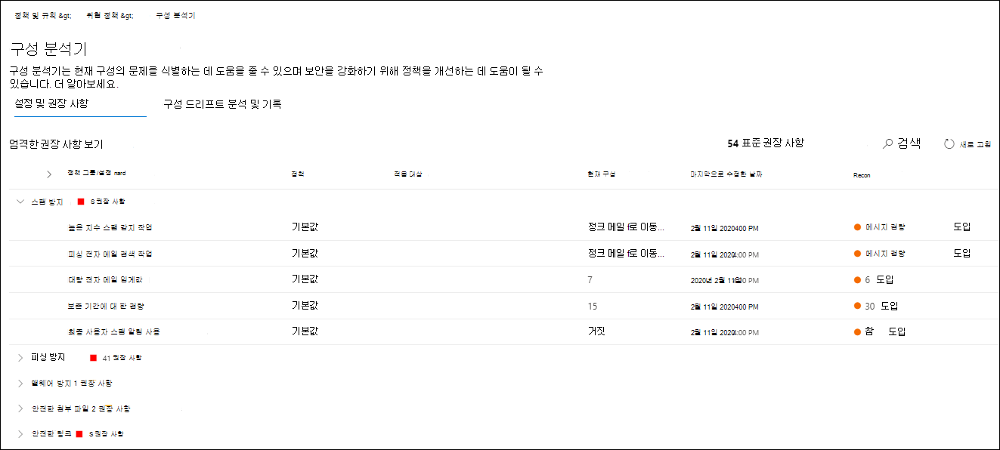
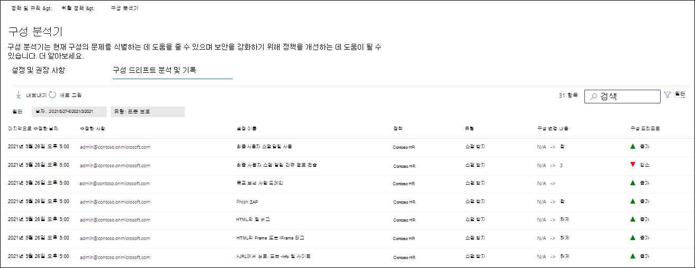

# EOP 및 Microsoft Defender for Office 365

[!INCLUDE [Microsoft 365 Defender rebranding](../includes/microsoft-defender-for-office.md)]

**적용 대상**
- [Exchange Online Protection](exchange-online-protection-overview.md)
- [Office 365용 Microsoft Defender 플랜 1 및 플랜 2](defender-for-office-365.md)
- [Microsoft 365 Defender](../defender/microsoft-365-defender.md)

Microsoft 365 Defender 포털의 구성 분석기는 설정이 미리 설정된 보안 정책의 표준 보호 및 엄격한 보호 프로필 설정 아래에 있는 보안 정책을 찾고 수정할 수 있는 중앙 [위치를 제공합니다.](preset-security-policies.md)

구성 분석기에서는 다음과 같은 유형의 정책을 분석합니다.

- **Exchange Online Protection(EOP)** 정책: Microsoft 365 사서함이 없는 Exchange Online 독립 실행형 EOP Exchange Online 포함됩니다.
  - [스팸 방지 정책](configure-your-spam-filter-policies.md).
  - [맬웨어 방지 정책](configure-anti-malware-policies.md).
  - [EOP 피싱 방지 정책](set-up-anti-phishing-policies.md#spoof-settings).

- **Microsoft Defender for Office 365** 정책: Microsoft 365 E5 추가 기능 구독에 대한 Office 365 조직이 포함됩니다.
  - Microsoft Defender for Office 365 피싱 방지 정책에는 다음이 포함됩니다.
    - EOP  피싱 방지 정책에서 사용할 수 있는 동일한 스푸핑 설정입니다.
    - [가장 설정](set-up-anti-phishing-policies.md#impersonation-settings-in-anti-phishing-policies-in-microsoft-defender-for-office-365)
    - [고급 피싱 임곗값](set-up-anti-phishing-policies.md#advanced-phishing-thresholds-in-anti-phishing-policies-in-microsoft-defender-for-office-365)
  - [안전한 링크 정책](set-up-safe-links-policies.md).
  - [안전한 첨부 파일 정책](set-up-safe-attachments-policies.md).

기준으로 사용되는 표준 및 엄격한 정책 설정 값은 보안 에 대한 EOP 및 Microsoft Defender에 대한 권장 [Office 365 설명되어 있습니다.](recommended-settings-for-eop-and-office365.md)

## 시작하기 전에 알아야 할 내용은 무엇인가요?

- <https://security.microsoft.com>에서 Microsoft 365 Defender 포털을 엽니다. 구성 분석기 **페이지로** 직접 이동하려면 를 <https://security.microsoft.com/configurationAnalyzer> 사용하세요.

- Exchange Online PowerShell에 연결하려면 [Exchange Online PowerShell에 연결](/powershell/exchange/connect-to-exchange-online-powershell)을 참조하세요.

- 이 문서의 절차를 수행하려면 Microsoft 365 Defender 포털에서 사용 권한을 할당해야 합니다.
  - 구성 분석기를 **사용하여** 보안 정책을 업데이트하려면 조직 관리 또는 보안  관리자 역할 그룹의 **구성원이** 되어야 합니다.
  - 구성 분석기에서 읽기 전용으로 액세스하려면 **전역 읽기 권한자** 또는 **보안 읽기 권한자** 역할 그룹의 구성원이어야 합니다.

  자세한 내용은 [Microsoft 365 Defender 포털 권한](permissions-microsoft-365-security-center.md)을 참조하세요.

  > [!NOTE]
  >
  > - 해당 Azure Active Directory 역할에 사용자를 추가하면 Microsoft 365 Defender 포털에서 필요한 사용 권한과  해당 역할의 다른 기능에 대한 사용 Microsoft 365. 자세한 내용은 [관리자 역할 정보](../../admin/add-users/about-admin-roles.md)를 참조하세요.
  > - [Exchange Online](/Exchange/permissions-exo/permissions-exo#role-groups)의 **보기 전용 조직 관리** 역할 그룹도 기능에 대한 읽기 전용 권한을 부여합니다.

## 웹 사이트 포털에서 구성 Microsoft 365 Defender 사용

Microsoft 365 Defender 포털의 템플릿 기반  정책 섹션에서 전자 메일 & 정책 & 규칙 위협 정책 구성 \>  \>  \> **분석기로** 이동하십시오. 

구성 **분석기 페이지에는** 다음 세 가지 기본 탭이 있습니다.

- **표준 권장 사항:** 기존 보안 정책을 표준 권장 사항과 비교합니다. 표준과 동일한 수준으로 설정하려면 설정 값을 조정할 수 있습니다.
- **엄격한 권장** 사항: 기존 보안 정책을 Strict 권장 사항과 비교합니다. 설정 값을 조정하여 Strict와 같은 수준으로 변경할 수 있습니다.
- **구성 드리프트 분석 및 기록:** 시간이 지날수록 정책 변경 내용을 감사하고 추적합니다.

### 구성 분석기에서 표준 권장 사항 및 엄격한 권장 사항 탭

기본적으로 구성 분석기는 표준 권장 사항 **탭에서 열립니다.** 엄격 추천 **탭으로 전환할 수** 있습니다. 설정, 레이아웃 및 동작은 두 탭에서 동일합니다.

탭의 첫 번째 섹션에는 표준 또는 엄격한 보호와 비교하여 개선해야 하는 각 정책 유형의 설정 수가 표시됩니다. 정책의 유형은 다음입니다.

- **스팸 방지**
- **피싱 방지**
- **맬웨어 방지**
- **금고 첨부** 파일(구독에 Microsoft Defender for Office 365)
- **금고 링크(구독에** Microsoft Defender for Office 365)

정책 유형과 번호가 표시되지 않는 경우 해당 유형의 모든 정책이 표준 또는 엄격한 보호의 권장 설정을 충족합니다.

탭의 나머지는 표준 또는 엄격한 보호 수준으로 설정해야 하는 설정 표입니다. 표에는 다음 열이 포함되어 있습니다.

- **권장 사항**: 표준 또는 엄격한 보호 프로필의 설정 값입니다.
- **정책**: 설정을 포함하는 영향을 받는 정책의 이름입니다.
- **정책 그룹/설정 이름**: 주의가 필요한 설정의 이름입니다.
- **정책 유형**: 스팸 방지, 피싱 방지, 맬웨어 방지, 금고 링크 또는 금고 첨부 파일입니다.
- **현재 구성:** 설정의 현재 값입니다.
- **마지막으로 수정**: 정책이 마지막으로 수정된 날짜입니다.
- **Status:** 일반적으로 이 값은 **시작되지 않습니다.**

### 정책 설정을 권장 값으로 변경

구성 **분석기** 표준 보호 또는 **엄격한** 보호 탭에서 표의 행을 선택합니다. 다음과 같은 단추가 나타납니다.

- **권장 적용**
- **정책 보기**
- **새로 고침**:

행을 선택하고 권장 설정 적용을 클릭하면 대화 상자를 다시 표시하지 않는 옵션이 있는 확인 대화 상자가 나타납니다. 확인을 **클릭하면** 다음과 같은 상황이 발생하게됩니다.

- 설정이 권장 값으로 업데이트됩니다.
- 권장 **적용 및** 보기 **정책이** 사라집니다(새로 **고침** 단추만 남음).
- 행의 **상태** 값이 완료로 **변경됩니다.**

행을 선택하고 정책  보기를 클릭하면 설정을 수동으로 업데이트할 수 있는 Microsoft 365 Defender 포털에서 영향을 받는 정책의 세부 정보 플라이아웃으로 이동됩니다.

설정을 자동으로 또는 수동으로 업데이트한  후 새로 고침을 클릭하여 줄어든 추천 수와 업데이트된 행을 결과에서 제거합니다.

### 구성 분석기에서 구성 드리프트 분석 및 기록 탭

이 탭에서는 보안 정책에 적용된 변경 내용과 이러한 변경 내용이 표준 또는 엄격한 설정과 어떻게 비교된지 추적할 수 있습니다. 기본적으로 다음 정보가 표시됩니다.

- **마지막으로 수정한 날짜**
- **수정한 사용자**
- **설정 이름**
- **정책:** 영향을 받는 정책의 이름입니다.
- **유형:** 스팸 방지, 피싱 방지, 맬웨어 방지, 금고 링크 또는 첨부 금고 입력합니다.
- **구성 변경:** 설정의 이전 값 및 새 값
- **구성 드리프트**: **권장** 표준 또는 엄격 설정과 비교하여 보안이 증가하거나 감소한 설정을 나타내는 Increase 또는 Decrease 값입니다. 

결과를 필터링하려면 **필터** 를 클릭합니다. **필터** 플라이아웃이 나타나면 다음 필터에서 선택할 수 있습니다.

- **시작 시간** 및 **종료 시간(날짜):** 오늘로부터 90일까지 돌아갈 수 있습니다.
- **표준 보호** 또는 **엄격한 보호**

완료되면 **적용** 을 클릭합니다.

결과를 파일로 내보내려면 .csv 를 **클릭합니다.**

특정 수정한 값, 설정 이름 또는 **유형** 값으로 결과를 필터링하기 위해 검색 **상자를** 사용 합니다.

