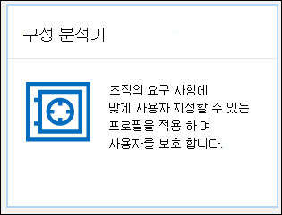

# EOP 및 Office 365 ATP의 보호 정책에 대 한 구성 분석기Configuration analyzer for protection policies in EOP and Office 365 ATP

> [!NOTE]
> 이 항목에서 설명 하는 기능은 미리 보기 상태 이며, 모든 조직에서 사용할 수 있는 것은 아니며, 변경 될 수 있습니다.The features described in this topic are in Preview, aren't available in all organizations, and are subject to change.

보안 & 준수 센터의 구성 분석기는 [미리 설정 된 보안 정책](preset-security-policies.md)에서 표준 보호 및 엄격한 보호 프로필 설정 아래에 있는 설정을 포함 하는 모든 보안 정책을 찾고 수정 하는 데 사용할 수 있는 중앙 위치를 제공 합니다.Configuration analyzer in the Security & Compliance center provides a central location to find and fix any of your security policies that contain settings that are below the Standard protection and Strict protection profile settings in [preset security policies](preset-security-policies.md).

구성 분석기에서는 다음과 같은 유형의 정책을 분석 합니다.The following types of policies are analyzed by the configuration analyzer:

- **EOP (Exchange Online Protection) 정책**: exchange online 사서함을 사용 하는 Microsoft 365 조직과 exchange online 사서함이 없는 독립 실행형 EOP 조직이 포함 됩니다.**Exchange Online Protection (EOP) policies**: This includes Microsoft 365 organizations with Exchange Online mailboxes and standalone EOP organizations without Exchange Online mailboxes:
  
  - [스팸 방지 정책](configure-your-spam-filter-policies.md)[Anti-spam policies](configure-your-spam-filter-policies.md).
  - [맬웨어 방지 정책](configure-anti-malware-policies.md)[Anti-malware policies](configure-anti-malware-policies.md).
  - [EOP 피싱 방지 정책](set-up-anti-phishing-policies.md#spoof-settings)[EOP Anti-phishing policies](set-up-anti-phishing-policies.md#spoof-settings).

- **Office 365 atp (Advanced Threat Protection) 정책**: 여기에는 Microsoft 365 E5 또는 OFFICE 365 ATP 추가 기능 구독이 있는 조직이 포함 됩니다.**Office 365 Advanced Threat Protection (ATP) policies**: This includes organizations with Microsoft 365 E5 or Office 365 ATP add-on subscriptions:

  - ATP 피싱 방지 정책에는 다음이 포함 됩니다.ATP anti-phishing policies, which include:

    - EOP 피싱 방지 정책에서 사용할 수 있는 것과 동일한 [스푸핑 설정](set-up-anti-phishing-policies.md#spoof-settings)The same [spoof settings](set-up-anti-phishing-policies.md#spoof-settings) that are available in the EOP anti-phishing policies.
    - [가장 설정Impersonation settings](set-up-anti-phishing-policies.md#impersonation-settings-in-atp-anti-phishing-policies)
    - [고급 피싱 임계값Advanced phishing thresholds](set-up-anti-phishing-policies.md#advanced-phishing-thresholds-in-atp-anti-phishing-policies)

  - [안전한 링크 정책](recommended-settings-for-eop-and-office365-atp.md#safe-links-policy-settings-in-custom-policies-for-specific-users)[Safe Links policies](recommended-settings-for-eop-and-office365-atp.md#safe-links-policy-settings-in-custom-policies-for-specific-users).

  - [안전한 첨부 파일 정책](recommended-settings-for-eop-and-office365-atp.md#safe-attachments-policy-settings-in-custom-policies-for-specific-users)[Safe Attachments policies](recommended-settings-for-eop-and-office365-atp.md#safe-attachments-policy-settings-in-custom-policies-for-specific-users).

초기 계획으로 사용 되는 **표준** 및 **엄격한** 정책 설정 값은 [EOP 및 Office 365 ATP 보안에 대 한 권장 설정](recommended-settings-for-eop-and-office365-atp.md)에 설명 되어 있습니다.The **Standard** and **Strict** policy setting values that are used as baselines are described in [Recommended settings for EOP and Office 365 ATP security](recommended-settings-for-eop-and-office365-atp.md).

## 시작하기 전에 알아야 할 내용은 무엇인가요?What do you need to know before you begin?

- <https://protection.office.com/>에서 보안 및 준수 센터를 엽니다.You open the Security & Compliance Center at <https://protection.office.com/>. **구성 분석기** 페이지로 바로 이동 하려면을 사용 <https://protection.office.com/configurationAnalyzer> 합니다.To go directly to the **Configuration analyzer** page, use <https://protection.office.com/configurationAnalyzer>.

- Exchange Online PowerShell에 연결하려면 [Exchange Online PowerShell에 연결](https://docs.microsoft.com/powershell/exchange/connect-to-exchange-online-powershell)을 참조하세요.To connect to Exchange Online PowerShell, see [Connect to Exchange Online PowerShell](https://docs.microsoft.com/powershell/exchange/connect-to-exchange-online-powershell).

- 이 항목의 절차를 수행하려면 먼저 사용 권한을 할당받아야 합니다.You need to be assigned permissions before you can do the procedures in this topic:

  - 구성 분석기를 사용 하 **고** 보안 정책을 업데이트 하려면 다음 역할 그룹 중 하나의 구성원 이어야 합니다.To use the configuration analyzer **and** make updates to security policies, you need to be a member of one of the following role groups:

    - [보안 및 준수 센터](permissions-in-the-security-and-compliance-center.md)의 **조직 관리** 또는 **보안 관리자****Organization Management** or **Security Administrator** in the [Security & Compliance Center](permissions-in-the-security-and-compliance-center.md).
    - [Exchange Online](https://docs.microsoft.com/Exchange/permissions-exo/permissions-exo#role-groups)의 **조직 관리** 및 **예방 조치 관리****Organization Management** or **Hygiene Management** in [Exchange Online](https://docs.microsoft.com/Exchange/permissions-exo/permissions-exo#role-groups).

  - 구성 분석기에 대 한 읽기 전용 액세스를 위해서는 다음 역할 그룹 중 하나의 구성원 이어야 합니다.For read-only access to the configuration analyzer, you need to be a member of one of the following role groups:

    - [보안 및 준수 센터](permissions-in-the-security-and-compliance-center.md)의 **보안 읽기****Security Reader** in the [Security & Compliance Center](permissions-in-the-security-and-compliance-center.md).
    - [Exchange Online](https://docs.microsoft.com/Exchange/permissions-exo/permissions-exo#role-groups)의 **보기 전용 조직 관리****View-Only Organization Management** in [Exchange Online](https://docs.microsoft.com/Exchange/permissions-exo/permissions-exo#role-groups).

## 보안 & 준수 센터의 구성 분석기 사용Use the configuration analyzer in the Security & Compliance Center

보안 & 준수 센터에서 **위협 관리** \> **정책** \> **구성 분석기**로 이동 합니다.In the Security & Compliance Center, go to **Threat management** \> **Policy** \> **Configuration analyzer**.

구성 분석기에는 두 가지 주요 탭이 있습니다.The configuration analyzer has two main tabs:

- **설정 및 권장 사항**: 표준 또는 Strict를 선택 하 고 해당 설정을 기존 보안 정책과 비교 합니다.**Settings and recommendations**: You pick Standard or Strict and compare those settings to your existing security policies. 결과에서 설정 값을 조정 하 여 표준 또는 Strict와 같은 수준까지 표시할 수 있습니다.In the results, you can adjust the values of your settings to bring them up to the same level as Standard or Strict.

- **구성 드리프트 분석 및 기록**:이 보기를 사용 하면 시간에 따른 구성 분석기의 결과에 따라 정책에 대해 수행한 변경 내용을 추적할 수 있습니다.**Configuration drift analysis and history**: This view allows to track the changes that you've made to your policies based on the results of the configuration analyzer over time.

### 구성 분석기의 설정 및 권장 사항 탭Setting and recommendations tab in the configuration analyzer

기본적으로 표준 보호 프로필에 대 한 비교에서 탭이 열립니다.By default, the tab opens on the comparison to the Standard protection profile. 엄격한 **권장 사항 보기**를 클릭 하 여 엄격한 보호 프로필 비교로 전환할 수 있습니다.You can switch to the comparison of the Strict protection profile by clicking **View Strict recommendations**. 다시 전환 하려면 **표준 권장 사항 보기**를 선택 합니다.To switch back, select **View Standard recommendations**.

기본적으로 **정책 그룹/설정 이름** 열에는 다양 한 유형의 보안 정책 및 개선 해야 하는 정책 (있는 경우)의 설정 수에 대 한 축소 된 보기가 포함 되어 있습니다.By default, the **Policy group/setting name** column contains a collapsed view of the different types of security polices and the number of settings in those policies that need improvement (if any). 정책 유형은 다음과 같습니다.The types of policies are:

- **스팸 방지****Anti-spam**
- **피싱 방지****Anti-phishing**
- **맬웨어 방지****Anti-malware**
- **Atp 안전한 첨부 파일** (구독에 ATP가 포함 된 경우)**ATP Safe Attachments** (if your subscription includes ATP)
- **Atp 안전한 링크** (구독에 ATP가 포함 된 경우)**ATP Safe Links** (if your subscription includes ATP)

기본 보기에서는 모든 항목이 축소 됩니다.In the default view, everything is collapsed. 각 정책 옆에는 정책에서의 비교 결과 요약 (수정할 수 있음)과 표준 또는 엄격한 보호 프로필 (수정할 수 없음)에 대 한 해당 정책의 설정이 표시 됩니다.Next to each policy, a summary of comparison results from your policies (which you can modify) and the settings in the corresponding policies for the Standard or Strict protection profiles (which you can't modify) are displayed. 다음 정보가 표시 됩니다.You'll see the following information:

- **녹색**: 모든 기존 정책의 모든 설정은 비교 중인 보호 프로필의 보안 수준 이상 이어야 합니다.**Green**: All settings in all existing policies are at least as secure as the protection profile that you're comparing to.
- **주황색**: 기존 정책의 소수의 설정이 비교 중인 보호 프로필 만큼 안전 하지 않습니다.**Amber**: A small number of settings in the existing policies are not as secure as the protection profile that you're comparing to.
- **빨강**: 기존 정책에서 상당한 수의 설정이 비교 중인 보호 프로필 만큼 안전 하지 않습니다.**Red**: A significant number of settings in the existing policies are not as secure as the protection profile that you're comparing to. 이는 여러 정책에서 몇 가지 설정이 나 한 정책에서의 여러 설정이 될 수 있습니다.This could be a few settings in many policies or many settings in one policy.

비교 시에는 **모든 설정이** \<**Standard** or **Strict**\> **권장 사항을**따릅니다.For favorable comparisons, you'll see the text: **All settings follow** \<**Standard** or **Strict**\> **recommendations**. 그렇지 않으면 변경할 권장 설정의 수가 표시 됩니다.Otherwise, you'll see the number of recommended settings to change.

**정책 그룹/설정 이름을**확장 하면 주의가 필요한 각 특정 정책의 모든 정책 및 관련 설정이 표시 됩니다.If you expand **Policy group/setting name**, all of the policies and the associated settings in each specific policy that require attention are revealed. 또는 특정 유형의 정책 (예: **스팸 방지**)을 확장 하 여 주의가 필요한 정책 유형에 서 해당 설정만 볼 수 있습니다.Or, you can expand a specific type of policy (for example, **Anti-spam**) to see just those settings in those types of policies that require your attention.

비교에 대 한 권장 사항 (녹색)이 없는 경우 정책을 확장 하면 아무 것도 표시 되지 않습니다.If the comparison has no recommendations for improvement (green), expanding the policy reveals nothing. 향상에 대 한 권장 사항 (주황색 또는 빨간색)이 있는 경우 주의가 필요한 설정이 표시 되 고 해당 정보가 다음 열에 표시 됩니다.If there are any number of recommendations for improvement (amber or red), the settings that require attention are revealed, and corresponding information is revealed in the following columns:

- 주의가 필요한 설정의 이름입니다.The name of the setting that requires your attention. 예를 들어 이전 스크린샷에서이는 스팸 방지 정책의 **대량 전자 메일 임계값** 입니다.For example, in the previous screenshot, it's the **Bulk email threshold** in an anti-spam policy.

- **정책**: 설정이 포함 된 영향을 받는 정책의 이름입니다.**Policy**: The name of the affected policy that contains the setting.

- **적용 대상**: 영향을 받는 정책이 적용 되는 사용자 수입니다.**Applied to**: The number of user that the affected policies are applied to.

- **현재 구성**: 설정의 현재 값입니다.**Current configuration**: The current value of the setting.

- **마지막으로 수정한**날짜: 정책을 마지막으로 수정한 시간입니다.**Last modified**: The date that the policy was last modified.

- **권장 사항**: 표준 또는 엄격한 보호 프로필의 설정 값입니다.**Recommendations**: The value of the setting in the Standard or Strict protection profile. 정책에서 설정 값을 보호 프로필의 권장 값과 일치 하도록 변경 하려면 **채택**을 클릭 합니다.To change the value of the setting in your policy to match the recommended value in the protection profile, click **Adopt**. 변경이 성공적으로 수행 되 면 **권장 사항이**적용 된 것을 볼 수 있습니다.If the change is successful, you'll see the message: **Recommendations successfully adopted**. **새로 고침** 을 클릭 하 여 추천 항목 수를 줄이고 결과에서 특정 설정/정책 행을 제거 합니다.Click **Refresh** to see the reduced number of recommendations, and the removal of the specific setting/policy row from the results.

### 구성 분석기의 구성 드리프트 분석 및 기록 탭Configuration drift analysis and history tab in the configuration analyzer

이 탭에서는 보안 분석기의 정보를 기반으로 사용자 지정 보안 정책에 대 한 변경 내용을 추적할 수 있습니다.This tab allows you to track the changes that you've made to your custom security policies based on the information in the security analyzer. 기본적으로 다음과 같은 정보가 표시 됩니다.By default, the following information is displayed:

- **마지막으로 수정한 날짜****Last modified**
- **수정한 사람****Modified by**
- **설정 이름****Setting Name**
- **정책****Policy**
- **Type****Type**

결과를 필터링하려면 **필터**를 클릭합니다.To filter the results, click **Filter**. **필터** 플라이 아웃이 나타나면 다음 필터 중에서 선택할 수 있습니다.In the **Filters** flyout that appears, you can select from the following filters:

- **시작 시간** 및 **종료 시간** (날짜)**Start time** and **End time** (date)
- **표준 보호** 또는 **엄격한 보호****Standard protection** or **Strict protection**

결과를 .csv 파일로 내보내려면 **내보내기를**클릭 합니다.To export the results to a .csv file, click **Export**.

