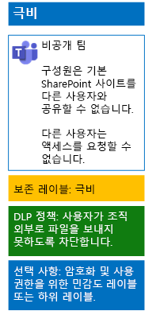

# 민감도 레이블을 사용하여 팀에서 파일 보호Protect files in teams with sensitivity labels

모든 사용자가 모든 파일에 적용할 수 있는 높은 규제 대상 데이터의 민감도 레이블과 달리, 극비 팀에서는 고유의 레이블이나 하위 레이블이 필요합니다. 이 레이블이 할당되는 파일은 다음과 같은 특징을 지니게 됩니다.Unlike a sensitivity label for highly regulated data that anyone can apply to any file, a secure team needs its own label or sublabel so that assigned files:

- 개별적으로 암호화됩니다.Are individually encrypted.
- 팀 구성원만 파일을 열 수 있도록 사용자 지정 권한을 포함합니다.Contain custom permissions so that only members of the Team Group can open it.

팀의 기본 SharePoint 사이트에 저장된 파일에 대한 보안 수준을 추가적으로 설정하려면, 고유의 레이블이나 높은 규제 대상 데이터를 위한 일반 레이블의 하위 레이블인 사용자 지정 민감도 레이블을 구성해야 합니다.To accomplish this additional level of security for files stored in the Team Site, you must configure a new sensitivity label that is either its own label a sublabel of the general label for highly regulated files. 팀 구성원만 레이블 목록에서 사용자 지정 레이블이나 하위 레이블을 볼 수 있습니다.Only team members will see the customized label or sublabel in their list of labels.

전역으로 사용하고 개별적 개인 팀에서 사용할 때, 소수의 레이블만 필요한 경우에는 민감도 레이블을 사용합니다.Use a sensitivity label when you need a small number of labels for both global use and individual private teams. 

다수의 레이블을 보유하고 있거나 높은 규제 대상 레이블 아래에 극비 팀의 레이블을 구성하려는 경우는 민감도 하위 레이블을 사용합니다.Use a sensitivity sublabel when you have a large number of labels or want to organize labels for private teams under the highly regulated label.

[이 지침](https://docs.microsoft.com/microsoft-365/compliance/encryption-sensitivity-labels)을 사용하여 다음의 설정으로 개별 레이블이나 하위 레이블을 구성합니다.[Use these instructions](https://docs.microsoft.com/microsoft-365/compliance/encryption-sensitivity-labels) to configure a separate label or a sublabel with the following settings:

- 레이블 또는 하위 레이블 이름은 팀 이름을 포함합니다.The name of the label contains the name of the team
- 암호화를 사용하도록 설정됩니다.Encryption is enabled
- 팀의 Office 365 그룹은 공동 작성 권한을 가집니다.The Office 365 group for the team has Co-Author permissions

작성한 후에는 사용자를 위해 새 레이블이나 하위 레이블을 게시합니다. 사용자는 레이블을 팀에 업로드하기 전에 로컬에서 파일에 적용하거나 파일이 팀에 저장된 후에 파일에 적용할 수 있습니다.After creating, publish the new label or sublabel for your users, who can then apply them to files either locally before uploading them to the team or later once the file is stored in the team.

파일 암호화 및 사용 권한에 대해 민감도 레이블을 사용하는 극비 팀의 구성은 다음과 같습니다.Here is the configuration of the highly confidential team that uses sensitivity labels for file encryption and permissions.

## 참고 항목See Also

[Microsoft Teams에서의 파일 보호Secure files in Microsoft Teams](secure-files-in-teams.md)
  
[클라우드 도입 및 하이브리드 솔루션Cloud adoption and hybrid solutions](https://docs.microsoft.com/office365/enterprise/cloud-adoption-and-hybrid-solutions)
