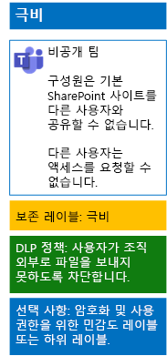

# 민감도 레이블을 사용하여 팀에서 파일 보호

모든 사용자가 모든 파일에 적용할 수 있는 높은 규제 대상 데이터의 민감도 레이블과 달리, 극비 팀에서는 고유의 레이블이나 하위 레이블이 필요합니다. 이 레이블이 할당되는 파일은 다음과 같은 특징을 지니게 됩니다.

- 개별적으로 암호화됩니다.
- 팀 구성원만 파일을 열 수 있도록 사용자 지정 권한을 포함합니다.

팀의 기본 SharePoint 사이트에 저장된 파일에 대한 보안 수준을 추가적으로 설정하려면, 고유의 레이블이나 높은 규제 대상 데이터를 위한 일반 레이블의 하위 레이블인 사용자 지정 민감도 레이블을 구성해야 합니다. 팀 구성원만 레이블 목록에서 사용자 지정 레이블이나 하위 레이블을 볼 수 있습니다.

전역으로 사용하고 개별적 개인 팀에서 사용할 때, 소수의 레이블만 필요한 경우에는 민감도 레이블을 사용합니다. 

다수의 레이블을 보유하고 있거나 높은 규제 대상 레이블 아래에 극비 팀의 레이블을 구성하려는 경우는 민감도 하위 레이블을 사용합니다.

[이 지침](https://docs.microsoft.com/microsoft-365/compliance/encryption-sensitivity-labels)을 사용하여 다음의 설정으로 개별 레이블이나 하위 레이블을 구성합니다.

- 레이블 또는 하위 레이블 이름은 팀 이름을 포함합니다.
- 암호화를 사용하도록 설정됩니다.
- 팀의 Office 365 그룹은 공동 작성 권한을 가집니다.

작성한 후에는 사용자를 위해 새 레이블이나 하위 레이블을 게시합니다. 사용자는 레이블을 팀에 업로드하기 전에 로컬에서 파일에 적용하거나 파일이 팀에 저장된 후에 파일에 적용할 수 있습니다.

파일 암호화 및 사용 권한에 대해 민감도 레이블을 사용하는 극비 팀의 구성은 다음과 같습니다.

## 참고 항목

[Microsoft Teams에서의 파일 보호](secure-files-in-teams.md)
  
[클라우드 도입 및 하이브리드 솔루션](https://docs.microsoft.com/office365/enterprise/cloud-adoption-and-hybrid-solutions)
